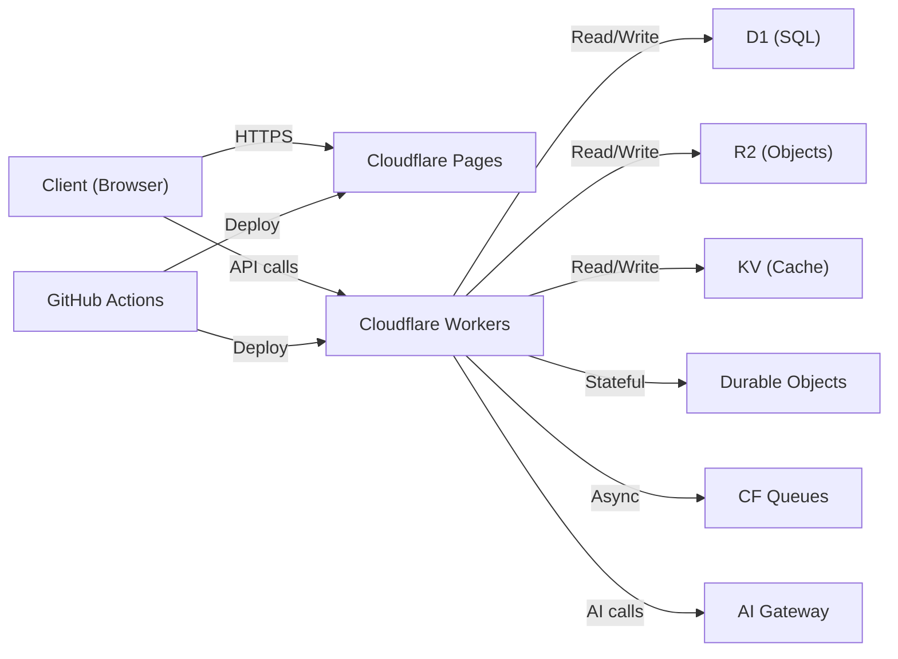

# AI_CONTEXT.md — Persistent AI Project Context

> **Back to:** [INDEX.md](INDEX.md) | **Related:** [AI_POLICY.md](AI_POLICY.md) | [AI_REFERENCE.md](AI_REFERENCE.md)

---

## Metadata

| Field | Value |
|---|---|
| **Version** | 1.0.0 |
| **Owner** | @jelvan-ricolcol |
| **Last Updated** | 2026-07-17 |
| **Status** | Active |
| **Scope** | AI context preservation across sessions |

---

## Overview

This document is the persistent context file for AI assistants. It provides a current snapshot of the project's architecture, conventions, services, and state so that AI tools can accurately assist without requiring full repository exploration every session.

**AI assistants: Read this file first before making any changes.**

---

## Project Identity

| Field | Value |
|---|---|
| **Repository** | jelvan-ricolcol/fullstack-developer-documentation- |
| **Type** | Documentation Knowledge Base |
| **Purpose** | Enterprise-grade, AI-readable full-stack developer documentation |
| **Primary Platform** | GitHub + Cloudflare |
| **Target Audience** | Full-stack developers, AI assistants, DevOps engineers |
| **Documentation Version** | 1.0.0 |

---

## Technology Stack

### Frontend
- **Languages:** TypeScript, JavaScript, HTML5, CSS3
- **Frameworks:** React (primary), Flutter Web (secondary)
- **State Management:** React Query (server state), Zustand (client state)
- **Styling:** Tailwind CSS, CSS Modules
- **Build Tools:** Vite, ESBuild

### Backend
- **Primary Runtime:** Cloudflare Workers (V8 isolates, not Node.js)
- **Language:** TypeScript
- **API Style:** REST (primary), GraphQL (optional)
- **Database:** Cloudflare D1 (SQLite-compatible), optional PostgreSQL via Hyperdrive
- **Storage:** Cloudflare R2 (object storage), Cloudflare KV (key-value)
- **Auth:** JWT + OAuth 2.0 / OIDC

### Infrastructure
- **Edge Compute:** Cloudflare Workers
- **CDN/Hosting:** Cloudflare Pages
- **DNS/Proxy:** Cloudflare
- **CI/CD:** GitHub Actions
- **Secrets:** GitHub Secrets + Cloudflare Secrets
- **Container (optional):** Docker

---

## Architecture Summary

```
┌─────────────────────────────────────────────────────────┐
│                     CLIENT LAYER                        │
│   React SPA / Flutter Web / Static HTML                 │
└──────────────────────┬──────────────────────────────────┘
                       │ HTTPS
┌──────────────────────▼──────────────────────────────────┐
│                  CLOUDFLARE EDGE                        │
│   CDN ─── Pages (static) ─── Workers (API/SSR)         │
│   KV (cache) ─── D1 (SQL) ─── R2 (objects)             │
│   Durable Objects (realtime) ─── Queues (async)         │
└──────────────────────┬──────────────────────────────────┘
                       │ (optional origin)
┌──────────────────────▼──────────────────────────────────┐
│                   ORIGIN SERVICES                       │
│   AWS Lambda / Docker / Traditional Server              │
│   PostgreSQL / MongoDB (if not D1)                      │
└─────────────────────────────────────────────────────────┘
```

---

## Folder Structure

```
/
├── INDEX.md                    ← Documentation map (start here)
├── README.md                   ← Repository overview
├── ARCHITECTURE.md             ← Architecture overview
├── SYSTEM_DESIGN.md            ← System design decisions
├── FRONTEND.md                 ← Frontend documentation
├── BACKEND.md                  ← Backend documentation
├── API.md                      ← API contracts
├── DATABASE.md                 ← Database documentation
├── AUTHENTICATION.md           ← Auth flows
├── AUTHORIZATION.md            ← Permissions and RBAC
├── ENVIRONMENT_VARIABLES.md    ← All env vars
├── DEPLOYMENT.md               ← Deployment procedures
├── UI_RESOURCES.md             ← UI assets, email HTML, and delivery guide
├── CLOUDFLARE.md               ← Cloudflare configuration
├── GITHUB.md                   ← GitHub governance
├── CI_CD.md                    ← CI/CD pipeline
├── SECURITY.md                 ← Security policy
├── PERFORMANCE.md              ← Performance standards
├── MONITORING.md               ← Monitoring setup
├── OBSERVABILITY.md            ← Logs, metrics, traces
├── TESTING.md                  ← Testing strategy
├── ERROR_HANDLING.md           ← Error patterns
├── STATE_MANAGEMENT.md         ← State patterns
├── COMPONENT_LIBRARY.md        ← UI components
├── DESIGN_SYSTEM.md            ← Design tokens
├── STORAGE.md                  ← Storage strategy
├── FILE_STRUCTURE.md           ← File layout
├── CODING_STANDARDS.md         ← Code conventions
├── TROUBLESHOOTING.md          ← Common issues
├── AI_POLICY.md                ← AI governance
├── AI_CONTEXT.md               ← This file
├── AI_REFERENCE.md             ← AI quick reference
├── FEATURE_REGISTRY.md         ← Feature tracking
├── SERVICE_REGISTRY.md         ← Service contracts
├── DATA_DICTIONARY.md          ← Data model definitions
├── KNOWN_LIMITATIONS.md        ← Known issues
├── ROADMAP.md                  ← Future plans
├── CHANGELOG.md                ← Version history
├── CONTRIBUTING.md             ← Contribution guidelines
├── STYLE_GUIDE.md              ← Documentation style
├── GLOSSARY.md                 ← Terms
├── CODE_OF_CONDUCT.md          ← Community standards
└── docs/                       ← Detailed topic docs
    ├── architecture/
    ├── api/
    ├── authentication/
    ├── authorization/
    ├── backend/
    ├── cloudflare/
    ├── database/
    ├── frontend/
    ├── github/
    ├── security/
    ├── testing/
    ├── performance/
    ├── monitoring/
    ├── observability/
    └── ...
```

---

## Naming Conventions

| Type | Convention | Example |
|---|---|---|
| File names | kebab-case | `api-standards.md` |
| Root docs | SCREAMING_SNAKE_CASE | `ARCHITECTURE.md` |
| Variables (JS/TS) | camelCase | `userId` |
| Constants | UPPER_SNAKE_CASE | `MAX_RETRY_COUNT` |
| Types/Interfaces | PascalCase | `UserProfile` |
| Database tables | snake_case | `user_sessions` |
| Database columns | snake_case | `created_at` |
| API endpoints | kebab-case | `/api/v1/user-profiles` |
| Environment variables | UPPER_SNAKE_CASE | `DATABASE_URL` |
| Branch names | kebab-case | `feature/add-auth-flow` |
| Commit messages | Conventional Commits | `feat: add JWT refresh` |

---

## Service Relationships



---

## API Conventions

- **Base URL:** `https://api.{domain}/v{n}/`
- **Versioning:** URI path versioning (`/v1/`, `/v2/`)
- **Auth:** `Authorization: ******
- **Content-Type:** `application/json`
- **Error format:**
  ```json
  {
    "error": {
      "code": "RESOURCE_NOT_FOUND",
      "message": "The requested resource was not found",
      "status": 404,
      "requestId": "req_abc123"
    }
  }
  ```
- **Pagination:**
  ```json
  {
    "data": [],
    "pagination": {
      "cursor": "next_cursor_value",
      "hasMore": true,
      "limit": 20
    }
  }
  ```

---

## Environment Tiers

| Tier | Branch | Domain | Purpose |
|---|---|---|---|
| Local | `feature/*` | `localhost` | Development |
| Preview | PR branches | `*.pages.dev` | PR review |
| Staging | `develop` | `staging.{domain}` | Pre-production |
| Production | `main` | `{domain}` | Live traffic |

---

## Critical Constraints

- **Cloudflare Workers runtime** is V8 isolates — not full Node.js. Avoid Node.js built-ins (`fs`, `path`, `crypto` → use Web Crypto API instead).
- **D1 is SQLite** — no stored procedures, no `RETURNING` on older versions, no full-text search by default.
- **KV has eventual consistency** — do not use for counters or transactional state.
- **Durable Objects** are strongly consistent but single-region; use carefully for latency-sensitive features.
- **Worker CPU time limit:** 10ms (free) / 30s (paid) per request.
- **Worker memory limit:** 128MB per isolate.

---

## Security Baseline

- All secrets stored in GitHub Secrets or Cloudflare Secrets — never in code.
- JWT tokens: RS256 or HS256, 15-minute access token, 7-day refresh token.
- All API endpoints require authentication unless explicitly public.
- Input validation at every trust boundary.
- OWASP Top 10 mitigations applied by default.
- CSP, CORS, HSTS headers set on all responses.

---

## Testing Baseline

- Unit tests: Vitest
- Integration tests: Vitest + Miniflare (Cloudflare Workers emulator)
- E2E tests: Playwright
- Coverage target: 80%+

---

## Deployment Flow

```
Developer Push → GitHub Actions → Lint + Test → Build → Deploy to Cloudflare
```

Detailed: [DEPLOYMENT.md](DEPLOYMENT.md) | [CI_CD.md](CI_CD.md)

---

## Current Documentation Status

- **Total documents:** 40+ root-level, 70+ in docs/
- **Completion level:** 1.0.0 initial release
- **Last full review:** 2026-07-17

---

## Related Documents

- [INDEX.md](INDEX.md) — Full documentation map
- [AI_POLICY.md](AI_POLICY.md) — AI governance rules
- [AI_REFERENCE.md](AI_REFERENCE.md) — Quick lookup
- [ARCHITECTURE.md](ARCHITECTURE.md) — Architecture details
- [KNOWN_LIMITATIONS.md](KNOWN_LIMITATIONS.md) — What to avoid
