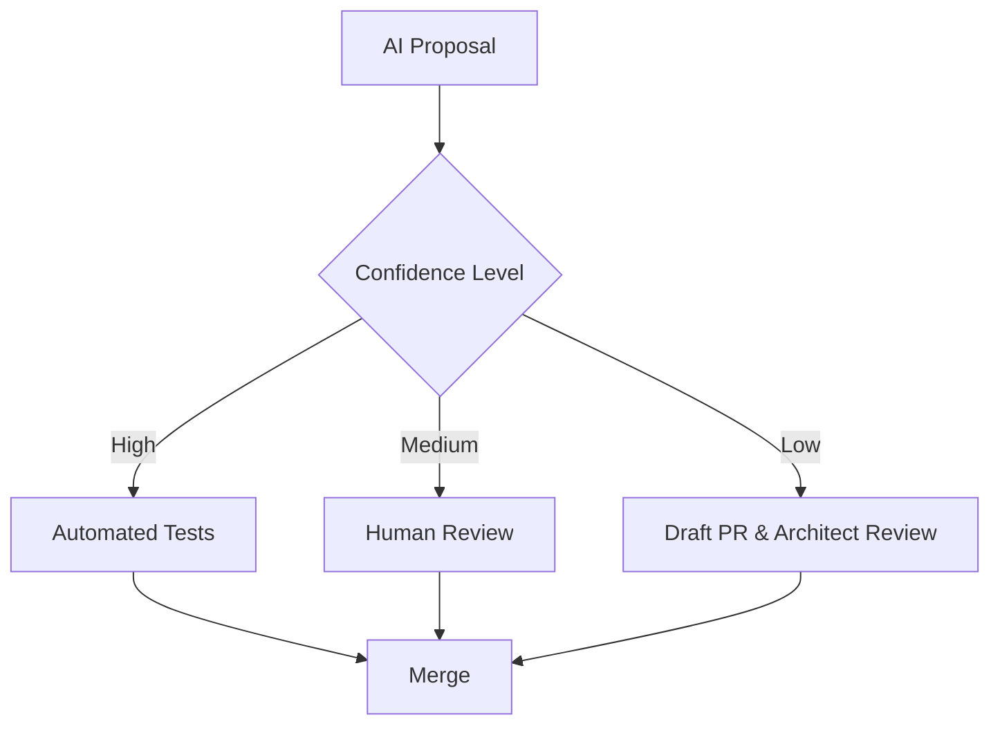

# AI Governance Framework

## Overview
This document outlines the Enterprise AI-First Development Standard governance model. Every AI assistant and human contributor must adhere to these policies.

## AI Decision Matrix
When encountering conflicting requirements or ambiguous architecture, AI agents must use the following priority:
1. Security & Compliance
2. Cloudflare & GitHub Source of Truth Integrity
3. Documentation & State Synchronization
4. Performance & Scalability
5. Developer Experience

## AI Conflict Resolution Policy
- **Minor Conflicts:** Automatically resolve by favoring the more restrictive security policy.
- **Major Conflicts:** Halt generation, document the conflict in `AI_CONFLICT_RESOLUTION.md`, and request human review.

## AI Escalation Procedures
1. Log warning to Dashboard.
2. Flag pull request as `AI-Escalation`.
3. Require Principal Architect approval.

## AI Confidence Levels
- **High (>95%):** Auto-merge allowed if tests pass.
- **Medium (75-95%):** Requires 1 Human PR review.
- **Low (<75%):** Must be generated as a Draft PR.

## AI Approval Workflow

## AI Risk Assessment
Risk levels must be assessed per AI intervention. Any changes to `wrangler.toml`, `deploy.yml`, or `D1_SCHEMA.sql` automatically trigger High Risk protocols.

## AI Documentation Standards
All AI output must include Mermaid diagrams for flows and adhere to this repository's Markdown structure.

## AI Development & Security Policies
- Never commit secrets.
- Always use typed interfaces.
- Validate all inputs.

## AI Validation Rules & Review Process
AI agents must cross-reference their changes with `INDEX.md`, `ARCHITECTURE.md`, and `CI_CD.md` prior to finalizing a PR.

---
*Enterprise AI-First Development Standard - [Return to Index](INDEX.md)*
