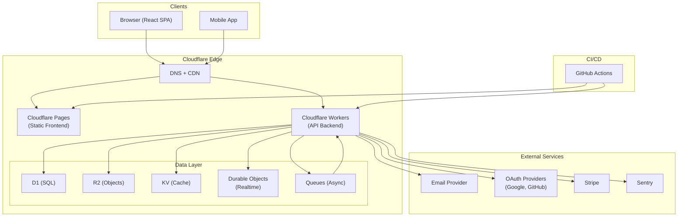

# ARCHITECTURE.md — System Architecture

> **Back to:** [INDEX.md](INDEX.md) | **Related:** [SYSTEM_DESIGN.md](SYSTEM_DESIGN.md) | [BACKEND.md](BACKEND.md) | [FRONTEND.md](FRONTEND.md) | [CLOUDFLARE.md](CLOUDFLARE.md)

---

## Metadata

| Field | Value |
|---|---|
| **Version** | 1.0.0 |
| **Owner** | @jelvan-ricolcol |
| **Last Updated** | 2026-07-17 |
| **Status** | Active |
| **Scope** | High-level system architecture overview |

---

## Overview

This document describes the high-level architecture of the full-stack system. For detailed design decisions, see [SYSTEM_DESIGN.md](SYSTEM_DESIGN.md). For platform-specific configuration, see [CLOUDFLARE.md](CLOUDFLARE.md).

---

## Architecture Style

**Edge-first Serverless** deployed on Cloudflare's global edge network, with optional origin fallback for workloads that exceed edge constraints.

**Key principles:**
- Compute close to the user (300+ edge locations)
- Stateless request handlers; state in managed storage
- No server provisioning or capacity planning
- Infrastructure as code (wrangler.toml + GitHub Actions)
- Security by default at every layer

---

## System Diagram



---

## Layer Responsibilities

### Client Layer
- React Single Page Application
- Communicates with Workers via REST API
- Auth tokens stored in memory (access) and HttpOnly cookie (refresh)

### Edge Layer (Cloudflare)
- **Pages:** Serves static frontend assets globally
- **Workers:** Processes all API requests, enforces auth/authz, accesses data layer
- **D1:** Primary relational database (SQLite-compatible)
- **R2:** Binary object storage (files, images)
- **KV:** Fast global key-value store (cache, sessions)
- **Durable Objects:** Strongly-consistent stateful compute (realtime features)
- **Queues:** Reliable message queue for background jobs

### CI/CD Layer
- GitHub Actions orchestrates lint → test → build → deploy pipeline
- Pushes to `main` automatically deploy to production

---

## Authentication & Authorization Architecture

- OAuth 2.0 + PKCE for social login
- JWT (HS256) access tokens, 15-minute TTL
- Opaque refresh tokens, 7-day TTL, rotated on use
- RBAC middleware enforced in every Workers route

See: [AUTHENTICATION.md](AUTHENTICATION.md) | [AUTHORIZATION.md](AUTHORIZATION.md)

---

## Data Architecture

| Tier | Technology | Use |
|---|---|---|
| Relational | D1 (SQLite) | Users, sessions, business data |
| Object | R2 | Files, images, exports |
| Cache | KV | API cache, session lookup |
| Realtime | Durable Objects | Chat, presence, collaboration |

See: [DATABASE.md](DATABASE.md) | [STORAGE.md](STORAGE.md)

---

## Deployment Architecture

```
feature/* → CI (lint + test) → Preview deploy (CF Pages + Worker)
develop  → CI → Staging deploy
main     → CI → DB migrations → Production deploy
```

See: [DEPLOYMENT.md](DEPLOYMENT.md) | [CI_CD.md](CI_CD.md)

---

## Security Architecture

- TLS enforced by Cloudflare (no self-signed certs)
- Secrets in Cloudflare Secrets + GitHub Secrets only
- OWASP Top 10 mitigations applied by default
- Input validation (Zod) at every API entry point
- Audit logging for all security-relevant events

See: [SECURITY.md](SECURITY.md)

---

## Verified Sources

- Cloudflare Workers Docs — https://developers.cloudflare.com/workers/
- Cloudflare Pages Docs — https://developers.cloudflare.com/pages/
- Cloudflare D1 Docs — https://developers.cloudflare.com/d1/
- Cloudflare R2 Docs — https://developers.cloudflare.com/r2/
- Docker Docs — https://docs.docker.com/
- The Twelve-Factor App — https://12factor.net/

---

## Version History

| Version | Date | Change |
|---|---|---|
| 1.0.0 | 2026-07-17 | Comprehensive architecture documentation |

---

## Related Documents

- [SYSTEM_DESIGN.md](SYSTEM_DESIGN.md) — Detailed design decisions
- [FRONTEND.md](FRONTEND.md) — Frontend architecture
- [BACKEND.md](BACKEND.md) — Backend architecture
- [CLOUDFLARE.md](CLOUDFLARE.md) — Cloudflare configuration
- [SECURITY.md](SECURITY.md) — Security architecture
- [DEPLOYMENT.md](DEPLOYMENT.md) — Deployment architecture
- [docs/architecture/system-design.md](docs/architecture/system-design.md) — Deep dive

## Documentation template for contributors

- **Decision:** What implementation choice was made?
- **Source:** Which official document backs the choice?
- **Reason:** Why is it appropriate for this project?
- **Risk:** What breaks if the assumption changes?
- **Validation:** Which test, command, or review proves it works?

## Verified sources

- Docker Docs — https://docs.docker.com/
- Kubernetes Docs — https://kubernetes.io/docs/
- OpenTelemetry Docs — https://opentelemetry.io/docs/
- Prometheus Docs — https://prometheus.io/docs/
- The Twelve-Factor App — https://12factor.net/

