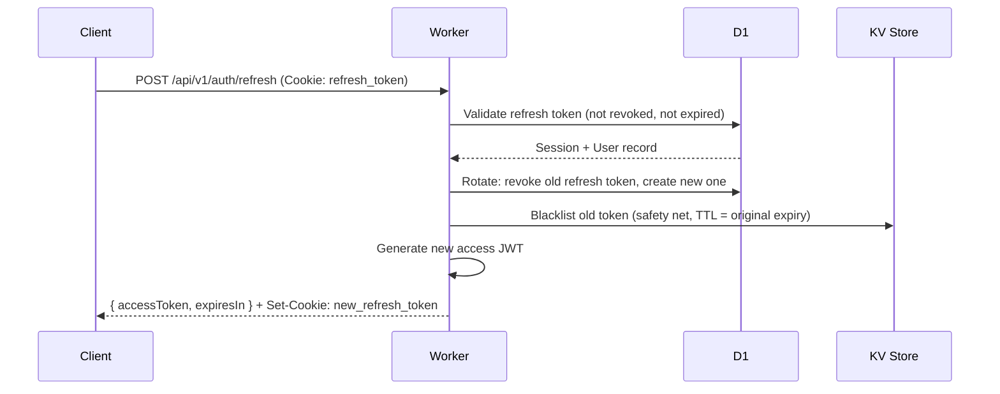
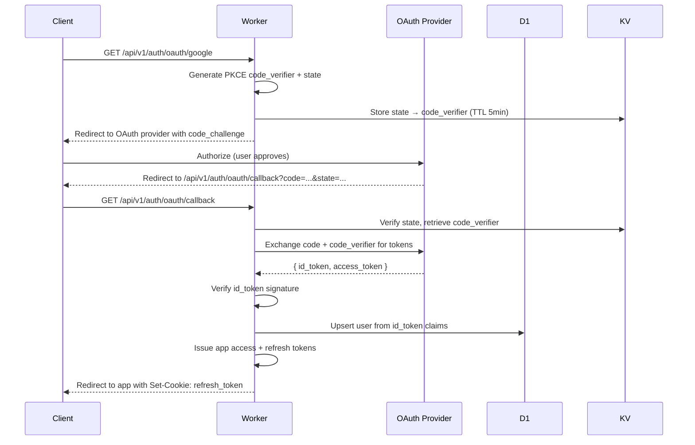

# AUTHENTICATION.md — Authentication Architecture

> **Back to:** [INDEX.md](INDEX.md) | **Related:** [AUTHORIZATION.md](AUTHORIZATION.md) | [SECURITY.md](SECURITY.md) | [API.md](API.md)

---

## Metadata

| Field | Value |
|---|---|
| **Version** | 1.0.0 |
| **Owner** | @jelvan-ricolcol |
| **Last Updated** | 2026-07-17 |
| **Status** | Active |
| **Scope** | All authentication flows, token management, and session handling |

---

## Overview

Authentication verifies **who** a user is. This system uses JWT-based authentication with OAuth 2.0 / OIDC support. Tokens are issued by the Cloudflare Workers backend and validated on every protected request.

---

## Authentication Methods

| Method | Use Case | Status |
|---|---|---|
| Email + Password | Primary login | Active |
| OAuth 2.0 (Google) | Social login | Active |
| OAuth 2.0 (GitHub) | Developer login | Active |
| Magic Link (email) | Passwordless | Planned |
| Multi-Factor Auth (TOTP) | Enhanced security | Planned |

---

## Token Architecture

| Token | Type | TTL | Storage | Purpose |
|---|---|---|---|---|
| Access Token | JWT (HS256) | 15 minutes | Memory only | Authenticate API requests |
| Refresh Token | Opaque | 7 days | HttpOnly cookie | Obtain new access tokens |
| ID Token | JWT (OIDC) | 1 hour | Memory | User profile claims |

---

## JWT Claims

```json
{
  "sub": "user_01HXYZ",
  "email": "user@example.com",
  "role": "admin",
  "iss": "https://api.{domain}",
  "aud": "https://{domain}",
  "iat": 1719600000,
  "exp": 1719600900,
  "jti": "unique-token-id"
}
```

---

## Authentication Flow — Email/Password

```mermaid
sequenceDiagram
    participant C as Client
    participant W as Worker
    participant DB as D1
    participant KV as KV Store

    C->>W: POST /api/v1/auth/login {email, password}
    W->>DB: Lookup user by email
    DB-->>W: User record
    W->>W: Verify password (bcrypt/argon2)
    W->>W: Generate access JWT (15min)
    W->>W: Generate refresh token (opaque, 7d)
    W->>DB: Store session (user_id, refresh_token, expires_at)
    W-->>C: { accessToken, expiresIn } + Set-Cookie: refresh_token=...; HttpOnly; Secure; SameSite=Strict
```

---

## Authentication Flow — Token Refresh



---

## Authentication Flow — OAuth 2.0



---

## JWT Validation Middleware

```typescript
// middleware/auth.ts
import { jwtVerify } from 'jose';
import { UnauthorizedError } from '../lib/errors';

export async function authMiddleware(
  request: Request,
  env: Env
): Promise<{ userId: string; role: string }> {
  const auth = request.headers.get('Authorization');
  if (!auth?.startsWith('Bearer ')) {
    throw new UnauthorizedError('Missing authorization header');
  }

  const token = auth.slice(7);
  try {
    const { payload } = await jwtVerify(
      token,
      new TextEncoder().encode(env.JWT_SECRET),
      {
        issuer: env.JWT_ISSUER,
        audience: env.JWT_AUDIENCE,
      }
    );
    return { userId: payload.sub as string, role: payload.role as string };
  } catch {
    throw new UnauthorizedError('Invalid or expired token');
  }
}
```

---

## Password Requirements

- Minimum 12 characters
- Must contain uppercase, lowercase, number, and special character
- Hashed with **Argon2id** (preferred) or bcrypt (rounds ≥ 12)
- Never store plaintext passwords
- Never log passwords

---

## Session Management

- Sessions stored in D1 `sessions` table
- Refresh token rotated on every use (prevents token reuse)
- Old tokens added to KV revocation list with TTL matching original expiry
- Session revoked on: logout, password change, security event
- Sessions expire after 7 days of inactivity
- Users can view and revoke active sessions

See: [docs/authentication/sessions.md](docs/authentication/sessions.md)

---

## Multi-Factor Authentication (Planned)

- TOTP (Time-based One-Time Password) via authenticator app
- Backup codes (10 single-use codes, hashed in DB)
- Required for admin role
- SMS (not recommended — see NIST 800-63B)

---

## Security Considerations

- Access tokens stored **in memory only** on the client (never localStorage)
- Refresh tokens in **HttpOnly, Secure, SameSite=Strict** cookies
- All auth endpoints rate-limited (5 attempts/minute per IP)
- Account lockout after 10 failed attempts (15-minute cooldown)
- Auth events logged to audit_logs table
- CSRF protection via SameSite cookie + custom header check

---

## Environment Variables

| Variable | Purpose |
|---|---|
| `JWT_SECRET` | HMAC signing secret (≥ 256 bits) |
| `JWT_ISSUER` | JWT `iss` claim value |
| `JWT_AUDIENCE` | JWT `aud` claim value |
| `OAUTH_GOOGLE_CLIENT_ID` | Google OAuth client ID |
| `OAUTH_GOOGLE_CLIENT_SECRET` | Google OAuth client secret |
| `OAUTH_GITHUB_CLIENT_ID` | GitHub OAuth client ID |
| `OAUTH_GITHUB_CLIENT_SECRET` | GitHub OAuth client secret |

See: [ENVIRONMENT_VARIABLES.md](ENVIRONMENT_VARIABLES.md)

---

## Version History

| Version | Date | Change |
|---|---|---|
| 1.0.0 | 2026-07-17 | Initial authentication documentation |

---

## Related Documents

- [AUTHORIZATION.md](AUTHORIZATION.md) — What users can do after login
- [SECURITY.md](SECURITY.md) — Security policy
- [API.md](API.md) — Auth endpoints
- [DATABASE.md](DATABASE.md) — Sessions table schema
- [ENVIRONMENT_VARIABLES.md](ENVIRONMENT_VARIABLES.md) — Auth environment variables
- [docs/authentication/oauth.md](docs/authentication/oauth.md) — OAuth deep dive
- [docs/authentication/jwt.md](docs/authentication/jwt.md) — JWT implementation
- [docs/authentication/sessions.md](docs/authentication/sessions.md) — Session management
