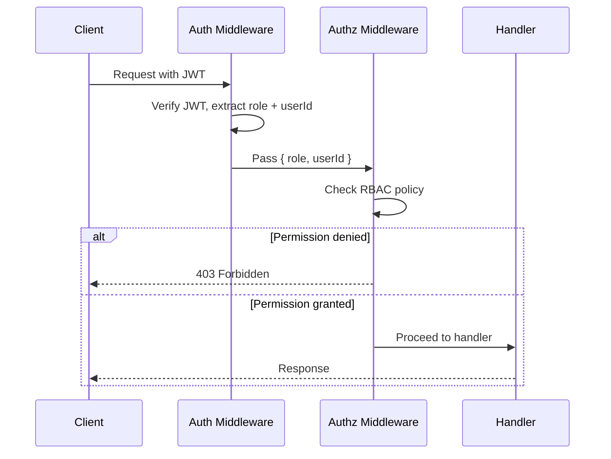

# AUTHORIZATION.md — Authorization & Access Control

> **Back to:** [INDEX.md](INDEX.md) | **Related:** [AUTHENTICATION.md](AUTHENTICATION.md) | [SECURITY.md](SECURITY.md) | [API.md](API.md)

---

## Metadata

| Field | Value |
|---|---|
| **Version** | 1.0.0 |
| **Owner** | @jelvan-ricolcol |
| **Last Updated** | 2026-07-17 |
| **Status** | Active |
| **Scope** | RBAC model, permission policies, and enforcement |

---

## Overview

Authorization determines **what** an authenticated user can do. This system uses **Role-Based Access Control (RBAC)** enforced in Cloudflare Workers middleware, with optional resource-level policies.

---

## RBAC Model

### Roles

| Role | Description |
|---|---|
| `admin` | Full access to all resources |
| `editor` | Read/write access to content resources |
| `viewer` | Read-only access to permitted resources |
| `service` | Machine-to-machine, system operations |

### Role Hierarchy
```
admin > editor > viewer
service (lateral — not in hierarchy)
```

---

## Permission Matrix

| Resource | Action | admin | editor | viewer | service |
|---|---|---|---|---|---|
| Users | list | ✅ | ❌ | ❌ | ✅ |
| Users | read (own) | ✅ | ✅ | ✅ | ✅ |
| Users | read (any) | ✅ | ❌ | ❌ | ✅ |
| Users | create | ✅ | ❌ | ❌ | ✅ |
| Users | update (own) | ✅ | ✅ | ✅ | ✅ |
| Users | update (any) | ✅ | ❌ | ❌ | ✅ |
| Users | delete | ✅ | ❌ | ❌ | ❌ |
| Content | list | ✅ | ✅ | ✅ | ✅ |
| Content | read | ✅ | ✅ | ✅ | ✅ |
| Content | create | ✅ | ✅ | ❌ | ✅ |
| Content | update | ✅ | ✅ | ❌ | ✅ |
| Content | delete | ✅ | ✅ | ❌ | ❌ |
| Audit Logs | read | ✅ | ❌ | ❌ | ✅ |
| Settings | read | ✅ | ✅ | ❌ | ✅ |
| Settings | update | ✅ | ❌ | ❌ | ❌ |

---

## Authorization Middleware

```typescript
// middleware/authorize.ts
import { ForbiddenError } from '../lib/errors';

type Permission = {
  resource: string;
  action: string;
};

const PERMISSIONS: Record<string, Record<string, string[]>> = {
  users: {
    list: ['admin', 'service'],
    create: ['admin', 'service'],
    update: ['admin', 'editor', 'viewer', 'service'],
    delete: ['admin'],
  },
  content: {
    list: ['admin', 'editor', 'viewer', 'service'],
    create: ['admin', 'editor', 'service'],
    update: ['admin', 'editor', 'service'],
    delete: ['admin', 'editor'],
  },
};

export function authorize(resource: string, action: string) {
  return (userRole: string, userId: string, targetId?: string) => {
    const allowed = PERMISSIONS[resource]?.[action] ?? [];

    // Resource owner can perform own-resource actions
    if (targetId && targetId === userId && action !== 'delete') {
      return; // Allow
    }

    if (!allowed.includes(userRole)) {
      throw new ForbiddenError(
        `Role '${userRole}' cannot perform '${action}' on '${resource}'`
      );
    }
  };
}
```

---

## Authorization Flow



---

## Ownership-Based Access

For resources owned by a user (e.g., user updating their own profile):

```typescript
// Route handler
app.patch('/api/v1/users/:id', async (c) => {
  const { userId, role } = c.get('auth');
  const targetId = c.req.param('id');

  // Self-update allowed; updating others requires admin
  if (targetId !== userId) {
    authorize('users', 'update')(role, userId, undefined);
  }

  // ... update logic
});
```

---

## Permission Storage

Current implementation: **In-memory RBAC map** in Worker code.

Future: D1-backed permissions table for dynamic role assignment:

```sql
CREATE TABLE IF NOT EXISTS user_roles (
  user_id    TEXT NOT NULL REFERENCES users(id),
  role       TEXT NOT NULL,
  created_at TEXT NOT NULL,
  PRIMARY KEY (user_id, role)
);
```

---

## Audit Logging

All authorization decisions are logged to the `audit_logs` table:

```typescript
await auditLog(env.DB, {
  userId,
  action: `${resource}:${action}`,
  resource,
  resourceId: targetId,
  metadata: { role, granted: true },
  ipAddress: request.headers.get('CF-Connecting-IP'),
});
```

---

## Security Considerations

- Authorization check happens **after** authentication — never skip auth
- Always check authorization on the **server** — client-side role checks are UI-only
- Principle of least privilege: default to `viewer` role on new accounts
- Admin role assignment requires existing admin or direct DB operation
- Never expose role information in error messages to unauthorized users
- Log all permission denials for security monitoring

---

## Version History

| Version | Date | Change |
|---|---|---|
| 1.0.0 | 2026-07-17 | Initial authorization documentation |

---

## Related Documents

- [AUTHENTICATION.md](AUTHENTICATION.md) — Who the user is
- [SECURITY.md](SECURITY.md) — Security policy
- [API.md](API.md) — API endpoint permission requirements
- [DATABASE.md](DATABASE.md) — Roles table schema
- [OBSERVABILITY.md](OBSERVABILITY.md) — Audit log monitoring
- [docs/authorization/rbac.md](docs/authorization/rbac.md) — RBAC deep dive
- [docs/authorization/permissions.md](docs/authorization/permissions.md) — Permissions detail
