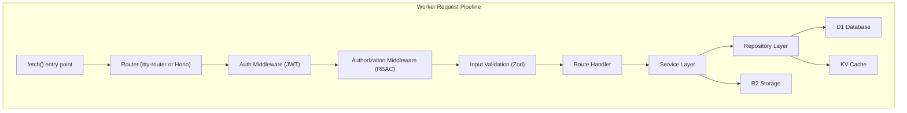

# BACKEND.md — Backend Architecture

> **Back to:** [INDEX.md](INDEX.md) | **Related:** [FRONTEND.md](FRONTEND.md) | [API.md](API.md) | [DATABASE.md](DATABASE.md) | [CLOUDFLARE.md](CLOUDFLARE.md)

---

## Metadata

| Field | Value |
|---|---|
| **Version** | 1.0.0 |
| **Owner** | @jelvan-ricolcol |
| **Last Updated** | 2026-07-17 |
| **Status** | Active |
| **Scope** | Backend architecture, runtime, patterns, and conventions |

---

## Overview

The backend runs on Cloudflare Workers — a serverless edge runtime executing TypeScript/JavaScript in V8 isolates at 300+ global edge locations. The backend exposes a RESTful API consumed by the frontend and potential third-party clients.

---

## Runtime: Cloudflare Workers

### Key Constraints
- **Runtime:** V8 isolates — NOT Node.js
- **CPU limit:** 10ms (free) / 30s (paid) per request
- **Memory:** 128MB per isolate
- **Available APIs:** Web APIs (fetch, crypto, streams, URL, etc.)
- **Not available:** `fs`, `path`, `os`, `process.env` (use `env` bindings instead)

```typescript
// Entry point
export default {
  async fetch(
    request: Request,
    env: Env,
    ctx: ExecutionContext
  ): Promise<Response> {
    return router.handle(request, env, ctx);
  },
};

// Environment bindings interface
interface Env {
  DB: D1Database;
  BUCKET: R2Bucket;
  KV: KVNamespace;
  DO: DurableObjectNamespace;
  QUEUE: Queue;
  JWT_SECRET: string;
  ENVIRONMENT: string;
}
```

---

## Architecture



---

## Project Structure

```
worker/
├── src/
│   ├── index.ts              # Entry point
│   ├── router.ts             # Route definitions
│   ├── middleware/
│   │   ├── auth.ts           # JWT authentication
│   │   ├── authorize.ts      # RBAC authorization
│   │   ├── cors.ts           # CORS headers
│   │   ├── rate-limit.ts     # Rate limiting
│   │   └── logger.ts         # Request logging
│   ├── routes/
│   │   ├── users.ts
│   │   ├── auth.ts
│   │   └── health.ts
│   ├── services/
│   │   ├── user.service.ts
│   │   └── auth.service.ts
│   ├── repositories/
│   │   ├── user.repository.ts
│   │   └── base.repository.ts
│   ├── lib/
│   │   ├── jwt.ts
│   │   ├── errors.ts
│   │   ├── validators.ts
│   │   └── response.ts
│   └── types/
│       ├── env.ts
│       └── models.ts
├── migrations/
│   └── 0001_initial.sql
├── wrangler.toml
└── package.json
```

---

## Routing Pattern (Hono)

```typescript
import { Hono } from 'hono';
import { authMiddleware } from './middleware/auth';
import { usersRouter } from './routes/users';

const app = new Hono<{ Bindings: Env }>();

app.use('*', corsMiddleware());
app.use('/api/*', authMiddleware());

app.route('/api/v1/users', usersRouter);
app.get('/health', (c) => c.json({ status: 'ok' }));

export default app;
```

---

## Middleware Stack (Order Matters)

1. **CORS** — Must be first to handle preflight
2. **Rate Limiting** — Block abuse early
3. **Request Logger** — Log incoming request metadata
4. **Authentication** — Validate JWT
5. **Authorization** — Check RBAC permissions
6. **Input Validation** — Validate request body/params with Zod
7. **Route Handler** — Business logic
8. **Error Handler** — Catch and format errors

---

## Service Layer Pattern

```typescript
// services/user.service.ts
export class UserService {
  constructor(
    private readonly repo: UserRepository,
    private readonly kv: KVNamespace
  ) {}

  async getUserById(id: string): Promise<User> {
    const cached = await this.kv.get(`user:${id}`);
    if (cached) return JSON.parse(cached);

    const user = await this.repo.findById(id);
    if (!user) throw new NotFoundError('User not found');

    await this.kv.put(`user:${id}`, JSON.stringify(user), {
      expirationTtl: 300,
    });
    return user;
  }
}
```

---

## Repository Layer Pattern

```typescript
// repositories/user.repository.ts
export class UserRepository {
  constructor(private readonly db: D1Database) {}

  async findById(id: string): Promise<User | null> {
    return this.db
      .prepare('SELECT * FROM users WHERE id = ? AND deleted_at IS NULL')
      .bind(id)
      .first<User>();
  }

  async create(data: CreateUserData): Promise<User> {
    const id = createId(); // CUID2
    const now = new Date().toISOString();
    await this.db
      .prepare(
        'INSERT INTO users (id, email, name, role, created_at, updated_at) VALUES (?, ?, ?, ?, ?, ?)'
      )
      .bind(id, data.email, data.name, data.role, now, now)
      .run();
    return this.findById(id) as Promise<User>;
  }
}
```

---

## Error Handling

```typescript
// lib/errors.ts
export class AppError extends Error {
  constructor(
    public readonly code: string,
    public readonly message: string,
    public readonly status: number
  ) {
    super(message);
  }
}

export class NotFoundError extends AppError {
  constructor(message = 'Resource not found') {
    super('NOT_FOUND', message, 404);
  }
}

export class UnauthorizedError extends AppError {
  constructor(message = 'Unauthorized') {
    super('UNAUTHORIZED', message, 401);
  }
}
```

See: [ERROR_HANDLING.md](ERROR_HANDLING.md)

---

## API Response Format

```typescript
// lib/response.ts
export function ok<T>(data: T, status = 200): Response {
  return Response.json({ data }, { status });
}

export function created<T>(data: T): Response {
  return Response.json({ data }, { status: 201 });
}

export function errorResponse(error: AppError, requestId?: string): Response {
  return Response.json(
    {
      error: {
        code: error.code,
        message: error.message,
        status: error.status,
        requestId,
      },
    },
    { status: error.status }
  );
}
```

---

## Security Practices

- Validate all inputs with Zod before processing
- Use parameterized queries for all D1 operations
- Validate JWT on every protected route
- Apply RBAC before accessing any resource
- Set security headers (CSP, CORS, X-Content-Type-Options, etc.)
- Rate-limit public and authenticated endpoints
- Log security events (failed auth, rate-limit hits)

See: [SECURITY.md](SECURITY.md)

---

## Performance Practices

- Cache frequently-read data in KV with appropriate TTL
- Use cursor-based pagination for list queries
- Avoid N+1 queries with JOIN or batched queries
- Use `ctx.waitUntil()` for non-blocking background work
- Keep Worker CPU usage under 10ms for free tier

See: [PERFORMANCE.md](PERFORMANCE.md)

---

## Testing

| Level | Tool | Purpose |
|---|---|---|
| Unit | Vitest | Services, utilities |
| Integration | Vitest + Miniflare | Route handlers, middleware |
| E2E | Playwright | Full API + Frontend flows |

```bash
npm run test          # Run all tests
npm run test:watch    # Watch mode
npm run test:coverage # Coverage report
```

See: [TESTING.md](TESTING.md)

---

## Deployment

```bash
# Deploy to production
wrangler deploy --env production

# Deploy to staging
wrangler deploy --env staging

# Run migrations
wrangler d1 migrations apply DB --env production
```

See: [DEPLOYMENT.md](DEPLOYMENT.md) | [CLOUDFLARE.md](CLOUDFLARE.md)

---

## Version History

| Version | Date | Change |
|---|---|---|
| 1.0.0 | 2026-07-17 | Initial backend documentation |

---

## Related Documents

- [API.md](API.md) — API contracts and endpoints
- [DATABASE.md](DATABASE.md) — Database schema
- [AUTHENTICATION.md](AUTHENTICATION.md) — Auth implementation
- [AUTHORIZATION.md](AUTHORIZATION.md) — RBAC implementation
- [CLOUDFLARE.md](CLOUDFLARE.md) — Cloudflare Workers config
- [ERROR_HANDLING.md](ERROR_HANDLING.md) — Error patterns
- [SECURITY.md](SECURITY.md) — Security requirements
- [docs/backend/workers-backend.md](docs/backend/workers-backend.md) — Workers-specific patterns
- [docs/cloudflare/workers.md](docs/cloudflare/workers.md) — Workers deep dive


---
*Enterprise AI-First Development Standard - [Return to Index](INDEX.md)*
