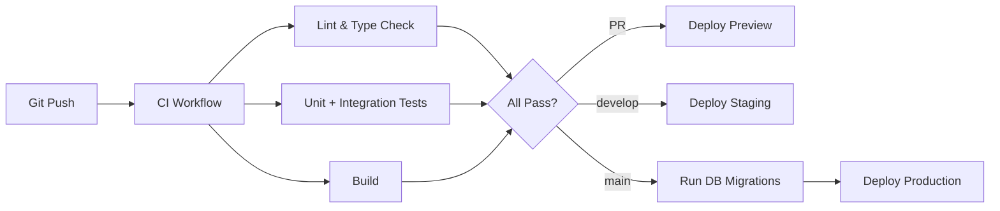

# CI_CD.md — CI/CD Pipeline

> **Back to:** [INDEX.md](INDEX.md) | **Related:** [GITHUB.md](GITHUB.md) | [DEPLOYMENT.md](DEPLOYMENT.md) | [TESTING.md](TESTING.md)

---

## Metadata

| Field | Value |
|---|---|
| **Version** | 1.0.0 |
| **Owner** | @jelvan-ricolcol |
| **Last Updated** | 2026-07-17 |
| **Status** | Active |
| **Scope** | All CI/CD pipeline configuration and workflow documentation |

---

## Overview

The CI/CD pipeline uses **GitHub Actions** to automate linting, testing, building, and deploying to Cloudflare on every push and pull request.

---

## Pipeline Overview



---

## Workflow Files

### CI Workflow (.github/workflows/ci.yml)

```yaml
name: CI

on:
  push:
    branches: ['**']
  pull_request:
    branches: [main, develop]

jobs:
  lint:
    name: Lint & Type Check
    runs-on: ubuntu-latest
    steps:
      - uses: actions/checkout@v4
      - uses: actions/setup-node@v4
        with:
          node-version: '20'
          cache: 'npm'
      - run: npm ci
      - run: npm run lint
      - run: npm run typecheck

  test:
    name: Unit & Integration Tests
    runs-on: ubuntu-latest
    needs: lint
    steps:
      - uses: actions/checkout@v4
      - uses: actions/setup-node@v4
        with:
          node-version: '20'
          cache: 'npm'
      - run: npm ci
      - run: npm run test:coverage
      - uses: actions/upload-artifact@v4
        with:
          name: coverage-report
          path: coverage/

  build:
    name: Build
    runs-on: ubuntu-latest
    needs: lint
    steps:
      - uses: actions/checkout@v4
      - uses: actions/setup-node@v4
        with:
          node-version: '20'
          cache: 'npm'
      - run: npm ci
      - run: npm run build
      - uses: actions/upload-artifact@v4
        with:
          name: dist
          path: dist/
```

---

### Preview Deploy (.github/workflows/deploy-preview.yml)

```yaml
name: Deploy Preview

on:
  pull_request:
    branches: [main, develop]

jobs:
  deploy-preview:
    name: Deploy Preview
    runs-on: ubuntu-latest
    needs: [lint, test, build]
    permissions:
      pull-requests: write
    steps:
      - uses: actions/checkout@v4
      - uses: actions/download-artifact@v4
        with: { name: dist, path: dist/ }
      - uses: cloudflare/wrangler-action@v3
        id: deploy-worker
        with:
          apiToken: ${{ secrets.CLOUDFLARE_API_TOKEN }}
          command: deploy --env preview
      - uses: cloudflare/wrangler-action@v3
        id: deploy-pages
        with:
          apiToken: ${{ secrets.CLOUDFLARE_API_TOKEN }}
          command: pages deploy dist --project-name my-frontend
      - uses: actions/github-script@v7
        with:
          script: |
            github.rest.issues.createComment({
              issue_number: context.issue.number,
              owner: context.repo.owner,
              repo: context.repo.repo,
              body: `🚀 Preview deployed: ${{ steps.deploy-pages.outputs.deployment-url }}`
            })
```

---

### Production Deploy (.github/workflows/deploy-production.yml)

```yaml
name: Deploy Production

on:
  push:
    branches: [main]

jobs:
  deploy-production:
    name: Deploy Production
    runs-on: ubuntu-latest
    environment: production
    steps:
      - uses: actions/checkout@v4
      - uses: actions/setup-node@v4
        with:
          node-version: '20'
          cache: 'npm'
      - run: npm ci
      - run: npm run build
      - name: Apply DB Migrations
        uses: cloudflare/wrangler-action@v3
        with:
          apiToken: ${{ secrets.CLOUDFLARE_API_TOKEN }}
          command: d1 migrations apply DB --env production
      - name: Deploy Worker
        uses: cloudflare/wrangler-action@v3
        with:
          apiToken: ${{ secrets.CLOUDFLARE_API_TOKEN }}
          command: deploy --env production
      - name: Deploy Pages
        uses: cloudflare/wrangler-action@v3
        with:
          apiToken: ${{ secrets.CLOUDFLARE_API_TOKEN }}
          command: pages deploy dist --project-name my-frontend --branch main
```

---

### CodeQL Security Scan (.github/workflows/codeql.yml)

```yaml
name: CodeQL

on:
  push:
    branches: [main, develop]
  schedule:
    - cron: '0 0 * * 1'  # Weekly on Monday

jobs:
  analyze:
    name: Analyze
    runs-on: ubuntu-latest
    permissions:
      actions: read
      contents: read
      security-events: write
    steps:
      - uses: actions/checkout@v4
      - uses: github/codeql-action/init@v3
        with:
          languages: javascript-typescript
      - uses: github/codeql-action/autobuild@v3
      - uses: github/codeql-action/analyze@v3
```

---

## Environment Protection Rules

| Environment | Required Reviewers | Wait Timer | Allowed Branches |
|---|---|---|---|
| `production` | @jelvan-ricolcol | 0 min | main |
| `staging` | None | 0 min | develop |

---

## Build Commands Reference

```bash
npm run lint          # ESLint + Prettier check
npm run typecheck     # TypeScript type checking
npm run test          # Run test suite
npm run test:coverage # Tests with coverage report
npm run build         # Production build (frontend + worker)
npm run preview       # Preview production build locally
```

---

## Version History

| Version | Date | Change |
|---|---|---|
| 1.0.0 | 2026-07-17 | Initial CI/CD documentation |

---

## Related Documents

- [GITHUB.md](GITHUB.md) — GitHub governance
- [DEPLOYMENT.md](DEPLOYMENT.md) — Deployment runbooks
- [TESTING.md](TESTING.md) — Testing strategy
- [ENVIRONMENT_VARIABLES.md](ENVIRONMENT_VARIABLES.md) — Secrets configuration
- [docs/github/ci-cd.md](docs/github/ci-cd.md) — CI/CD deep dive
