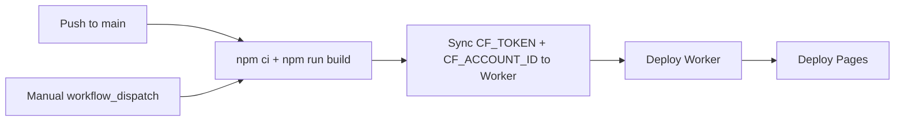

# CI_CD.md — CI/CD Pipeline

> **Back to:** [INDEX.md](INDEX.md) | **Related:** [GITHUB.md](GITHUB.md) | [DEPLOYMENT.md](DEPLOYMENT.md) | [TESTING.md](TESTING.md)

---

## Metadata

| Field | Value |
|---|---|
| **Version** | 1.0.0 |
| **Owner** | @jelvan-ricolcol |
| **Last Updated** | 2026-07-17 |
| **Status** | Active |
| **Scope** | All CI/CD pipeline configuration and workflow documentation |

---

## Overview

The CI/CD pipeline uses **GitHub Actions** to build and deploy the application to Cloudflare. The repository currently includes a production deployment workflow at `.github/workflows/deploy.yml` that uses the `CLOUDFLARE_API_TOKEN` and `CLOUDFLARE_ACCOUNT_ID` GitHub secrets to deploy both the Pages frontend and the Worker backend.

---

## Pipeline Overview



---

## Workflow Files

This repository currently checks in `.github/workflows/deploy.yml`. Additional workflow snippets below should be treated as reference patterns unless a matching workflow file exists in the repository.

### CI Workflow (.github/workflows/ci.yml)

```yaml
name: CI

on:
  push:
    branches: ['**']
  pull_request:
    branches: [main, develop]

jobs:
  lint:
    name: Lint & Type Check
    runs-on: ubuntu-latest
    steps:
      - uses: actions/checkout@v4
      - uses: actions/setup-node@v4
        with:
          node-version: '20'
          cache: 'npm'
      - run: npm ci
      - run: npm run lint
      - run: npm run typecheck

  test:
    name: Unit & Integration Tests
    runs-on: ubuntu-latest
    needs: lint
    steps:
      - uses: actions/checkout@v4
      - uses: actions/setup-node@v4
        with:
          node-version: '20'
          cache: 'npm'
      - run: npm ci
      - run: npm run test:coverage
      - uses: actions/upload-artifact@v4
        with:
          name: coverage-report
          path: coverage/

  build:
    name: Build
    runs-on: ubuntu-latest
    needs: lint
    steps:
      - uses: actions/checkout@v4
      - uses: actions/setup-node@v4
        with:
          node-version: '20'
          cache: 'npm'
      - run: npm ci
      - run: npm run build
      - uses: actions/upload-artifact@v4
        with:
          name: dist
          path: dist/
```

---

### Deployment Workflow (.github/workflows/deploy.yml)

```yaml
name: Deploy DevPilot

on:
  push:
    branches: [main]
  workflow_dispatch:

jobs:
  build-and-deploy:
    name: Build & Deploy to Cloudflare
    runs-on: ubuntu-latest
    steps:
      - uses: actions/checkout@v4
      - uses: actions/setup-node@v4
        with:
          node-version: '20'
          cache: 'npm'
      - run: npm ci
      - run: npm run build
      - name: Sync Worker runtime Cloudflare secrets
        run: node scripts/sync-worker-secrets.mjs
      - uses: cloudflare/wrangler-action@v3
        with:
          apiToken: ${{ secrets.CLOUDFLARE_API_TOKEN }}
          accountId: ${{ secrets.CLOUDFLARE_ACCOUNT_ID }}
          command: deploy --env production
      - uses: cloudflare/pages-action@v1
        with:
          apiToken: ${{ secrets.CLOUDFLARE_API_TOKEN }}
          accountId: ${{ secrets.CLOUDFLARE_ACCOUNT_ID }}
          projectName: devpilot-dashboard
          directory: dist
          gitHubToken: ${{ secrets.GITHUB_TOKEN }}
```

---

### CodeQL Security Scan (.github/workflows/codeql.yml)

```yaml
name: CodeQL

on:
  push:
    branches: [main, develop]
  schedule:
    - cron: '0 0 * * 1'  # Weekly on Monday

jobs:
  analyze:
    name: Analyze
    runs-on: ubuntu-latest
    permissions:
      actions: read
      contents: read
      security-events: write
    steps:
      - uses: actions/checkout@v4
      - uses: github/codeql-action/init@v3
        with:
          languages: javascript-typescript
      - uses: github/codeql-action/autobuild@v3
      - uses: github/codeql-action/analyze@v3
```

---

## Environment Protection Rules

| Environment | Required Reviewers | Wait Timer | Allowed Branches |
|---|---|---|---|
| `production` | @jelvan-ricolcol | 0 min | main |
| `staging` | None | 0 min | develop |

---

## Build Commands Reference

```bash
npm run dev           # Vite development server
npm run build         # Production frontend build
npm run lint          # ESLint script configured in package.json
npm run worker:dev    # Local Worker development with Wrangler
npm run worker:deploy # Manual Worker deploy with Wrangler
```

---

## Version History

| Version | Date | Change |
|---|---|---|
| 1.0.0 | 2026-07-17 | Initial CI/CD documentation |

---

## Related Documents

- [GITHUB.md](GITHUB.md) — GitHub governance
- [DEPLOYMENT.md](DEPLOYMENT.md) — Deployment runbooks
- [TESTING.md](TESTING.md) — Testing strategy
- [ENVIRONMENT_VARIABLES.md](ENVIRONMENT_VARIABLES.md) — Secrets configuration
- [docs/github/ci-cd.md](docs/github/ci-cd.md) — CI/CD deep dive
