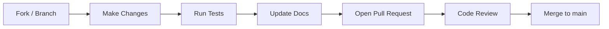

# CONTRIBUTING.md — Contribution Guidelines

> **Back to:** [INDEX.md](INDEX.md) | **Related:** [CODING_STANDARDS.md](CODING_STANDARDS.md) | [STYLE_GUIDE.md](STYLE_GUIDE.md) | [GITHUB.md](GITHUB.md)

---

## Metadata

| Field | Value |
|---|---|
| **Version** | 1.0.0 |
| **Owner** | @jelvan-ricolcol |
| **Last Updated** | 2026-07-17 |
| **Status** | Active |

---

## Overview

Thank you for contributing to this repository. This guide covers how to propose changes, submit pull requests, add documentation, and maintain quality standards.

---

## Before You Start

1. Read [CODE_OF_CONDUCT.md](CODE_OF_CONDUCT.md)
2. Read [CODING_STANDARDS.md](CODING_STANDARDS.md)
3. Read [STYLE_GUIDE.md](STYLE_GUIDE.md) (for documentation changes)
4. Search existing issues and PRs to avoid duplication

---

## Contribution Workflow



---

## Branch Naming

```
feature/add-magic-link-auth
fix/jwt-refresh-race-condition
docs/update-api-reference
chore/bump-wrangler-version
security/fix-cors-header
```

---

## Commit Messages (Conventional Commits)

Format: `type(scope): description`

```
feat(auth): add magic link login flow
fix(api): return 422 instead of 400 for business rule violations
docs(api): add pagination examples to API.md
chore(deps): update wrangler to 3.78.0
test(auth): add refresh token expiry test
security(api): add rate limiting to login endpoint
```

See full type reference in [GITHUB.md](GITHUB.md).

---

## Documentation Requirements

**Every change must update affected documentation before the PR is considered complete.**

When you change | Update these documents
--- | ---
API endpoints | [API.md](API.md), [SERVICE_REGISTRY.md](SERVICE_REGISTRY.md)
Database schema | [DATABASE.md](DATABASE.md), [DATA_DICTIONARY.md](DATA_DICTIONARY.md)
Auth/authz logic | [AUTHENTICATION.md](AUTHENTICATION.md) or [AUTHORIZATION.md](AUTHORIZATION.md)
Environment variables | [ENVIRONMENT_VARIABLES.md](ENVIRONMENT_VARIABLES.md)
CI/CD workflows | [CI_CD.md](CI_CD.md)
Deployment procedure | [DEPLOYMENT.md](DEPLOYMENT.md)
New feature | [FEATURE_REGISTRY.md](FEATURE_REGISTRY.md), [CHANGELOG.md](CHANGELOG.md)
New service | [SERVICE_REGISTRY.md](SERVICE_REGISTRY.md)
Breaking change | [CHANGELOG.md](CHANGELOG.md), affected docs

New documents must be registered in [INDEX.md](INDEX.md).

---

## Pull Request Checklist

- [ ] Tests added or updated for changed behavior
- [ ] All existing tests pass (`npm run test`)
- [ ] Linting passes (`npm run lint`)
- [ ] Type checking passes (`npm run typecheck`)
- [ ] Documentation updated for all affected areas
- [ ] CHANGELOG.md updated
- [ ] No secrets committed
- [ ] PR description explains the *why* (not just the what)
- [ ] Breaking changes documented

---

## Adding Documentation

1. Create file following the template in [STYLE_GUIDE.md](STYLE_GUIDE.md)
2. Add to [INDEX.md](INDEX.md) under the appropriate category
3. Add back-link to INDEX.md at the top of the new document
4. Link related documents in the "Related Documents" section

---

## Reporting Issues

Use GitHub Issues with the appropriate label:
- `bug` — Something is broken
- `docs` — Documentation improvement
- `feature` — New capability request
- `security` — Security concern (use GitHub Security Advisories for vulnerabilities)

---

## Related Documents

- [CODE_OF_CONDUCT.md](CODE_OF_CONDUCT.md)
- [CODING_STANDARDS.md](CODING_STANDARDS.md)
- [STYLE_GUIDE.md](STYLE_GUIDE.md)
- [GITHUB.md](GITHUB.md) — Branch and PR standards
- [TESTING.md](TESTING.md) — Testing requirements


---
*Enterprise AI-First Development Standard - [Return to Index](INDEX.md)*
