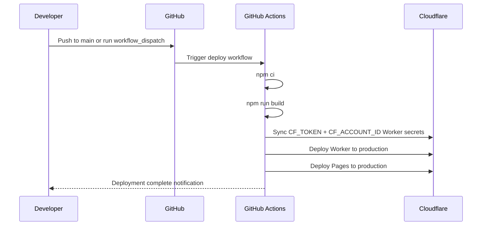

# DEPLOYMENT.md — Deployment Procedures

> **Back to:** [INDEX.md](INDEX.md) | **Related:** [CI_CD.md](CI_CD.md) | [CLOUDFLARE.md](CLOUDFLARE.md) | [ENVIRONMENT_VARIABLES.md](ENVIRONMENT_VARIABLES.md)

---

## Metadata

| Field | Value |
|---|---|
| **Version** | 1.0.0 |
| **Owner** | @jelvan-ricolcol |
| **Last Updated** | 2026-07-17 |
| **Status** | Active |
| **Scope** | All deployment procedures and runbooks |

---

## Overview

Deployments are automated via GitHub Actions. The repository now deploys both the Cloudflare Pages frontend and the `devpilot-api` Worker backend from `.github/workflows/deploy.yml` using the `CLOUDFLARE_API_TOKEN` and `CLOUDFLARE_ACCOUNT_ID` GitHub secrets. Manual deployments using Wrangler CLI are documented for emergencies. All deployments require passing CI checks.

---

## Environments

| Environment | Branch | Trigger | URL |
|---|---|---|---|
| Local | Any | Manual | `localhost` |
| Production | `main` | Push to `main` or manual workflow dispatch | Cloudflare Pages project + Worker route |

---

## Deployment Flow



---

## Pre-Deployment Checklist

Before every production deployment:

- [ ] `npm run build` passes
- [ ] Code reviewed and approved
- [ ] `CLOUDFLARE_API_TOKEN` and `CLOUDFLARE_ACCOUNT_ID` are present in GitHub Secrets
- [ ] Required manual Worker secrets are verified in Cloudflare
- [ ] Rollback plan documented

---

## GitHub Actions Workflow

See: [CI_CD.md](CI_CD.md)

### Production Deploy (automated on push to `main` or manual dispatch)
```yaml
# .github/workflows/deploy.yml (summarized)
on:
  push:
    branches: [main]
  workflow_dispatch:
jobs:
  build-and-deploy:
    runs-on: ubuntu-latest
    steps:
      - uses: actions/checkout@v4
      - uses: actions/setup-node@v4
        with: { node-version: '20' }
      - run: npm ci
      - run: npm run build
      - name: Sync Worker runtime Cloudflare secrets
        run: |
          printf '%s' "$CLOUDFLARE_API_TOKEN" | npx wrangler secret put CF_TOKEN --env production
          printf '%s' "$CLOUDFLARE_ACCOUNT_ID" | npx wrangler secret put CF_ACCOUNT_ID --env production
      - uses: cloudflare/wrangler-action@v3
        with:
          apiToken: ${{ secrets.CLOUDFLARE_API_TOKEN }}
          accountId: ${{ secrets.CLOUDFLARE_ACCOUNT_ID }}
          command: deploy --env production
      - uses: cloudflare/pages-action@v1
        with:
          apiToken: ${{ secrets.CLOUDFLARE_API_TOKEN }}
          accountId: ${{ secrets.CLOUDFLARE_ACCOUNT_ID }}
          projectName: devpilot-dashboard
          directory: dist
          gitHubToken: ${{ secrets.GITHUB_TOKEN }}
```

### What is automated now

- Frontend build (`npm run build`)
- Production Worker deployment for `devpilot-api`
- Production Pages deployment for `devpilot-dashboard`
- Sync of Worker runtime secrets `CF_TOKEN` and `CF_ACCOUNT_ID` from GitHub Actions secrets before backend deploy

### Still requires manual setup

- Create and keep the Cloudflare Pages project `devpilot-dashboard`
- Create and keep the Cloudflare Worker target defined by `wrangler.toml`
- Add the optional Worker secret `GITHUB_TOKEN` manually if the backend should proxy GitHub API requests server-side
- Add any future runtime secrets that are not derived from `CLOUDFLARE_API_TOKEN` or `CLOUDFLARE_ACCOUNT_ID`
- Configure custom domains, routes, and any Cloudflare product bindings not declared in this repository

---

## Manual Deployment (Emergency)

```bash
# 1. Authenticate
wrangler login

# 2. Run migrations
wrangler d1 migrations apply DB --env production

# 3. Deploy Worker
wrangler deploy --env production

# 4. Deploy Pages
wrangler pages deploy dist --project-name devpilot-dashboard --branch main
```

---

## Rollback Procedures

### Worker Rollback
```bash
# List recent deployments
wrangler deployments list

# Roll back to previous deployment
wrangler rollback [deployment-id]
```

### Database Rollback
```bash
# D1 does not support automatic rollback
# Apply rollback SQL from migration file footer
wrangler d1 execute DB --file migrations/rollback_XXXX.sql --env production
```

---

## Zero-Downtime Deployments

Cloudflare Workers supports zero-downtime deployment:
- New Worker version deployed while old version continues serving requests
- Cloudflare gradually routes traffic to new version
- No restart, no connection drop

**Database migrations must be backward-compatible:**
- Add columns (never remove in the same deploy)
- Deploy new code that handles both old and new schema
- Remove deprecated columns in a subsequent deploy

---

## Post-Deployment Verification

```bash
# Check Worker health
curl https://api.{domain}/api/health

# Check database connectivity
curl https://api.{domain}/health/db

# Tail Worker logs
wrangler tail --env production
```

---

## Version History

| Version | Date | Change |
|---|---|---|
| 1.0.0 | 2026-07-17 | Initial deployment documentation |

---

## Related Documents

- [CI_CD.md](CI_CD.md) — CI/CD pipeline detail
- [CLOUDFLARE.md](CLOUDFLARE.md) — Cloudflare services
- [ENVIRONMENT_VARIABLES.md](ENVIRONMENT_VARIABLES.md) — Env vars per environment
- [DATABASE.md](DATABASE.md) — Migration procedures
- [TROUBLESHOOTING.md](TROUBLESHOOTING.md) — Deployment failure resolution
