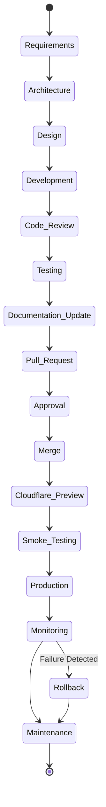

# Enterprise Deployment State Machine

## Complete Deployment Lifecycle

Every deployment must strictly traverse these states. Bypassing states is only allowed under the Emergency Hotfix workflow, which still mandates Documentation Update and Code Review retroactively.

---
*Enterprise AI-First Development Standard - [Return to Index](INDEX.md)*
