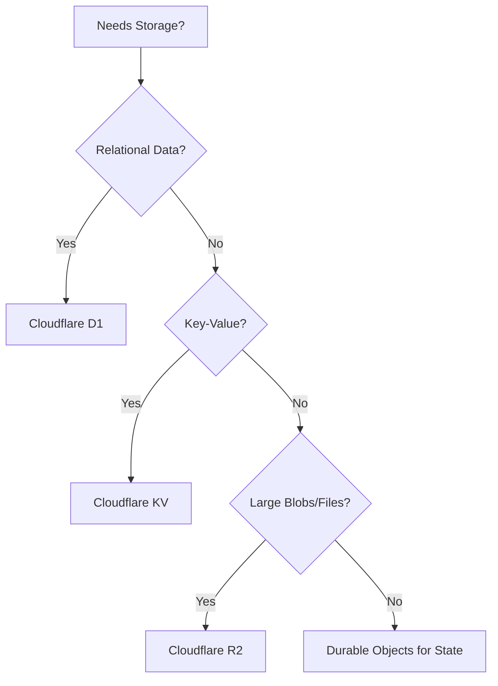

# Enterprise Decision Trees

## Storage Selection

## Other Decision Trees
- **Authentication:** Use built-in OAuth/JWT flows documented in `AUTHENTICATION.md`.
- **API Design:** RESTful principles with Hono.
- **State Management:** React Context + React Query.
- **Error Handling:** Standardized JSON error responses.

---
*Enterprise AI-First Development Standard - [Return to Index](INDEX.md)*
