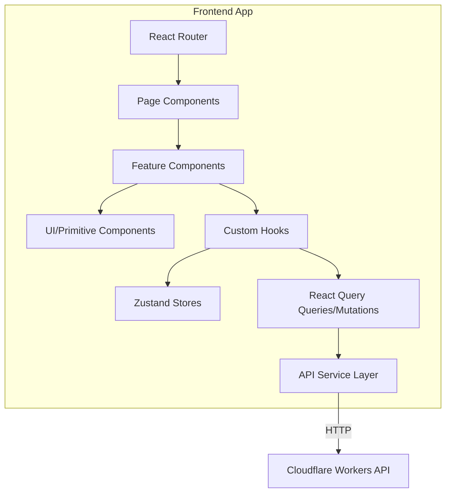

# FRONTEND.md — Frontend Architecture

> **Back to:** [INDEX.md](INDEX.md) | **Related:** [BACKEND.md](BACKEND.md) | [COMPONENT_LIBRARY.md](COMPONENT_LIBRARY.md) | [DESIGN_SYSTEM.md](DESIGN_SYSTEM.md) | [STATE_MANAGEMENT.md](STATE_MANAGEMENT.md)

---

## Metadata

| Field | Value |
|---|---|
| **Version** | 1.0.0 |
| **Owner** | @jelvan-ricolcol |
| **Last Updated** | 2026-07-17 |
| **Status** | Active |
| **Scope** | Frontend architecture, patterns, and conventions |

---

## Overview

The frontend is a modern TypeScript-first single-page application built with React, hosted on Cloudflare Pages, with API calls to Cloudflare Workers. It is designed for performance, accessibility, and maintainability.

---

## Technology Stack

| Technology | Version | Purpose |
|---|---|---|
| TypeScript | 5.x | Type-safe language |
| React | 18.x | UI component framework |
| Vite | 5.x | Build tool |
| React Query (TanStack) | 5.x | Server state management |
| Zustand | 4.x | Client state management |
| React Router | 6.x | Client-side routing |
| Tailwind CSS | 3.x | Utility-first CSS |
| Zod | 3.x | Runtime validation |
| Playwright | 1.x | E2E testing |
| Vitest | 1.x | Unit/integration testing |

---

## Architecture



---

## Folder Structure

```
src/
├── app/                    # App-level setup (router, providers)
│   ├── App.tsx
│   ├── router.tsx
│   └── providers.tsx
├── pages/                  # Route-level page components
│   ├── Home/
│   ├── Dashboard/
│   └── Settings/
├── features/               # Feature-scoped modules
│   ├── auth/
│   │   ├── components/
│   │   ├── hooks/
│   │   ├── queries/
│   │   └── store.ts
│   └── users/
│       ├── components/
│       ├── hooks/
│       └── queries/
├── components/             # Shared/reusable UI components
│   ├── Button/
│   ├── Input/
│   └── Modal/
├── hooks/                  # Shared custom hooks
├── lib/                    # Utilities, API client, helpers
│   ├── api-client.ts
│   ├── utils.ts
│   └── validators.ts
├── stores/                 # Shared Zustand stores
├── types/                  # Global TypeScript types
└── styles/                 # Global styles, Tailwind config
```

---

## State Management Strategy

| State Type | Tool | Storage |
|---|---|---|
| Server data (API responses) | React Query | Memory + Cache |
| Auth state | Zustand + React Query | Memory |
| UI state (modals, drawers) | Zustand or useState | Memory |
| Form state | React Hook Form | Memory |
| URL/navigation state | React Router params | URL |
| Persistent preferences | Zustand + localStorage | localStorage |

See: [STATE_MANAGEMENT.md](STATE_MANAGEMENT.md)

---

## API Integration Pattern

```typescript
// lib/api-client.ts
export const apiClient = {
  async get<T>(path: string, options?: RequestInit): Promise<T> {
    const response = await fetch(`${import.meta.env.VITE_API_URL}${path}`, {
      ...options,
      headers: {
        'Content-Type': 'application/json',
        Authorization: `******
        ...options?.headers,
      },
    });
    if (!response.ok) throw await parseError(response);
    return response.json();
  },
  // post, put, patch, delete follow same pattern
};

// features/users/queries/useUsers.ts
export function useUsers() {
  return useQuery({
    queryKey: ['users'],
    queryFn: () => apiClient.get<User[]>('/v1/users'),
    staleTime: 60_000,
  });
}
```

---

## Routing Conventions

- Route paths: `/kebab-case`
- Dynamic segments: `/users/:userId`
- Protected routes wrapped in `<AuthGuard />`
- Lazy loading with `React.lazy()` for all page-level components

---

## Performance Standards

| Metric | Target |
|---|---|
| Largest Contentful Paint | < 2.5s |
| Cumulative Layout Shift | < 0.1 |
| First Input Delay | < 100ms |
| Time to Interactive | < 3.5s |
| Bundle size (initial) | < 200KB gzipped |

Optimizations:
- Code splitting at route level
- Image optimization (WebP, lazy loading)
- Tree shaking via Vite
- Asset hashing for long-term caching
- Preloading critical routes

See: [PERFORMANCE.md](PERFORMANCE.md)

---

## Accessibility Standards

- WCAG 2.1 AA compliance required
- All interactive elements keyboard-navigable
- ARIA labels on all icon-only buttons
- Sufficient color contrast (4.5:1 for normal text)
- Screen reader tested with NVDA and VoiceOver
- Focus management on modal open/close

---

## Security Considerations

- No secrets in frontend code or environment variables exposed to browser
- Content-Security-Policy headers set by Cloudflare Workers
- XSS prevention: React escapes by default; never use `dangerouslySetInnerHTML` with untrusted content
- Auth tokens: access token in memory only, refresh token in HttpOnly cookie
- API calls over HTTPS only

See: [docs/frontend/frontend-security.md](docs/frontend/frontend-security.md)

---

## Error Handling

- React Error Boundaries wrap all route-level components
- React Query `onError` callbacks for API failures
- Global toast notification for user-facing errors
- Structured error object from API: `{ error: { code, message, status } }`
- Never expose stack traces to user

See: [ERROR_HANDLING.md](ERROR_HANDLING.md)

---

## Testing Strategy

| Level | Tool | Coverage Target |
|---|---|---|
| Unit | Vitest + React Testing Library | 80%+ |
| Integration | Vitest + MSW (API mocking) | Key flows |
| E2E | Playwright | Critical paths |

See: [TESTING.md](TESTING.md)

---

## Build & Deployment

```bash
# Local development
npm run dev

# Type check
npm run typecheck

# Lint
npm run lint

# Test
npm run test

# Build for production
npm run build

# Preview production build
npm run preview
```

Deployed to Cloudflare Pages via GitHub Actions on push to `main`.

See: [DEPLOYMENT.md](DEPLOYMENT.md) | [CI_CD.md](CI_CD.md)

---

## Environment Variables

| Variable | Purpose | Required |
|---|---|---|
| `VITE_API_URL` | Backend API base URL | Yes |
| `VITE_APP_ENV` | Environment name | Yes |
| `VITE_SENTRY_DSN` | Error monitoring | Production |

See: [ENVIRONMENT_VARIABLES.md](ENVIRONMENT_VARIABLES.md)

---

## Version History

| Version | Date | Change |
|---|---|---|
| 1.0.0 | 2026-07-17 | Initial frontend documentation |

---

## Related Documents

- [BACKEND.md](BACKEND.md) — API server documentation
- [API.md](API.md) — API contract reference
- [STATE_MANAGEMENT.md](STATE_MANAGEMENT.md) — State patterns
- [COMPONENT_LIBRARY.md](COMPONENT_LIBRARY.md) — UI components
- [DESIGN_SYSTEM.md](DESIGN_SYSTEM.md) — Design tokens
- [TESTING.md](TESTING.md) — Testing strategy
- [PERFORMANCE.md](PERFORMANCE.md) — Performance budgets
- [docs/frontend/react.md](docs/frontend/react.md) — React patterns
- [docs/frontend/typescript.md](docs/frontend/typescript.md) — TypeScript standards


---
*Enterprise AI-First Development Standard - [Return to Index](INDEX.md)*
