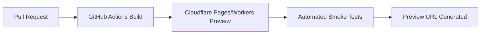
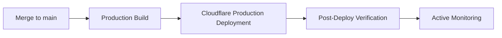

# GitHub ↔ Cloudflare Source of Truth

## Single Source of Truth
GitHub is the definitive and canonical source of truth for the codebase, configurations, and documentation. Cloudflare is the sole execution environment. No manual changes via the Cloudflare UI are permitted if they alter state tracked in GitHub.

## Deployment Lifecycles

### Preview Deployment Lifecycle
Triggered on every PR.

### Production Deployment Lifecycle
Triggered on merge to `main`.

## Rollback & Emergency Hotfix Workflow
- **Rollback:** Revert commit on `main`, which triggers a production deployment of the previous state.
- **Hotfix:** Branch from `main`, implement fix, open PR, fast-track approval, merge, deploy.

## Branch Protection & Merge Requirements
- `main` branch is protected.
- Requires passing CI checks (build, test, AI review).
- Requires at least 1 approval.

## Environment Promotion Strategy
Development -> Preview (PR) -> Production (`main`).

---
*Enterprise AI-First Development Standard - [Return to Index](INDEX.md)*
