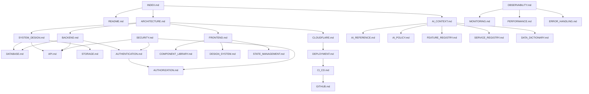

# INDEX.md — Documentation Map

> **Navigation entry point for humans and AI assistants.**
> Every document in this repository is indexed here. No document may exist without being listed.

---

## Metadata

| Field | Value |
|---|---|
| **Version** | 1.0.0 |
| **Owner** | @jelvan-ricolcol |
| **Last Updated** | 2026-07-17 |
| **Status** | Active |
| **Scope** | Entire repository |

---

## Purpose

This INDEX.md serves as the single source of truth for all documentation in this repository. It enables:

- **AI assistants** to quickly locate relevant context, trace dependencies, and make accurate implementation decisions.
- **Human developers** to navigate the knowledge base without searching.
- **Automated tooling** to validate documentation completeness and cross-reference integrity.

---

## Quick Navigation

| Category | Document | Purpose |
|---|---|---|
| 🏠 Root | [README.md](README.md) | Repository overview and onboarding |
| 📚 Unified | [fullstack-jel.md](fullstack-jel.md) | Complete concatenated documentation in one file |
| 🗺️ Navigation | **INDEX.md** *(this file)* | Documentation map |
| 🏛️ Architecture | [ARCHITECTURE.md](ARCHITECTURE.md) | System architecture overview |
| 🏗️ System Design | [SYSTEM_DESIGN.md](SYSTEM_DESIGN.md) | Detailed system design decisions |
| 🎨 Frontend | [FRONTEND.md](FRONTEND.md) | Frontend architecture and patterns |
| ⚙️ Backend | [BACKEND.md](BACKEND.md) | Backend architecture and patterns |
| 🔌 API | [API.md](API.md) | API contracts, standards, versioning |
| 🗄️ Database | [DATABASE.md](DATABASE.md) | Database schema, migrations, query patterns |
| 🔐 Authentication | [AUTHENTICATION.md](AUTHENTICATION.md) | Auth flows, JWT, OAuth, sessions |
| 🛡️ Authorization | [AUTHORIZATION.md](AUTHORIZATION.md) | RBAC, permissions, access control |
| 🔑 Env Variables | [ENVIRONMENT_VARIABLES.md](ENVIRONMENT_VARIABLES.md) | All environment variables documented |
| 🚀 Deployment | [DEPLOYMENT.md](DEPLOYMENT.md) | Deployment procedures and runbooks |
| 🖼️ UI Resources | [UI_RESOURCES.md](UI_RESOURCES.md) | UI assets, probing, email HTML, and delivery guidance |
| ☁️ Cloudflare | [CLOUDFLARE.md](CLOUDFLARE.md) | Cloudflare services and configuration |
| 🐙 GitHub | [GITHUB.md](GITHUB.md) | GitHub workflows, branch rules, governance |
| 🔄 CI/CD | [CI_CD.md](CI_CD.md) | CI/CD pipeline documentation |
| 🔒 Security | [SECURITY.md](SECURITY.md) | Security policy and practices |
| ⚡ Performance | [PERFORMANCE.md](PERFORMANCE.md) | Performance budgets and optimization |
| 📊 Monitoring | [MONITORING.md](MONITORING.md) | Monitoring setup and alerts |
| 🔭 Observability | [OBSERVABILITY.md](OBSERVABILITY.md) | Logs, metrics, traces |
| 🧪 Testing | [TESTING.md](TESTING.md) | Testing strategy and standards |
| 🚨 Error Handling | [ERROR_HANDLING.md](ERROR_HANDLING.md) | Error patterns and response contracts |
| 📦 State Management | [STATE_MANAGEMENT.md](STATE_MANAGEMENT.md) | Client and server state patterns |
| 🧩 Component Library | [COMPONENT_LIBRARY.md](COMPONENT_LIBRARY.md) | UI component system |
| 🎨 Design System | [DESIGN_SYSTEM.md](DESIGN_SYSTEM.md) | Design tokens, typography, colors |
| 💾 Storage | [STORAGE.md](STORAGE.md) | File storage, object storage, CDN |
| 📁 File Structure | [FILE_STRUCTURE.md](FILE_STRUCTURE.md) | Repository and project file layout |
| 📏 Coding Standards | [CODING_STANDARDS.md](CODING_STANDARDS.md) | Code style, conventions, linting |
| 🛠️ Troubleshooting | [TROUBLESHOOTING.md](TROUBLESHOOTING.md) | Common issues and resolutions |
| 🤖 AI Policy | [AI_POLICY.md](AI_POLICY.md) | AI assistant usage and governance |
| 🧠 AI Context | [AI_CONTEXT.md](AI_CONTEXT.md) | Persistent AI context and project state |
| 📚 AI Reference | [AI_REFERENCE.md](AI_REFERENCE.md) | AI-optimized quick reference |
| 🗂️ Feature Registry | [FEATURE_REGISTRY.md](FEATURE_REGISTRY.md) | All features tracked and documented |
| 🔧 Service Registry | [SERVICE_REGISTRY.md](SERVICE_REGISTRY.md) | All services and their contracts |
| 📖 Data Dictionary | [DATA_DICTIONARY.md](DATA_DICTIONARY.md) | Canonical data model definitions |
| ⚠️ Known Limitations | [KNOWN_LIMITATIONS.md](KNOWN_LIMITATIONS.md) | Known issues and platform constraints |
| 📋 Roadmap | [ROADMAP.md](ROADMAP.md) | Future development plans |
| 📝 Changelog | [CHANGELOG.md](CHANGELOG.md) | Version history |
| 🤝 Contributing | [CONTRIBUTING.md](CONTRIBUTING.md) | Contribution guidelines |
| 📐 Style Guide | [STYLE_GUIDE.md](STYLE_GUIDE.md) | Documentation style guide |
| 📖 Glossary | [GLOSSARY.md](GLOSSARY.md) | Terms and definitions |
| ⚖️ Code of Conduct | [CODE_OF_CONDUCT.md](CODE_OF_CONDUCT.md) | Community standards |

---

## Docs Subdirectory Index

### Architecture
| File | Purpose |
|---|---|
| [docs/architecture/system-design.md](docs/architecture/system-design.md) | System design patterns |
| [docs/architecture/microservices.md](docs/architecture/microservices.md) | Microservices patterns |
| [docs/architecture/monolith-vs-microservices.md](docs/architecture/monolith-vs-microservices.md) | Architecture comparison |
| [docs/architecture/scalable-architecture.md](docs/architecture/scalable-architecture.md) | Scalability patterns |
| [docs/architecture/diagrams.md](docs/architecture/diagrams.md) | Architecture diagrams |

### API
| File | Purpose |
|---|---|
| [docs/api/api-standards.md](docs/api/api-standards.md) | API design standards |
| [docs/api/authentication.md](docs/api/authentication.md) | API authentication |
| [docs/api/documentation.md](docs/api/documentation.md) | API documentation guidelines |
| [docs/api/versioning.md](docs/api/versioning.md) | API versioning strategy |

### Authentication & Authorization
| File | Purpose |
|---|---|
| [docs/authentication/oauth.md](docs/authentication/oauth.md) | OAuth 2.0 / OIDC |
| [docs/authentication/jwt.md](docs/authentication/jwt.md) | JWT tokens |
| [docs/authentication/mfa.md](docs/authentication/mfa.md) | Multi-factor authentication |
| [docs/authentication/sessions.md](docs/authentication/sessions.md) | Session management |
| [docs/authorization/rbac.md](docs/authorization/rbac.md) | Role-based access control |
| [docs/authorization/permissions.md](docs/authorization/permissions.md) | Permissions model |
| [docs/authorization/access-control.md](docs/authorization/access-control.md) | Access control policies |

### Backend
| File | Purpose |
|---|---|
| [docs/backend/api-design.md](docs/backend/api-design.md) | Backend API design |
| [docs/backend/rest-api.md](docs/backend/rest-api.md) | REST API patterns |
| [docs/backend/graphql.md](docs/backend/graphql.md) | GraphQL patterns |
| [docs/backend/serverless.md](docs/backend/serverless.md) | Serverless patterns |
| [docs/backend/workers-backend.md](docs/backend/workers-backend.md) | Cloudflare Workers backend |
| [docs/backend/backend-patterns.md](docs/backend/backend-patterns.md) | General backend patterns |

### Cloudflare
| File | Purpose |
|---|---|
| [docs/cloudflare/workers.md](docs/cloudflare/workers.md) | Cloudflare Workers |
| [docs/cloudflare/d1.md](docs/cloudflare/d1.md) | D1 SQLite database |
| [docs/cloudflare/r2.md](docs/cloudflare/r2.md) | R2 object storage |
| [docs/cloudflare/kv.md](docs/cloudflare/kv.md) | KV store |
| [docs/cloudflare/durable-objects.md](docs/cloudflare/durable-objects.md) | Durable Objects |
| [docs/cloudflare/queues.md](docs/cloudflare/queues.md) | Cloudflare Queues |
| [docs/cloudflare/deployment.md](docs/cloudflare/deployment.md) | Cloudflare deployment |

### Database
| File | Purpose |
|---|---|
| [docs/database/sql.md](docs/database/sql.md) | SQL patterns and best practices |
| [docs/database/nosql.md](docs/database/nosql.md) | NoSQL patterns |
| [docs/database/migrations.md](docs/database/migrations.md) | Database migration patterns |
| [docs/database/optimization.md](docs/database/optimization.md) | Query optimization |

### Frontend
| File | Purpose |
|---|---|
| [docs/frontend/html-css.md](docs/frontend/html-css.md) | HTML & CSS standards |
| [docs/frontend/javascript.md](docs/frontend/javascript.md) | JavaScript standards |
| [docs/frontend/typescript.md](docs/frontend/typescript.md) | TypeScript standards |
| [docs/frontend/react.md](docs/frontend/react.md) | React patterns |
| [docs/frontend/state-management.md](docs/frontend/state-management.md) | Frontend state management |
| [docs/frontend/flutter-web.md](docs/frontend/flutter-web.md) | Flutter Web |
| [docs/frontend/frontend-security.md](docs/frontend/frontend-security.md) | Frontend security |

### GitHub
| File | Purpose |
|---|---|
| [docs/github/github-actions.md](docs/github/github-actions.md) | GitHub Actions workflows |
| [docs/github/ci-cd.md](docs/github/ci-cd.md) | CI/CD pipeline |
| [docs/github/repository-standard.md](docs/github/repository-standard.md) | Repository standards |
| [docs/github/security.md](docs/github/security.md) | GitHub security settings |

### Security
| File | Purpose |
|---|---|
| [docs/security/owasp.md](docs/security/owasp.md) | OWASP Top 10 |
| [docs/security/encryption.md](docs/security/encryption.md) | Encryption standards |
| [docs/security/secrets.md](docs/security/secrets.md) | Secrets management |
| [docs/security/vulnerability-management.md](docs/security/vulnerability-management.md) | Vulnerability management |

### Operations
| File | Purpose |
|---|---|
| [docs/observability/README.md](docs/observability/README.md) | Observability overview |
| [docs/monitoring/README.md](docs/monitoring/README.md) | Monitoring overview |
| [docs/logging/README.md](docs/logging/README.md) | Logging standards |
| [docs/performance/README.md](docs/performance/README.md) | Performance standards |
| [docs/testing/README.md](docs/testing/README.md) | Testing overview |
| [docs/troubleshooting/README.md](docs/troubleshooting/README.md) | Troubleshooting guide |
| [docs/deployment/README.md](docs/deployment/README.md) | Deployment overview |

### Infrastructure
| File | Purpose |
|---|---|
| [docs/aws/cloud-services.md](docs/aws/cloud-services.md) | AWS cloud services |
| [docs/aws/lambda.md](docs/aws/lambda.md) | AWS Lambda |
| [docs/aws/s3.md](docs/aws/s3.md) | AWS S3 |
| [docs/aws/ses.md](docs/aws/ses.md) | AWS SES |
| [docs/docker/README.md](docs/docker/README.md) | Docker setup |
| [docs/kubernetes/README.md](docs/kubernetes/README.md) | Kubernetes setup |

### Other
| File | Purpose |
|---|---|
| [docs/realtime/websocket.md](docs/realtime/websocket.md) | WebSocket patterns |
| [docs/realtime/cloudflare-durable-object-realtime.md](docs/realtime/cloudflare-durable-object-realtime.md) | Realtime with Durable Objects |
| [docs/realtime/messaging-platform.md](docs/realtime/messaging-platform.md) | Messaging platform |
| [docs/accessibility/README.md](docs/accessibility/README.md) | Accessibility standards |
| [docs/caching/README.md](docs/caching/README.md) | Caching strategies |
| [docs/storage/README.md](docs/storage/README.md) | Storage patterns |
| [docs/ui-ux/README.md](docs/ui-ux/README.md) | UI/UX guidelines |
| [docs/seo/README.md](docs/seo/README.md) | SEO guidelines |
| [docs/integrations/README.md](docs/integrations/README.md) | Third-party integrations |
| [docs/standards/README.md](docs/standards/README.md) | Coding standards |
| [docs/prompts/README.md](docs/prompts/README.md) | AI prompt library |
| [docs/references/README.md](docs/references/README.md) | External references |
| [docs/queues/README.md](docs/queues/README.md) | Queue patterns |

---

## Document Dependency Graph

---

## Implementation Status

| Document | Status | Last Updated | Version |
|---|---|---|---|
| INDEX.md | ✅ Complete | 2026-07-17 | 1.0.0 |
| README.md | ✅ Complete | 2026-07-17 | 1.0.0 |
| ARCHITECTURE.md | ✅ Complete | 2026-07-17 | 1.0.0 |
| SYSTEM_DESIGN.md | ✅ Complete | 2026-07-17 | 1.0.0 |
| FRONTEND.md | ✅ Complete | 2026-07-17 | 1.0.0 |
| BACKEND.md | ✅ Complete | 2026-07-17 | 1.0.0 |
| API.md | ✅ Complete | 2026-07-17 | 1.0.0 |
| DATABASE.md | ✅ Complete | 2026-07-17 | 1.0.0 |
| AUTHENTICATION.md | ✅ Complete | 2026-07-17 | 1.0.0 |
| AUTHORIZATION.md | ✅ Complete | 2026-07-17 | 1.0.0 |
| ENVIRONMENT_VARIABLES.md | ✅ Complete | 2026-07-17 | 1.0.0 |
| DEPLOYMENT.md | ✅ Complete | 2026-07-17 | 1.0.0 |
| CLOUDFLARE.md | ✅ Complete | 2026-07-17 | 1.0.0 |
| GITHUB.md | ✅ Complete | 2026-07-17 | 1.0.0 |
| CI_CD.md | ✅ Complete | 2026-07-17 | 1.0.0 |
| SECURITY.md | ✅ Complete | 2026-07-17 | 1.0.0 |
| PERFORMANCE.md | ✅ Complete | 2026-07-17 | 1.0.0 |
| MONITORING.md | ✅ Complete | 2026-07-17 | 1.0.0 |
| OBSERVABILITY.md | ✅ Complete | 2026-07-17 | 1.0.0 |
| TESTING.md | ✅ Complete | 2026-07-17 | 1.0.0 |
| ERROR_HANDLING.md | ✅ Complete | 2026-07-17 | 1.0.0 |
| STATE_MANAGEMENT.md | ✅ Complete | 2026-07-17 | 1.0.0 |
| COMPONENT_LIBRARY.md | ✅ Complete | 2026-07-17 | 1.0.0 |
| DESIGN_SYSTEM.md | ✅ Complete | 2026-07-17 | 1.0.0 |
| STORAGE.md | ✅ Complete | 2026-07-17 | 1.0.0 |
| FILE_STRUCTURE.md | ✅ Complete | 2026-07-17 | 1.0.0 |
| CODING_STANDARDS.md | ✅ Complete | 2026-07-17 | 1.0.0 |
| TROUBLESHOOTING.md | ✅ Complete | 2026-07-17 | 1.0.0 |
| AI_POLICY.md | ✅ Complete | 2026-07-17 | 1.0.0 |
| AI_CONTEXT.md | ✅ Complete | 2026-07-17 | 1.0.0 |
| AI_REFERENCE.md | ✅ Complete | 2026-07-17 | 1.0.0 |
| FEATURE_REGISTRY.md | ✅ Complete | 2026-07-17 | 1.0.0 |
| SERVICE_REGISTRY.md | ✅ Complete | 2026-07-17 | 1.0.0 |
| DATA_DICTIONARY.md | ✅ Complete | 2026-07-17 | 1.0.0 |
| ROADMAP.md | ✅ Complete | 2026-07-17 | 1.0.0 |
| KNOWN_LIMITATIONS.md | ✅ Complete | 2026-07-17 | 1.0.0 |
| CHANGELOG.md | ✅ Complete | 2026-07-17 | 1.0.0 |
| CONTRIBUTING.md | ✅ Complete | 2026-07-17 | 1.0.0 |
| STYLE_GUIDE.md | ✅ Complete | 2026-07-17 | 1.0.0 |
| GLOSSARY.md | ✅ Complete | 2026-07-17 | 1.0.0 |

---

## How to Use This Index

### For AI Assistants
- Start here to locate the correct document for any query.
- Use the dependency graph to understand which documents are related.
- Each document contains a "Related Documents" section with direct links.
- Prefer documents with `✅ Complete` status for authoritative answers.

### For Developers
- Use Quick Navigation for direct links.
- Use the Docs Subdirectory Index for deep-dive topics.
- All documents follow the same structure defined in [STYLE_GUIDE.md](STYLE_GUIDE.md).

### For Onboarding
1. Start with [README.md](README.md)
2. Read [ARCHITECTURE.md](ARCHITECTURE.md)
3. Read [AI_CONTEXT.md](AI_CONTEXT.md) for project state
4. Read your domain-specific document (FRONTEND.md, BACKEND.md, etc.)

---

## Related Documents

- [README.md](README.md) — Repository overview
- [AI_CONTEXT.md](AI_CONTEXT.md) — AI-optimized project context
- [STYLE_GUIDE.md](STYLE_GUIDE.md) — Documentation authoring standards
- [CONTRIBUTING.md](CONTRIBUTING.md) — How to add or update documentation

## Enterprise AI Standards
- [Ai Governance](AI_GOVERNANCE.md)
- [Github Cloudflare Source Of Truth](GITHUB_CLOUDFLARE_SOURCE_OF_TRUTH.md)
- [Deployment State Machine](DEPLOYMENT_STATE_MACHINE.md)
- [Ai Agent Architecture](AI_AGENT_ARCHITECTURE.md)
- [Repository Map](REPOSITORY_MAP.md)
- [Enterprise Decision Trees](ENTERPRISE_DECISION_TREES.md)
- [Universal Development Lifecycle](UNIVERSAL_DEVELOPMENT_LIFECYCLE.md)
- [Enterprise Coding Policies](ENTERPRISE_CODING_POLICIES.md)
- [Jelai Dashboard Architecture](JELAI_DASHBOARD_ARCHITECTURE.md)
- [Ai Prompt Standards](AI_PROMPT_STANDARDS.md)

## Newly Audited Documents
- [Colors](COLORS.md)
- [Feature Flags](FEATURE_FLAGS.md)
- [Module Dependencies](MODULE_DEPENDENCIES.md)
- [Pull Requests](PULL_REQUESTS.md)
- [Stripe](STRIPE.md)
- [Zoho](ZOHO.md)
- [Dns](DNS.md)
- [Branching](BRANCHING.md)
- [Ai Security Policy](AI_SECURITY_POLICY.md)
- [Accessibility](ACCESSIBILITY.md)
- [Ai Implementation Rules](AI_IMPLEMENTATION_RULES.md)
- [Environment](ENVIRONMENT.md)
- [Integration Tests](INTEGRATION_TESTS.md)
- [Zero Trust](ZERO_TRUST.md)
- [Data Retention](DATA_RETENTION.md)
- [Kv](KV.md)
- [Github Actions](GITHUB_ACTIONS.md)
- [Worker Architecture](WORKER_ARCHITECTURE.md)
- [Jwt](JWT.md)
- [Middleware](MIDDLEWARE.md)
- [Ui Guidelines](UI_GUIDELINES.md)
- [Api Rate Limits](API_RATE_LIMITS.md)
- [Mfa](MFA.md)
- [Github Api](GITHUB_API.md)
- [Request Flow](REQUEST_FLOW.md)
- [Database Schema](DATABASE_SCHEMA.md)
- [Responsive](RESPONSIVE.md)
- [R2](R2.md)
- [Api Reference](API_REFERENCE.md)
- [Workers](WORKERS.md)
- [Business Rules](BUSINESS_RULES.md)
- [Cache](CACHE.md)
- [Decision Log](DECISION_LOG.md)
- [Tables](TABLES.md)
- [Resend](RESEND.md)
- [Cloudflare Api](CLOUDFLARE_API.md)
- [Secrets](SECRETS.md)
- [Ai Conflict Resolution](AI_CONFLICT_RESOLUTION.md)
- [Api Errors](API_ERRORS.md)
- [Queues](QUEUES.md)
- [Csp](CSP.md)
- [Do](DO.md)
- [Migrations](MIGRATIONS.md)
- [Rollback](ROLLBACK.md)
- [Api Examples](API_EXAMPLES.md)
- [Permissions](PERMISSIONS.md)
- [D1](D1.md)
- [Input Validation](INPUT_VALIDATION.md)
- [Faq](FAQ.md)
- [Api Webhooks](API_WEBHOOKS.md)
- [Icons](ICONS.md)
- [Disaster Recovery](DISASTER_RECOVERY.md)
- [Api Versioning](API_VERSIONING.md)
- [Healthchecks](HEALTHCHECKS.md)
- [Ai Copilot Guidelines](AI_COPILOT_GUIDELINES.md)
- [System Architecture](SYSTEM_ARCHITECTURE.md)
- [Indexes](INDEXES.md)
- [Project Context](PROJECT_CONTEXT.md)
- [Csrf](CSRF.md)
- [Pages](PAGES.md)
- [Api Overview](API_OVERVIEW.md)
- [Aws Ses](AWS_SES.md)
- [Backup](BACKUP.md)
- [Openai](OPENAI.md)
- [Passkey](PASSKEY.md)
- [Api Endpoints](API_ENDPOINTS.md)
- [Cron](CRON.md)
- [Error Monitoring](ERROR_MONITORING.md)
- [Access](ACCESS.md)
- [Typography](TYPOGRAPHY.md)
- [Anti Patterns](ANTI_PATTERNS.md)
- [Google](GOOGLE.md)
- [Data Flow](DATA_FLOW.md)
- [Naming Conventions](NAMING_CONVENTIONS.md)
- [Relationships](RELATIONSHIPS.md)
- [Logging](LOGGING.md)
- [Mocks](MOCKS.md)
- [Webhooks](WEBHOOKS.md)
- [Unit Tests](UNIT_TESTS.md)
- [Directory Structure](DIRECTORY_STRUCTURE.md)
- [Sql Injection](SQL_INJECTION.md)
- [Er Diagram](ER_DIAGRAM.md)
- [Production](PRODUCTION.md)
- [Services](SERVICES.md)
- [Validation](VALIDATION.md)
- [Encryption](ENCRYPTION.md)
- [Ai Code Review](AI_CODE_REVIEW.md)
- [E2E](E2E.md)
- [Ai Rules](AI_RULES.md)
- [Api Authentication](API_AUTHENTICATION.md)
- [Ai Decision Tree](AI_DECISION_TREE.md)
- [Background Jobs](BACKGROUND_JOBS.md)
- [Rbac](RBAC.md)
- [Figma Guide](FIGMA_GUIDE.md)
- [Hyperdrive](HYPERDRIVE.md)
- [Session](SESSION.md)
- [Headers](HEADERS.md)
- [Ai Deployment Policy](AI_DEPLOYMENT_POLICY.md)
- [Meta](META.md)
- [Local Development](LOCAL_DEVELOPMENT.md)
- [Analytics](ANALYTICS.md)
- [Releases](RELEASES.md)
- [Ai System Prompt](AI_SYSTEM_PROMPT.md)
- [Configuration](CONFIGURATION.md)
- [Staging](STAGING.md)
- [Oauth](OAUTH.md)
- [Common Patterns](COMMON_PATTERNS.md)
- [Event Flow](EVENT_FLOW.md)
- [Xss](XSS.md)
- [Project Structure](PROJECT_STRUCTURE.md)
- [Metrics](METRICS.md)
- [Billing](docs/features/billing.md)
- [Crm](docs/features/crm.md)
- [Contracts](docs/features/contracts.md)
- [Chat](docs/features/chat.md)
- [Calendar](docs/features/calendar.md)
- [Projects](docs/features/projects.md)
- [Email](docs/features/email.md)
- [Ai-Assistant](docs/features/ai-assistant.md)
- [Analytics](docs/features/analytics.md)
- [Admin](docs/features/admin.md)
- [Dashboard](docs/features/dashboard.md)
- [Notes](docs/features/notes.md)
- [Notifications](docs/features/notifications.md)
- [Enterprise Consistency Audit](ENTERPRISE_CONSISTENCY_AUDIT.md)
