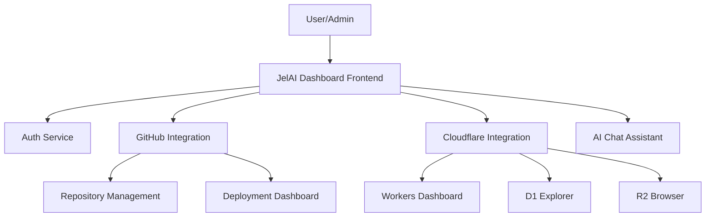

# JelAI Dashboard Architecture

## System Architecture

## Features
- **Code & Deploy:** Commit Assistant, AI Code Review, Deployment Monitoring.
- **Data Management:** D1, R2, KV, and Queue explorers.
- **Admin:** User Roles, Permissions, Cost Monitoring, Audit Logs, Secrets Manager.

---
*Enterprise AI-First Development Standard - [Return to Index](INDEX.md)*
