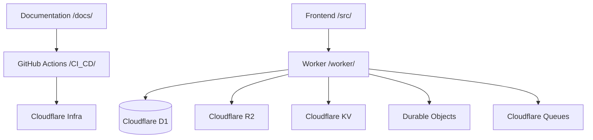

# Repository Knowledge Map

## Component Interaction

## Directory Structure
- `/docs/`: All documentation.
- `/src/`: Frontend React application.
- `/worker/`: Cloudflare Worker API.
- `/.github/`: CI/CD and deployment workflows.
- `/assets/`: Static assets and diagrams.
- `/scripts/`: Utility scripts.

---
*Enterprise AI-First Development Standard - [Return to Index](INDEX.md)*
