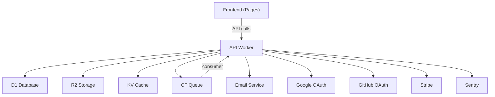

# SERVICE_REGISTRY.md — Service Registry

> **Back to:** [INDEX.md](INDEX.md) | **Related:** [FEATURE_REGISTRY.md](FEATURE_REGISTRY.md) | [API.md](API.md) | [CLOUDFLARE.md](CLOUDFLARE.md)

---

## Metadata

| Field | Value |
|---|---|
| **Version** | 1.0.0 |
| **Owner** | @jelvan-ricolcol |
| **Last Updated** | 2026-07-17 |
| **Status** | Active |
| **Scope** | All services, their contracts, dependencies, and configuration |

---

## Overview

The Service Registry provides a single reference for every service in the system: internal Workers, external APIs, and Cloudflare resources. It documents contracts, authentication, base URLs, and dependencies.

---

## Internal Services

### API Worker (`my-api-worker`)

| Field | Value |
|---|---|
| **Type** | Cloudflare Worker |
| **Runtime** | V8 isolates |
| **Base URL (prod)** | `https://api.{domain}` |
| **Base URL (staging)** | `https://staging-api.{domain}` |
| **Auth** | JWT ****** |
| **Docs** | [BACKEND.md](BACKEND.md) / [API.md](API.md) |

**Bindings:**
- `DB` → D1 (primary database)
- `BUCKET` → R2 (object storage)
- `KV` → KV (cache/sessions)
- `QUEUE` → Queues (background jobs)

**Endpoints:** See [API.md](API.md)

---

### Frontend (Cloudflare Pages)

| Field | Value |
|---|---|
| **Type** | Cloudflare Pages |
| **URL (prod)** | `https://{domain}` |
| **URL (staging)** | `https://staging.{domain}` |
| **Framework** | React + Vite |
| **Docs** | [FRONTEND.md](FRONTEND.md) |

---

## External Services

### Authentication Provider (OAuth)

| Provider | Endpoint | Docs |
|---|---|---|
| Google | `https://accounts.google.com/.well-known/openid-configuration` | [AUTHENTICATION.md](AUTHENTICATION.md) |
| GitHub | `https://github.com/login/oauth/authorize` | [AUTHENTICATION.md](AUTHENTICATION.md) |

---

### Email Service

| Field | Value |
|---|---|
| **Provider** | Resend (or AWS SES) |
| **SDK** | `@resend/node` or AWS SDK |
| **Auth** | API Key via CF Secret (`EMAIL_API_KEY`) |
| **From address** | `noreply@{domain}` |
| **Docs** | [ENVIRONMENT_VARIABLES.md](ENVIRONMENT_VARIABLES.md) |

---

### Payment Service (Stripe)

| Field | Value |
|---|---|
| **Provider** | Stripe |
| **Auth** | Secret key via CF Secret (`STRIPE_SECRET_KEY`) |
| **Webhooks** | Verified via `STRIPE_WEBHOOK_SECRET` |
| **Docs** | https://stripe.com/docs |

---

### Error Tracking (Sentry)

| Field | Value |
|---|---|
| **Provider** | Sentry |
| **Auth** | DSN via CF Secret (`SENTRY_DSN`) |
| **SDK** | `@sentry/cloudflare` |
| **Docs** | [MONITORING.md](MONITORING.md) |

---

## Cloudflare Resources

| Resource | Name | Type | Binding | Environment |
|---|---|---|---|---|
| D1 Database | `my-db-prod` | D1 | `env.DB` | Production |
| D1 Database | `my-db-staging` | D1 | `env.DB` | Staging |
| R2 Bucket | `my-bucket-prod` | R2 | `env.BUCKET` | Production |
| R2 Bucket | `my-bucket-staging` | R2 | `env.BUCKET` | Staging |
| KV Namespace | `my-kv-prod` | KV | `env.KV` | Production |
| KV Namespace | `my-kv-staging` | KV | `env.KV` | Staging |
| Queue | `background-jobs` | Queue | `env.QUEUE` | Production |

---

## Service Dependencies

---

## SLA Reference

| Service | SLA | Source |
|---|---|---|
| Cloudflare Workers | 99.99% | Cloudflare Enterprise |
| Cloudflare Pages | 99.99% | Cloudflare |
| Cloudflare D1 | 99.9% | Cloudflare |
| Resend | 99.9% | Resend SLA |
| Stripe | 99.9% | Stripe Status |

---

## Version History

| Version | Date | Change |
|---|---|---|
| 1.0.0 | 2026-07-17 | Initial service registry |

---

## Related Documents

- [API.md](API.md) — API contract detail
- [CLOUDFLARE.md](CLOUDFLARE.md) — CF service configuration
- [ENVIRONMENT_VARIABLES.md](ENVIRONMENT_VARIABLES.md) — Service credentials
- [FEATURE_REGISTRY.md](FEATURE_REGISTRY.md) — Features per service

---
*Enterprise AI-First Development Standard - [Return to Index](INDEX.md)*
