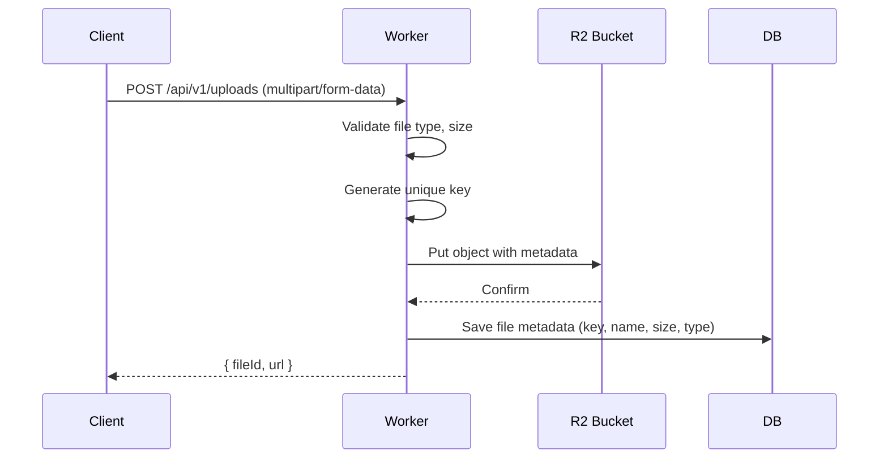

# STORAGE.md — Storage Architecture

> **Back to:** [INDEX.md](INDEX.md) | **Related:** [DATABASE.md](DATABASE.md) | [CLOUDFLARE.md](CLOUDFLARE.md) | [BACKEND.md](BACKEND.md)

---

## Metadata

| Field | Value |
|---|---|
| **Version** | 1.0.0 |
| **Owner** | @jelvan-ricolcol |
| **Last Updated** | 2026-07-17 |
| **Status** | Active |
| **Scope** | All storage solutions: object, key-value, relational, and CDN |

---

## Overview

Storage is split by data type and access pattern across four Cloudflare services: D1 (SQL), R2 (objects), KV (key-value), and Durable Objects (stateful).

---

## Storage Decision Matrix

| Data Type | Storage | Reason |
|---|---|---|
| Structured relational data | D1 (SQLite) | ACID, SQL queries |
| Files, images, documents | R2 (S3-compatible) | Unlimited size, cheap |
| Sessions, cache, feature flags | KV | Fast global read |
| Realtime state, presence | Durable Objects | Strong consistency |
| Async jobs, events | Queues | Reliable delivery |

---

## Cloudflare R2 (Object Storage)

### Use Cases
- User-uploaded files (documents, images)
- Processed/generated assets (thumbnails, exports)
- Static asset backup
- Database backups

### Key Conventions
```typescript
// Key naming: {category}/{userId}/{filename}
const key = `uploads/${userId}/${Date.now()}-${filename}`;

// Upload with metadata
await env.BUCKET.put(key, body, {
  httpMetadata: {
    contentType: file.type,
    cacheControl: 'public, max-age=31536000',
  },
  customMetadata: {
    uploadedBy: userId,
    originalName: file.name,
  },
});

// Serve (via Worker — not direct R2 public URL in production)
const obj = await env.BUCKET.get(key);
return new Response(obj?.body, {
  headers: {
    'Content-Type': obj?.httpMetadata?.contentType ?? 'application/octet-stream',
    'Cache-Control': 'public, max-age=31536000',
  },
});
```

### File Upload Flow


---

## KV Store

### Use Cases
- API response caching
- Session data (short-lived)
- Feature flags
- Rate limit counters (approximate — KV is eventually consistent)
- User preferences

### Key Naming Conventions
```
user:{userId}                   → Cached user object (TTL: 5min)
session:{token}                 → Session data (TTL: 7d)
ratelimit:{ip}:{minute}         → Rate limit count (TTL: 60s)
feature:{flagName}              → Feature flag (TTL: 5min)
config:{key}                    → System config (TTL: 1h)
```

---

## D1 for Structured Storage

See: [DATABASE.md](DATABASE.md)

---

## File Type Restrictions

| Type | Allowed | Max Size |
|---|---|---|
| Images (jpg, png, webp, gif) | ✅ | 10MB |
| Documents (pdf, docx) | ✅ | 25MB |
| Audio (mp3, wav) | ✅ | 50MB |
| Video (mp4) | ✅ | 200MB |
| Executables (.exe, .sh) | ❌ | — |
| Archives (.zip) | ❌ (scan first) | 50MB |

---

## Security

- Validate file type via magic bytes, not just extension
- Restrict R2 bucket to Worker-only access (no public bucket URL)
- Serve files via Worker to enforce authentication
- Scan uploaded files for malware (integrate with antivirus API if required)
- Signed URLs for temporary access (time-limited)

---

## Version History

| Version | Date | Change |
|---|---|---|
| 1.0.0 | 2026-07-17 | Initial storage documentation |

---

## Related Documents

- [DATABASE.md](DATABASE.md) — SQL storage
- [CLOUDFLARE.md](CLOUDFLARE.md) — R2 and KV configuration
- [BACKEND.md](BACKEND.md) — Upload route implementation
- [SECURITY.md](SECURITY.md) — File upload security
- [docs/cloudflare/r2.md](docs/cloudflare/r2.md) — R2 deep dive
- [docs/cloudflare/kv.md](docs/cloudflare/kv.md) — KV deep dive


---
*Enterprise AI-First Development Standard - [Return to Index](INDEX.md)*
