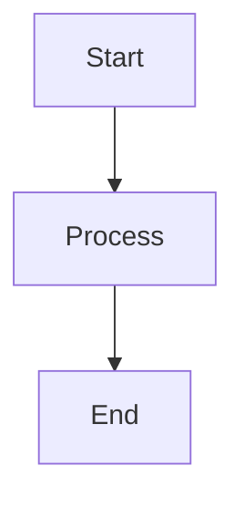
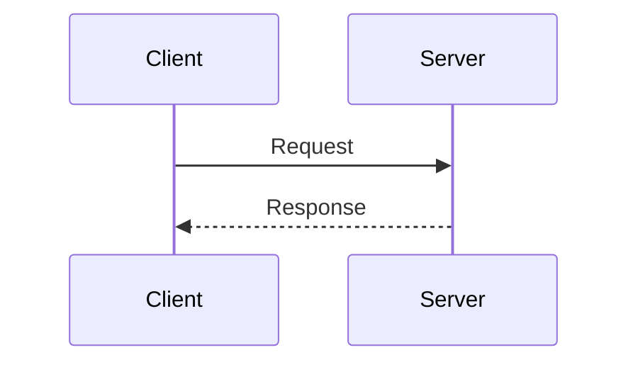

# STYLE_GUIDE.md — Documentation Style Guide

> **Back to:** [INDEX.md](INDEX.md) | **Related:** [CONTRIBUTING.md](CONTRIBUTING.md) | [CODING_STANDARDS.md](CODING_STANDARDS.md)

---

## Metadata

| Field | Value |
|---|---|
| **Version** | 1.0.0 |
| **Owner** | @jelvan-ricolcol |
| **Last Updated** | 2026-07-17 |
| **Status** | Active |
| **Scope** | Documentation authoring standards for all repository documents |

---

## Overview

This guide ensures documentation is consistent, AI-readable, and human-friendly across all files.

---

## Document Structure

Every document must include:

```markdown
# DOCUMENT_NAME.md — Human-Readable Title

> **Back to:** [INDEX.md](INDEX.md) | **Related:** [DOC1.md](DOC1.md)

---

## Metadata
| Field | Value |
|---|---|
| **Version** | x.y.z |
| **Owner** | @username |
| **Last Updated** | YYYY-MM-DD |
| **Status** | Active / Draft / Deprecated |
| **Scope** | One-line description |

---

## Overview
Brief description of what this document covers.

[... content sections ...]

## Version History
| Version | Date | Change |

## Related Documents
- [DOC.md](DOC.md) — Description
```

---

## Headings

- `#` — Document title (one per file)
- `##` — Major sections
- `###` — Subsections
- `####` — Deep subsections (use sparingly)
- Never skip heading levels

---

## Tables

Use tables for:
- Metadata
- Comparison matrices
- Configuration options
- Status tracking
- Reference lookups

```markdown
| Column 1 | Column 2 | Column 3 |
|---|---|---|
| Value | Value | Value |
```

---

## Code Blocks

Always label code blocks with the language:

````markdown
```typescript
const x: string = 'hello';
```

```bash
npm run build
```

```sql
SELECT * FROM users WHERE id = ?;
```

```json
{ "key": "value" }
```
````

---

## Diagrams

Use Mermaid for all diagrams:

````markdown



````

---

## File Naming

| Type | Convention | Example |
|---|---|---|
| Root documents | `UPPER_SNAKE_CASE.md` | `ARCHITECTURE.md` |
| Subdirectory documents | `kebab-case.md` | `api-standards.md` |

---

## Status Values

| Status | Meaning |
|---|---|
| Active | Current, accurate, maintained |
| Draft | Work in progress, not finalized |
| Deprecated | Superseded; kept for reference |
| Archived | No longer relevant |

---

## Language

- Write in clear, direct English
- Use present tense: "The Worker handles" not "The Worker will handle"
- Use active voice: "Validate the input" not "The input should be validated"
- Avoid filler phrases: "It should be noted that" → just state the fact
- Acronyms: spell out on first use: "Role-Based Access Control (RBAC)"

---

## Cross-References

Every document must:
1. Link back to [INDEX.md](INDEX.md) in the header
2. List related documents in a "Related Documents" section
3. Use relative links for internal documents: `[BACKEND.md](BACKEND.md)`
4. Use absolute URLs for external references

---

## Version History Tracking

All documents track changes in a version history table:

```markdown
## Version History
| Version | Date | Change |
|---|---|---|
| 1.1.0 | 2026-08-01 | Added section X |
| 1.0.0 | 2026-07-17 | Initial document |
```

---

## Version History

| Version | Date | Change |
|---|---|---|
| 1.0.0 | 2026-07-17 | Initial style guide |

---

## Related Documents

- [INDEX.md](INDEX.md) — Documentation map
- [CONTRIBUTING.md](CONTRIBUTING.md) — How to contribute
- [CODING_STANDARDS.md](CODING_STANDARDS.md) — Code conventions
- [GLOSSARY.md](GLOSSARY.md) — Terms and definitions

## Documentation template for contributors

- **Decision:** What implementation choice was made?
- **Source:** Which official document backs the choice?
- **Reason:** Why is it appropriate for this project?
- **Risk:** What breaks if the assumption changes?
- **Validation:** Which test, command, or review proves it works?

## Verified sources

- Docker Docs — https://docs.docker.com/
- Kubernetes Docs — https://kubernetes.io/docs/
- OpenTelemetry Docs — https://opentelemetry.io/docs/
- Prometheus Docs — https://prometheus.io/docs/
- The Twelve-Factor App — https://12factor.net/


---
*Enterprise AI-First Development Standard - [Return to Index](INDEX.md)*
