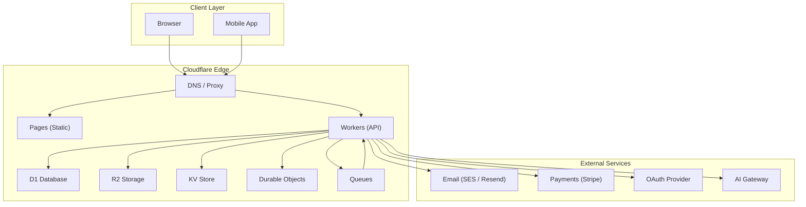
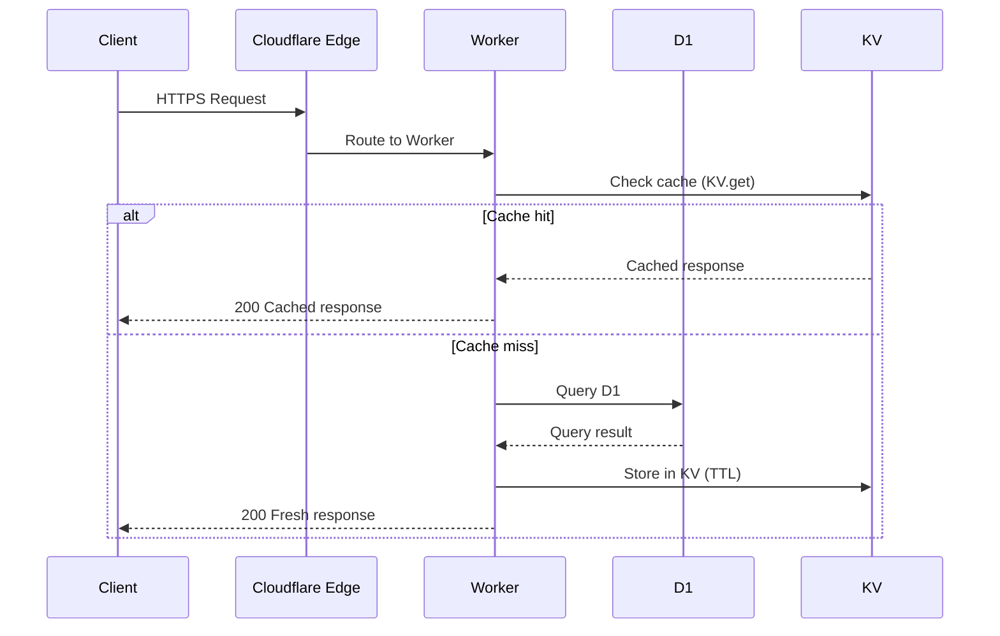

# SYSTEM_DESIGN.md — System Design

> **Back to:** [INDEX.md](INDEX.md) | **Related:** [ARCHITECTURE.md](ARCHITECTURE.md) | [BACKEND.md](BACKEND.md) | [DATABASE.md](DATABASE.md)

---

## Metadata

| Field | Value |
|---|---|
| **Version** | 1.0.0 |
| **Owner** | @jelvan-ricolcol |
| **Last Updated** | 2026-07-17 |
| **Status** | Active |
| **Scope** | Full-stack system design patterns and decisions |

---

## Overview

This document captures the fundamental system design decisions for a production-grade full-stack application deployed on Cloudflare's edge network. It documents the rationale behind key choices so that future developers and AI assistants can understand constraints and make consistent decisions.

---

## Architecture Style

**Chosen:** Edge-first Serverless with optional Origin Fallback

**Rationale:**
- Cloudflare Workers execute at 300+ edge locations, minimizing request latency globally.
- No server provisioning, automatic scaling, zero cold-start overhead.
- Integrated storage (D1, R2, KV) eliminates cross-region database hops for most queries.
- Reduces operational burden: no VMs, no load balancers, no Kubernetes for typical workloads.

**Trade-offs:**
- Worker CPU limits (10ms free / 30s paid) constrain heavy computation.
- Node.js built-ins unavailable — must use Web APIs.
- D1 (SQLite) lacks some PostgreSQL features; migration to Hyperdrive + PostgreSQL is documented.

---

## System Diagram



---

## Request Lifecycle



---

## Data Flow Design

### Write Path
```
Client → Worker → Validate Input (Zod) → Authenticate (JWT)
       → Authorize (RBAC) → Write D1 → Invalidate KV Cache
       → Enqueue background job (optional) → Return 201
```

### Read Path
```
Client → Worker → Authenticate (JWT) → Authorize (RBAC)
       → Check KV cache → (miss) Query D1 → Cache in KV
       → Return 200 with data
```

### Async Path
```
Worker → Enqueue to CF Queues → Return 202 Accepted
Background Worker → Dequeue → Process → Update D1 → Notify via DO
```

---

## Database Design Principles

- **Primary DB:** Cloudflare D1 (SQLite) for structured relational data.
- **Schema-first:** All tables defined in migration files under `migrations/`.
- **Soft deletes:** Prefer `deleted_at TIMESTAMP` over hard deletes for audit trails.
- **Timestamps:** Every table has `created_at` and `updated_at`.
- **IDs:** CUID2 or UUIDv7 for distributed uniqueness without auto-increment.
- **Indexes:** Defined on all foreign keys and common query predicates.

See: [DATABASE.md](DATABASE.md)

---

## API Design Principles

- **RESTful** with resource-oriented URLs.
- **Versioned** via URI path (`/api/v1/`).
- **Authenticated** with JWT ****** on all protected routes.
- **Paginated** with cursor-based pagination for list endpoints.
- **Idempotent** POST and PUT operations documented with `Idempotency-Key` header support.
- **Error responses** follow a consistent schema.

See: [API.md](API.md)

---

## Authentication Design

- **Primary flow:** OAuth 2.0 Authorization Code with PKCE.
- **Token format:** JWT (HS256 or RS256).
- **Access token TTL:** 15 minutes.
- **Refresh token TTL:** 7 days, rotated on use.
- **Storage:** Access token in memory; Refresh token in HttpOnly cookie.
- **Session revocation:** Revocation list in KV store.

See: [AUTHENTICATION.md](AUTHENTICATION.md)

---

## Authorization Design

- **Model:** Role-Based Access Control (RBAC) with resource-level policies.
- **Roles:** `admin`, `editor`, `viewer`, `service` (system-to-system).
- **Enforcement:** Middleware in Worker before route handler.
- **Policy storage:** D1 `permissions` table or KV for fast lookup.

See: [AUTHORIZATION.md](AUTHORIZATION.md)

---

## Caching Strategy

| Layer | Technology | TTL | Use Case |
|---|---|---|---|
| CDN | Cloudflare Cache | Configurable | Static assets, public pages |
| Application | KV Store | 60s – 24h | API responses, sessions |
| Database | D1 prepared queries | N/A | Query plan caching |
| Client | HTTP Cache-Control | Per endpoint | Browser-level cache |

---

## Storage Design

| Data Type | Storage | Notes |
|---|---|---|
| Structured/relational | D1 (SQLite) | Users, content, transactions |
| Unstructured/blobs | R2 | Images, documents, exports |
| Ephemeral key-value | KV | Sessions, cache, feature flags |
| Realtime state | Durable Objects | Presence, chat, collaboration |
| Message queues | Cloudflare Queues | Email, webhooks, notifications |

See: [STORAGE.md](STORAGE.md)

---

## Scalability Design

- **Horizontal scale:** Workers scale automatically at the edge.
- **Database scale:** D1 scales reads; for high write throughput, shard by tenant or migrate to Hyperdrive + PostgreSQL.
- **Storage scale:** R2 is object-level, unlimited scale.
- **Rate limiting:** CF Rate Limiting rules + per-IP / per-user limits in Workers.

---

## Resilience & Reliability

- **Retries:** Exponential backoff for all external API calls.
- **Timeouts:** 5s for external HTTP; 30s for Worker max.
- **Circuit breaker:** Not built-in to Workers; implement via KV flag.
- **Health checks:** `/health` endpoint returning Worker + D1 status.
- **Graceful degradation:** Return cached data on DB failure where acceptable.

---

## Security Design

- TLS enforced by Cloudflare (no self-signed certs needed).
- All secrets in Cloudflare Secrets or GitHub Secrets — never in code.
- Input validated at every Worker entry point.
- OWASP Top 10 mitigations applied.
- Content-Security-Policy and CORS headers on all responses.

See: [SECURITY.md](SECURITY.md)

---

## Performance Targets

| Metric | Target |
|---|---|
| API p50 latency | < 50ms |
| API p99 latency | < 200ms |
| Time to First Byte | < 200ms |
| Core Web Vitals (LCP) | < 2.5s |
| Worker CPU per request | < 10ms (free tier) |

See: [PERFORMANCE.md](PERFORMANCE.md)

---

## Known Trade-offs & Decisions

| Decision | Rationale | Risk | Mitigation |
|---|---|---|---|
| Cloudflare Workers over Lambda | Lower latency, simpler ops | CF vendor lock-in | Abstract runtime-specific code |
| D1 (SQLite) over PostgreSQL | Zero config, cheap, integrated | Limited SQL features | Migrate to Hyperdrive if needed |
| JWT over server sessions | Stateless, scalable | Token revocation complexity | Short TTL + KV revocation list |
| Cursor pagination over offset | Consistent results, better perf | Harder to jump to page N | Accept limitation, document it |

---

## Version History

| Version | Date | Change |
|---|---|---|
| 1.0.0 | 2026-07-17 | Initial system design documentation |

---

## Related Documents

- [ARCHITECTURE.md](ARCHITECTURE.md) — High-level architecture
- [BACKEND.md](BACKEND.md) — Backend implementation
- [DATABASE.md](DATABASE.md) — Database schema and patterns
- [API.md](API.md) — API contracts
- [CLOUDFLARE.md](CLOUDFLARE.md) — Cloudflare configuration
- [SECURITY.md](SECURITY.md) — Security design
- [PERFORMANCE.md](PERFORMANCE.md) — Performance targets


---
*Enterprise AI-First Development Standard - [Return to Index](INDEX.md)*
