# Fullstack Developer Documentation

## Table of Contents

- [AI_CONTEXT](#ai-context)
- [AI_POLICY](#ai-policy)
- [AI_REFERENCE](#ai-reference)
- [API](#api)
- [ARCHITECTURE](#architecture)
- [AUTHENTICATION](#authentication)
- [AUTHORIZATION](#authorization)
- [BACKEND](#backend)
- [CHANGELOG](#changelog)
- [CI_CD](#ci-cd)
- [CLOUDFLARE](#cloudflare)
- [CODE_OF_CONDUCT](#code-of-conduct)
- [CODING_STANDARDS](#coding-standards)
- [COMPONENT_LIBRARY](#component-library)
- [CONTRIBUTING](#contributing)
- [DATABASE](#database)
- [DATA_DICTIONARY](#data-dictionary)
- [DEPLOYMENT](#deployment)
- [DESIGN_SYSTEM](#design-system)
- [ENVIRONMENT_VARIABLES](#environment-variables)
- [ERROR_HANDLING](#error-handling)
- [FEATURE_REGISTRY](#feature-registry)
- [FILE_STRUCTURE](#file-structure)
- [FRONTEND](#frontend)
- [GITHUB](#github)
- [GLOSSARY](#glossary)
- [INDEX](#index)
- [KNOWN_LIMITATIONS](#known-limitations)
- [MONITORING](#monitoring)
- [OBSERVABILITY](#observability)
- [PERFORMANCE](#performance)
- [README](#readme)
- [ROADMAP](#roadmap)
- [SECURITY](#security)
- [SERVICE_REGISTRY](#service-registry)
- [STATE_MANAGEMENT](#state-management)
- [STORAGE](#storage)
- [STYLE_GUIDE](#style-guide)
- [SYSTEM_DESIGN](#system-design)
- [TESTING](#testing)
- [TROUBLESHOOTING](#troubleshooting)
- [UI_RESOURCES](#ui-resources)
- [assets/README](#assets-readme)
- [docs/README](#docs-readme)
- [docs/accessibility/README](#docs-accessibility-readme)
- [docs/api/api-standards](#docs-api-api-standards)
- [docs/api/authentication](#docs-api-authentication)
- [docs/api/documentation](#docs-api-documentation)
- [docs/api/versioning](#docs-api-versioning)
- [docs/architecture/diagrams](#docs-architecture-diagrams)
- [docs/architecture/microservices](#docs-architecture-microservices)
- [docs/architecture/monolith-vs-microservices](#docs-architecture-monolith-vs-microservices)
- [docs/architecture/scalable-architecture](#docs-architecture-scalable-architecture)
- [docs/architecture/system-design](#docs-architecture-system-design)
- [docs/authentication/jwt](#docs-authentication-jwt)
- [docs/authentication/mfa](#docs-authentication-mfa)
- [docs/authentication/oauth](#docs-authentication-oauth)
- [docs/authentication/sessions](#docs-authentication-sessions)
- [docs/authorization/access-control](#docs-authorization-access-control)
- [docs/authorization/permissions](#docs-authorization-permissions)
- [docs/authorization/rbac](#docs-authorization-rbac)
- [docs/aws/cloud-services](#docs-aws-cloud-services)
- [docs/aws/lambda](#docs-aws-lambda)
- [docs/aws/s3](#docs-aws-s3)
- [docs/aws/ses](#docs-aws-ses)
- [docs/backend/api-design](#docs-backend-api-design)
- [docs/backend/backend-patterns](#docs-backend-backend-patterns)
- [docs/backend/graphql](#docs-backend-graphql)
- [docs/backend/rest-api](#docs-backend-rest-api)
- [docs/backend/serverless](#docs-backend-serverless)
- [docs/backend/workers-backend](#docs-backend-workers-backend)
- [docs/caching/README](#docs-caching-readme)
- [docs/cloudflare/d1](#docs-cloudflare-d1)
- [docs/cloudflare/deployment](#docs-cloudflare-deployment)
- [docs/cloudflare/durable-objects](#docs-cloudflare-durable-objects)
- [docs/cloudflare/kv](#docs-cloudflare-kv)
- [docs/cloudflare/queues](#docs-cloudflare-queues)
- [docs/cloudflare/r2](#docs-cloudflare-r2)
- [docs/cloudflare/workers](#docs-cloudflare-workers)
- [docs/database/migrations](#docs-database-migrations)
- [docs/database/nosql](#docs-database-nosql)
- [docs/database/optimization](#docs-database-optimization)
- [docs/database/sql](#docs-database-sql)
- [docs/deployment/README](#docs-deployment-readme)
- [docs/docker/README](#docs-docker-readme)
- [docs/frontend/flutter-web](#docs-frontend-flutter-web)
- [docs/frontend/frontend-security](#docs-frontend-frontend-security)
- [docs/frontend/html-css](#docs-frontend-html-css)
- [docs/frontend/javascript](#docs-frontend-javascript)
- [docs/frontend/react](#docs-frontend-react)
- [docs/frontend/state-management](#docs-frontend-state-management)
- [docs/frontend/typescript](#docs-frontend-typescript)
- [docs/github/ci-cd](#docs-github-ci-cd)
- [docs/github/github-actions](#docs-github-github-actions)
- [docs/github/repository-standard](#docs-github-repository-standard)
- [docs/github/security](#docs-github-security)
- [docs/integrations/README](#docs-integrations-readme)
- [docs/kubernetes/README](#docs-kubernetes-readme)
- [docs/logging/README](#docs-logging-readme)
- [docs/monitoring/README](#docs-monitoring-readme)
- [docs/observability/README](#docs-observability-readme)
- [docs/performance/README](#docs-performance-readme)
- [docs/prompts/README](#docs-prompts-readme)
- [docs/queues/README](#docs-queues-readme)
- [docs/realtime/cloudflare-durable-object-realtime](#docs-realtime-cloudflare-durable-object-realtime)
- [docs/realtime/messaging-platform](#docs-realtime-messaging-platform)
- [docs/realtime/websocket](#docs-realtime-websocket)
- [docs/references/README](#docs-references-readme)
- [docs/security/encryption](#docs-security-encryption)
- [docs/security/owasp](#docs-security-owasp)
- [docs/security/secrets](#docs-security-secrets)
- [docs/security/vulnerability-management](#docs-security-vulnerability-management)
- [docs/seo/README](#docs-seo-readme)
- [docs/standards/README](#docs-standards-readme)
- [docs/storage/README](#docs-storage-readme)
- [docs/testing/README](#docs-testing-readme)
- [docs/troubleshooting/README](#docs-troubleshooting-readme)
- [docs/ui-ux/README](#docs-ui-ux-readme)
- [examples/README](#examples-readme)
- [examples/api/README](#examples-api-readme)
- [examples/authentication/README](#examples-authentication-readme)
- [examples/aws-ses/README](#examples-aws-ses-readme)
- [examples/cloudflare/README](#examples-cloudflare-readme)
- [examples/messaging/README](#examples-messaging-readme)
- [examples/oauth/README](#examples-oauth-readme)
- [examples/openai/README](#examples-openai-readme)
- [examples/payments/README](#examples-payments-readme)
- [examples/realtime-chat/README](#examples-realtime-chat-readme)
- [examples/stripe/README](#examples-stripe-readme)
- [examples/websocket/README](#examples-websocket-readme)
- [snippets/README](#snippets-readme)
- [snippets/flutter/README](#snippets-flutter-readme)
- [snippets/javascript/README](#snippets-javascript-readme)
- [snippets/react/README](#snippets-react-readme)
- [snippets/sql/README](#snippets-sql-readme)
- [snippets/typescript/README](#snippets-typescript-readme)
- [snippets/workers/README](#snippets-workers-readme)
- [templates/README](#templates-readme)


---

## AI_CONTEXT
<a id="ai-context"></a>

# AI_CONTEXT.md — Persistent AI Project Context

> **Back to:** [INDEX.md](INDEX.md) | **Related:** [AI_POLICY.md](AI_POLICY.md) | [AI_REFERENCE.md](AI_REFERENCE.md)

---

## Metadata

| Field | Value |
|---|---|
| **Version** | 1.0.0 |
| **Owner** | @jelvan-ricolcol |
| **Last Updated** | 2026-07-17 |
| **Status** | Active |
| **Scope** | AI context preservation across sessions |

---

## Overview

This document is the persistent context file for AI assistants. It provides a current snapshot of the project's architecture, conventions, services, and state so that AI tools can accurately assist without requiring full repository exploration every session.

**AI assistants: Read this file first before making any changes.**

---

## Project Identity

| Field | Value |
|---|---|
| **Repository** | jelvan-ricolcol/fullstack-developer-documentation- |
| **Type** | Documentation Knowledge Base |
| **Purpose** | Enterprise-grade, AI-readable full-stack developer documentation |
| **Primary Platform** | GitHub + Cloudflare |
| **Target Audience** | Full-stack developers, AI assistants, DevOps engineers |
| **Documentation Version** | 1.0.0 |

---

## Technology Stack

### Frontend
- **Languages:** TypeScript, JavaScript, HTML5, CSS3
- **Frameworks:** React (primary), Flutter Web (secondary)
- **State Management:** React Query (server state), Zustand (client state)
- **Styling:** Tailwind CSS, CSS Modules
- **Build Tools:** Vite, ESBuild

### Backend
- **Primary Runtime:** Cloudflare Workers (V8 isolates, not Node.js)
- **Language:** TypeScript
- **API Style:** REST (primary), GraphQL (optional)
- **Database:** Cloudflare D1 (SQLite-compatible), optional PostgreSQL via Hyperdrive
- **Storage:** Cloudflare R2 (object storage), Cloudflare KV (key-value)
- **Auth:** JWT + OAuth 2.0 / OIDC

### Infrastructure
- **Edge Compute:** Cloudflare Workers
- **CDN/Hosting:** Cloudflare Pages
- **DNS/Proxy:** Cloudflare
- **CI/CD:** GitHub Actions
- **Secrets:** GitHub Secrets + Cloudflare Secrets
- **Container (optional):** Docker

---

## Architecture Summary

```
┌─────────────────────────────────────────────────────────┐
│                     CLIENT LAYER                        │
│   React SPA / Flutter Web / Static HTML                 │
└──────────────────────┬──────────────────────────────────┘
                       │ HTTPS
┌──────────────────────▼──────────────────────────────────┐
│                  CLOUDFLARE EDGE                        │
│   CDN ─── Pages (static) ─── Workers (API/SSR)         │
│   KV (cache) ─── D1 (SQL) ─── R2 (objects)             │
│   Durable Objects (realtime) ─── Queues (async)         │
└──────────────────────┬──────────────────────────────────┘
                       │ (optional origin)
┌──────────────────────▼──────────────────────────────────┐
│                   ORIGIN SERVICES                       │
│   AWS Lambda / Docker / Traditional Server              │
│   PostgreSQL / MongoDB (if not D1)                      │
└─────────────────────────────────────────────────────────┘
```

---

## Folder Structure

```
/
├── INDEX.md                    ← Documentation map (start here)
├── README.md                   ← Repository overview
├── ARCHITECTURE.md             ← Architecture overview
├── SYSTEM_DESIGN.md            ← System design decisions
├── FRONTEND.md                 ← Frontend documentation
├── BACKEND.md                  ← Backend documentation
├── API.md                      ← API contracts
├── DATABASE.md                 ← Database documentation
├── AUTHENTICATION.md           ← Auth flows
├── AUTHORIZATION.md            ← Permissions and RBAC
├── ENVIRONMENT_VARIABLES.md    ← All env vars
├── DEPLOYMENT.md               ← Deployment procedures
├── UI_RESOURCES.md             ← UI assets, email HTML, and delivery guide
├── CLOUDFLARE.md               ← Cloudflare configuration
├── GITHUB.md                   ← GitHub governance
├── CI_CD.md                    ← CI/CD pipeline
├── SECURITY.md                 ← Security policy
├── PERFORMANCE.md              ← Performance standards
├── MONITORING.md               ← Monitoring setup
├── OBSERVABILITY.md            ← Logs, metrics, traces
├── TESTING.md                  ← Testing strategy
├── ERROR_HANDLING.md           ← Error patterns
├── STATE_MANAGEMENT.md         ← State patterns
├── COMPONENT_LIBRARY.md        ← UI components
├── DESIGN_SYSTEM.md            ← Design tokens
├── STORAGE.md                  ← Storage strategy
├── FILE_STRUCTURE.md           ← File layout
├── CODING_STANDARDS.md         ← Code conventions
├── TROUBLESHOOTING.md          ← Common issues
├── AI_POLICY.md                ← AI governance
├── AI_CONTEXT.md               ← This file
├── AI_REFERENCE.md             ← AI quick reference
├── FEATURE_REGISTRY.md         ← Feature tracking
├── SERVICE_REGISTRY.md         ← Service contracts
├── DATA_DICTIONARY.md          ← Data model definitions
├── KNOWN_LIMITATIONS.md        ← Known issues
├── ROADMAP.md                  ← Future plans
├── CHANGELOG.md                ← Version history
├── CONTRIBUTING.md             ← Contribution guidelines
├── STYLE_GUIDE.md              ← Documentation style
├── GLOSSARY.md                 ← Terms
├── CODE_OF_CONDUCT.md          ← Community standards
└── docs/                       ← Detailed topic docs
    ├── architecture/
    ├── api/
    ├── authentication/
    ├── authorization/
    ├── backend/
    ├── cloudflare/
    ├── database/
    ├── frontend/
    ├── github/
    ├── security/
    ├── testing/
    ├── performance/
    ├── monitoring/
    ├── observability/
    └── ...
```

---

## Naming Conventions

| Type | Convention | Example |
|---|---|---|
| File names | kebab-case | `api-standards.md` |
| Root docs | SCREAMING_SNAKE_CASE | `ARCHITECTURE.md` |
| Variables (JS/TS) | camelCase | `userId` |
| Constants | UPPER_SNAKE_CASE | `MAX_RETRY_COUNT` |
| Types/Interfaces | PascalCase | `UserProfile` |
| Database tables | snake_case | `user_sessions` |
| Database columns | snake_case | `created_at` |
| API endpoints | kebab-case | `/api/v1/user-profiles` |
| Environment variables | UPPER_SNAKE_CASE | `DATABASE_URL` |
| Branch names | kebab-case | `feature/add-auth-flow` |
| Commit messages | Conventional Commits | `feat: add JWT refresh` |

---

## Service Relationships

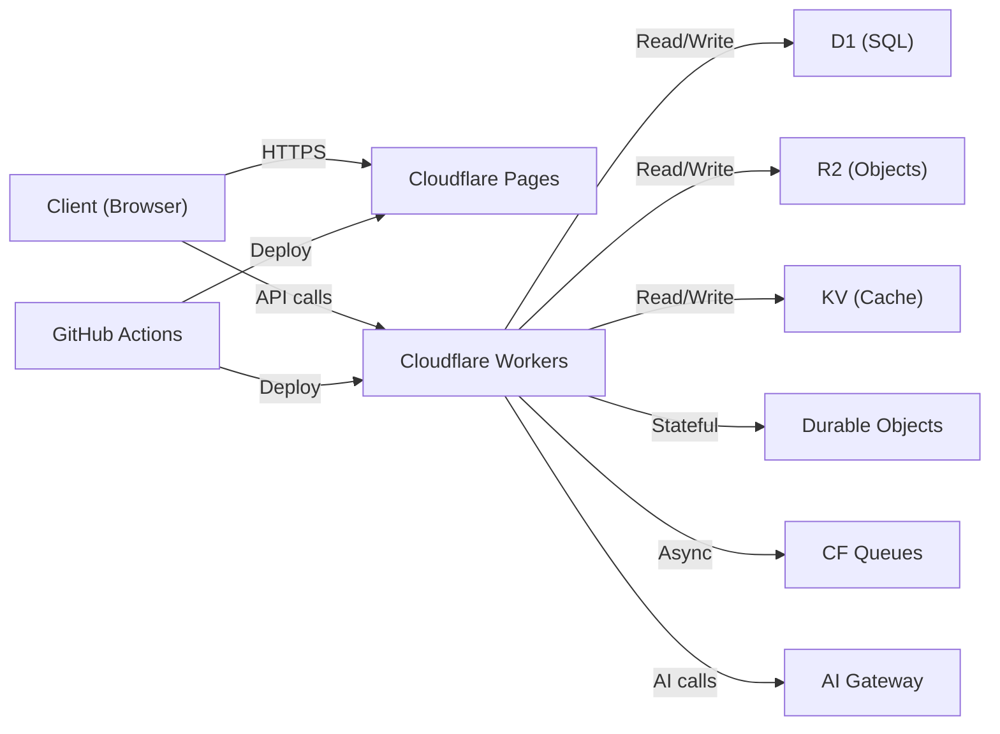

---

## API Conventions

- **Base URL:** `https://api.{domain}/v{n}/`
- **Versioning:** URI path versioning (`/v1/`, `/v2/`)
- **Auth:** `Authorization: ******
- **Content-Type:** `application/json`
- **Error format:**
  ```json
  {
    "error": {
      "code": "RESOURCE_NOT_FOUND",
      "message": "The requested resource was not found",
      "status": 404,
      "requestId": "req_abc123"
    }
  }
  ```
- **Pagination:**
  ```json
  {
    "data": [],
    "pagination": {
      "cursor": "next_cursor_value",
      "hasMore": true,
      "limit": 20
    }
  }
  ```

---

## Environment Tiers

| Tier | Branch | Domain | Purpose |
|---|---|---|---|
| Local | `feature/*` | `localhost` | Development |
| Preview | PR branches | `*.pages.dev` | PR review |
| Staging | `develop` | `staging.{domain}` | Pre-production |
| Production | `main` | `{domain}` | Live traffic |

---

## Critical Constraints

- **Cloudflare Workers runtime** is V8 isolates — not full Node.js. Avoid Node.js built-ins (`fs`, `path`, `crypto` → use Web Crypto API instead).
- **D1 is SQLite** — no stored procedures, no `RETURNING` on older versions, no full-text search by default.
- **KV has eventual consistency** — do not use for counters or transactional state.
- **Durable Objects** are strongly consistent but single-region; use carefully for latency-sensitive features.
- **Worker CPU time limit:** 10ms (free) / 30s (paid) per request.
- **Worker memory limit:** 128MB per isolate.

---

## Security Baseline

- All secrets stored in GitHub Secrets or Cloudflare Secrets — never in code.
- JWT tokens: RS256 or HS256, 15-minute access token, 7-day refresh token.
- All API endpoints require authentication unless explicitly public.
- Input validation at every trust boundary.
- OWASP Top 10 mitigations applied by default.
- CSP, CORS, HSTS headers set on all responses.

---

## Testing Baseline

- Unit tests: Vitest
- Integration tests: Vitest + Miniflare (Cloudflare Workers emulator)
- E2E tests: Playwright
- Coverage target: 80%+

---

## Deployment Flow

```
Developer Push → GitHub Actions → Lint + Test → Build → Deploy to Cloudflare
```

Detailed: [DEPLOYMENT.md](DEPLOYMENT.md) | [CI_CD.md](CI_CD.md)

---

## Current Documentation Status

- **Total documents:** 40+ root-level, 70+ in docs/
- **Completion level:** 1.0.0 initial release
- **Last full review:** 2026-07-17

---

## Related Documents

- [INDEX.md](INDEX.md) — Full documentation map
- [AI_POLICY.md](AI_POLICY.md) — AI governance rules
- [AI_REFERENCE.md](AI_REFERENCE.md) — Quick lookup
- [ARCHITECTURE.md](ARCHITECTURE.md) — Architecture details
- [KNOWN_LIMITATIONS.md](KNOWN_LIMITATIONS.md) — What to avoid


---

## AI_POLICY
<a id="ai-policy"></a>

# AI_POLICY.md — AI Usage & Governance Policy

> **Back to:** [INDEX.md](INDEX.md) | **Related:** [AI_CONTEXT.md](AI_CONTEXT.md) | [AI_REFERENCE.md](AI_REFERENCE.md)

---

## Metadata

| Field | Value |
|---|---|
| **Version** | 1.0.0 |
| **Owner** | @jelvan-ricolcol |
| **Last Updated** | 2026-07-17 |
| **Status** | Active |
| **Scope** | Repository-wide AI assistant governance |

---

## Overview

This document governs how AI assistants (GitHub Copilot, Claude, Gemini, Codex, Cursor, Windsurf, etc.) interact with this repository. It defines acceptable use, documentation requirements, decision-making authority, and safety constraints.

---

## Purpose

- Ensure AI-generated code is production-ready and reviewed before merge.
- Preserve documentation-first principles across AI-assisted workflows.
- Prevent AI assistants from making undocumented or conflicting changes.
- Define clear ownership of AI-assisted decisions.

---

## Scope

Applies to:
- All AI code generation tools used in this repository
- All AI documentation generation
- All AI-assisted code review
- All AI-assisted architecture decisions

---

## Governing Principles

### 1. Documentation-First
Every AI-generated change must be accompanied by documentation updates. AI assistants must update relevant documents before a change is considered complete.

### 2. Human Oversight Required
All AI-generated code changes require human review before merging to protected branches. AI is a collaborator, not an autonomous decision-maker.

### 3. No Silent Side Effects
AI assistants must not modify configuration files, environment variables, CI/CD pipelines, or infrastructure definitions without explicit human approval and documentation.

### 4. Security Non-Negotiable
AI assistants must never:
- Commit secrets, API keys, or credentials to any file
- Disable security checks or linters
- Bypass branch protection rules
- Weaken authentication or authorization logic
- Introduce unvalidated user input into queries or commands

### 5. Backward Compatibility
AI assistants must preserve backward compatibility unless a breaking change is explicitly requested, documented, and versioned.

### 6. Source Verification
AI-generated documentation must cite official sources. AI must not fabricate references, version numbers, or API behaviors.

---

## Approved AI Tools

| Tool | Use Case | Approval Level |
|---|---|---|
| GitHub Copilot | Code completion, PR review | Developer |
| Claude (Anthropic) | Architecture, documentation, complex refactoring | Senior Developer |
| Gemini (Google) | Research, code review | Developer |
| OpenAI Codex | Code generation | Developer |
| Cursor | IDE integration, refactoring | Developer |
| Windsurf | IDE integration | Developer |

---

## Required Actions for AI-Generated Changes

1. **Before implementation:** Verify the change does not conflict with existing configuration, deployments, or documented architecture.
2. **During implementation:** Follow [CODING_STANDARDS.md](CODING_STANDARDS.md) exactly.
3. **After implementation:** Update all affected documentation per [INDEX.md](INDEX.md).
4. **Before commit:** Run secret scanning. Never commit credentials.
5. **Before merge:** Human review required. All CI checks must pass.

---

## AI Context Preservation

AI assistants should always consult:
1. [AI_CONTEXT.md](AI_CONTEXT.md) — Current project state
2. [AI_REFERENCE.md](AI_REFERENCE.md) — Quick lookup reference
3. [ARCHITECTURE.md](ARCHITECTURE.md) — System constraints
4. [ENVIRONMENT_VARIABLES.md](ENVIRONMENT_VARIABLES.md) — Configuration
5. [KNOWN_LIMITATIONS.md](KNOWN_LIMITATIONS.md) — What not to attempt

---

## Decision Authority Matrix

| Decision Type | AI Role | Human Role |
|---|---|---|
| Boilerplate code | Generate | Review |
| Business logic | Suggest | Own and verify |
| Architecture changes | Propose | Approve and document |
| Security policies | Reference | Define and enforce |
| Database schema changes | Suggest | Approve, migrate, test |
| Environment variables | Reference existing | Define new |
| Breaking changes | Flag | Decide and document |
| Secret management | Never touch | Own entirely |

---

## AI Knowledge Base Maintenance

This repository is an AI knowledge base. All documents must be:
- **Machine-readable:** Consistent structure, predictable headings, code blocks labeled with language.
- **Cross-referenced:** Every document links back to INDEX.md and related docs.
- **Version-aware:** All documents carry version and last-updated metadata.
- **Non-conflicting:** No two documents should contain contradictory information.

When AI detects a conflict between documents, it must:
1. Flag the conflict in a comment or PR description.
2. Not silently resolve it in favor of either document.
3. Surface it to the human developer for resolution.

---

## Prohibited AI Actions

AI assistants **must not**:
- Push directly to `main` or protected branches
- Modify `.github/` directory without explicit instruction
- Change Cloudflare `wrangler.toml` without instruction
- Alter CI/CD pipeline configurations without instruction
- Generate or reference fake documentation
- Assume undocumented behavior is safe
- Skip documentation updates when making code changes
- Create files in paths that conflict with existing structure

---

## Security Constraints for AI

Reference: [SECURITY.md](SECURITY.md)

- All AI-generated code is subject to the same security review as human-written code.
- AI must apply OWASP Top 10 mitigations by default.
- AI must apply input validation at all trust boundaries.
- AI must use parameterized queries for all database interactions.
- AI must encode outputs according to the target context (HTML, JSON, SQL, etc.).
- AI must not suggest disabling security headers, CSP, or CORS protections.

---

## Version History

| Version | Date | Change |
|---|---|---|
| 1.0.0 | 2026-07-17 | Initial policy document |

---

## Related Documents

- [INDEX.md](INDEX.md) — Documentation map
- [AI_CONTEXT.md](AI_CONTEXT.md) — Project context for AI
- [AI_REFERENCE.md](AI_REFERENCE.md) — AI quick reference
- [SECURITY.md](SECURITY.md) — Security policy
- [CODING_STANDARDS.md](CODING_STANDARDS.md) — Code conventions
- [CONTRIBUTING.md](CONTRIBUTING.md) — Contribution guidelines


---

## AI_REFERENCE
<a id="ai-reference"></a>

# AI_REFERENCE.md — AI Quick Reference

> **Back to:** [INDEX.md](INDEX.md) | **Related:** [AI_CONTEXT.md](AI_CONTEXT.md) | [AI_POLICY.md](AI_POLICY.md)

---

## Metadata

| Field | Value |
|---|---|
| **Version** | 1.0.0 |
| **Last Updated** | 2026-07-17 |
| **Purpose** | Fast lookup for AI assistants — minimal prose, maximum signal |

---

## Document Lookup Table

| Question | Document |
|---|---|
| How does the overall system work? | [ARCHITECTURE.md](ARCHITECTURE.md) |
| What are the system design decisions? | [SYSTEM_DESIGN.md](SYSTEM_DESIGN.md) |
| What does the frontend do? | [FRONTEND.md](FRONTEND.md) |
| What does the backend do? | [BACKEND.md](BACKEND.md) |
| What are the API contracts? | [API.md](API.md) |
| How is the database structured? | [DATABASE.md](DATABASE.md) |
| How does authentication work? | [AUTHENTICATION.md](AUTHENTICATION.md) |
| How does authorization work? | [AUTHORIZATION.md](AUTHORIZATION.md) |
| What environment variables exist? | [ENVIRONMENT_VARIABLES.md](ENVIRONMENT_VARIABLES.md) |
| How is deployment done? | [DEPLOYMENT.md](DEPLOYMENT.md) |
| How is Cloudflare configured? | [CLOUDFLARE.md](CLOUDFLARE.md) |
| How are GitHub workflows set up? | [GITHUB.md](GITHUB.md) |
| How does CI/CD work? | [CI_CD.md](CI_CD.md) |
| What are the security requirements? | [SECURITY.md](SECURITY.md) |
| What are the performance budgets? | [PERFORMANCE.md](PERFORMANCE.md) |
| How is monitoring configured? | [MONITORING.md](MONITORING.md) |
| How is observability structured? | [OBSERVABILITY.md](OBSERVABILITY.md) |
| What is the testing strategy? | [TESTING.md](TESTING.md) |
| How are errors handled? | [ERROR_HANDLING.md](ERROR_HANDLING.md) |
| How is state managed? | [STATE_MANAGEMENT.md](STATE_MANAGEMENT.md) |
| What UI components exist? | [COMPONENT_LIBRARY.md](COMPONENT_LIBRARY.md) |
| What are the design tokens? | [DESIGN_SYSTEM.md](DESIGN_SYSTEM.md) |
| How is file storage handled? | [STORAGE.md](STORAGE.md) |
| What is the file structure? | [FILE_STRUCTURE.md](FILE_STRUCTURE.md) |
| What are the coding standards? | [CODING_STANDARDS.md](CODING_STANDARDS.md) |
| How to fix a common issue? | [TROUBLESHOOTING.md](TROUBLESHOOTING.md) |
| What features are built? | [FEATURE_REGISTRY.md](FEATURE_REGISTRY.md) |
| What services are registered? | [SERVICE_REGISTRY.md](SERVICE_REGISTRY.md) |
| What do data fields mean? | [DATA_DICTIONARY.md](DATA_DICTIONARY.md) |
| What are the known limitations? | [KNOWN_LIMITATIONS.md](KNOWN_LIMITATIONS.md) |
| What is planned for the future? | [ROADMAP.md](ROADMAP.md) |
| What changed recently? | [CHANGELOG.md](CHANGELOG.md) |
| What are the AI rules? | [AI_POLICY.md](AI_POLICY.md) |
| What is the project context? | [AI_CONTEXT.md](AI_CONTEXT.md) |

---

## Quick Code Patterns

### API Error Response (TypeScript / Cloudflare Workers)
```typescript
export function errorResponse(
  code: string,
  message: string,
  status: number,
  requestId?: string
): Response {
  return Response.json(
    { error: { code, message, status, requestId } },
    { status }
  );
}
```

### JWT Validation (Workers)
```typescript
import { jwtVerify } from 'jose';

async function validateJWT(token: string, secret: string) {
  const { payload } = await jwtVerify(
    token,
    new TextEncoder().encode(secret)
  );
  return payload;
}
```

### D1 Query Pattern
```typescript
const result = await env.DB.prepare(
  'SELECT * FROM users WHERE id = ?'
).bind(userId).first();
```

### R2 Upload Pattern
```typescript
await env.BUCKET.put(key, body, {
  httpMetadata: { contentType: 'image/jpeg' },
  customMetadata: { uploadedBy: userId },
});
```

### KV Read/Write Pattern
```typescript
// Write
await env.KV.put(key, JSON.stringify(value), { expirationTtl: 3600 });

// Read
const raw = await env.KV.get(key);
const value = raw ? JSON.parse(raw) : null;
```

### Cloudflare Worker Entry Point
```typescript
export default {
  async fetch(request: Request, env: Env, ctx: ExecutionContext): Promise<Response> {
    const url = new URL(request.url);
    // route based on url.pathname
  },
};
```

### Input Validation Pattern
```typescript
import { z } from 'zod';

const CreateUserSchema = z.object({
  email: z.string().email(),
  name: z.string().min(1).max(100),
  role: z.enum(['admin', 'user', 'viewer']),
});

const data = CreateUserSchema.parse(await request.json());
```

---

## Naming Conventions (Quick Reference)

| Item | Convention |
|---|---|
| JS/TS variables | `camelCase` |
| JS/TS constants | `UPPER_SNAKE_CASE` |
| TS types/interfaces | `PascalCase` |
| Files | `kebab-case.ts` |
| Root docs | `UPPER_CASE.md` |
| Subdocs | `kebab-case.md` |
| DB tables | `snake_case` |
| DB columns | `snake_case` |
| API paths | `/kebab-case` |
| Env vars | `UPPER_SNAKE_CASE` |
| Branches | `feature/kebab-case` |
| Commits | `type(scope): message` |

---

## Commit Type Reference

| Type | When to Use |
|---|---|
| `feat` | New feature |
| `fix` | Bug fix |
| `docs` | Documentation only |
| `style` | Formatting, no logic change |
| `refactor` | Code restructure, no behavior change |
| `test` | Adding or updating tests |
| `chore` | Build, config, dependency updates |
| `perf` | Performance improvement |
| `ci` | CI/CD changes |
| `revert` | Reverting a commit |
| `security` | Security fix |

---

## HTTP Status Code Reference

| Status | Meaning | When to Use |
|---|---|---|
| 200 | OK | Successful GET, PUT, PATCH |
| 201 | Created | Successful POST creating a resource |
| 204 | No Content | Successful DELETE |
| 400 | Bad Request | Invalid input / validation error |
| 401 | Unauthorized | Missing or invalid auth token |
| 403 | Forbidden | Valid token, insufficient permissions |
| 404 | Not Found | Resource does not exist |
| 409 | Conflict | Duplicate resource, state conflict |
| 422 | Unprocessable Entity | Valid syntax, business rule violation |
| 429 | Too Many Requests | Rate limit exceeded |
| 500 | Internal Server Error | Unexpected server failure |
| 503 | Service Unavailable | Dependency down, maintenance mode |

---

## Environment Variables (Quick Reference)

See full docs: [ENVIRONMENT_VARIABLES.md](ENVIRONMENT_VARIABLES.md)

| Variable | Where Set | Purpose |
|---|---|---|
| `DATABASE_URL` | CF Secret / Local | D1 database binding |
| `JWT_SECRET` | CF Secret | JWT signing secret |
| `JWT_ISSUER` | CF Secret | JWT issuer claim |
| `CLOUDFLARE_API_TOKEN` | GitHub Secret | CF deployment token |
| `CLOUDFLARE_ACCOUNT_ID` | GitHub Secret | CF account identifier |
| `R2_BUCKET_NAME` | wrangler.toml | R2 bucket binding |
| `KV_NAMESPACE_ID` | wrangler.toml | KV namespace binding |
| `ENVIRONMENT` | Determined by deploy | `local`/`preview`/`staging`/`production` |

---

## Cloudflare Resource Quick Reference

| Resource | Type | Purpose | Binding |
|---|---|---|---|
| D1 | SQLite DB | Primary structured data | `env.DB` |
| R2 | Object Storage | Files, images, assets | `env.BUCKET` |
| KV | Key-Value Store | Cache, sessions, config | `env.KV` |
| Durable Objects | Stateful Actor | Realtime, locks, counters | `env.DO` |
| Queues | Message Queue | Async background jobs | `env.QUEUE` |
| AI Gateway | AI Proxy | Rate-limited AI API calls | `env.AI` |

---

## Security Checklist (Quick)

- [ ] Input validated with Zod or equivalent schema library
- [ ] JWT validated on every protected endpoint
- [ ] Authorization check after authentication
- [ ] SQL queries use parameterized bindings
- [ ] Secrets in CF/GH secrets, never in code
- [ ] CORS configured with allowlist
- [ ] Rate limiting applied to public endpoints
- [ ] Response does not leak stack traces in production
- [ ] Content-Security-Policy header set
- [ ] HTTPS enforced (CF handles TLS)

---

## Related Documents

- [AI_CONTEXT.md](AI_CONTEXT.md) — Full project context
- [AI_POLICY.md](AI_POLICY.md) — AI governance rules
- [INDEX.md](INDEX.md) — Full documentation map
- [CODING_STANDARDS.md](CODING_STANDARDS.md) — Detailed code conventions
- [API.md](API.md) — Full API documentation


---

## API
<a id="api"></a>

# API.md — API Contracts & Standards

> **Back to:** [INDEX.md](INDEX.md) | **Related:** [BACKEND.md](BACKEND.md) | [AUTHENTICATION.md](AUTHENTICATION.md) | [ERROR_HANDLING.md](ERROR_HANDLING.md)

---

## Metadata

| Field | Value |
|---|---|
| **Version** | 1.0.0 |
| **Owner** | @jelvan-ricolcol |
| **Last Updated** | 2026-07-17 |
| **Status** | Active |
| **Scope** | All API contracts, standards, and versioning |

---

## Overview

This document defines the API design standards, contracts, and patterns used across all backend services. All APIs must conform to these standards to ensure consistency for frontend clients, AI integrations, and third-party consumers.

---

## Base URL

| Environment | URL |
|---|---|
| Local | `http://localhost:8787/api` |
| Preview | `https://{branch}.{project}.pages.dev/api` |
| Staging | `https://staging.{domain}/api` |
| Production | `https://api.{domain}` |

---

## Versioning

- URI path versioning: `/api/v1/`, `/api/v2/`
- Current version: **v1**
- New versions created only for breaking changes
- Old versions deprecated with 6-month notice and `Deprecation` header
- Non-breaking additions (new fields, new endpoints) do not require version bump

---

## Authentication

All protected endpoints require:
```
Authorization: ******
```

Token obtained via POST `/api/v1/auth/login` or OAuth callback.

See: [AUTHENTICATION.md](AUTHENTICATION.md)

---

## Request Format

- **Content-Type:** `application/json`
- **Accept:** `application/json`
- **Encoding:** UTF-8
- **Max body size:** 10MB (configurable per endpoint)

---

## Response Format

### Success Response
```json
{
  "data": { ... }
}
```

### List Response
```json
{
  "data": [ ... ],
  "pagination": {
    "cursor": "next_cursor_value",
    "hasMore": true,
    "limit": 20,
    "total": 500
  }
}
```

### Error Response
```json
{
  "error": {
    "code": "RESOURCE_NOT_FOUND",
    "message": "The requested user was not found",
    "status": 404,
    "requestId": "req_01HXYZ123"
  }
}
```

---

## HTTP Status Codes

| Status | Meaning |
|---|---|
| 200 | OK — GET, PUT, PATCH success |
| 201 | Created — POST success |
| 202 | Accepted — Async operation started |
| 204 | No Content — DELETE success |
| 400 | Bad Request — Validation error |
| 401 | Unauthorized — Missing/invalid token |
| 403 | Forbidden — Insufficient permissions |
| 404 | Not Found — Resource missing |
| 409 | Conflict — Duplicate or state conflict |
| 422 | Unprocessable Entity — Business rule violation |
| 429 | Too Many Requests — Rate limit |
| 500 | Internal Server Error — Unexpected failure |
| 503 | Service Unavailable — Dependency down |

---

## Error Code Reference

| Code | Status | Meaning |
|---|---|---|
| `VALIDATION_ERROR` | 400 | Input failed schema validation |
| `MISSING_REQUIRED_FIELD` | 400 | Required field absent |
| `UNAUTHORIZED` | 401 | No valid auth token |
| `TOKEN_EXPIRED` | 401 | JWT has expired |
| `FORBIDDEN` | 403 | Insufficient role/permission |
| `RESOURCE_NOT_FOUND` | 404 | Entity does not exist |
| `DUPLICATE_RESOURCE` | 409 | Unique constraint violation |
| `RATE_LIMIT_EXCEEDED` | 429 | Too many requests |
| `INTERNAL_ERROR` | 500 | Unexpected server failure |
| `SERVICE_UNAVAILABLE` | 503 | Dependency unavailable |

---

## Pagination

All list endpoints use **cursor-based pagination**:

### Request
```
GET /api/v1/users?limit=20&cursor=next_cursor_value
```

### Response
```json
{
  "data": [...],
  "pagination": {
    "cursor": "next_cursor_value",
    "hasMore": true,
    "limit": 20
  }
}
```

### Rules
- Default limit: 20
- Max limit: 100
- `cursor` is opaque — do not parse or construct manually
- Omit `cursor` to start from the beginning

---

## Filtering & Sorting

```
GET /api/v1/users?role=admin&sort=created_at&order=desc
```

- Filter params use field name as query param key
- `sort`: field to sort by
- `order`: `asc` | `desc` (default: `desc`)
- Multiple filters combined with `AND`

---

## Idempotency

For POST endpoints that should be idempotent (payments, notifications):
```
POST /api/v1/orders
Idempotency-Key: uuid-v4-value
```

- Responses for duplicate requests return the original result with `X-Idempotent-Response: true`
- Keys stored for 24 hours

---

## Rate Limiting

| Tier | Limit | Window |
|---|---|---|
| Anonymous | 100 requests | 60 seconds |
| Authenticated | 1000 requests | 60 seconds |
| Service account | 10000 requests | 60 seconds |

Rate limit headers returned:
```
X-RateLimit-Limit: 1000
X-RateLimit-Remaining: 999
X-RateLimit-Reset: 1719600000
Retry-After: 60  (when limited)
```

---

## CORS

```
Access-Control-Allow-Origin: https://{domain}
Access-Control-Allow-Methods: GET, POST, PUT, PATCH, DELETE, OPTIONS
Access-Control-Allow-Headers: Content-Type, Authorization
Access-Control-Max-Age: 86400
```

---

## API Endpoints (Registry)

### Auth
| Method | Path | Auth | Description |
|---|---|---|---|
| POST | `/api/v1/auth/login` | None | Email/password login |
| POST | `/api/v1/auth/logout` | Required | Invalidate refresh token |
| POST | `/api/v1/auth/refresh` | Cookie | Refresh access token |
| GET | `/api/v1/auth/me` | Required | Get current user |
| POST | `/api/v1/auth/oauth/callback` | None | OAuth callback |

### Users
| Method | Path | Auth | Description |
|---|---|---|---|
| GET | `/api/v1/users` | admin | List all users |
| POST | `/api/v1/users` | admin | Create user |
| GET | `/api/v1/users/:id` | Required | Get user by ID |
| PATCH | `/api/v1/users/:id` | admin/self | Update user |
| DELETE | `/api/v1/users/:id` | admin | Soft-delete user |

### Health
| Method | Path | Auth | Description |
|---|---|---|---|
| GET | `/health` | None | Worker health check |
| GET | `/health/db` | None | D1 connectivity check |

---

## Data Models

### User
```typescript
interface User {
  id: string;           // CUID2
  email: string;        // Unique
  name: string;
  role: 'admin' | 'editor' | 'viewer';
  avatarUrl?: string;
  createdAt: string;    // ISO 8601
  updatedAt: string;    // ISO 8601
  deletedAt?: string;   // ISO 8601, null = active
}
```

### Auth Tokens
```typescript
interface TokenResponse {
  accessToken: string;   // JWT, 15min TTL
  expiresIn: number;     // Seconds
  tokenType: 'Bearer';
}
```

---

## OpenAPI / Swagger

OpenAPI spec maintained at `/docs/api/openapi.yaml` (when implemented).

---

## Version History

| Version | Date | Change |
|---|---|---|
| 1.0.0 | 2026-07-17 | Initial API documentation |

---

## Related Documents

- [BACKEND.md](BACKEND.md) — API server implementation
- [AUTHENTICATION.md](AUTHENTICATION.md) — Auth endpoints detail
- [AUTHORIZATION.md](AUTHORIZATION.md) — Permission model
- [ERROR_HANDLING.md](ERROR_HANDLING.md) — Error contract detail
- [SERVICE_REGISTRY.md](SERVICE_REGISTRY.md) — All service contracts
- [DATA_DICTIONARY.md](DATA_DICTIONARY.md) — Data field definitions
- [docs/api/api-standards.md](docs/api/api-standards.md) — Detailed API standards
- [docs/api/versioning.md](docs/api/versioning.md) — Versioning strategy


---

## ARCHITECTURE
<a id="architecture"></a>

# ARCHITECTURE.md — System Architecture

> **Back to:** [INDEX.md](INDEX.md) | **Related:** [SYSTEM_DESIGN.md](SYSTEM_DESIGN.md) | [BACKEND.md](BACKEND.md) | [FRONTEND.md](FRONTEND.md) | [CLOUDFLARE.md](CLOUDFLARE.md)

---

## Metadata

| Field | Value |
|---|---|
| **Version** | 1.0.0 |
| **Owner** | @jelvan-ricolcol |
| **Last Updated** | 2026-07-17 |
| **Status** | Active |
| **Scope** | High-level system architecture overview |

---

## Overview

This document describes the high-level architecture of the full-stack system. For detailed design decisions, see [SYSTEM_DESIGN.md](SYSTEM_DESIGN.md). For platform-specific configuration, see [CLOUDFLARE.md](CLOUDFLARE.md).

---

## Architecture Style

**Edge-first Serverless** deployed on Cloudflare's global edge network, with optional origin fallback for workloads that exceed edge constraints.

**Key principles:**
- Compute close to the user (300+ edge locations)
- Stateless request handlers; state in managed storage
- No server provisioning or capacity planning
- Infrastructure as code (wrangler.toml + GitHub Actions)
- Security by default at every layer

---

## System Diagram

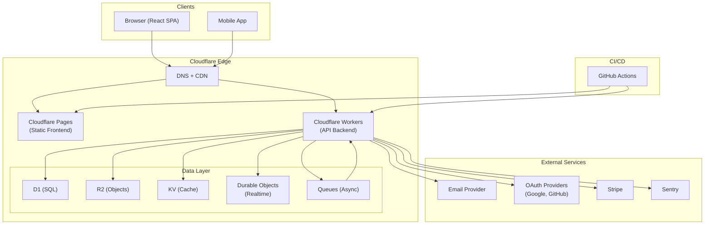

---

## Layer Responsibilities

### Client Layer
- React Single Page Application
- Communicates with Workers via REST API
- Auth tokens stored in memory (access) and HttpOnly cookie (refresh)

### Edge Layer (Cloudflare)
- **Pages:** Serves static frontend assets globally
- **Workers:** Processes all API requests, enforces auth/authz, accesses data layer
- **D1:** Primary relational database (SQLite-compatible)
- **R2:** Binary object storage (files, images)
- **KV:** Fast global key-value store (cache, sessions)
- **Durable Objects:** Strongly-consistent stateful compute (realtime features)
- **Queues:** Reliable message queue for background jobs

### CI/CD Layer
- GitHub Actions orchestrates lint → test → build → deploy pipeline
- Pushes to `main` automatically deploy to production

---

## Authentication & Authorization Architecture

- OAuth 2.0 + PKCE for social login
- JWT (HS256) access tokens, 15-minute TTL
- Opaque refresh tokens, 7-day TTL, rotated on use
- RBAC middleware enforced in every Workers route

See: [AUTHENTICATION.md](AUTHENTICATION.md) | [AUTHORIZATION.md](AUTHORIZATION.md)

---

## Data Architecture

| Tier | Technology | Use |
|---|---|---|
| Relational | D1 (SQLite) | Users, sessions, business data |
| Object | R2 | Files, images, exports |
| Cache | KV | API cache, session lookup |
| Realtime | Durable Objects | Chat, presence, collaboration |

See: [DATABASE.md](DATABASE.md) | [STORAGE.md](STORAGE.md)

---

## Deployment Architecture

```
feature/* → CI (lint + test) → Preview deploy (CF Pages + Worker)
develop  → CI → Staging deploy
main     → CI → DB migrations → Production deploy
```

See: [DEPLOYMENT.md](DEPLOYMENT.md) | [CI_CD.md](CI_CD.md)

---

## Security Architecture

- TLS enforced by Cloudflare (no self-signed certs)
- Secrets in Cloudflare Secrets + GitHub Secrets only
- OWASP Top 10 mitigations applied by default
- Input validation (Zod) at every API entry point
- Audit logging for all security-relevant events

See: [SECURITY.md](SECURITY.md)

---

## Verified Sources

- Cloudflare Workers Docs — https://developers.cloudflare.com/workers/
- Cloudflare Pages Docs — https://developers.cloudflare.com/pages/
- Cloudflare D1 Docs — https://developers.cloudflare.com/d1/
- Cloudflare R2 Docs — https://developers.cloudflare.com/r2/
- Docker Docs — https://docs.docker.com/
- The Twelve-Factor App — https://12factor.net/

---

## Version History

| Version | Date | Change |
|---|---|---|
| 1.0.0 | 2026-07-17 | Comprehensive architecture documentation |

---

## Related Documents

- [SYSTEM_DESIGN.md](SYSTEM_DESIGN.md) — Detailed design decisions
- [FRONTEND.md](FRONTEND.md) — Frontend architecture
- [BACKEND.md](BACKEND.md) — Backend architecture
- [CLOUDFLARE.md](CLOUDFLARE.md) — Cloudflare configuration
- [SECURITY.md](SECURITY.md) — Security architecture
- [DEPLOYMENT.md](DEPLOYMENT.md) — Deployment architecture
- [docs/architecture/system-design.md](docs/architecture/system-design.md) — Deep dive

## Documentation template for contributors

- **Decision:** What implementation choice was made?
- **Source:** Which official document backs the choice?
- **Reason:** Why is it appropriate for this project?
- **Risk:** What breaks if the assumption changes?
- **Validation:** Which test, command, or review proves it works?

## Verified sources

- Docker Docs — https://docs.docker.com/
- Kubernetes Docs — https://kubernetes.io/docs/
- OpenTelemetry Docs — https://opentelemetry.io/docs/
- Prometheus Docs — https://prometheus.io/docs/
- The Twelve-Factor App — https://12factor.net/


---

## AUTHENTICATION
<a id="authentication"></a>

# AUTHENTICATION.md — Authentication Architecture

> **Back to:** [INDEX.md](INDEX.md) | **Related:** [AUTHORIZATION.md](AUTHORIZATION.md) | [SECURITY.md](SECURITY.md) | [API.md](API.md)

---

## Metadata

| Field | Value |
|---|---|
| **Version** | 1.0.0 |
| **Owner** | @jelvan-ricolcol |
| **Last Updated** | 2026-07-17 |
| **Status** | Active |
| **Scope** | All authentication flows, token management, and session handling |

---

## Overview

Authentication verifies **who** a user is. This system uses JWT-based authentication with OAuth 2.0 / OIDC support. Tokens are issued by the Cloudflare Workers backend and validated on every protected request.

---

## Authentication Methods

| Method | Use Case | Status |
|---|---|---|
| Email + Password | Primary login | Active |
| OAuth 2.0 (Google) | Social login | Active |
| OAuth 2.0 (GitHub) | Developer login | Active |
| Magic Link (email) | Passwordless | Planned |
| Multi-Factor Auth (TOTP) | Enhanced security | Planned |

---

## Token Architecture

| Token | Type | TTL | Storage | Purpose |
|---|---|---|---|---|
| Access Token | JWT (HS256) | 15 minutes | Memory only | Authenticate API requests |
| Refresh Token | Opaque | 7 days | HttpOnly cookie | Obtain new access tokens |
| ID Token | JWT (OIDC) | 1 hour | Memory | User profile claims |

---

## JWT Claims

```json
{
  "sub": "user_01HXYZ",
  "email": "user@example.com",
  "role": "admin",
  "iss": "https://api.{domain}",
  "aud": "https://{domain}",
  "iat": 1719600000,
  "exp": 1719600900,
  "jti": "unique-token-id"
}
```

---

## Authentication Flow — Email/Password

```mermaid
sequenceDiagram
    participant C as Client
    participant W as Worker
    participant DB as D1
    participant KV as KV Store

    C->>W: POST /api/v1/auth/login {email, password}
    W->>DB: Lookup user by email
    DB-->>W: User record
    W->>W: Verify password (bcrypt/argon2)
    W->>W: Generate access JWT (15min)
    W->>W: Generate refresh token (opaque, 7d)
    W->>DB: Store session (user_id, refresh_token, expires_at)
    W-->>C: { accessToken, expiresIn } + Set-Cookie: refresh_token=...; HttpOnly; Secure; SameSite=Strict
```

---

## Authentication Flow — Token Refresh

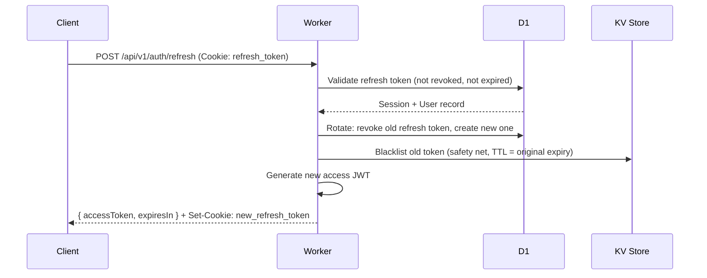

---

## Authentication Flow — OAuth 2.0

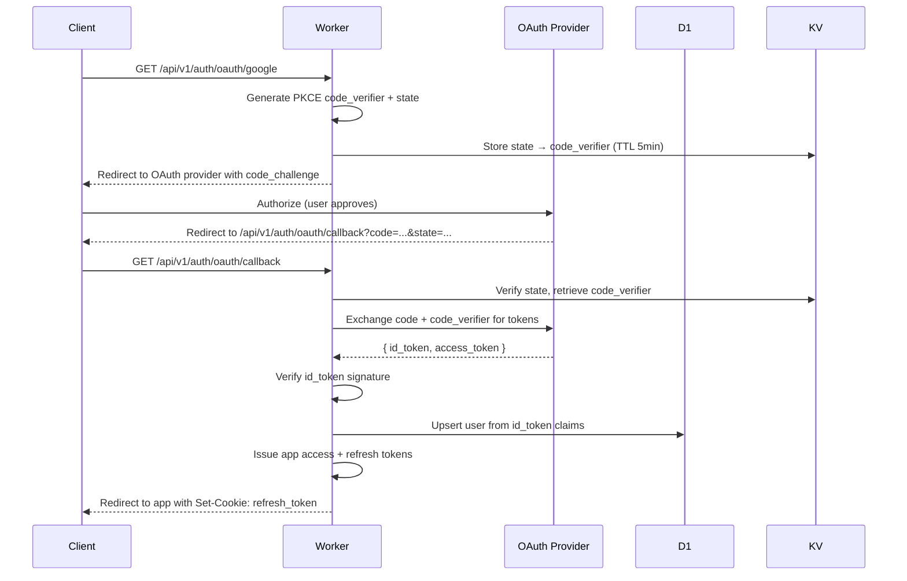

---

## JWT Validation Middleware

```typescript
// middleware/auth.ts
import { jwtVerify } from 'jose';
import { UnauthorizedError } from '../lib/errors';

export async function authMiddleware(
  request: Request,
  env: Env
): Promise<{ userId: string; role: string }> {
  const auth = request.headers.get('Authorization');
  if (!auth?.startsWith('Bearer ')) {
    throw new UnauthorizedError('Missing authorization header');
  }

  const token = auth.slice(7);
  try {
    const { payload } = await jwtVerify(
      token,
      new TextEncoder().encode(env.JWT_SECRET),
      {
        issuer: env.JWT_ISSUER,
        audience: env.JWT_AUDIENCE,
      }
    );
    return { userId: payload.sub as string, role: payload.role as string };
  } catch {
    throw new UnauthorizedError('Invalid or expired token');
  }
}
```

---

## Password Requirements

- Minimum 12 characters
- Must contain uppercase, lowercase, number, and special character
- Hashed with **Argon2id** (preferred) or bcrypt (rounds ≥ 12)
- Never store plaintext passwords
- Never log passwords

---

## Session Management

- Sessions stored in D1 `sessions` table
- Refresh token rotated on every use (prevents token reuse)
- Old tokens added to KV revocation list with TTL matching original expiry
- Session revoked on: logout, password change, security event
- Sessions expire after 7 days of inactivity
- Users can view and revoke active sessions

See: [docs/authentication/sessions.md](docs/authentication/sessions.md)

---

## Multi-Factor Authentication (Planned)

- TOTP (Time-based One-Time Password) via authenticator app
- Backup codes (10 single-use codes, hashed in DB)
- Required for admin role
- SMS (not recommended — see NIST 800-63B)

---

## Security Considerations

- Access tokens stored **in memory only** on the client (never localStorage)
- Refresh tokens in **HttpOnly, Secure, SameSite=Strict** cookies
- All auth endpoints rate-limited (5 attempts/minute per IP)
- Account lockout after 10 failed attempts (15-minute cooldown)
- Auth events logged to audit_logs table
- CSRF protection via SameSite cookie + custom header check

---

## Environment Variables

| Variable | Purpose |
|---|---|
| `JWT_SECRET` | HMAC signing secret (≥ 256 bits) |
| `JWT_ISSUER` | JWT `iss` claim value |
| `JWT_AUDIENCE` | JWT `aud` claim value |
| `OAUTH_GOOGLE_CLIENT_ID` | Google OAuth client ID |
| `OAUTH_GOOGLE_CLIENT_SECRET` | Google OAuth client secret |
| `OAUTH_GITHUB_CLIENT_ID` | GitHub OAuth client ID |
| `OAUTH_GITHUB_CLIENT_SECRET` | GitHub OAuth client secret |

See: [ENVIRONMENT_VARIABLES.md](ENVIRONMENT_VARIABLES.md)

---

## Version History

| Version | Date | Change |
|---|---|---|
| 1.0.0 | 2026-07-17 | Initial authentication documentation |

---

## Related Documents

- [AUTHORIZATION.md](AUTHORIZATION.md) — What users can do after login
- [SECURITY.md](SECURITY.md) — Security policy
- [API.md](API.md) — Auth endpoints
- [DATABASE.md](DATABASE.md) — Sessions table schema
- [ENVIRONMENT_VARIABLES.md](ENVIRONMENT_VARIABLES.md) — Auth environment variables
- [docs/authentication/oauth.md](docs/authentication/oauth.md) — OAuth deep dive
- [docs/authentication/jwt.md](docs/authentication/jwt.md) — JWT implementation
- [docs/authentication/sessions.md](docs/authentication/sessions.md) — Session management


---

## AUTHORIZATION
<a id="authorization"></a>

# AUTHORIZATION.md — Authorization & Access Control

> **Back to:** [INDEX.md](INDEX.md) | **Related:** [AUTHENTICATION.md](AUTHENTICATION.md) | [SECURITY.md](SECURITY.md) | [API.md](API.md)

---

## Metadata

| Field | Value |
|---|---|
| **Version** | 1.0.0 |
| **Owner** | @jelvan-ricolcol |
| **Last Updated** | 2026-07-17 |
| **Status** | Active |
| **Scope** | RBAC model, permission policies, and enforcement |

---

## Overview

Authorization determines **what** an authenticated user can do. This system uses **Role-Based Access Control (RBAC)** enforced in Cloudflare Workers middleware, with optional resource-level policies.

---

## RBAC Model

### Roles

| Role | Description |
|---|---|
| `admin` | Full access to all resources |
| `editor` | Read/write access to content resources |
| `viewer` | Read-only access to permitted resources |
| `service` | Machine-to-machine, system operations |

### Role Hierarchy
```
admin > editor > viewer
service (lateral — not in hierarchy)
```

---

## Permission Matrix

| Resource | Action | admin | editor | viewer | service |
|---|---|---|---|---|---|
| Users | list | ✅ | ❌ | ❌ | ✅ |
| Users | read (own) | ✅ | ✅ | ✅ | ✅ |
| Users | read (any) | ✅ | ❌ | ❌ | ✅ |
| Users | create | ✅ | ❌ | ❌ | ✅ |
| Users | update (own) | ✅ | ✅ | ✅ | ✅ |
| Users | update (any) | ✅ | ❌ | ❌ | ✅ |
| Users | delete | ✅ | ❌ | ❌ | ❌ |
| Content | list | ✅ | ✅ | ✅ | ✅ |
| Content | read | ✅ | ✅ | ✅ | ✅ |
| Content | create | ✅ | ✅ | ❌ | ✅ |
| Content | update | ✅ | ✅ | ❌ | ✅ |
| Content | delete | ✅ | ✅ | ❌ | ❌ |
| Audit Logs | read | ✅ | ❌ | ❌ | ✅ |
| Settings | read | ✅ | ✅ | ❌ | ✅ |
| Settings | update | ✅ | ❌ | ❌ | ❌ |

---

## Authorization Middleware

```typescript
// middleware/authorize.ts
import { ForbiddenError } from '../lib/errors';

type Permission = {
  resource: string;
  action: string;
};

const PERMISSIONS: Record<string, Record<string, string[]>> = {
  users: {
    list: ['admin', 'service'],
    create: ['admin', 'service'],
    update: ['admin', 'editor', 'viewer', 'service'],
    delete: ['admin'],
  },
  content: {
    list: ['admin', 'editor', 'viewer', 'service'],
    create: ['admin', 'editor', 'service'],
    update: ['admin', 'editor', 'service'],
    delete: ['admin', 'editor'],
  },
};

export function authorize(resource: string, action: string) {
  return (userRole: string, userId: string, targetId?: string) => {
    const allowed = PERMISSIONS[resource]?.[action] ?? [];

    // Resource owner can perform own-resource actions
    if (targetId && targetId === userId && action !== 'delete') {
      return; // Allow
    }

    if (!allowed.includes(userRole)) {
      throw new ForbiddenError(
        `Role '${userRole}' cannot perform '${action}' on '${resource}'`
      );
    }
  };
}
```

---

## Authorization Flow

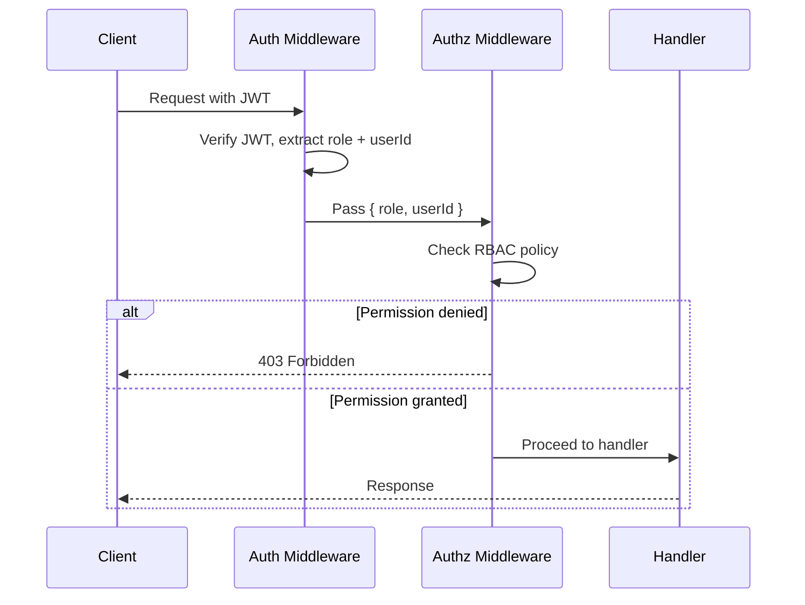

---

## Ownership-Based Access

For resources owned by a user (e.g., user updating their own profile):

```typescript
// Route handler
app.patch('/api/v1/users/:id', async (c) => {
  const { userId, role } = c.get('auth');
  const targetId = c.req.param('id');

  // Self-update allowed; updating others requires admin
  if (targetId !== userId) {
    authorize('users', 'update')(role, userId, undefined);
  }

  // ... update logic
});
```

---

## Permission Storage

Current implementation: **In-memory RBAC map** in Worker code.

Future: D1-backed permissions table for dynamic role assignment:

```sql
CREATE TABLE IF NOT EXISTS user_roles (
  user_id    TEXT NOT NULL REFERENCES users(id),
  role       TEXT NOT NULL,
  created_at TEXT NOT NULL,
  PRIMARY KEY (user_id, role)
);
```

---

## Audit Logging

All authorization decisions are logged to the `audit_logs` table:

```typescript
await auditLog(env.DB, {
  userId,
  action: `${resource}:${action}`,
  resource,
  resourceId: targetId,
  metadata: { role, granted: true },
  ipAddress: request.headers.get('CF-Connecting-IP'),
});
```

---

## Security Considerations

- Authorization check happens **after** authentication — never skip auth
- Always check authorization on the **server** — client-side role checks are UI-only
- Principle of least privilege: default to `viewer` role on new accounts
- Admin role assignment requires existing admin or direct DB operation
- Never expose role information in error messages to unauthorized users
- Log all permission denials for security monitoring

---

## Version History

| Version | Date | Change |
|---|---|---|
| 1.0.0 | 2026-07-17 | Initial authorization documentation |

---

## Related Documents

- [AUTHENTICATION.md](AUTHENTICATION.md) — Who the user is
- [SECURITY.md](SECURITY.md) — Security policy
- [API.md](API.md) — API endpoint permission requirements
- [DATABASE.md](DATABASE.md) — Roles table schema
- [OBSERVABILITY.md](OBSERVABILITY.md) — Audit log monitoring
- [docs/authorization/rbac.md](docs/authorization/rbac.md) — RBAC deep dive
- [docs/authorization/permissions.md](docs/authorization/permissions.md) — Permissions detail


---

## BACKEND
<a id="backend"></a>

# BACKEND.md — Backend Architecture

> **Back to:** [INDEX.md](INDEX.md) | **Related:** [FRONTEND.md](FRONTEND.md) | [API.md](API.md) | [DATABASE.md](DATABASE.md) | [CLOUDFLARE.md](CLOUDFLARE.md)

---

## Metadata

| Field | Value |
|---|---|
| **Version** | 1.0.0 |
| **Owner** | @jelvan-ricolcol |
| **Last Updated** | 2026-07-17 |
| **Status** | Active |
| **Scope** | Backend architecture, runtime, patterns, and conventions |

---

## Overview

The backend runs on Cloudflare Workers — a serverless edge runtime executing TypeScript/JavaScript in V8 isolates at 300+ global edge locations. The backend exposes a RESTful API consumed by the frontend and potential third-party clients.

---

## Runtime: Cloudflare Workers

### Key Constraints
- **Runtime:** V8 isolates — NOT Node.js
- **CPU limit:** 10ms (free) / 30s (paid) per request
- **Memory:** 128MB per isolate
- **Available APIs:** Web APIs (fetch, crypto, streams, URL, etc.)
- **Not available:** `fs`, `path`, `os`, `process.env` (use `env` bindings instead)

```typescript
// Entry point
export default {
  async fetch(
    request: Request,
    env: Env,
    ctx: ExecutionContext
  ): Promise<Response> {
    return router.handle(request, env, ctx);
  },
};

// Environment bindings interface
interface Env {
  DB: D1Database;
  BUCKET: R2Bucket;
  KV: KVNamespace;
  DO: DurableObjectNamespace;
  QUEUE: Queue;
  JWT_SECRET: string;
  ENVIRONMENT: string;
}
```

---

## Architecture

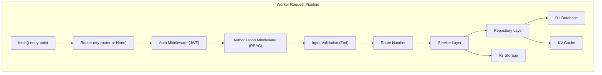

---

## Project Structure

```
worker/
├── src/
│   ├── index.ts              # Entry point
│   ├── router.ts             # Route definitions
│   ├── middleware/
│   │   ├── auth.ts           # JWT authentication
│   │   ├── authorize.ts      # RBAC authorization
│   │   ├── cors.ts           # CORS headers
│   │   ├── rate-limit.ts     # Rate limiting
│   │   └── logger.ts         # Request logging
│   ├── routes/
│   │   ├── users.ts
│   │   ├── auth.ts
│   │   └── health.ts
│   ├── services/
│   │   ├── user.service.ts
│   │   └── auth.service.ts
│   ├── repositories/
│   │   ├── user.repository.ts
│   │   └── base.repository.ts
│   ├── lib/
│   │   ├── jwt.ts
│   │   ├── errors.ts
│   │   ├── validators.ts
│   │   └── response.ts
│   └── types/
│       ├── env.ts
│       └── models.ts
├── migrations/
│   └── 0001_initial.sql
├── wrangler.toml
└── package.json
```

---

## Routing Pattern (Hono)

```typescript
import { Hono } from 'hono';
import { authMiddleware } from './middleware/auth';
import { usersRouter } from './routes/users';

const app = new Hono<{ Bindings: Env }>();

app.use('*', corsMiddleware());
app.use('/api/*', authMiddleware());

app.route('/api/v1/users', usersRouter);
app.get('/health', (c) => c.json({ status: 'ok' }));

export default app;
```

---

## Middleware Stack (Order Matters)

1. **CORS** — Must be first to handle preflight
2. **Rate Limiting** — Block abuse early
3. **Request Logger** — Log incoming request metadata
4. **Authentication** — Validate JWT
5. **Authorization** — Check RBAC permissions
6. **Input Validation** — Validate request body/params with Zod
7. **Route Handler** — Business logic
8. **Error Handler** — Catch and format errors

---

## Service Layer Pattern

```typescript
// services/user.service.ts
export class UserService {
  constructor(
    private readonly repo: UserRepository,
    private readonly kv: KVNamespace
  ) {}

  async getUserById(id: string): Promise<User> {
    const cached = await this.kv.get(`user:${id}`);
    if (cached) return JSON.parse(cached);

    const user = await this.repo.findById(id);
    if (!user) throw new NotFoundError('User not found');

    await this.kv.put(`user:${id}`, JSON.stringify(user), {
      expirationTtl: 300,
    });
    return user;
  }
}
```

---

## Repository Layer Pattern

```typescript
// repositories/user.repository.ts
export class UserRepository {
  constructor(private readonly db: D1Database) {}

  async findById(id: string): Promise<User | null> {
    return this.db
      .prepare('SELECT * FROM users WHERE id = ? AND deleted_at IS NULL')
      .bind(id)
      .first<User>();
  }

  async create(data: CreateUserData): Promise<User> {
    const id = createId(); // CUID2
    const now = new Date().toISOString();
    await this.db
      .prepare(
        'INSERT INTO users (id, email, name, role, created_at, updated_at) VALUES (?, ?, ?, ?, ?, ?)'
      )
      .bind(id, data.email, data.name, data.role, now, now)
      .run();
    return this.findById(id) as Promise<User>;
  }
}
```

---

## Error Handling

```typescript
// lib/errors.ts
export class AppError extends Error {
  constructor(
    public readonly code: string,
    public readonly message: string,
    public readonly status: number
  ) {
    super(message);
  }
}

export class NotFoundError extends AppError {
  constructor(message = 'Resource not found') {
    super('NOT_FOUND', message, 404);
  }
}

export class UnauthorizedError extends AppError {
  constructor(message = 'Unauthorized') {
    super('UNAUTHORIZED', message, 401);
  }
}
```

See: [ERROR_HANDLING.md](ERROR_HANDLING.md)

---

## API Response Format

```typescript
// lib/response.ts
export function ok<T>(data: T, status = 200): Response {
  return Response.json({ data }, { status });
}

export function created<T>(data: T): Response {
  return Response.json({ data }, { status: 201 });
}

export function errorResponse(error: AppError, requestId?: string): Response {
  return Response.json(
    {
      error: {
        code: error.code,
        message: error.message,
        status: error.status,
        requestId,
      },
    },
    { status: error.status }
  );
}
```

---

## Security Practices

- Validate all inputs with Zod before processing
- Use parameterized queries for all D1 operations
- Validate JWT on every protected route
- Apply RBAC before accessing any resource
- Set security headers (CSP, CORS, X-Content-Type-Options, etc.)
- Rate-limit public and authenticated endpoints
- Log security events (failed auth, rate-limit hits)

See: [SECURITY.md](SECURITY.md)

---

## Performance Practices

- Cache frequently-read data in KV with appropriate TTL
- Use cursor-based pagination for list queries
- Avoid N+1 queries with JOIN or batched queries
- Use `ctx.waitUntil()` for non-blocking background work
- Keep Worker CPU usage under 10ms for free tier

See: [PERFORMANCE.md](PERFORMANCE.md)

---

## Testing

| Level | Tool | Purpose |
|---|---|---|
| Unit | Vitest | Services, utilities |
| Integration | Vitest + Miniflare | Route handlers, middleware |
| E2E | Playwright | Full API + Frontend flows |

```bash
npm run test          # Run all tests
npm run test:watch    # Watch mode
npm run test:coverage # Coverage report
```

See: [TESTING.md](TESTING.md)

---

## Deployment

```bash
# Deploy to production
wrangler deploy --env production

# Deploy to staging
wrangler deploy --env staging

# Run migrations
wrangler d1 migrations apply DB --env production
```

See: [DEPLOYMENT.md](DEPLOYMENT.md) | [CLOUDFLARE.md](CLOUDFLARE.md)

---

## Version History

| Version | Date | Change |
|---|---|---|
| 1.0.0 | 2026-07-17 | Initial backend documentation |

---

## Related Documents

- [API.md](API.md) — API contracts and endpoints
- [DATABASE.md](DATABASE.md) — Database schema
- [AUTHENTICATION.md](AUTHENTICATION.md) — Auth implementation
- [AUTHORIZATION.md](AUTHORIZATION.md) — RBAC implementation
- [CLOUDFLARE.md](CLOUDFLARE.md) — Cloudflare Workers config
- [ERROR_HANDLING.md](ERROR_HANDLING.md) — Error patterns
- [SECURITY.md](SECURITY.md) — Security requirements
- [docs/backend/workers-backend.md](docs/backend/workers-backend.md) — Workers-specific patterns
- [docs/cloudflare/workers.md](docs/cloudflare/workers.md) — Workers deep dive


---

## CHANGELOG
<a id="changelog"></a>

# CHANGELOG.md — Version History

> **Back to:** [INDEX.md](INDEX.md) | **Related:** [ROADMAP.md](ROADMAP.md) | [FEATURE_REGISTRY.md](FEATURE_REGISTRY.md)

All notable changes to this repository are documented in this file.

Format follows [Keep a Changelog](https://keepachangelog.com/en/1.1.0/).
Versioning follows [Semantic Versioning](https://semver.org/spec/v2.0.0.html).

---

## [Unreleased]

### Added
- Feature: Magic link authentication (planned, AUTH-006)
- Feature: TOTP MFA (planned, AUTH-007)
- Feature: Sentry error tracking integration (planned, OPS-006)
- UI_RESOURCES.md — UI design resources, AI probing, email HTML, serverless, and automation guide

---

## [1.0.0] — 2026-07-17

### Added
- Complete documentation knowledge base with 40+ root-level documents
- INDEX.md — central documentation map for humans and AI assistants
- AI_POLICY.md — AI assistant governance policy
- AI_CONTEXT.md — persistent AI project context
- AI_REFERENCE.md — AI quick reference guide
- SYSTEM_DESIGN.md — detailed system design decisions and diagrams
- FRONTEND.md — React/TypeScript frontend architecture
- BACKEND.md — Cloudflare Workers backend architecture
- API.md — REST API contracts, versioning, and error format
- DATABASE.md — D1 schema, migration strategy, and query patterns
- AUTHENTICATION.md — JWT, OAuth 2.0, session management
- AUTHORIZATION.md — RBAC model and permission matrix
- ENVIRONMENT_VARIABLES.md — complete environment variable catalog
- DEPLOYMENT.md — deployment procedures and runbooks
- CLOUDFLARE.md — Workers, Pages, D1, R2, KV, Queues, Durable Objects
- GITHUB.md — branch strategy, PR standards, Actions workflows
- CI_CD.md — complete CI/CD pipeline documentation
- PERFORMANCE.md — performance budgets and optimization patterns
- MONITORING.md — monitoring stack, alerts, and incident response
- OBSERVABILITY.md — structured logging, metrics, and tracing
- TESTING.md — testing strategy with Vitest, Miniflare, Playwright
- ERROR_HANDLING.md — error types, response schema, global handler
- STATE_MANAGEMENT.md — React Query + Zustand patterns
- COMPONENT_LIBRARY.md — UI component catalog and standards
- DESIGN_SYSTEM.md — design tokens, typography, color, spacing
- STORAGE.md — R2, KV, and D1 storage patterns
- FILE_STRUCTURE.md — repository and project file layout
- CODING_STANDARDS.md — TypeScript conventions, naming, linting
- TROUBLESHOOTING.md — common issues and resolutions
- FEATURE_REGISTRY.md — feature tracking and status
- SERVICE_REGISTRY.md — service contracts and dependencies
- DATA_DICTIONARY.md — canonical data model definitions
- KNOWN_LIMITATIONS.md — platform constraints and workarounds
- Expanded ARCHITECTURE.md with full system diagram and Mermaid
- Expanded SECURITY.md with OWASP controls, threat model, headers
- Expanded ROADMAP.md with phased development plan
- Expanded CONTRIBUTING.md with complete contribution workflow
- Expanded STYLE_GUIDE.md with documentation standards
- Expanded GLOSSARY.md with comprehensive terminology

### Documentation structure established
- Professional, source-backed full-stack developer documentation
- Architecture, cloud, security, and deployment documentation
- All documents cross-referenced and indexed in INDEX.md

---

## [0.1.0] — 2025 (Initial)

### Added
- Initial repository structure
- Basic documentation scaffolding for all major topic areas
- docs/ subdirectory with architecture, API, auth, backend, cloudflare, database, frontend, github, security sections


---

## CI_CD
<a id="ci-cd"></a>

# CI_CD.md — CI/CD Pipeline

> **Back to:** [INDEX.md](INDEX.md) | **Related:** [GITHUB.md](GITHUB.md) | [DEPLOYMENT.md](DEPLOYMENT.md) | [TESTING.md](TESTING.md)

---

## Metadata

| Field | Value |
|---|---|
| **Version** | 1.0.0 |
| **Owner** | @jelvan-ricolcol |
| **Last Updated** | 2026-07-17 |
| **Status** | Active |
| **Scope** | All CI/CD pipeline configuration and workflow documentation |

---

## Overview

The CI/CD pipeline uses **GitHub Actions** to build and deploy the application to Cloudflare. The repository currently includes a production deployment workflow at `.github/workflows/deploy.yml` that uses the `CLOUDFLARE_API_TOKEN` and `CLOUDFLARE_ACCOUNT_ID` GitHub secrets to deploy both the Pages frontend and the Worker backend.

---

## Pipeline Overview

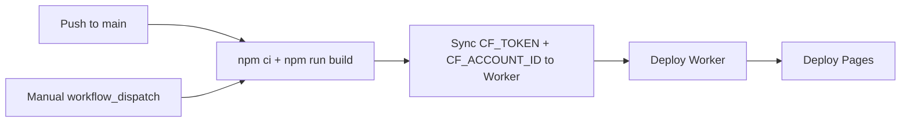

---

## Workflow Files

This repository currently checks in `.github/workflows/deploy.yml`. Additional workflow snippets below should be treated as reference patterns unless a matching workflow file exists in the repository.

### CI Workflow (.github/workflows/ci.yml)

```yaml
name: CI

on:
  push:
    branches: ['**']
  pull_request:
    branches: [main, develop]

jobs:
  lint:
    name: Lint & Type Check
    runs-on: ubuntu-latest
    steps:
      - uses: actions/checkout@v4
      - uses: actions/setup-node@v4
        with:
          node-version: '20'
          cache: 'npm'
      - run: npm ci
      - run: npm run lint
      - run: npm run typecheck

  test:
    name: Unit & Integration Tests
    runs-on: ubuntu-latest
    needs: lint
    steps:
      - uses: actions/checkout@v4
      - uses: actions/setup-node@v4
        with:
          node-version: '20'
          cache: 'npm'
      - run: npm ci
      - run: npm run test:coverage
      - uses: actions/upload-artifact@v4
        with:
          name: coverage-report
          path: coverage/

  build:
    name: Build
    runs-on: ubuntu-latest
    needs: lint
    steps:
      - uses: actions/checkout@v4
      - uses: actions/setup-node@v4
        with:
          node-version: '20'
          cache: 'npm'
      - run: npm ci
      - run: npm run build
      - uses: actions/upload-artifact@v4
        with:
          name: dist
          path: dist/
```

---

### Deployment Workflow (.github/workflows/deploy.yml)

```yaml
name: Deploy DevPilot

on:
  push:
    branches: [main]
  workflow_dispatch:

jobs:
  build-and-deploy:
    name: Build & Deploy to Cloudflare
    runs-on: ubuntu-latest
    steps:
      - uses: actions/checkout@v4
      - uses: actions/setup-node@v4
        with:
          node-version: '20'
          cache: 'npm'
      - run: npm ci
      - run: npm run build
      - name: Sync Worker runtime Cloudflare secrets
        run: node scripts/sync-worker-secrets.mjs
      - uses: cloudflare/wrangler-action@v3
        with:
          apiToken: ${{ secrets.CLOUDFLARE_API_TOKEN }}
          accountId: ${{ secrets.CLOUDFLARE_ACCOUNT_ID }}
          command: deploy --env production
      - uses: cloudflare/pages-action@v1
        with:
          apiToken: ${{ secrets.CLOUDFLARE_API_TOKEN }}
          accountId: ${{ secrets.CLOUDFLARE_ACCOUNT_ID }}
          projectName: devpilot-dashboard
          directory: dist
          gitHubToken: ${{ secrets.GITHUB_TOKEN }}
```

---

### CodeQL Security Scan (.github/workflows/codeql.yml)

```yaml
name: CodeQL

on:
  push:
    branches: [main, develop]
  schedule:
    - cron: '0 0 * * 1'  # Weekly on Monday

jobs:
  analyze:
    name: Analyze
    runs-on: ubuntu-latest
    permissions:
      actions: read
      contents: read
      security-events: write
    steps:
      - uses: actions/checkout@v4
      - uses: github/codeql-action/init@v3
        with:
          languages: javascript-typescript
      - uses: github/codeql-action/autobuild@v3
      - uses: github/codeql-action/analyze@v3
```

---

## Environment Protection Rules

| Environment | Required Reviewers | Wait Timer | Allowed Branches |
|---|---|---|---|
| `production` | @jelvan-ricolcol | 0 min | main |
| `staging` | None | 0 min | develop |

---

## Build Commands Reference

```bash
npm run dev           # Vite development server
npm run build         # Production frontend build
npm run lint          # ESLint script configured in package.json
npm run worker:dev    # Local Worker development with Wrangler
npm run worker:deploy # Manual Worker deploy with Wrangler
```

---

## Version History

| Version | Date | Change |
|---|---|---|
| 1.0.0 | 2026-07-17 | Initial CI/CD documentation |

---

## Related Documents

- [GITHUB.md](GITHUB.md) — GitHub governance
- [DEPLOYMENT.md](DEPLOYMENT.md) — Deployment runbooks
- [TESTING.md](TESTING.md) — Testing strategy
- [ENVIRONMENT_VARIABLES.md](ENVIRONMENT_VARIABLES.md) — Secrets configuration
- [docs/github/ci-cd.md](docs/github/ci-cd.md) — CI/CD deep dive


---

## CLOUDFLARE
<a id="cloudflare"></a>

# CLOUDFLARE.md — Cloudflare Configuration & Services

> **Back to:** [INDEX.md](INDEX.md) | **Related:** [DEPLOYMENT.md](DEPLOYMENT.md) | [BACKEND.md](BACKEND.md) | [STORAGE.md](STORAGE.md)

---

## Metadata

| Field | Value |
|---|---|
| **Version** | 1.0.0 |
| **Owner** | @jelvan-ricolcol |
| **Last Updated** | 2026-07-17 |
| **Status** | Active |
| **Scope** | All Cloudflare services, configuration, and deployment |

---

## Overview

Cloudflare is the primary cloud platform. It provides edge compute (Workers), static hosting (Pages), SQL database (D1), object storage (R2), key-value store (KV), stateful compute (Durable Objects), and message queuing (Queues).

---

## Services Used

| Service | Purpose | Binding |
|---|---|---|
| Workers | Edge API, backend logic | — |
| Pages | Static frontend hosting | — |
| D1 | SQLite relational database | `env.DB` |
| R2 | Object storage (files, images) | `env.BUCKET` |
| KV | Key-value cache and sessions | `env.KV` |
| Durable Objects | Stateful realtime (chat, presence) | `env.DO` |
| Queues | Async background jobs | `env.QUEUE` |
| AI Gateway | Rate-limited AI API proxy | — |
| Turnstile | Bot protection (CAPTCHA-free) | — |
| Access | Zero Trust application access | — |

---

## Workers Configuration

### wrangler.toml
```toml
name = "my-api-worker"
main = "src/index.ts"
compatibility_date = "2024-09-23"
compatibility_flags = ["nodejs_compat"]

[env.staging]
name = "my-api-worker-staging"
vars = { ENVIRONMENT = "staging" }

[env.production]
name = "my-api-worker"
vars = { ENVIRONMENT = "production" }

[[d1_databases]]
binding = "DB"
database_name = "my-db-prod"
database_id = "<production-db-id>"

[[r2_buckets]]
binding = "BUCKET"
bucket_name = "my-bucket-prod"

[[kv_namespaces]]
binding = "KV"
id = "<production-kv-id>"

[[queues.producers]]
queue = "background-jobs"
binding = "QUEUE"

[[queues.consumers]]
queue = "background-jobs"
max_batch_size = 10
max_batch_timeout = 30
```

---

## Pages Configuration

```toml
# pages.toml (or via Cloudflare Dashboard)
[build]
command = "npm run build"
destination = "dist"

[build.environment_variables]
NODE_VERSION = "20"
```

### Pages Deployment via Wrangler
```bash
wrangler pages deploy dist --project-name my-frontend
```

---

## D1 Database

```bash
# Create database
wrangler d1 create my-db

# Apply migrations
wrangler d1 migrations apply DB --env production

# Query database directly
wrangler d1 execute DB --command "SELECT * FROM users LIMIT 5"

# Export database
wrangler d1 export DB --output backup.sql
```

See: [DATABASE.md](DATABASE.md) | [docs/cloudflare/d1.md](docs/cloudflare/d1.md)

---

## R2 Object Storage

```typescript
// Upload object
await env.BUCKET.put(key, body, {
  httpMetadata: { contentType: 'image/jpeg' },
  customMetadata: { uploadedBy: userId },
});

// Get object
const obj = await env.BUCKET.get(key);
if (!obj) throw new NotFoundError('Object not found');
const data = await obj.arrayBuffer();

// Delete object
await env.BUCKET.delete(key);

// Generate presigned URL (requires Cloudflare Workers R2 presigned URL feature)
```

See: [docs/cloudflare/r2.md](docs/cloudflare/r2.md)

---

## KV Store

```typescript
// Write (with TTL)
await env.KV.put(key, JSON.stringify(value), { expirationTtl: 3600 });

// Read
const raw = await env.KV.get(key);
const value = raw ? JSON.parse(raw) : null;

// Delete
await env.KV.delete(key);

// List keys
const list = await env.KV.list({ prefix: 'session:' });
```

**KV Limitations:**
- Eventual consistency — not suitable for counters or transactional state
- Max value size: 25MB
- Max key size: 512 bytes
- Strong consistency within same region only

See: [docs/cloudflare/kv.md](docs/cloudflare/kv.md)

---

## Durable Objects

```typescript
// Declare DO class
export class ChatRoom implements DurableObject {
  private sessions: Set<WebSocket> = new Set();

  constructor(private readonly state: DurableObjectState, private readonly env: Env) {}

  async fetch(request: Request): Promise<Response> {
    if (request.headers.get('Upgrade') === 'websocket') {
      const pair = new WebSocketPair();
      this.sessions.add(pair[1]);
      pair[1].accept();
      return new Response(null, { status: 101, webSocket: pair[0] });
    }
    return new Response('Not a WebSocket request', { status: 400 });
  }
}

// Access from another Worker
const id = env.DO.idFromName('chat-room-123');
const stub = env.DO.get(id);
const response = await stub.fetch(request);
```

See: [docs/cloudflare/durable-objects.md](docs/cloudflare/durable-objects.md)

---

## Queues

```typescript
// Produce message
await env.QUEUE.send({ type: 'send-email', userId, templateId });

// Consume messages (in queue consumer Worker)
export default {
  async queue(batch: MessageBatch<QueueMessage>, env: Env): Promise<void> {
    for (const message of batch.messages) {
      try {
        await processMessage(message.body, env);
        message.ack();
      } catch (error) {
        message.retry(); // Will retry with backoff
      }
    }
  },
};
```

See: [docs/cloudflare/queues.md](docs/cloudflare/queues.md)

---

## Turnstile (Bot Protection)

```typescript
// Server-side validation
const response = await fetch(
  'https://challenges.cloudflare.com/turnstile/v0/siteverify',
  {
    method: 'POST',
    headers: { 'Content-Type': 'application/json' },
    body: JSON.stringify({
      secret: env.TURNSTILE_SECRET_KEY,
      response: turnstileToken,
      remoteip: request.headers.get('CF-Connecting-IP'),
    }),
  }
);
const { success } = await response.json();
if (!success) throw new ForbiddenError('Bot check failed');
```

---

## AI Gateway

```typescript
// Route AI calls through AI Gateway for rate limiting and logging
const aiResponse = await fetch(
  `https://gateway.ai.cloudflare.com/v1/${env.CLOUDFLARE_ACCOUNT_ID}/my-gateway/openai/v1/chat/completions`,
  {
    method: 'POST',
    headers: {
      Authorization: `******
      'Content-Type': 'application/json',
    },
    body: JSON.stringify({ model: 'gpt-4o', messages }),
  }
);
```

---

## Custom Domains

```bash
# Add custom domain to Worker
wrangler deploy --env production
# Then in Cloudflare Dashboard: Workers & Pages → Custom Domains

# Add custom domain to Pages
wrangler pages deploy --project-name my-frontend
# Then in Cloudflare Dashboard: Pages → Custom Domains
```

---

## Security Headers (Worker)

```typescript
function addSecurityHeaders(response: Response): Response {
  const headers = new Headers(response.headers);
  headers.set('X-Content-Type-Options', 'nosniff');
  headers.set('X-Frame-Options', 'DENY');
  headers.set('X-XSS-Protection', '1; mode=block');
  headers.set('Referrer-Policy', 'strict-origin-when-cross-origin');
  headers.set(
    'Content-Security-Policy',
    "default-src 'self'; script-src 'self'; style-src 'self' 'unsafe-inline'"
  );
  headers.set(
    'Permissions-Policy',
    'camera=(), microphone=(), geolocation=()'
  );
  return new Response(response.body, { ...response, headers });
}
```

---

## Monitoring & Analytics

- Cloudflare Analytics: available in Dashboard for Workers and Pages
- `wrangler tail` — live log streaming
- Workers Metrics: CPU time, wall time, error rate, invocation count

See: [MONITORING.md](MONITORING.md) | [OBSERVABILITY.md](OBSERVABILITY.md)

---

## Version History

| Version | Date | Change |
|---|---|---|
| 1.0.0 | 2026-07-17 | Initial Cloudflare documentation |

---

## Related Documents

- [DEPLOYMENT.md](DEPLOYMENT.md) — Deployment procedures
- [BACKEND.md](BACKEND.md) — Worker implementation
- [DATABASE.md](DATABASE.md) — D1 schema
- [STORAGE.md](STORAGE.md) — R2 usage
- [ENVIRONMENT_VARIABLES.md](ENVIRONMENT_VARIABLES.md) — CF bindings and secrets
- [docs/cloudflare/workers.md](docs/cloudflare/workers.md) — Workers deep dive
- [docs/cloudflare/d1.md](docs/cloudflare/d1.md) — D1 deep dive
- [docs/cloudflare/r2.md](docs/cloudflare/r2.md) — R2 deep dive
- [docs/cloudflare/kv.md](docs/cloudflare/kv.md) — KV deep dive


---

## CODE_OF_CONDUCT
<a id="code-of-conduct"></a>

# Code of Conduct

Professional collaboration guidelines for contributors.


---

## CODING_STANDARDS
<a id="coding-standards"></a>

# CODING_STANDARDS.md — Coding Standards & Conventions

> **Back to:** [INDEX.md](INDEX.md) | **Related:** [FILE_STRUCTURE.md](FILE_STRUCTURE.md) | [STYLE_GUIDE.md](STYLE_GUIDE.md) | [CONTRIBUTING.md](CONTRIBUTING.md)

---

## Metadata

| Field | Value |
|---|---|
| **Version** | 1.0.0 |
| **Owner** | @jelvan-ricolcol |
| **Last Updated** | 2026-07-17 |
| **Status** | Active |
| **Scope** | All code style, naming, and convention rules |

---

## Overview

Consistent code style reduces cognitive load, enables AI-assisted development, and ensures maintainability. All standards are enforced by ESLint, TypeScript, and Prettier.

---

## Language Standards

### TypeScript

- **Strict mode:** `"strict": true` in tsconfig
- **Explicit return types:** Required on all public functions and module exports
- **No `any`:** Use `unknown` and narrow with type guards
- **Prefer `interface` for object shapes:** `interface User {}` not `type User = {}`
- **Prefer `type` for unions/intersections:** `type Role = 'admin' | 'viewer'`
- **No implicit undefined:** Use `string | undefined` explicitly

```typescript
// ✅ Good
export function getUserById(id: string): Promise<User | null> {
  return repo.findById(id);
}

// ❌ Bad
export function getUserById(id) {
  return repo.findById(id);
}
```

---

## Naming Conventions

| Item | Convention | Example |
|---|---|---|
| Variables | `camelCase` | `userId`, `accessToken` |
| Constants | `UPPER_SNAKE_CASE` | `MAX_RETRY_COUNT` |
| Functions | `camelCase` | `getUserById` |
| Classes | `PascalCase` | `UserService` |
| Interfaces | `PascalCase` | `UserProfile` |
| Types | `PascalCase` | `ApiError` |
| Enums | `PascalCase` values | `Role.Admin` |
| Files | `kebab-case` | `user-service.ts` |
| React components | `PascalCase.tsx` | `UserProfile.tsx` |
| CSS classes | `kebab-case` | `modal-overlay` |
| Database tables | `snake_case` | `user_sessions` |
| Database columns | `snake_case` | `created_at` |
| Environment variables | `UPPER_SNAKE_CASE` | `JWT_SECRET` |
| API endpoints | `kebab-case` path | `/api/v1/user-profiles` |
| Git branches | `kebab-case` | `feature/add-auth` |

---

## Import Order

Imports must be ordered (enforced by ESLint):
1. External packages
2. Internal packages / path aliases
3. Relative imports
4. Type-only imports (last)

```typescript
// 1. External
import { Hono } from 'hono';
import { z } from 'zod';

// 2. Internal aliases
import { AppError } from '@/lib/errors';

// 3. Relative
import { userSchema } from './validators';

// 4. Types
import type { User } from './types';
```

---

## Function Design

- Functions do one thing (Single Responsibility Principle)
- Max function length: ~40 lines (prefer shorter)
- Max function arguments: 3 positional (use object parameter beyond that)
- Pure functions preferred where possible

```typescript
// ✅ Good — options object for multiple params
async function sendEmail(options: {
  to: string;
  subject: string;
  body: string;
  templateId?: string;
}): Promise<void>

// ❌ Bad — too many positional params
async function sendEmail(to: string, subject: string, body: string, templateId?: string)
```

---

## Error Handling

- Never swallow errors silently
- Always rethrow or log caught errors
- Use typed error classes (see [ERROR_HANDLING.md](ERROR_HANDLING.md))
- Use `try/catch` only at the appropriate boundary (route handler or service)

---

## Comments

- Comments explain **why**, not **what**
- Avoid obvious comments that mirror the code
- Use JSDoc for all public functions, classes, and interfaces
- Mark TODOs: `// TODO(username): description` — do not leave untracked TODOs

```typescript
/**
 * Returns the user by ID, or null if not found.
 * Uses KV cache with 5-minute TTL to reduce D1 reads.
 */
export async function getUserById(id: string): Promise<User | null> {
  // Check cache first to avoid unnecessary D1 reads
  const cached = await kv.get(`user:${id}`);
  // ...
}
```

---

## React Component Standards

- One component per file
- Prefer function components and hooks
- Name the default export and use `displayName` for forwardRef
- Avoid inline functions in JSX for stable references
- Use `useCallback` and `useMemo` only when profiling shows a need

---

## Security Coding Rules

- Never concatenate user input into SQL queries
- Never use `dangerouslySetInnerHTML` with untrusted content
- Validate all inputs with Zod at API boundaries
- Never log sensitive data (passwords, tokens, PII)
- Use HTTPS everywhere; Workers enforce this via Cloudflare

---

## Linting & Formatting

```bash
# Run linter
npm run lint

# Auto-fix lint issues
npm run lint:fix

# Format code
npm run format

# Type check
npm run typecheck
```

### ESLint Rules (key)
- `no-unused-vars`: error
- `no-explicit-any`: error
- `prefer-const`: error
- `no-console`: warn (use logger instead)
- `import/order`: enforced
- `react-hooks/rules-of-hooks`: error
- `react-hooks/exhaustive-deps`: warn

---

## Version History

| Version | Date | Change |
|---|---|---|
| 1.0.0 | 2026-07-17 | Initial coding standards documentation |

---

## Related Documents

- [FILE_STRUCTURE.md](FILE_STRUCTURE.md) — File organization
- [STYLE_GUIDE.md](STYLE_GUIDE.md) — Documentation style
- [CONTRIBUTING.md](CONTRIBUTING.md) — Contribution process
- [ERROR_HANDLING.md](ERROR_HANDLING.md) — Error conventions
- [TESTING.md](TESTING.md) — Test conventions


---

## COMPONENT_LIBRARY
<a id="component-library"></a>

# COMPONENT_LIBRARY.md — UI Component Library

> **Back to:** [INDEX.md](INDEX.md) | **Related:** [DESIGN_SYSTEM.md](DESIGN_SYSTEM.md) | [FRONTEND.md](FRONTEND.md)

---

## Metadata

| Field | Value |
|---|---|
| **Version** | 1.0.0 |
| **Owner** | @jelvan-ricolcol |
| **Last Updated** | 2026-07-17 |
| **Status** | Active |
| **Scope** | UI component system, primitive and composite components |

---

## Overview

The component library contains all shared, reusable UI components. Components are built on top of the design system tokens and follow accessibility, composability, and consistency principles.

---

## Component Architecture

```
components/
├── primitives/         # Atomic, unstyled or minimally styled
│   ├── Button/
│   ├── Input/
│   ├── Label/
│   ├── Select/
│   ├── Checkbox/
│   ├── RadioGroup/
│   ├── Switch/
│   └── Textarea/
├── layout/             # Page structure
│   ├── Container/
│   ├── Grid/
│   ├── Stack/
│   └── Divider/
├── feedback/           # User feedback
│   ├── Alert/
│   ├── Toast/
│   ├── Spinner/
│   └── Skeleton/
├── overlay/            # Floating elements
│   ├── Modal/
│   ├── Drawer/
│   ├── Popover/
│   └── Tooltip/
├── navigation/         # Navigation elements
│   ├── Breadcrumb/
│   ├── Tabs/
│   ├── Pagination/
│   └── Sidebar/
└── data-display/       # Data presentation
    ├── Table/
    ├── Card/
    ├── Badge/
    └── Avatar/
```

---

## Component Standards

Every component must:
1. Accept and forward `className` for style overrides
2. Forward `ref` where applicable
3. Support keyboard navigation
4. Have ARIA roles/labels for accessibility
5. Have a `data-testid` prop for testing
6. Be exported from the `components/index.ts` barrel file
7. Have a corresponding test file

---

## Button Component

```tsx
// components/primitives/Button/Button.tsx
import { forwardRef, ButtonHTMLAttributes } from 'react';
import { cn } from '../../lib/utils';

export interface ButtonProps extends ButtonHTMLAttributes<HTMLButtonElement> {
  variant?: 'primary' | 'secondary' | 'ghost' | 'destructive';
  size?: 'sm' | 'md' | 'lg';
  loading?: boolean;
}

export const Button = forwardRef<HTMLButtonElement, ButtonProps>(
  (
    { variant = 'primary', size = 'md', loading, disabled, children, className, ...props },
    ref
  ) => (
    <button
      ref={ref}
      disabled={disabled || loading}
      aria-busy={loading}
      className={cn(buttonVariants({ variant, size }), className)}
      {...props}
    >
      {loading && <Spinner size="sm" aria-hidden />}
      {children}
    </button>
  )
);
Button.displayName = 'Button';
```

---

## Modal Component

```tsx
// components/overlay/Modal/Modal.tsx
import { useEffect, useRef } from 'react';
import { createPortal } from 'react-dom';

interface ModalProps {
  open: boolean;
  onClose: () => void;
  title: string;
  children: React.ReactNode;
}

export function Modal({ open, onClose, title, children }: ModalProps) {
  const ref = useRef<HTMLDivElement>(null);

  // Focus management
  useEffect(() => {
    if (open) ref.current?.focus();
  }, [open]);

  // Keyboard close
  useEffect(() => {
    const handler = (e: KeyboardEvent) => {
      if (e.key === 'Escape') onClose();
    };
    document.addEventListener('keydown', handler);
    return () => document.removeEventListener('keydown', handler);
  }, [onClose]);

  if (!open) return null;

  return createPortal(
    <div role="dialog" aria-modal aria-labelledby="modal-title">
      <div className="overlay" onClick={onClose} aria-hidden />
      <div ref={ref} tabIndex={-1} className="modal-content">
        <h2 id="modal-title">{title}</h2>
        {children}
        <button onClick={onClose} aria-label="Close modal">×</button>
      </div>
    </div>,
    document.body
  );
}
```

---

## Component Catalog

| Component | Status | Accessibility | Notes |
|---|---|---|---|
| Button | ✅ | ARIA busy, disabled | Variants: primary, secondary, ghost, destructive |
| Input | ✅ | ARIA required, invalid | Controlled + uncontrolled |
| Select | ✅ | Native select | Use for simple dropdowns |
| Checkbox | ✅ | ARIA checked | Group support |
| Modal | ✅ | focus-trap, role=dialog | Portal-based |
| Toast | ✅ | role=alert | Auto-dismiss |
| Spinner | ✅ | aria-hidden or aria-label | size: sm, md, lg |
| Table | ✅ | thead/tbody, scope | Sortable, selectable |
| Tabs | ✅ | role=tablist | Keyboard navigation |
| Tooltip | ✅ | role=tooltip | Hover + focus |
| Skeleton | ✅ | aria-hidden | Loading state |
| Avatar | ✅ | alt text required | Image + initials fallback |
| Badge | ✅ | — | Status, count variants |
| Pagination | ✅ | aria-label on pages | Cursor-based |

---

## Storybook (Planned)

Component documentation and interactive playground planned via Storybook:
```bash
npm run storybook
```

---

## Version History

| Version | Date | Change |
|---|---|---|
| 1.0.0 | 2026-07-17 | Initial component library documentation |

---

## Related Documents

- [DESIGN_SYSTEM.md](DESIGN_SYSTEM.md) — Design tokens and theming
- [FRONTEND.md](FRONTEND.md) — Frontend architecture
- [TESTING.md](TESTING.md) — Component testing
- [CODING_STANDARDS.md](CODING_STANDARDS.md) — Component code conventions


---

## CONTRIBUTING
<a id="contributing"></a>

# CONTRIBUTING.md — Contribution Guidelines

> **Back to:** [INDEX.md](INDEX.md) | **Related:** [CODING_STANDARDS.md](CODING_STANDARDS.md) | [STYLE_GUIDE.md](STYLE_GUIDE.md) | [GITHUB.md](GITHUB.md)

---

## Metadata

| Field | Value |
|---|---|
| **Version** | 1.0.0 |
| **Owner** | @jelvan-ricolcol |
| **Last Updated** | 2026-07-17 |
| **Status** | Active |

---

## Overview

Thank you for contributing to this repository. This guide covers how to propose changes, submit pull requests, add documentation, and maintain quality standards.

---

## Before You Start

1. Read [CODE_OF_CONDUCT.md](CODE_OF_CONDUCT.md)
2. Read [CODING_STANDARDS.md](CODING_STANDARDS.md)
3. Read [STYLE_GUIDE.md](STYLE_GUIDE.md) (for documentation changes)
4. Search existing issues and PRs to avoid duplication

---

## Contribution Workflow

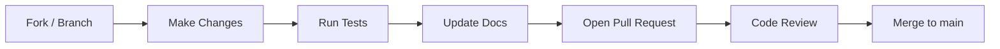

---

## Branch Naming

```
feature/add-magic-link-auth
fix/jwt-refresh-race-condition
docs/update-api-reference
chore/bump-wrangler-version
security/fix-cors-header
```

---

## Commit Messages (Conventional Commits)

Format: `type(scope): description`

```
feat(auth): add magic link login flow
fix(api): return 422 instead of 400 for business rule violations
docs(api): add pagination examples to API.md
chore(deps): update wrangler to 3.78.0
test(auth): add refresh token expiry test
security(api): add rate limiting to login endpoint
```

See full type reference in [GITHUB.md](GITHUB.md).

---

## Documentation Requirements

**Every change must update affected documentation before the PR is considered complete.**

When you change | Update these documents
--- | ---
API endpoints | [API.md](API.md), [SERVICE_REGISTRY.md](SERVICE_REGISTRY.md)
Database schema | [DATABASE.md](DATABASE.md), [DATA_DICTIONARY.md](DATA_DICTIONARY.md)
Auth/authz logic | [AUTHENTICATION.md](AUTHENTICATION.md) or [AUTHORIZATION.md](AUTHORIZATION.md)
Environment variables | [ENVIRONMENT_VARIABLES.md](ENVIRONMENT_VARIABLES.md)
CI/CD workflows | [CI_CD.md](CI_CD.md)
Deployment procedure | [DEPLOYMENT.md](DEPLOYMENT.md)
New feature | [FEATURE_REGISTRY.md](FEATURE_REGISTRY.md), [CHANGELOG.md](CHANGELOG.md)
New service | [SERVICE_REGISTRY.md](SERVICE_REGISTRY.md)
Breaking change | [CHANGELOG.md](CHANGELOG.md), affected docs

New documents must be registered in [INDEX.md](INDEX.md).

---

## Pull Request Checklist

- [ ] Tests added or updated for changed behavior
- [ ] All existing tests pass (`npm run test`)
- [ ] Linting passes (`npm run lint`)
- [ ] Type checking passes (`npm run typecheck`)
- [ ] Documentation updated for all affected areas
- [ ] CHANGELOG.md updated
- [ ] No secrets committed
- [ ] PR description explains the *why* (not just the what)
- [ ] Breaking changes documented

---

## Adding Documentation

1. Create file following the template in [STYLE_GUIDE.md](STYLE_GUIDE.md)
2. Add to [INDEX.md](INDEX.md) under the appropriate category
3. Add back-link to INDEX.md at the top of the new document
4. Link related documents in the "Related Documents" section

---

## Reporting Issues

Use GitHub Issues with the appropriate label:
- `bug` — Something is broken
- `docs` — Documentation improvement
- `feature` — New capability request
- `security` — Security concern (use GitHub Security Advisories for vulnerabilities)

---

## Related Documents

- [CODE_OF_CONDUCT.md](CODE_OF_CONDUCT.md)
- [CODING_STANDARDS.md](CODING_STANDARDS.md)
- [STYLE_GUIDE.md](STYLE_GUIDE.md)
- [GITHUB.md](GITHUB.md) — Branch and PR standards
- [TESTING.md](TESTING.md) — Testing requirements


---

## DATABASE
<a id="database"></a>

# DATABASE.md — Database Architecture

> **Back to:** [INDEX.md](INDEX.md) | **Related:** [BACKEND.md](BACKEND.md) | [DATA_DICTIONARY.md](DATA_DICTIONARY.md) | [STORAGE.md](STORAGE.md)

---

## Metadata

| Field | Value |
|---|---|
| **Version** | 1.0.0 |
| **Owner** | @jelvan-ricolcol |
| **Last Updated** | 2026-07-17 |
| **Status** | Active |
| **Scope** | Database design, schema, migrations, and query patterns |

---

## Overview

The primary database is **Cloudflare D1** — a SQLite-compatible serverless SQL database available as a Cloudflare Workers binding. It is accessed directly from Workers without a connection pool. For high-write or complex-query workloads, migration to PostgreSQL via Cloudflare Hyperdrive is documented below.

---

## Technology Stack

| Technology | Purpose |
|---|---|
| Cloudflare D1 | Primary relational database (SQLite) |
| Cloudflare KV | Ephemeral key-value, cache, sessions |
| Cloudflare R2 | Binary/blob storage (not relational) |
| Hyperdrive + PostgreSQL | Optional: high-performance relational |

---

## D1 Constraints (SQLite)

| Constraint | Value |
|---|---|
| Max DB size | 2GB (current D1 limit) |
| Max row size | 1MB |
| Max columns per table | 2000 |
| Concurrent writes | Single-writer (serialized) |
| Full-text search | FTS5 available |
| JSON support | `json_extract()` available |
| No stored procedures | Use application layer |
| No `RETURNING` (older D1) | Use `last_insert_rowid()` |

---

## Schema Conventions

- All tables use **snake_case** names
- All columns use **snake_case** names
- Primary keys: `id TEXT PRIMARY KEY` (CUID2 or UUIDv7 generated in application)
- Every table has: `created_at TEXT NOT NULL`, `updated_at TEXT NOT NULL`
- Soft deletes: `deleted_at TEXT` (null = active)
- Foreign keys: named `{table_singular}_id`
- Indexes on all FK columns and common filter columns

---

## Core Schema

```sql
-- Users
CREATE TABLE IF NOT EXISTS users (
  id         TEXT PRIMARY KEY,
  email      TEXT NOT NULL UNIQUE,
  name       TEXT NOT NULL,
  role       TEXT NOT NULL DEFAULT 'viewer' CHECK (role IN ('admin', 'editor', 'viewer')),
  avatar_url TEXT,
  created_at TEXT NOT NULL,
  updated_at TEXT NOT NULL,
  deleted_at TEXT
);
CREATE INDEX IF NOT EXISTS idx_users_email ON users(email);
CREATE INDEX IF NOT EXISTS idx_users_role  ON users(role);

-- Sessions (for refresh token storage)
CREATE TABLE IF NOT EXISTS sessions (
  id            TEXT PRIMARY KEY,
  user_id       TEXT NOT NULL REFERENCES users(id),
  refresh_token TEXT NOT NULL UNIQUE,
  user_agent    TEXT,
  ip_address    TEXT,
  expires_at    TEXT NOT NULL,
  created_at    TEXT NOT NULL,
  revoked_at    TEXT
);
CREATE INDEX IF NOT EXISTS idx_sessions_user_id ON sessions(user_id);
CREATE INDEX IF NOT EXISTS idx_sessions_refresh_token ON sessions(refresh_token);

-- Audit Log
CREATE TABLE IF NOT EXISTS audit_logs (
  id          TEXT PRIMARY KEY,
  user_id     TEXT REFERENCES users(id),
  action      TEXT NOT NULL,
  resource    TEXT NOT NULL,
  resource_id TEXT,
  metadata    TEXT,  -- JSON
  ip_address  TEXT,
  created_at  TEXT NOT NULL
);
CREATE INDEX IF NOT EXISTS idx_audit_user_id   ON audit_logs(user_id);
CREATE INDEX IF NOT EXISTS idx_audit_resource  ON audit_logs(resource, resource_id);
CREATE INDEX IF NOT EXISTS idx_audit_created   ON audit_logs(created_at);
```

---

## Migration Strategy

Migrations are SQL files stored in `migrations/` directory and applied with Wrangler CLI.

### File Naming
```
migrations/
├── 0001_initial.sql
├── 0002_add_audit_logs.sql
└── 0003_add_user_preferences.sql
```

### Apply Migrations
```bash
# Local
wrangler d1 migrations apply DB

# Staging
wrangler d1 migrations apply DB --env staging

# Production
wrangler d1 migrations apply DB --env production
```

### Migration Rules
1. Never modify existing migrations — create a new one
2. Migrations must be idempotent (`CREATE TABLE IF NOT EXISTS`)
3. Include rollback SQL as a comment at the bottom of each file
4. Test migrations on staging before production
5. Document breaking schema changes in [CHANGELOG.md](CHANGELOG.md)

---

## Query Patterns

### Safe Query (Parameterized)
```typescript
// Always use bound parameters — never string interpolation
const user = await env.DB
  .prepare('SELECT * FROM users WHERE id = ? AND deleted_at IS NULL')
  .bind(userId)
  .first<User>();
```

### Batch Queries
```typescript
const [users, count] = await env.DB.batch([
  env.DB.prepare('SELECT * FROM users LIMIT ? OFFSET ?').bind(limit, offset),
  env.DB.prepare('SELECT COUNT(*) as total FROM users WHERE deleted_at IS NULL'),
]);
```

### Transactions (D1)
```typescript
// D1 supports transactions via batch with implicit transaction
const result = await env.DB.batch([
  env.DB.prepare('INSERT INTO orders (...) VALUES (?)').bind(...),
  env.DB.prepare('UPDATE inventory SET stock = stock - 1 WHERE id = ?').bind(itemId),
]);
```

---

## Indexing Strategy

- Index all foreign key columns
- Index all `WHERE` clause columns used in common queries
- Index `created_at` for time-range queries
- Composite indexes for multi-column queries (order: most selective first)
- Review `EXPLAIN QUERY PLAN` for slow queries

---

## Data Types (SQLite)

| Use Case | SQLite Type | Notes |
|---|---|---|
| IDs | `TEXT` | CUID2 or UUIDv7 |
| Strings | `TEXT` | UTF-8 |
| Integers | `INTEGER` | 64-bit signed |
| Decimals | `REAL` or `TEXT` | Use TEXT for currency (store cents as INTEGER) |
| Booleans | `INTEGER` | 0 = false, 1 = true |
| Timestamps | `TEXT` | ISO 8601: `2026-07-17T13:00:00.000Z` |
| JSON | `TEXT` | Use `json_extract()` for queries |
| Enums | `TEXT` with CHECK | `CHECK (role IN ('admin', 'viewer'))` |

---

## Backup & Recovery

- D1 automatic daily snapshots (Cloudflare-managed)
- Export database: `wrangler d1 export DB --output backup.sql`
- Restore: `wrangler d1 execute DB --file backup.sql`
- Point-in-time recovery: Review current D1 plan capabilities

---

## Performance Guidelines

- Use `LIMIT` on all list queries
- Use indexes for all `WHERE` and `ORDER BY` columns
- Avoid `SELECT *` — specify required columns
- Use `EXPLAIN QUERY PLAN` to verify index usage
- Cache frequently-read data in KV (avoid repeated D1 reads)
- For analytics/aggregations, consider exporting to R2 + D1 Analytics

---

## Security

- Use parameterized queries **always** — never string interpolation
- Restrict D1 access to Worker bindings only (no public access)
- Audit sensitive data access via audit_logs table
- Encrypt sensitive columns (PII) in application layer before storage

---

## Migration to PostgreSQL (Hyperdrive)

When D1 limitations are reached (size, write throughput, complex queries):

1. Provision PostgreSQL (Supabase, Neon, or self-hosted)
2. Enable Cloudflare Hyperdrive for connection pooling
3. Update Worker binding: `env.DB` → Hyperdrive connection
4. Migrate schema (SQLite → PostgreSQL syntax differences)
5. Update data types: `TEXT` IDs → `UUID`, `TEXT` booleans → `BOOLEAN`
6. Document in [CHANGELOG.md](CHANGELOG.md) and [DEPLOYMENT.md](DEPLOYMENT.md)

---

## Version History

| Version | Date | Change |
|---|---|---|
| 1.0.0 | 2026-07-17 | Initial database documentation |

---

## Related Documents

- [BACKEND.md](BACKEND.md) — Repository layer patterns
- [DATA_DICTIONARY.md](DATA_DICTIONARY.md) — Field-level definitions
- [CLOUDFLARE.md](CLOUDFLARE.md) — D1 binding configuration
- [STORAGE.md](STORAGE.md) — Non-relational storage
- [SECURITY.md](SECURITY.md) — Data security requirements
- [docs/database/sql.md](docs/database/sql.md) — SQL patterns
- [docs/database/migrations.md](docs/database/migrations.md) — Migration guide
- [docs/cloudflare/d1.md](docs/cloudflare/d1.md) — D1 deep dive


---

## DATA_DICTIONARY
<a id="data-dictionary"></a>

# DATA_DICTIONARY.md — Data Dictionary

> **Back to:** [INDEX.md](INDEX.md) | **Related:** [DATABASE.md](DATABASE.md) | [API.md](API.md) | [SERVICE_REGISTRY.md](SERVICE_REGISTRY.md)

---

## Metadata

| Field | Value |
|---|---|
| **Version** | 1.0.0 |
| **Owner** | @jelvan-ricolcol |
| **Last Updated** | 2026-07-17 |
| **Status** | Active |
| **Scope** | Canonical definitions of all data fields, types, and models |

---

## Overview

The Data Dictionary is the authoritative reference for all data fields across the system. Use this to ensure consistent naming, types, and validation rules across the API, database, and frontend.

---

## ID Format

All entity IDs use **CUID2** (Collision-resistant Unique Identifier).

- Format: 24-character string, starts with letter `c`
- Example: `cuid2abc123def456ghi789`
- Library: `@paralleldrive/cuid2`
- Stored as `TEXT` in D1

---

## Timestamp Format

All timestamps are stored and transmitted as **ISO 8601** strings in UTC:
- Format: `YYYY-MM-DDTHH:mm:ss.sssZ`
- Example: `2026-07-17T13:54:52.000Z`
- Stored as `TEXT` in D1 (SQLite has no native TIMESTAMP)

---

## Entities

---

### User

**Table:** `users` | **API Resource:** `/api/v1/users`

| Field | DB Column | Type | Required | Description |
|---|---|---|---|---|
| `id` | `id` | CUID2 string | Yes | Unique user identifier |
| `email` | `email` | string (email) | Yes | Unique email address |
| `name` | `name` | string (1–100) | Yes | Display name |
| `role` | `role` | enum | Yes | `admin` / `editor` / `viewer` |
| `avatarUrl` | `avatar_url` | string (URL) | No | Profile picture URL |
| `createdAt` | `created_at` | ISO 8601 | Yes | Record creation time |
| `updatedAt` | `updated_at` | ISO 8601 | Yes | Last modification time |
| `deletedAt` | `deleted_at` | ISO 8601 | No | Soft delete timestamp (null = active) |

**Constraints:**
- `email` must be unique and lowercase-normalized
- `role` defaults to `viewer`
- `deletedAt IS NULL` required to be considered "active"

---

### Session

**Table:** `sessions`

| Field | DB Column | Type | Required | Description |
|---|---|---|---|---|
| `id` | `id` | CUID2 string | Yes | Unique session ID |
| `userId` | `user_id` | CUID2 string | Yes | FK → users.id |
| `refreshToken` | `refresh_token` | string (64 chars) | Yes | Opaque refresh token (hashed) |
| `userAgent` | `user_agent` | string | No | Browser/client user agent |
| `ipAddress` | `ip_address` | string (IP) | No | Client IP at creation |
| `expiresAt` | `expires_at` | ISO 8601 | Yes | When this session expires |
| `createdAt` | `created_at` | ISO 8601 | Yes | Session creation time |
| `revokedAt` | `revoked_at` | ISO 8601 | No | Revocation time (null = active) |

---

### Audit Log

**Table:** `audit_logs`

| Field | DB Column | Type | Required | Description |
|---|---|---|---|---|
| `id` | `id` | CUID2 string | Yes | Unique log entry ID |
| `userId` | `user_id` | CUID2 string | No | Who performed the action (null = system) |
| `action` | `action` | string | Yes | Action performed (e.g., `users:update`) |
| `resource` | `resource` | string | Yes | Resource type (e.g., `users`) |
| `resourceId` | `resource_id` | string | No | ID of affected resource |
| `metadata` | `metadata` | JSON string | No | Additional context |
| `ipAddress` | `ip_address` | string | No | Client IP address |
| `createdAt` | `created_at` | ISO 8601 | Yes | When action occurred |

---

## Enumerations

### UserRole
| Value | Description |
|---|---|
| `admin` | Full system access |
| `editor` | Read/write content access |
| `viewer` | Read-only access |
| `service` | Machine-to-machine access |

### ApiErrorCode
See full list in [ERROR_HANDLING.md](ERROR_HANDLING.md)

---

## API Field Naming (Camel Case)

The API returns `camelCase` field names:
```json
{
  "id": "cuid2abc123",
  "userId": "cuid2xyz456",
  "createdAt": "2026-07-17T13:54:52.000Z"
}
```

Database stores `snake_case` column names:
```sql
user_id, created_at, deleted_at
```

Mapping is handled in the repository layer.

---

## Validation Rules

| Field | Rule |
|---|---|
| Email | RFC 5322 format, max 254 chars, normalized to lowercase |
| Password | Min 12 chars, 1 upper, 1 lower, 1 digit, 1 special |
| Name | Min 1, max 100 chars, no HTML |
| ID (path param) | Must match CUID2 format |
| Pagination limit | Integer 1–100 |
| Pagination cursor | Opaque string, max 512 chars |

---

## Version History

| Version | Date | Change |
|---|---|---|
| 1.0.0 | 2026-07-17 | Initial data dictionary |

---

## Related Documents

- [DATABASE.md](DATABASE.md) — SQL schema
- [API.md](API.md) — API response models
- [BACKEND.md](BACKEND.md) — Repository layer
- [AUTHENTICATION.md](AUTHENTICATION.md) — Session data model


---

## DEPLOYMENT
<a id="deployment"></a>

# DEPLOYMENT.md — Deployment Procedures

> **Back to:** [INDEX.md](INDEX.md) | **Related:** [CI_CD.md](CI_CD.md) | [CLOUDFLARE.md](CLOUDFLARE.md) | [ENVIRONMENT_VARIABLES.md](ENVIRONMENT_VARIABLES.md)

---

## Metadata

| Field | Value |
|---|---|
| **Version** | 1.0.0 |
| **Owner** | @jelvan-ricolcol |
| **Last Updated** | 2026-07-17 |
| **Status** | Active |
| **Scope** | All deployment procedures and runbooks |

---

## Overview

Deployments are automated via GitHub Actions. The repository now deploys both the Cloudflare Pages frontend and the `devpilot-api` Worker backend from `.github/workflows/deploy.yml` using the `CLOUDFLARE_API_TOKEN` and `CLOUDFLARE_ACCOUNT_ID` GitHub secrets. Manual deployments using Wrangler CLI are documented for emergencies. All deployments require passing CI checks.

---

## Environments

| Environment | Branch | Trigger | URL |
|---|---|---|---|
| Local | Any | Manual | `localhost` |
| Production | `main` | Push to `main` or manual workflow dispatch | Cloudflare Pages project + Worker route |

---

## Deployment Flow

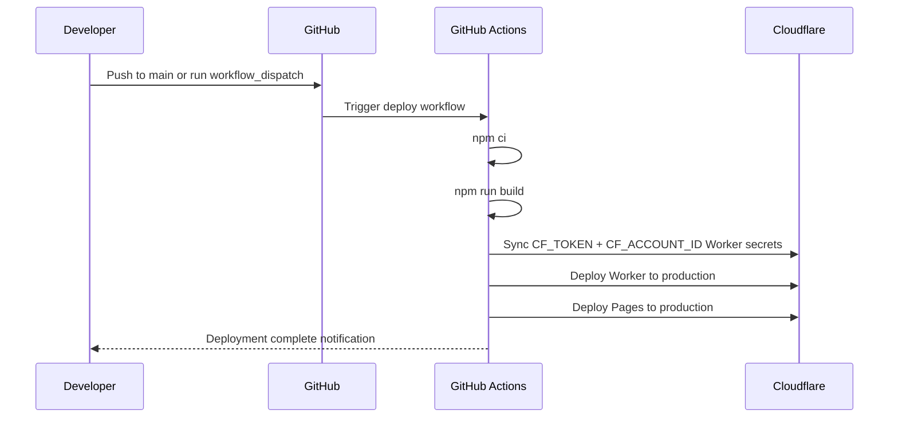

---

## Pre-Deployment Checklist

Before every production deployment:

- [ ] `npm run build` passes
- [ ] Code reviewed and approved
- [ ] `CLOUDFLARE_API_TOKEN` and `CLOUDFLARE_ACCOUNT_ID` are present in GitHub Secrets
- [ ] Required manual Worker secrets are verified in Cloudflare
- [ ] Rollback plan documented

---

## GitHub Actions Workflow

See: [CI_CD.md](CI_CD.md)

### Production Deploy (automated on push to `main` or manual dispatch)
```yaml
# .github/workflows/deploy.yml (summarized)
on:
  push:
    branches: [main]
  workflow_dispatch:
jobs:
  build-and-deploy:
    runs-on: ubuntu-latest
    steps:
      - uses: actions/checkout@v4
      - uses: actions/setup-node@v4
        with: { node-version: '20' }
      - run: npm ci
      - run: npm run build
      - name: Sync Worker runtime Cloudflare secrets
        run: node scripts/sync-worker-secrets.mjs
      - uses: cloudflare/wrangler-action@v3
        with:
          apiToken: ${{ secrets.CLOUDFLARE_API_TOKEN }}
          accountId: ${{ secrets.CLOUDFLARE_ACCOUNT_ID }}
          command: deploy --env production
      - uses: cloudflare/pages-action@v1
        with:
          apiToken: ${{ secrets.CLOUDFLARE_API_TOKEN }}
          accountId: ${{ secrets.CLOUDFLARE_ACCOUNT_ID }}
          projectName: devpilot-dashboard
          directory: dist
          gitHubToken: ${{ secrets.GITHUB_TOKEN }}
```

### What is automated now

- Frontend build (`npm run build`)
- Production Worker deployment for `devpilot-api`
- Production Pages deployment for `devpilot-dashboard`
- Sync of Worker runtime secrets `CF_TOKEN` and `CF_ACCOUNT_ID` from GitHub Actions secrets before backend deploy

### Still requires manual setup

- Create and maintain the Cloudflare Pages project `devpilot-dashboard`
- Ensure the Cloudflare Worker target defined by `wrangler.toml` exists and remains configured correctly
- Manually maintain the optional Worker secret `GITHUB_TOKEN` if the backend should proxy GitHub API requests server-side
- Add any future runtime secrets that are not derived from `CLOUDFLARE_API_TOKEN` or `CLOUDFLARE_ACCOUNT_ID`
- Configure custom domains, routes, and any Cloudflare product bindings not declared in this repository

---

## Manual Deployment (Emergency)

```bash
# 1. Authenticate
wrangler login

# 2. Run migrations
wrangler d1 migrations apply DB --env production

# 3. Deploy Worker
wrangler deploy --env production

# 4. Deploy Pages
wrangler pages deploy dist --project-name devpilot-dashboard --branch main
```

---

## Rollback Procedures

### Worker Rollback
```bash
# List recent deployments
wrangler deployments list

# Roll back to previous deployment
wrangler rollback [deployment-id]
```

### Database Rollback
```bash
# D1 does not support automatic rollback
# Apply rollback SQL from migration file footer
wrangler d1 execute DB --file migrations/rollback_XXXX.sql --env production
```

---

## Zero-Downtime Deployments

Cloudflare Workers supports zero-downtime deployment:
- New Worker version deployed while old version continues serving requests
- Cloudflare gradually routes traffic to new version
- No restart, no connection drop

**Database migrations must be backward-compatible:**
- Add columns (never remove in the same deploy)
- Deploy new code that handles both old and new schema
- Remove deprecated columns in a subsequent deploy

---

## Post-Deployment Verification

```bash
# Check Worker health
curl https://{worker-domain}/api/health

# Check database connectivity
curl https://{worker-domain}/health/db

# Tail Worker logs
wrangler tail --env production
```

---

## Version History

| Version | Date | Change |
|---|---|---|
| 1.0.0 | 2026-07-17 | Initial deployment documentation |

---

## Related Documents

- [CI_CD.md](CI_CD.md) — CI/CD pipeline detail
- [CLOUDFLARE.md](CLOUDFLARE.md) — Cloudflare services
- [ENVIRONMENT_VARIABLES.md](ENVIRONMENT_VARIABLES.md) — Env vars per environment
- [DATABASE.md](DATABASE.md) — Migration procedures
- [TROUBLESHOOTING.md](TROUBLESHOOTING.md) — Deployment failure resolution


---

## DESIGN_SYSTEM
<a id="design-system"></a>

# DESIGN_SYSTEM.md — Design System

> **Back to:** [INDEX.md](INDEX.md) | **Related:** [COMPONENT_LIBRARY.md](COMPONENT_LIBRARY.md) | [FRONTEND.md](FRONTEND.md)

---

## Metadata

| Field | Value |
|---|---|
| **Version** | 1.0.0 |
| **Owner** | @jelvan-ricolcol |
| **Last Updated** | 2026-07-17 |
| **Status** | Active |
| **Scope** | Design tokens, typography, color palette, spacing, and theming |

---

## Overview

The design system defines the visual language: tokens, typography, colors, spacing, and motion. All UI components use these tokens consistently via Tailwind CSS custom properties.

---

## Color Palette

### Brand Colors
```css
:root {
  --color-primary-50:  #eff6ff;
  --color-primary-100: #dbeafe;
  --color-primary-200: #bfdbfe;
  --color-primary-300: #93c5fd;
  --color-primary-400: #60a5fa;
  --color-primary-500: #3b82f6;  /* Primary */
  --color-primary-600: #2563eb;
  --color-primary-700: #1d4ed8;
  --color-primary-800: #1e40af;
  --color-primary-900: #1e3a8a;
}
```

### Semantic Colors
```css
:root {
  --color-success: #22c55e;
  --color-warning: #f59e0b;
  --color-error:   #ef4444;
  --color-info:    #3b82f6;

  /* Light mode */
  --color-background: #ffffff;
  --color-surface:    #f9fafb;
  --color-border:     #e5e7eb;
  --color-text:       #111827;
  --color-muted:      #6b7280;
}

[data-theme="dark"] {
  --color-background: #0f172a;
  --color-surface:    #1e293b;
  --color-border:     #334155;
  --color-text:       #f1f5f9;
  --color-muted:      #94a3b8;
}
```

---

## Typography

### Font Stack
```css
:root {
  --font-sans: 'Inter', system-ui, -apple-system, sans-serif;
  --font-mono: 'JetBrains Mono', 'Fira Code', monospace;
}
```

### Type Scale
| Token | Size | Line Height | Use |
|---|---|---|---|
| `text-xs` | 12px | 1.5 | Labels, captions |
| `text-sm` | 14px | 1.5 | Body small |
| `text-base` | 16px | 1.5 | Body default |
| `text-lg` | 18px | 1.4 | Body large |
| `text-xl` | 20px | 1.3 | Heading 4 |
| `text-2xl` | 24px | 1.3 | Heading 3 |
| `text-3xl` | 30px | 1.2 | Heading 2 |
| `text-4xl` | 36px | 1.1 | Heading 1 |
| `text-5xl` | 48px | 1 | Display |

---

## Spacing Scale

Based on 4px base unit:

| Token | Value | Use |
|---|---|---|
| `space-1` | 4px | Micro gap |
| `space-2` | 8px | Tight gap |
| `space-3` | 12px | Small gap |
| `space-4` | 16px | Default gap |
| `space-5` | 20px | Medium gap |
| `space-6` | 24px | Section gap |
| `space-8` | 32px | Large gap |
| `space-12` | 48px | Section spacing |
| `space-16` | 64px | Layout spacing |

---

## Border Radius
| Token | Value | Use |
|---|---|---|
| `rounded-sm` | 2px | Subtle rounding |
| `rounded` | 4px | Default rounding |
| `rounded-md` | 6px | Cards, inputs |
| `rounded-lg` | 8px | Larger cards |
| `rounded-xl` | 12px | Modals |
| `rounded-full` | 9999px | Pills, avatars |

---

## Shadows
```css
:root {
  --shadow-sm:  0 1px 2px 0 rgb(0 0 0 / 0.05);
  --shadow-md:  0 4px 6px -1px rgb(0 0 0 / 0.1);
  --shadow-lg:  0 10px 15px -3px rgb(0 0 0 / 0.1);
  --shadow-xl:  0 20px 25px -5px rgb(0 0 0 / 0.1);
}
```

---

## Motion / Animation

```css
:root {
  --transition-fast:   150ms ease-in-out;
  --transition-base:   200ms ease-in-out;
  --transition-slow:   300ms ease-in-out;
}

/* Respect reduced motion preference */
@media (prefers-reduced-motion: reduce) {
  * {
    transition-duration: 0.01ms !important;
    animation-duration: 0.01ms !important;
  }
}
```

---

## Z-Index Scale

| Token | Value | Use |
|---|---|---|
| `z-base` | 0 | Default stacking |
| `z-raised` | 10 | Dropdowns |
| `z-overlay` | 20 | Modals, drawers (backdrop) |
| `z-modal` | 30 | Modals (content) |
| `z-toast` | 40 | Toast notifications |
| `z-tooltip` | 50 | Tooltips |

---

## Tailwind Config

```typescript
// tailwind.config.ts
export default {
  content: ['./src/**/*.{ts,tsx}'],
  darkMode: ['selector', '[data-theme="dark"]'],
  theme: {
    extend: {
      colors: {
        primary: {
          500: 'var(--color-primary-500)',
          // ...
        },
      },
      fontFamily: {
        sans: 'var(--font-sans)',
        mono: 'var(--font-mono)',
      },
    },
  },
};
```

---

## Version History

| Version | Date | Change |
|---|---|---|
| 1.0.0 | 2026-07-17 | Initial design system documentation |

---

## Related Documents

- [COMPONENT_LIBRARY.md](COMPONENT_LIBRARY.md) — Components using these tokens
- [FRONTEND.md](FRONTEND.md) — Frontend architecture
- [CODING_STANDARDS.md](CODING_STANDARDS.md) — CSS/Tailwind conventions


---

## ENVIRONMENT_VARIABLES
<a id="environment-variables"></a>

# ENVIRONMENT_VARIABLES.md — Environment Variables

> **Back to:** [INDEX.md](INDEX.md) | **Related:** [DEPLOYMENT.md](DEPLOYMENT.md) | [CLOUDFLARE.md](CLOUDFLARE.md) | [SECURITY.md](SECURITY.md)

---

## Metadata

| Field | Value |
|---|---|
| **Version** | 1.0.0 |
| **Owner** | @jelvan-ricolcol |
| **Last Updated** | 2026-07-17 |
| **Status** | Active |
| **Scope** | All environment variables across all tiers |

---

## Overview

This document catalogs every environment variable used across frontend, backend, and CI/CD. Variables are classified by sensitivity and how they are stored.

**Rules:**
- **Secrets** are never committed to the repository
- Secrets live in **Cloudflare Secrets** (production/staging) or **GitHub Secrets** (CI/CD)
- Non-secret config lives in `wrangler.toml` (per environment) or `.env.local` (local only)
- `.env` files are `.gitignore`d

---

## Storage Locations

| Location | Used For | Committed? |
|---|---|---|
| `wrangler.toml` [vars] | Non-secret config | ✅ Yes |
| Cloudflare Secrets | Sensitive runtime secrets | ❌ No |
| GitHub Secrets | CI/CD pipeline secrets | ❌ No |
| `.env.local` | Local dev non-secrets | ❌ No |

---

## Backend (Cloudflare Workers)

### Application Config

| Variable | Type | Where Set | Required | Description |
|---|---|---|---|---|
| `ENVIRONMENT` | string | `wrangler.toml` | Yes | `local` / `staging` / `production` |
| `APP_URL` | string | `wrangler.toml` | Yes | Public URL of the application |
| `API_URL` | string | `wrangler.toml` | Yes | Public URL of the API |
| `LOG_LEVEL` | string | `wrangler.toml` | No | `debug` / `info` / `warn` / `error` (default: `info`) |
| `CORS_ORIGINS` | string | `wrangler.toml` | Yes | Comma-separated allowed CORS origins |

### Authentication Secrets

| Variable | Type | Where Set | Required | Description |
|---|---|---|---|---|
| `JWT_SECRET` | secret | CF Secrets | Yes | HMAC signing secret (≥ 32 bytes) |
| `JWT_ISSUER` | string | `wrangler.toml` | Yes | JWT `iss` claim (e.g., `https://api.{domain}`) |
| `JWT_AUDIENCE` | string | `wrangler.toml` | Yes | JWT `aud` claim (e.g., `https://{domain}`) |
| `OAUTH_GOOGLE_CLIENT_ID` | secret | CF Secrets | OAuth | Google OAuth 2.0 client ID |
| `OAUTH_GOOGLE_CLIENT_SECRET` | secret | CF Secrets | OAuth | Google OAuth 2.0 client secret |
| `OAUTH_GITHUB_CLIENT_ID` | secret | CF Secrets | OAuth | GitHub OAuth 2.0 client ID |
| `OAUTH_GITHUB_CLIENT_SECRET` | secret | CF Secrets | OAuth | GitHub OAuth 2.0 client secret |

### Cloudflare Bindings (wrangler.toml)

| Binding | Type | Description |
|---|---|---|
| `DB` | D1Database | Primary SQLite database |
| `BUCKET` | R2Bucket | Object storage |
| `KV` | KVNamespace | Key-value store |
| `DO` | DurableObjectNamespace | Durable Objects |
| `QUEUE` | Queue | Message queue |

### External Services

| Variable | Type | Where Set | Required | Description |
|---|---|---|---|---|
| `EMAIL_API_KEY` | secret | CF Secrets | Yes | Email provider API key (Resend/SES) |
| `EMAIL_FROM` | string | `wrangler.toml` | Yes | Default sender email address |
| `STRIPE_SECRET_KEY` | secret | CF Secrets | Payments | Stripe secret key |
| `STRIPE_WEBHOOK_SECRET` | secret | CF Secrets | Payments | Stripe webhook signing secret |
| `SENTRY_DSN` | secret | CF Secrets | No | Sentry error tracking DSN |

### Current Worker Runtime Secrets Used In This Repository

| Variable | Type | Where Set | Required | Description |
|---|---|---|---|---|
| `CF_TOKEN` | secret | CF Secret (synced from GitHub Secret in deploy workflow) | Yes | Worker-side Cloudflare API token |
| `CF_ACCOUNT_ID` | string | CF Secret (synced from GitHub Secret in deploy workflow) | Yes | Worker-side Cloudflare account ID |
| `GITHUB_TOKEN` | secret | CF Secret (manual) | Optional | Enables Worker-side GitHub API proxying without browser tokens |

---

## Frontend (Vite / Browser)

> ⚠️ All `VITE_` variables are **exposed to the browser**. Never put secrets here.

| Variable | Required | Description |
|---|---|---|
| `VITE_API_URL` | Yes | Backend API base URL |
| `VITE_APP_ENV` | Yes | Environment name |
| `VITE_APP_NAME` | No | Display name for the application |
| `VITE_SENTRY_DSN` | Production | Sentry DSN for frontend error tracking |
| `VITE_POSTHOG_KEY` | No | PostHog analytics key |

---

## CI/CD (GitHub Actions)

| Secret/Variable | Where Set | Purpose |
|---|---|---|
| `CLOUDFLARE_API_TOKEN` | GitHub Secret | Deploy Workers and Pages |
| `CLOUDFLARE_ACCOUNT_ID` | GitHub Secret | CF account identifier |
| `CF_PAGES_PROJECT_NAME` | GitHub Variable | Pages project name |
| `CF_WORKER_NAME` | GitHub Variable | Worker script name |
| `STAGING_D1_DATABASE_ID` | GitHub Variable | D1 DB ID for staging |
| `PRODUCTION_D1_DATABASE_ID` | GitHub Variable | D1 DB ID for production |

The current `.github/workflows/deploy.yml` runs `node scripts/sync-worker-secrets.mjs` to sync `CLOUDFLARE_API_TOKEN` into the Worker secret `CF_TOKEN` and `CLOUDFLARE_ACCOUNT_ID` into the Worker secret `CF_ACCOUNT_ID` before deploying the backend.

---

## wrangler.toml Example

```toml
name = "my-worker"
compatibility_date = "2024-01-01"
compatibility_flags = ["nodejs_compat"]

[vars]
ENVIRONMENT = "production"
APP_URL = "https://{domain}"
API_URL = "https://api.{domain}"
JWT_ISSUER = "https://api.{domain}"
JWT_AUDIENCE = "https://{domain}"
CORS_ORIGINS = "https://{domain}"
EMAIL_FROM = "noreply@{domain}"
LOG_LEVEL = "info"

[[d1_databases]]
binding = "DB"
database_name = "my-db"
database_id = "xxxx-xxxx-xxxx-xxxx"

[[r2_buckets]]
binding = "BUCKET"
bucket_name = "my-bucket"

[[kv_namespaces]]
binding = "KV"
id = "xxxx-xxxx-xxxx-xxxx"
```

---

## Setting Secrets

```bash
# Cloudflare Workers secrets
wrangler secret put JWT_SECRET
wrangler secret put OAUTH_GOOGLE_CLIENT_SECRET --env production

# List secrets (shows names only, not values)
wrangler secret list
```

---

## Local Development Setup

```bash
# Copy example file
cp .env.example .env.local

# .env.local (never commit this file)
ENVIRONMENT=local
JWT_SECRET=local-dev-secret-32-chars-minimum
VITE_API_URL=http://localhost:8787
```

---

## Validation

Every Worker startup should validate required variables:

```typescript
function validateEnv(env: Env): void {
  const required = ['JWT_SECRET', 'JWT_ISSUER', 'JWT_AUDIENCE'];
  for (const key of required) {
    if (!env[key as keyof Env]) {
      throw new Error(`Missing required environment variable: ${key}`);
    }
  }
}
```

---

## Version History

| Version | Date | Change |
|---|---|---|
| 1.0.0 | 2026-07-17 | Initial environment variables documentation |

---

## Related Documents

- [DEPLOYMENT.md](DEPLOYMENT.md) — Deployment procedures
- [CLOUDFLARE.md](CLOUDFLARE.md) — Cloudflare configuration
- [SECURITY.md](SECURITY.md) — Secrets management policy
- [CI_CD.md](CI_CD.md) — GitHub Actions secrets
- [AUTHENTICATION.md](AUTHENTICATION.md) — Auth variable usage


---

## ERROR_HANDLING
<a id="error-handling"></a>

# ERROR_HANDLING.md — Error Handling Standards

> **Back to:** [INDEX.md](INDEX.md) | **Related:** [API.md](API.md) | [BACKEND.md](BACKEND.md) | [OBSERVABILITY.md](OBSERVABILITY.md)

---

## Metadata

| Field | Value |
|---|---|
| **Version** | 1.0.0 |
| **Owner** | @jelvan-ricolcol |
| **Last Updated** | 2026-07-17 |
| **Status** | Active |
| **Scope** | Error handling patterns across backend, frontend, and APIs |

---

## Overview

Errors must be caught, classified, logged, and returned in a consistent format. Users receive friendly messages; developers receive actionable context in logs. Internal stack traces are never exposed in production.

---

## Error Classification

| Class | HTTP Range | Examples |
|---|---|---|
| Client errors | 4xx | Validation, auth, not found |
| Server errors | 5xx | DB failure, unexpected exception |
| Business errors | 422 | Rule violation (e.g., email already exists) |
| Rate limit | 429 | Too many requests |

---

## Error Response Schema

```json
{
  "error": {
    "code": "RESOURCE_NOT_FOUND",
    "message": "The requested user was not found",
    "status": 404,
    "requestId": "req_01HXYZ123",
    "details": [
      { "field": "id", "message": "Must be a valid CUID2" }
    ]
  }
}
```

`details` is optional — used for validation errors to identify specific fields.

---

## Backend Error Types

```typescript
// lib/errors.ts
export class AppError extends Error {
  constructor(
    public readonly code: string,
    public readonly message: string,
    public readonly status: number
  ) {
    super(message);
    this.name = 'AppError';
  }
}

export class ValidationError extends AppError {
  constructor(
    message = 'Validation failed',
    public readonly details?: Array<{ field: string; message: string }>
  ) {
    super('VALIDATION_ERROR', message, 400);
  }
}

export class NotFoundError extends AppError {
  constructor(message = 'Resource not found') {
    super('RESOURCE_NOT_FOUND', message, 404);
  }
}

export class UnauthorizedError extends AppError {
  constructor(message = 'Authentication required') {
    super('UNAUTHORIZED', message, 401);
  }
}

export class ForbiddenError extends AppError {
  constructor(message = 'Access denied') {
    super('FORBIDDEN', message, 403);
  }
}

export class ConflictError extends AppError {
  constructor(message = 'Resource already exists') {
    super('DUPLICATE_RESOURCE', message, 409);
  }
}

export class RateLimitError extends AppError {
  constructor(message = 'Too many requests') {
    super('RATE_LIMIT_EXCEEDED', message, 429);
  }
}

export class InternalError extends AppError {
  constructor(message = 'An internal error occurred') {
    super('INTERNAL_ERROR', message, 500);
  }
}
```

---

## Global Error Handler (Hono)

```typescript
// middleware/error-handler.ts
import { AppError, InternalError } from '../lib/errors';
import { log } from '../lib/logger';

app.onError((error, c) => {
  const requestId = c.req.header('X-Request-Id') ?? crypto.randomUUID();

  if (error instanceof AppError) {
    // Known application error — log at appropriate level
    log({
      level: error.status >= 500 ? 'error' : 'warn',
      message: error.message,
      requestId,
      error: { code: error.code, message: error.message },
      status: error.status,
    });

    return c.json(
      {
        error: {
          code: error.code,
          message: error.message,
          status: error.status,
          requestId,
        },
      },
      error.status as any
    );
  }

  // Unknown error — log full context, return safe message
  log({
    level: 'error',
    message: 'Unhandled error',
    requestId,
    error: {
      code: 'INTERNAL_ERROR',
      message: error.message,
      stack: c.env.ENVIRONMENT !== 'production' ? error.stack : undefined,
    },
  });

  return c.json(
    {
      error: {
        code: 'INTERNAL_ERROR',
        message: 'An internal error occurred',
        status: 500,
        requestId,
      },
    },
    500
  );
});
```

---

## Input Validation Errors (Zod)

```typescript
import { z, ZodError } from 'zod';
import { ValidationError } from '../lib/errors';

function parseZodError(error: ZodError): ValidationError {
  const details = error.errors.map((e) => ({
    field: e.path.join('.'),
    message: e.message,
  }));
  return new ValidationError('Validation failed', details);
}

// Usage
try {
  const body = CreateUserSchema.parse(await c.req.json());
} catch (error) {
  if (error instanceof ZodError) {
    throw parseZodError(error);
  }
  throw error;
}
```

---

## Frontend Error Handling

### React Error Boundary
```tsx
// components/ErrorBoundary.tsx
class ErrorBoundary extends React.Component<
  { children: React.ReactNode; fallback: React.ReactNode },
  { hasError: boolean }
> {
  state = { hasError: false };

  static getDerivedStateFromError() {
    return { hasError: true };
  }

  componentDidCatch(error: Error) {
    Sentry.captureException(error);
  }

  render() {
    return this.state.hasError ? this.props.fallback : this.props.children;
  }
}
```

### API Error Handling (React Query)
```typescript
useQuery({
  queryKey: ['user', id],
  queryFn: () => apiClient.get<User>(`/v1/users/${id}`),
  retry: (failureCount, error) => {
    // Don't retry 4xx client errors
    if (error instanceof ApiError && error.status < 500) return false;
    return failureCount < 3;
  },
});
```

---

## Error Codes Reference

| Code | Status | Description |
|---|---|---|
| `VALIDATION_ERROR` | 400 | Input failed validation |
| `UNAUTHORIZED` | 401 | Missing or invalid token |
| `TOKEN_EXPIRED` | 401 | JWT has expired |
| `FORBIDDEN` | 403 | Insufficient permissions |
| `RESOURCE_NOT_FOUND` | 404 | Entity does not exist |
| `METHOD_NOT_ALLOWED` | 405 | HTTP method not supported |
| `DUPLICATE_RESOURCE` | 409 | Unique constraint violation |
| `UNPROCESSABLE_ENTITY` | 422 | Business rule violation |
| `RATE_LIMIT_EXCEEDED` | 429 | Rate limit hit |
| `INTERNAL_ERROR` | 500 | Unexpected server failure |
| `SERVICE_UNAVAILABLE` | 503 | Dependency unavailable |

---

## Version History

| Version | Date | Change |
|---|---|---|
| 1.0.0 | 2026-07-17 | Initial error handling documentation |

---

## Related Documents

- [API.md](API.md) — Error response contract
- [BACKEND.md](BACKEND.md) — Error middleware implementation
- [OBSERVABILITY.md](OBSERVABILITY.md) — Error logging
- [MONITORING.md](MONITORING.md) — Error rate alerting
- [FRONTEND.md](FRONTEND.md) — Frontend error handling


---

## FEATURE_REGISTRY
<a id="feature-registry"></a>

# FEATURE_REGISTRY.md — Feature Registry

> **Back to:** [INDEX.md](INDEX.md) | **Related:** [SERVICE_REGISTRY.md](SERVICE_REGISTRY.md) | [ROADMAP.md](ROADMAP.md) | [CHANGELOG.md](CHANGELOG.md)

---

## Metadata

| Field | Value |
|---|---|
| **Version** | 1.0.0 |
| **Owner** | @jelvan-ricolcol |
| **Last Updated** | 2026-07-17 |
| **Status** | Active |
| **Scope** | All features tracked with status, ownership, and dependencies |

---

## Overview

The Feature Registry tracks every product feature, its implementation status, dependencies, and documentation references. It serves as the authoritative source for "what is built."

---

## Feature Status Legend

| Status | Meaning |
|---|---|
| ✅ Complete | Shipped to production |
| 🔄 In Progress | Currently being developed |
| 📋 Planned | Approved for development |
| 🔬 Research | Under investigation |
| ❌ Deprecated | No longer supported |
| 🚫 Cancelled | Will not be built |

---

## Authentication & Authorization

| ID | Feature | Status | Version | Docs |
|---|---|---|---|---|
| AUTH-001 | Email/password login | ✅ Complete | 1.0.0 | [AUTHENTICATION.md](AUTHENTICATION.md) |
| AUTH-002 | JWT access token | ✅ Complete | 1.0.0 | [AUTHENTICATION.md](AUTHENTICATION.md) |
| AUTH-003 | Refresh token rotation | ✅ Complete | 1.0.0 | [AUTHENTICATION.md](AUTHENTICATION.md) |
| AUTH-004 | OAuth Google login | ✅ Complete | 1.0.0 | [AUTHENTICATION.md](AUTHENTICATION.md) |
| AUTH-005 | OAuth GitHub login | ✅ Complete | 1.0.0 | [AUTHENTICATION.md](AUTHENTICATION.md) |
| AUTH-006 | Magic link login | 📋 Planned | 1.1.0 | — |
| AUTH-007 | TOTP MFA | 📋 Planned | 1.2.0 | — |
| AUTHZ-001 | RBAC (admin/editor/viewer) | ✅ Complete | 1.0.0 | [AUTHORIZATION.md](AUTHORIZATION.md) |
| AUTHZ-002 | Resource-level ownership | ✅ Complete | 1.0.0 | [AUTHORIZATION.md](AUTHORIZATION.md) |

---

## User Management

| ID | Feature | Status | Version | Docs |
|---|---|---|---|---|
| USER-001 | Create user | ✅ Complete | 1.0.0 | [API.md](API.md) |
| USER-002 | List users (admin) | ✅ Complete | 1.0.0 | [API.md](API.md) |
| USER-003 | Get user by ID | ✅ Complete | 1.0.0 | [API.md](API.md) |
| USER-004 | Update user profile | ✅ Complete | 1.0.0 | [API.md](API.md) |
| USER-005 | Soft delete user | ✅ Complete | 1.0.0 | [API.md](API.md) |
| USER-006 | Avatar upload | 📋 Planned | 1.1.0 | — |
| USER-007 | Email change with verification | 📋 Planned | 1.1.0 | — |

---

## Storage & Files

| ID | Feature | Status | Version | Docs |
|---|---|---|---|---|
| STOR-001 | File upload to R2 | ✅ Complete | 1.0.0 | [STORAGE.md](STORAGE.md) |
| STOR-002 | File download via Worker | ✅ Complete | 1.0.0 | [STORAGE.md](STORAGE.md) |
| STOR-003 | Image thumbnail generation | 📋 Planned | 1.1.0 | — |
| STOR-004 | Signed URL generation | 📋 Planned | 1.1.0 | — |

---

## Infrastructure & Operations

| ID | Feature | Status | Version | Docs |
|---|---|---|---|---|
| OPS-001 | Health check endpoint | ✅ Complete | 1.0.0 | [MONITORING.md](MONITORING.md) |
| OPS-002 | D1 connectivity check | ✅ Complete | 1.0.0 | [MONITORING.md](MONITORING.md) |
| OPS-003 | Request logging | ✅ Complete | 1.0.0 | [OBSERVABILITY.md](OBSERVABILITY.md) |
| OPS-004 | Audit logging | ✅ Complete | 1.0.0 | [OBSERVABILITY.md](OBSERVABILITY.md) |
| OPS-005 | Rate limiting | ✅ Complete | 1.0.0 | [BACKEND.md](BACKEND.md) |
| OPS-006 | Sentry error tracking | 📋 Planned | 1.1.0 | [MONITORING.md](MONITORING.md) |

---

## How to Add a Feature

1. Assign a unique ID: `{CATEGORY}-{NNN}`
2. Add row to this registry with status `🔄 In Progress`
3. Create feature branch: `feature/{kebab-name}`
4. Implement with tests and documentation
5. Update status to `✅ Complete` on merge
6. Update [CHANGELOG.md](CHANGELOG.md)

---

## Version History

| Version | Date | Change |
|---|---|---|
| 1.0.0 | 2026-07-17 | Initial feature registry |

---

## Related Documents

- [SERVICE_REGISTRY.md](SERVICE_REGISTRY.md) — Service contracts
- [ROADMAP.md](ROADMAP.md) — Planned features
- [CHANGELOG.md](CHANGELOG.md) — Shipped features
- [API.md](API.md) — API endpoints


---

## FILE_STRUCTURE
<a id="file-structure"></a>

# FILE_STRUCTURE.md — Repository File Structure

> **Back to:** [INDEX.md](INDEX.md) | **Related:** [CODING_STANDARDS.md](CODING_STANDARDS.md) | [AI_CONTEXT.md](AI_CONTEXT.md)

---

## Metadata

| Field | Value |
|---|---|
| **Version** | 1.0.0 |
| **Owner** | @jelvan-ricolcol |
| **Last Updated** | 2026-07-17 |
| **Status** | Active |
| **Scope** | Complete repository and project file layout |

---

## Repository Root

```
/
├── .github/                    # GitHub configuration
│   ├── workflows/              # GitHub Actions workflows
│   │   ├── ci.yml
│   │   ├── deploy-preview.yml
│   │   ├── deploy-staging.yml
│   │   ├── deploy-production.yml
│   │   └── codeql.yml
│   ├── CODEOWNERS
│   ├── dependabot.yml
│   └── pull_request_template.md
│
├── docs/                       # Detailed topic documentation
│   ├── architecture/
│   ├── api/
│   ├── authentication/
│   ├── authorization/
│   ├── backend/
│   ├── cloudflare/
│   ├── database/
│   ├── frontend/
│   ├── github/
│   ├── security/
│   ├── testing/
│   ├── performance/
│   ├── monitoring/
│   ├── observability/
│   ├── deployment/
│   ├── realtime/
│   ├── accessibility/
│   ├── caching/
│   ├── storage/
│   ├── logging/
│   ├── docker/
│   ├── kubernetes/
│   ├── aws/
│   ├── integrations/
│   ├── ui-ux/
│   ├── seo/
│   ├── prompts/
│   ├── standards/
│   ├── references/
│   └── queues/
│
├── assets/                     # Documentation assets (images, diagrams)
├── examples/                   # Code examples
├── snippets/                   # Reusable code snippets
├── templates/                  # Project templates
│
├── INDEX.md                    ← Start here (documentation map)
├── README.md                   ← Repository overview
├── ARCHITECTURE.md
├── SYSTEM_DESIGN.md
├── FRONTEND.md
├── BACKEND.md
├── API.md
├── DATABASE.md
├── AUTHENTICATION.md
├── AUTHORIZATION.md
├── ENVIRONMENT_VARIABLES.md
├── DEPLOYMENT.md
├── CLOUDFLARE.md
├── GITHUB.md
├── CI_CD.md
├── SECURITY.md
├── PERFORMANCE.md
├── MONITORING.md
├── OBSERVABILITY.md
├── TESTING.md
├── ERROR_HANDLING.md
├── STATE_MANAGEMENT.md
├── COMPONENT_LIBRARY.md
├── DESIGN_SYSTEM.md
├── STORAGE.md
├── FILE_STRUCTURE.md           ← This file
├── CODING_STANDARDS.md
├── TROUBLESHOOTING.md
├── AI_POLICY.md
├── AI_CONTEXT.md
├── AI_REFERENCE.md
├── FEATURE_REGISTRY.md
├── SERVICE_REGISTRY.md
├── DATA_DICTIONARY.md
├── KNOWN_LIMITATIONS.md
├── ROADMAP.md
├── CHANGELOG.md
├── CONTRIBUTING.md
├── STYLE_GUIDE.md
├── GLOSSARY.md
├── CODE_OF_CONDUCT.md
└── LICENSE
```

---

## Frontend Application Structure

```
src/
├── app/
│   ├── App.tsx                 # Root component
│   ├── router.tsx              # Route definitions
│   └── providers.tsx           # React context providers
│
├── pages/                      # Route-level page components
│   ├── Home/
│   │   ├── Home.tsx
│   │   ├── Home.test.tsx
│   │   └── index.ts
│   ├── Dashboard/
│   └── Settings/
│
├── features/                   # Feature modules (co-located)
│   ├── auth/
│   │   ├── components/         # Auth-specific components
│   │   ├── hooks/              # Auth hooks
│   │   ├── queries/            # React Query definitions
│   │   ├── store.ts            # Zustand store
│   │   └── index.ts
│   └── users/
│
├── components/                 # Shared components
│   ├── primitives/             # Atoms (Button, Input)
│   ├── layout/                 # Grid, Stack
│   ├── feedback/               # Toast, Alert
│   ├── overlay/                # Modal, Drawer
│   └── index.ts                # Barrel export
│
├── hooks/                      # Shared custom hooks
├── lib/                        # Utilities
│   ├── api-client.ts
│   ├── utils.ts
│   └── validators.ts
├── stores/                     # Global Zustand stores
├── types/                      # Global TypeScript types
└── styles/                     # Global CSS, Tailwind config
```

---

## Backend (Worker) Structure

```
worker/
├── src/
│   ├── index.ts                # Entry point
│   ├── router.ts               # Route registration
│   ├── middleware/
│   ├── routes/
│   ├── services/
│   ├── repositories/
│   ├── lib/
│   └── types/
├── migrations/                 # D1 SQL migrations
├── test/                       # Integration tests
├── wrangler.toml
└── package.json
```

---

## Naming Rules

| Type | Convention | Example |
|---|---|---|
| Root markdown docs | `UPPER_SNAKE_CASE.md` | `ARCHITECTURE.md` |
| Docs subdirectory files | `kebab-case.md` | `api-standards.md` |
| TypeScript files | `kebab-case.ts` | `auth-middleware.ts` |
| React components | `PascalCase.tsx` | `UserProfile.tsx` |
| Test files | `*.test.ts(x)` | `Button.test.tsx` |
| Directories | `kebab-case` | `auth-service/` |

---

## Version History

| Version | Date | Change |
|---|---|---|
| 1.0.0 | 2026-07-17 | Initial file structure documentation |

---

## Related Documents

- [CODING_STANDARDS.md](CODING_STANDARDS.md) — Naming and code conventions
- [AI_CONTEXT.md](AI_CONTEXT.md) — Folder structure for AI context
- [FRONTEND.md](FRONTEND.md) — Frontend folder detail
- [BACKEND.md](BACKEND.md) — Backend folder detail


---

## FRONTEND
<a id="frontend"></a>

# FRONTEND.md — Frontend Architecture

> **Back to:** [INDEX.md](INDEX.md) | **Related:** [BACKEND.md](BACKEND.md) | [COMPONENT_LIBRARY.md](COMPONENT_LIBRARY.md) | [DESIGN_SYSTEM.md](DESIGN_SYSTEM.md) | [STATE_MANAGEMENT.md](STATE_MANAGEMENT.md)

---

## Metadata

| Field | Value |
|---|---|
| **Version** | 1.0.0 |
| **Owner** | @jelvan-ricolcol |
| **Last Updated** | 2026-07-17 |
| **Status** | Active |
| **Scope** | Frontend architecture, patterns, and conventions |

---

## Overview

The frontend is a modern TypeScript-first single-page application built with React, hosted on Cloudflare Pages, with API calls to Cloudflare Workers. It is designed for performance, accessibility, and maintainability.

---

## Technology Stack

| Technology | Version | Purpose |
|---|---|---|
| TypeScript | 5.x | Type-safe language |
| React | 18.x | UI component framework |
| Vite | 5.x | Build tool |
| React Query (TanStack) | 5.x | Server state management |
| Zustand | 4.x | Client state management |
| React Router | 6.x | Client-side routing |
| Tailwind CSS | 3.x | Utility-first CSS |
| Zod | 3.x | Runtime validation |
| Playwright | 1.x | E2E testing |
| Vitest | 1.x | Unit/integration testing |

---

## Architecture

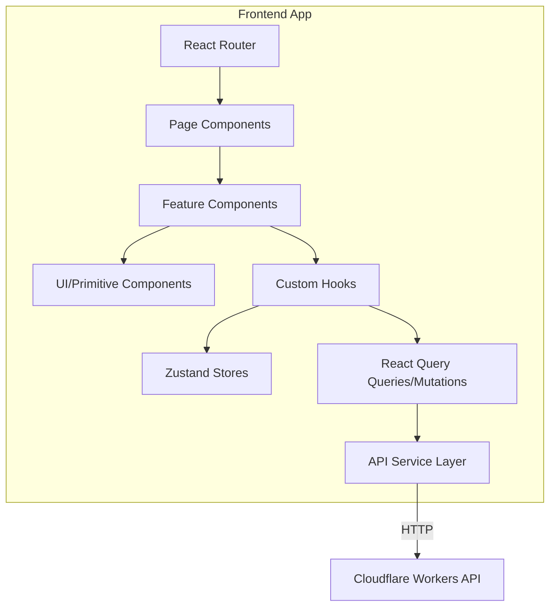

---

## Folder Structure

```
src/
├── app/                    # App-level setup (router, providers)
│   ├── App.tsx
│   ├── router.tsx
│   └── providers.tsx
├── pages/                  # Route-level page components
│   ├── Home/
│   ├── Dashboard/
│   └── Settings/
├── features/               # Feature-scoped modules
│   ├── auth/
│   │   ├── components/
│   │   ├── hooks/
│   │   ├── queries/
│   │   └── store.ts
│   └── users/
│       ├── components/
│       ├── hooks/
│       └── queries/
├── components/             # Shared/reusable UI components
│   ├── Button/
│   ├── Input/
│   └── Modal/
├── hooks/                  # Shared custom hooks
├── lib/                    # Utilities, API client, helpers
│   ├── api-client.ts
│   ├── utils.ts
│   └── validators.ts
├── stores/                 # Shared Zustand stores
├── types/                  # Global TypeScript types
└── styles/                 # Global styles, Tailwind config
```

---

## State Management Strategy

| State Type | Tool | Storage |
|---|---|---|
| Server data (API responses) | React Query | Memory + Cache |
| Auth state | Zustand + React Query | Memory |
| UI state (modals, drawers) | Zustand or useState | Memory |
| Form state | React Hook Form | Memory |
| URL/navigation state | React Router params | URL |
| Persistent preferences | Zustand + localStorage | localStorage |

See: [STATE_MANAGEMENT.md](STATE_MANAGEMENT.md)

---

## API Integration Pattern

```typescript
// lib/api-client.ts
export const apiClient = {
  async get<T>(path: string, options?: RequestInit): Promise<T> {
    const response = await fetch(`${import.meta.env.VITE_API_URL}${path}`, {
      ...options,
      headers: {
        'Content-Type': 'application/json',
        Authorization: `******
        ...options?.headers,
      },
    });
    if (!response.ok) throw await parseError(response);
    return response.json();
  },
  // post, put, patch, delete follow same pattern
};

// features/users/queries/useUsers.ts
export function useUsers() {
  return useQuery({
    queryKey: ['users'],
    queryFn: () => apiClient.get<User[]>('/v1/users'),
    staleTime: 60_000,
  });
}
```

---

## Routing Conventions

- Route paths: `/kebab-case`
- Dynamic segments: `/users/:userId`
- Protected routes wrapped in `<AuthGuard />`
- Lazy loading with `React.lazy()` for all page-level components

---

## Performance Standards

| Metric | Target |
|---|---|
| Largest Contentful Paint | < 2.5s |
| Cumulative Layout Shift | < 0.1 |
| First Input Delay | < 100ms |
| Time to Interactive | < 3.5s |
| Bundle size (initial) | < 200KB gzipped |

Optimizations:
- Code splitting at route level
- Image optimization (WebP, lazy loading)
- Tree shaking via Vite
- Asset hashing for long-term caching
- Preloading critical routes

See: [PERFORMANCE.md](PERFORMANCE.md)

---

## Accessibility Standards

- WCAG 2.1 AA compliance required
- All interactive elements keyboard-navigable
- ARIA labels on all icon-only buttons
- Sufficient color contrast (4.5:1 for normal text)
- Screen reader tested with NVDA and VoiceOver
- Focus management on modal open/close

---

## Security Considerations

- No secrets in frontend code or environment variables exposed to browser
- Content-Security-Policy headers set by Cloudflare Workers
- XSS prevention: React escapes by default; never use `dangerouslySetInnerHTML` with untrusted content
- Auth tokens: access token in memory only, refresh token in HttpOnly cookie
- API calls over HTTPS only

See: [docs/frontend/frontend-security.md](docs/frontend/frontend-security.md)

---

## Error Handling

- React Error Boundaries wrap all route-level components
- React Query `onError` callbacks for API failures
- Global toast notification for user-facing errors
- Structured error object from API: `{ error: { code, message, status } }`
- Never expose stack traces to user

See: [ERROR_HANDLING.md](ERROR_HANDLING.md)

---

## Testing Strategy

| Level | Tool | Coverage Target |
|---|---|---|
| Unit | Vitest + React Testing Library | 80%+ |
| Integration | Vitest + MSW (API mocking) | Key flows |
| E2E | Playwright | Critical paths |

See: [TESTING.md](TESTING.md)

---

## Build & Deployment

```bash
# Local development
npm run dev

# Type check
npm run typecheck

# Lint
npm run lint

# Test
npm run test

# Build for production
npm run build

# Preview production build
npm run preview
```

Deployed to Cloudflare Pages via GitHub Actions on push to `main`.

See: [DEPLOYMENT.md](DEPLOYMENT.md) | [CI_CD.md](CI_CD.md)

---

## Environment Variables

| Variable | Purpose | Required |
|---|---|---|
| `VITE_API_URL` | Backend API base URL | Yes |
| `VITE_APP_ENV` | Environment name | Yes |
| `VITE_SENTRY_DSN` | Error monitoring | Production |

See: [ENVIRONMENT_VARIABLES.md](ENVIRONMENT_VARIABLES.md)

---

## Version History

| Version | Date | Change |
|---|---|---|
| 1.0.0 | 2026-07-17 | Initial frontend documentation |

---

## Related Documents

- [BACKEND.md](BACKEND.md) — API server documentation
- [API.md](API.md) — API contract reference
- [STATE_MANAGEMENT.md](STATE_MANAGEMENT.md) — State patterns
- [COMPONENT_LIBRARY.md](COMPONENT_LIBRARY.md) — UI components
- [DESIGN_SYSTEM.md](DESIGN_SYSTEM.md) — Design tokens
- [TESTING.md](TESTING.md) — Testing strategy
- [PERFORMANCE.md](PERFORMANCE.md) — Performance budgets
- [docs/frontend/react.md](docs/frontend/react.md) — React patterns
- [docs/frontend/typescript.md](docs/frontend/typescript.md) — TypeScript standards


---

## GITHUB
<a id="github"></a>

# GITHUB.md — GitHub Governance & Configuration

> **Back to:** [INDEX.md](INDEX.md) | **Related:** [CI_CD.md](CI_CD.md) | [DEPLOYMENT.md](DEPLOYMENT.md) | [CONTRIBUTING.md](CONTRIBUTING.md)

---

## Metadata

| Field | Value |
|---|---|
| **Version** | 1.0.0 |
| **Owner** | @jelvan-ricolcol |
| **Last Updated** | 2026-07-17 |
| **Status** | Active |
| **Scope** | GitHub repository governance, workflows, and settings |

---

## Overview

This document describes all GitHub-specific configuration: branch protection, PR standards, Actions workflows, security settings, and repository governance policies.

---

## Branch Strategy

| Branch | Purpose | Protection | Who Merges |
|---|---|---|---|
| `main` | Production | ✅ Protected | Repository admin |
| `develop` | Staging integration | ✅ Protected | PR merge |
| `feature/*` | New features | ❌ | Developer |
| `fix/*` | Bug fixes | ❌ | Developer |
| `chore/*` | Maintenance | ❌ | Developer |
| `docs/*` | Documentation | ❌ | Developer |

### Branch Naming
```
feature/add-user-auth
fix/jwt-refresh-race-condition
chore/update-wrangler-version
docs/update-api-reference
```

---

## Branch Protection Rules (main & develop)

- ✅ Require pull request before merging
- ✅ Require at least 1 approving review
- ✅ Dismiss stale reviews on new push
- ✅ Require review from CODEOWNERS
- ✅ Require status checks to pass (lint, test, build)
- ✅ Require branches to be up to date
- ✅ Require conversation resolution
- ✅ Do not allow force pushes
- ✅ Do not allow deletions

---

## Pull Request Standards

### PR Title (Conventional Commits)
```
feat(auth): add OAuth Google login
fix(api): correct 401 response on expired token
docs(api): update endpoint reference
chore(deps): bump wrangler to 3.x
```

### PR Description Template
```markdown
## Summary
Brief description of what this PR does.

## Changes
- Added X
- Updated Y
- Fixed Z

## Testing
- [ ] Unit tests pass
- [ ] Integration tests pass
- [ ] Manual testing completed

## Documentation
- [ ] Relevant docs updated
- [ ] INDEX.md updated (if new doc added)
- [ ] CHANGELOG.md updated

## Checklist
- [ ] No secrets committed
- [ ] Breaking changes documented
- [ ] Tests added for new behavior
```

---

## Commit Message Standards (Conventional Commits)

Format: `type(scope): description`

```
feat(auth): add magic link authentication
fix(workers): handle D1 connection timeout
docs(api): add pagination examples
style(frontend): fix button alignment
refactor(service): extract email service
test(auth): add JWT refresh token tests
chore(ci): update GitHub Actions to Node 20
perf(query): add index on users.email
ci(deploy): add staging deployment step
revert: feat(auth): revert magic link (breaks mobile)
security(api): fix CORS misconfiguration
```

---

## CODEOWNERS

```
# .github/CODEOWNERS
# All files require review from repository owner
* @jelvan-ricolcol

# Security-sensitive paths require additional review
/SECURITY.md @jelvan-ricolcol
/.github/ @jelvan-ricolcol
/docs/security/ @jelvan-ricolcol
```

---

## GitHub Actions Workflows

See full detail: [CI_CD.md](CI_CD.md)

| Workflow | Trigger | Purpose |
|---|---|---|
| `ci.yml` | Push, PR | Lint, test, build |
| `deploy-preview.yml` | PR opened/updated | Deploy preview |
| `deploy-staging.yml` | Push to develop | Deploy staging |
| `deploy-production.yml` | Push to main | Deploy production |
| `codeql.yml` | Push, weekly | Security scanning |
| `dependabot-review.yml` | Dependabot PR | Auto-merge minor deps |

---

## Dependabot Configuration

```yaml
# .github/dependabot.yml
version: 2
updates:
  - package-ecosystem: "npm"
    directory: "/"
    schedule:
      interval: "weekly"
    groups:
      dev-dependencies:
        patterns: ["*"]
        dependency-type: "development"
  - package-ecosystem: "github-actions"
    directory: "/"
    schedule:
      interval: "monthly"
```

---

## Security Settings

- Secret scanning: **Enabled**
- Push protection: **Enabled** (blocks secrets in commits)
- Dependency review: **Enabled**
- CodeQL: **Enabled** (JavaScript/TypeScript)
- Dependabot security updates: **Enabled**

---

## Repository Secrets

| Secret | Purpose |
|---|---|
| `CLOUDFLARE_API_TOKEN` | Deploy to Cloudflare |
| `CLOUDFLARE_ACCOUNT_ID` | Cloudflare account ID |

> All other secrets are stored in Cloudflare Secrets, not GitHub.

---

## Issues & Discussions

### Issue Labels
| Label | Usage |
|---|---|
| `bug` | Confirmed defect |
| `feature` | New capability |
| `docs` | Documentation update |
| `security` | Security concern |
| `performance` | Performance issue |
| `good first issue` | Suitable for contributors |
| `blocked` | Waiting on external factor |

### Milestones
- Milestones map to minor version releases (e.g., `v1.1.0`)
- Issues assigned to milestones for tracking

---

## Releases

- Semantic versioning: `vMAJOR.MINOR.PATCH`
- Release notes auto-generated from conventional commits
- GitHub Releases created on every production deployment
- Release tags match deployed version

---

## Version History

| Version | Date | Change |
|---|---|---|
| 1.0.0 | 2026-07-17 | Initial GitHub governance documentation |

---

## Related Documents

- [CI_CD.md](CI_CD.md) — Workflow details
- [CONTRIBUTING.md](CONTRIBUTING.md) — Contribution guide
- [SECURITY.md](SECURITY.md) — Security policy
- [DEPLOYMENT.md](DEPLOYMENT.md) — Deployment procedures
- [docs/github/github-actions.md](docs/github/github-actions.md) — Actions deep dive
- [docs/github/repository-standard.md](docs/github/repository-standard.md) — Repository standards


---

## GLOSSARY
<a id="glossary"></a>

# GLOSSARY.md — Terms & Definitions

> **Back to:** [INDEX.md](INDEX.md) | **Related:** [AI_REFERENCE.md](AI_REFERENCE.md) | [DATA_DICTIONARY.md](DATA_DICTIONARY.md)

---

## Metadata

| Field | Value |
|---|---|
| **Version** | 1.0.0 |
| **Owner** | @jelvan-ricolcol |
| **Last Updated** | 2026-07-17 |
| **Status** | Active |
| **Scope** | All technical terms used across this repository |

---

## A

**Access Token** — A short-lived JWT (15-minute TTL) used to authenticate API requests. Stored in browser memory only. See [AUTHENTICATION.md](AUTHENTICATION.md).

**AI Gateway** — Cloudflare service that acts as a proxy for AI API calls (OpenAI, Anthropic, etc.) with rate limiting, caching, and logging.

**Argon2id** — Password hashing algorithm. The recommended choice per OWASP. Preferred over bcrypt.

---

## B

**Binding** — In Cloudflare Workers, a named reference to a resource (D1, R2, KV, etc.) available as `env.BINDING_NAME`.

**Branch Protection** — GitHub rule preventing direct pushes to a branch; requires PR and passing checks.

---

## C

**CUID2** — Collision-resistant Unique Identifier v2. 24-character string starting with `c`. Used as primary keys.

**Conventional Commits** — Commit message format: `type(scope): description`. See [GITHUB.md](GITHUB.md).

**CSP** — Content-Security-Policy HTTP header. Prevents XSS by restricting script sources.

**CORS** — Cross-Origin Resource Sharing. Controls which origins can call the API from a browser.

---

## D

**D1** — Cloudflare's serverless SQLite database, accessible as a Worker binding.

**Durable Object (DO)** — Cloudflare primitive for strongly-consistent stateful compute. Single-instance per name/key.

---

## E

**Edge** — Cloudflare's global network of 300+ Points of Presence. Workers execute here.

**Eventual Consistency** — Property of KV store: writes may not be immediately visible in all regions.

---

## H

**Hono** — Lightweight TypeScript web framework for Cloudflare Workers.

**HSTS** — HTTP Strict Transport Security. Forces HTTPS for all connections.

**Hyperdrive** — Cloudflare service that accelerates connections to external PostgreSQL/MySQL databases from Workers.

---

## I

**Idempotency-Key** — Request header for POST operations that ensures repeated calls with the same key return the original result.

**Isolate** — V8 JavaScript isolate. Cloudflare Workers run in isolates, not full Node.js processes.

---

## J

**JWT** — JSON Web Token. Compact, URL-safe token format for authentication claims. See [AUTHENTICATION.md](AUTHENTICATION.md).

---

## K

**KV** — Cloudflare Key-Value store. Global, eventually-consistent, low-latency key-value storage.

---

## M

**Miniflare** — Local Cloudflare Workers emulator for development and testing.

**MFA** — Multi-Factor Authentication. Requires a second verification method beyond password.

---

## O

**OAuth 2.0** — Authorization framework for third-party login (Google, GitHub). See [AUTHENTICATION.md](AUTHENTICATION.md).

**OIDC** — OpenID Connect. Identity layer on top of OAuth 2.0; provides ID tokens with user claims.

**OWASP Top 10** — List of the most critical web application security risks. See [SECURITY.md](SECURITY.md).

---

## P

**Pages** — Cloudflare Pages. Static site hosting with global CDN and optional Workers integration.

**PKCE** — Proof Key for Code Exchange. OAuth 2.0 extension for public clients (SPAs, mobile apps).

---

## R

**R2** — Cloudflare's S3-compatible object storage service. Zero egress fees.

**RBAC** — Role-Based Access Control. Access permissions assigned by role. See [AUTHORIZATION.md](AUTHORIZATION.md).

**Refresh Token** — Long-lived (7-day), opaque token used to obtain new access tokens. Stored in HttpOnly cookie.

---

## S

**SameSite** — Cookie attribute controlling cross-site request behavior. `Strict` = only same-site requests.

**Soft Delete** — Setting `deleted_at` timestamp instead of removing a database row. Enables audit trail and recovery.

**SQLite** — Embedded SQL database engine. Cloudflare D1 is SQLite-compatible.

---

## T

**TOTP** — Time-based One-Time Password. Algorithm for 2FA via authenticator apps (RFC 6238).

**Turnstile** — Cloudflare's CAPTCHA-free bot protection challenge system.

---

## V

**V8** — Google's JavaScript engine. Cloudflare Workers run V8 isolates, not Node.js.

**Vitest** — Vite-native unit testing framework compatible with Cloudflare Workers via Miniflare.

---

## W

**Worker** — A Cloudflare Workers script. Stateless request handler running in V8 at the edge.

**Wrangler** — Cloudflare's CLI for developing and deploying Workers, Pages, D1, R2, and KV.

---

## Z

**Zod** — TypeScript-first schema validation library. Used for all input validation at API boundaries.

---

## Version History

| Version | Date | Change |
|---|---|---|
| 1.0.0 | 2026-07-17 | Comprehensive glossary |

---

## Related Documents

- [AI_REFERENCE.md](AI_REFERENCE.md) — Quick AI reference
- [DATA_DICTIONARY.md](DATA_DICTIONARY.md) — Data field definitions
- [INDEX.md](INDEX.md) — Documentation map

## Documentation template for contributors

- **Decision:** What implementation choice was made?
- **Source:** Which official document backs the choice?
- **Reason:** Why is it appropriate for this project?
- **Risk:** What breaks if the assumption changes?
- **Validation:** Which test, command, or review proves it works?

## Verified sources

- Docker Docs — https://docs.docker.com/
- Kubernetes Docs — https://kubernetes.io/docs/
- OpenTelemetry Docs — https://opentelemetry.io/docs/
- Prometheus Docs — https://prometheus.io/docs/
- The Twelve-Factor App — https://12factor.net/


---

## INDEX
<a id="index"></a>

# INDEX.md — Documentation Map

> **Navigation entry point for humans and AI assistants.**
> Every document in this repository is indexed here. No document may exist without being listed.

---

## Metadata

| Field | Value |
|---|---|
| **Version** | 1.0.0 |
| **Owner** | @jelvan-ricolcol |
| **Last Updated** | 2026-07-17 |
| **Status** | Active |
| **Scope** | Entire repository |

---

## Purpose

This INDEX.md serves as the single source of truth for all documentation in this repository. It enables:

- **AI assistants** to quickly locate relevant context, trace dependencies, and make accurate implementation decisions.
- **Human developers** to navigate the knowledge base without searching.
- **Automated tooling** to validate documentation completeness and cross-reference integrity.

---

## Quick Navigation

| Category | Document | Purpose |
|---|---|---|
| 🏠 Root | [README.md](README.md) | Repository overview and onboarding |
| 📚 Unified | [fullstack-jel.md](fullstack-jel.md) | Complete concatenated documentation in one file |
| 🗺️ Navigation | **INDEX.md** *(this file)* | Documentation map |
| 🏛️ Architecture | [ARCHITECTURE.md](ARCHITECTURE.md) | System architecture overview |
| 🏗️ System Design | [SYSTEM_DESIGN.md](SYSTEM_DESIGN.md) | Detailed system design decisions |
| 🎨 Frontend | [FRONTEND.md](FRONTEND.md) | Frontend architecture and patterns |
| ⚙️ Backend | [BACKEND.md](BACKEND.md) | Backend architecture and patterns |
| 🔌 API | [API.md](API.md) | API contracts, standards, versioning |
| 🗄️ Database | [DATABASE.md](DATABASE.md) | Database schema, migrations, query patterns |
| 🔐 Authentication | [AUTHENTICATION.md](AUTHENTICATION.md) | Auth flows, JWT, OAuth, sessions |
| 🛡️ Authorization | [AUTHORIZATION.md](AUTHORIZATION.md) | RBAC, permissions, access control |
| 🔑 Env Variables | [ENVIRONMENT_VARIABLES.md](ENVIRONMENT_VARIABLES.md) | All environment variables documented |
| 🚀 Deployment | [DEPLOYMENT.md](DEPLOYMENT.md) | Deployment procedures and runbooks |
| 🖼️ UI Resources | [UI_RESOURCES.md](UI_RESOURCES.md) | UI assets, probing, email HTML, and delivery guidance |
| ☁️ Cloudflare | [CLOUDFLARE.md](CLOUDFLARE.md) | Cloudflare services and configuration |
| 🐙 GitHub | [GITHUB.md](GITHUB.md) | GitHub workflows, branch rules, governance |
| 🔄 CI/CD | [CI_CD.md](CI_CD.md) | CI/CD pipeline documentation |
| 🔒 Security | [SECURITY.md](SECURITY.md) | Security policy and practices |
| ⚡ Performance | [PERFORMANCE.md](PERFORMANCE.md) | Performance budgets and optimization |
| 📊 Monitoring | [MONITORING.md](MONITORING.md) | Monitoring setup and alerts |
| 🔭 Observability | [OBSERVABILITY.md](OBSERVABILITY.md) | Logs, metrics, traces |
| 🧪 Testing | [TESTING.md](TESTING.md) | Testing strategy and standards |
| 🚨 Error Handling | [ERROR_HANDLING.md](ERROR_HANDLING.md) | Error patterns and response contracts |
| 📦 State Management | [STATE_MANAGEMENT.md](STATE_MANAGEMENT.md) | Client and server state patterns |
| 🧩 Component Library | [COMPONENT_LIBRARY.md](COMPONENT_LIBRARY.md) | UI component system |
| 🎨 Design System | [DESIGN_SYSTEM.md](DESIGN_SYSTEM.md) | Design tokens, typography, colors |
| 💾 Storage | [STORAGE.md](STORAGE.md) | File storage, object storage, CDN |
| 📁 File Structure | [FILE_STRUCTURE.md](FILE_STRUCTURE.md) | Repository and project file layout |
| 📏 Coding Standards | [CODING_STANDARDS.md](CODING_STANDARDS.md) | Code style, conventions, linting |
| 🛠️ Troubleshooting | [TROUBLESHOOTING.md](TROUBLESHOOTING.md) | Common issues and resolutions |
| 🤖 AI Policy | [AI_POLICY.md](AI_POLICY.md) | AI assistant usage and governance |
| 🧠 AI Context | [AI_CONTEXT.md](AI_CONTEXT.md) | Persistent AI context and project state |
| 📚 AI Reference | [AI_REFERENCE.md](AI_REFERENCE.md) | AI-optimized quick reference |
| 🗂️ Feature Registry | [FEATURE_REGISTRY.md](FEATURE_REGISTRY.md) | All features tracked and documented |
| 🔧 Service Registry | [SERVICE_REGISTRY.md](SERVICE_REGISTRY.md) | All services and their contracts |
| 📖 Data Dictionary | [DATA_DICTIONARY.md](DATA_DICTIONARY.md) | Canonical data model definitions |
| ⚠️ Known Limitations | [KNOWN_LIMITATIONS.md](KNOWN_LIMITATIONS.md) | Known issues and platform constraints |
| 📋 Roadmap | [ROADMAP.md](ROADMAP.md) | Future development plans |
| 📝 Changelog | [CHANGELOG.md](CHANGELOG.md) | Version history |
| 🤝 Contributing | [CONTRIBUTING.md](CONTRIBUTING.md) | Contribution guidelines |
| 📐 Style Guide | [STYLE_GUIDE.md](STYLE_GUIDE.md) | Documentation style guide |
| 📖 Glossary | [GLOSSARY.md](GLOSSARY.md) | Terms and definitions |
| ⚖️ Code of Conduct | [CODE_OF_CONDUCT.md](CODE_OF_CONDUCT.md) | Community standards |

---

## Docs Subdirectory Index

### Architecture
| File | Purpose |
|---|---|
| [docs/architecture/system-design.md](docs/architecture/system-design.md) | System design patterns |
| [docs/architecture/microservices.md](docs/architecture/microservices.md) | Microservices patterns |
| [docs/architecture/monolith-vs-microservices.md](docs/architecture/monolith-vs-microservices.md) | Architecture comparison |
| [docs/architecture/scalable-architecture.md](docs/architecture/scalable-architecture.md) | Scalability patterns |
| [docs/architecture/diagrams.md](docs/architecture/diagrams.md) | Architecture diagrams |

### API
| File | Purpose |
|---|---|
| [docs/api/api-standards.md](docs/api/api-standards.md) | API design standards |
| [docs/api/authentication.md](docs/api/authentication.md) | API authentication |
| [docs/api/documentation.md](docs/api/documentation.md) | API documentation guidelines |
| [docs/api/versioning.md](docs/api/versioning.md) | API versioning strategy |

### Authentication & Authorization
| File | Purpose |
|---|---|
| [docs/authentication/oauth.md](docs/authentication/oauth.md) | OAuth 2.0 / OIDC |
| [docs/authentication/jwt.md](docs/authentication/jwt.md) | JWT tokens |
| [docs/authentication/mfa.md](docs/authentication/mfa.md) | Multi-factor authentication |
| [docs/authentication/sessions.md](docs/authentication/sessions.md) | Session management |
| [docs/authorization/rbac.md](docs/authorization/rbac.md) | Role-based access control |
| [docs/authorization/permissions.md](docs/authorization/permissions.md) | Permissions model |
| [docs/authorization/access-control.md](docs/authorization/access-control.md) | Access control policies |

### Backend
| File | Purpose |
|---|---|
| [docs/backend/api-design.md](docs/backend/api-design.md) | Backend API design |
| [docs/backend/rest-api.md](docs/backend/rest-api.md) | REST API patterns |
| [docs/backend/graphql.md](docs/backend/graphql.md) | GraphQL patterns |
| [docs/backend/serverless.md](docs/backend/serverless.md) | Serverless patterns |
| [docs/backend/workers-backend.md](docs/backend/workers-backend.md) | Cloudflare Workers backend |
| [docs/backend/backend-patterns.md](docs/backend/backend-patterns.md) | General backend patterns |

### Cloudflare
| File | Purpose |
|---|---|
| [docs/cloudflare/workers.md](docs/cloudflare/workers.md) | Cloudflare Workers |
| [docs/cloudflare/d1.md](docs/cloudflare/d1.md) | D1 SQLite database |
| [docs/cloudflare/r2.md](docs/cloudflare/r2.md) | R2 object storage |
| [docs/cloudflare/kv.md](docs/cloudflare/kv.md) | KV store |
| [docs/cloudflare/durable-objects.md](docs/cloudflare/durable-objects.md) | Durable Objects |
| [docs/cloudflare/queues.md](docs/cloudflare/queues.md) | Cloudflare Queues |
| [docs/cloudflare/deployment.md](docs/cloudflare/deployment.md) | Cloudflare deployment |

### Database
| File | Purpose |
|---|---|
| [docs/database/sql.md](docs/database/sql.md) | SQL patterns and best practices |
| [docs/database/nosql.md](docs/database/nosql.md) | NoSQL patterns |
| [docs/database/migrations.md](docs/database/migrations.md) | Database migration patterns |
| [docs/database/optimization.md](docs/database/optimization.md) | Query optimization |

### Frontend
| File | Purpose |
|---|---|
| [docs/frontend/html-css.md](docs/frontend/html-css.md) | HTML & CSS standards |
| [docs/frontend/javascript.md](docs/frontend/javascript.md) | JavaScript standards |
| [docs/frontend/typescript.md](docs/frontend/typescript.md) | TypeScript standards |
| [docs/frontend/react.md](docs/frontend/react.md) | React patterns |
| [docs/frontend/state-management.md](docs/frontend/state-management.md) | Frontend state management |
| [docs/frontend/flutter-web.md](docs/frontend/flutter-web.md) | Flutter Web |
| [docs/frontend/frontend-security.md](docs/frontend/frontend-security.md) | Frontend security |

### GitHub
| File | Purpose |
|---|---|
| [docs/github/github-actions.md](docs/github/github-actions.md) | GitHub Actions workflows |
| [docs/github/ci-cd.md](docs/github/ci-cd.md) | CI/CD pipeline |
| [docs/github/repository-standard.md](docs/github/repository-standard.md) | Repository standards |
| [docs/github/security.md](docs/github/security.md) | GitHub security settings |

### Security
| File | Purpose |
|---|---|
| [docs/security/owasp.md](docs/security/owasp.md) | OWASP Top 10 |
| [docs/security/encryption.md](docs/security/encryption.md) | Encryption standards |
| [docs/security/secrets.md](docs/security/secrets.md) | Secrets management |
| [docs/security/vulnerability-management.md](docs/security/vulnerability-management.md) | Vulnerability management |

### Operations
| File | Purpose |
|---|---|
| [docs/observability/README.md](docs/observability/README.md) | Observability overview |
| [docs/monitoring/README.md](docs/monitoring/README.md) | Monitoring overview |
| [docs/logging/README.md](docs/logging/README.md) | Logging standards |
| [docs/performance/README.md](docs/performance/README.md) | Performance standards |
| [docs/testing/README.md](docs/testing/README.md) | Testing overview |
| [docs/troubleshooting/README.md](docs/troubleshooting/README.md) | Troubleshooting guide |
| [docs/deployment/README.md](docs/deployment/README.md) | Deployment overview |

### Infrastructure
| File | Purpose |
|---|---|
| [docs/aws/cloud-services.md](docs/aws/cloud-services.md) | AWS cloud services |
| [docs/aws/lambda.md](docs/aws/lambda.md) | AWS Lambda |
| [docs/aws/s3.md](docs/aws/s3.md) | AWS S3 |
| [docs/aws/ses.md](docs/aws/ses.md) | AWS SES |
| [docs/docker/README.md](docs/docker/README.md) | Docker setup |
| [docs/kubernetes/README.md](docs/kubernetes/README.md) | Kubernetes setup |

### Other
| File | Purpose |
|---|---|
| [docs/realtime/websocket.md](docs/realtime/websocket.md) | WebSocket patterns |
| [docs/realtime/cloudflare-durable-object-realtime.md](docs/realtime/cloudflare-durable-object-realtime.md) | Realtime with Durable Objects |
| [docs/realtime/messaging-platform.md](docs/realtime/messaging-platform.md) | Messaging platform |
| [docs/accessibility/README.md](docs/accessibility/README.md) | Accessibility standards |
| [docs/caching/README.md](docs/caching/README.md) | Caching strategies |
| [docs/storage/README.md](docs/storage/README.md) | Storage patterns |
| [docs/ui-ux/README.md](docs/ui-ux/README.md) | UI/UX guidelines |
| [docs/seo/README.md](docs/seo/README.md) | SEO guidelines |
| [docs/integrations/README.md](docs/integrations/README.md) | Third-party integrations |
| [docs/standards/README.md](docs/standards/README.md) | Coding standards |
| [docs/prompts/README.md](docs/prompts/README.md) | AI prompt library |
| [docs/references/README.md](docs/references/README.md) | External references |
| [docs/queues/README.md](docs/queues/README.md) | Queue patterns |

---

## Document Dependency Graph

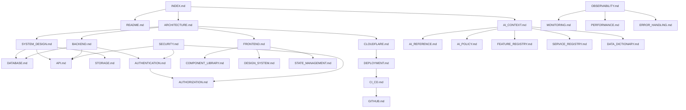

---

## Implementation Status

| Document | Status | Last Updated | Version |
|---|---|---|---|
| INDEX.md | ✅ Complete | 2026-07-17 | 1.0.0 |
| README.md | ✅ Complete | 2026-07-17 | 1.0.0 |
| ARCHITECTURE.md | ✅ Complete | 2026-07-17 | 1.0.0 |
| SYSTEM_DESIGN.md | ✅ Complete | 2026-07-17 | 1.0.0 |
| FRONTEND.md | ✅ Complete | 2026-07-17 | 1.0.0 |
| BACKEND.md | ✅ Complete | 2026-07-17 | 1.0.0 |
| API.md | ✅ Complete | 2026-07-17 | 1.0.0 |
| DATABASE.md | ✅ Complete | 2026-07-17 | 1.0.0 |
| AUTHENTICATION.md | ✅ Complete | 2026-07-17 | 1.0.0 |
| AUTHORIZATION.md | ✅ Complete | 2026-07-17 | 1.0.0 |
| ENVIRONMENT_VARIABLES.md | ✅ Complete | 2026-07-17 | 1.0.0 |
| DEPLOYMENT.md | ✅ Complete | 2026-07-17 | 1.0.0 |
| CLOUDFLARE.md | ✅ Complete | 2026-07-17 | 1.0.0 |
| GITHUB.md | ✅ Complete | 2026-07-17 | 1.0.0 |
| CI_CD.md | ✅ Complete | 2026-07-17 | 1.0.0 |
| SECURITY.md | ✅ Complete | 2026-07-17 | 1.0.0 |
| PERFORMANCE.md | ✅ Complete | 2026-07-17 | 1.0.0 |
| MONITORING.md | ✅ Complete | 2026-07-17 | 1.0.0 |
| OBSERVABILITY.md | ✅ Complete | 2026-07-17 | 1.0.0 |
| TESTING.md | ✅ Complete | 2026-07-17 | 1.0.0 |
| ERROR_HANDLING.md | ✅ Complete | 2026-07-17 | 1.0.0 |
| STATE_MANAGEMENT.md | ✅ Complete | 2026-07-17 | 1.0.0 |
| COMPONENT_LIBRARY.md | ✅ Complete | 2026-07-17 | 1.0.0 |
| DESIGN_SYSTEM.md | ✅ Complete | 2026-07-17 | 1.0.0 |
| STORAGE.md | ✅ Complete | 2026-07-17 | 1.0.0 |
| FILE_STRUCTURE.md | ✅ Complete | 2026-07-17 | 1.0.0 |
| CODING_STANDARDS.md | ✅ Complete | 2026-07-17 | 1.0.0 |
| TROUBLESHOOTING.md | ✅ Complete | 2026-07-17 | 1.0.0 |
| AI_POLICY.md | ✅ Complete | 2026-07-17 | 1.0.0 |
| AI_CONTEXT.md | ✅ Complete | 2026-07-17 | 1.0.0 |
| AI_REFERENCE.md | ✅ Complete | 2026-07-17 | 1.0.0 |
| FEATURE_REGISTRY.md | ✅ Complete | 2026-07-17 | 1.0.0 |
| SERVICE_REGISTRY.md | ✅ Complete | 2026-07-17 | 1.0.0 |
| DATA_DICTIONARY.md | ✅ Complete | 2026-07-17 | 1.0.0 |
| ROADMAP.md | ✅ Complete | 2026-07-17 | 1.0.0 |
| KNOWN_LIMITATIONS.md | ✅ Complete | 2026-07-17 | 1.0.0 |
| CHANGELOG.md | ✅ Complete | 2026-07-17 | 1.0.0 |
| CONTRIBUTING.md | ✅ Complete | 2026-07-17 | 1.0.0 |
| STYLE_GUIDE.md | ✅ Complete | 2026-07-17 | 1.0.0 |
| GLOSSARY.md | ✅ Complete | 2026-07-17 | 1.0.0 |

---

## How to Use This Index

### For AI Assistants
- Start here to locate the correct document for any query.
- Use the dependency graph to understand which documents are related.
- Each document contains a "Related Documents" section with direct links.
- Prefer documents with `✅ Complete` status for authoritative answers.

### For Developers
- Use Quick Navigation for direct links.
- Use the Docs Subdirectory Index for deep-dive topics.
- All documents follow the same structure defined in [STYLE_GUIDE.md](STYLE_GUIDE.md).

### For Onboarding
1. Start with [README.md](README.md)
2. Read [ARCHITECTURE.md](ARCHITECTURE.md)
3. Read [AI_CONTEXT.md](AI_CONTEXT.md) for project state
4. Read your domain-specific document (FRONTEND.md, BACKEND.md, etc.)

---

## Related Documents

- [README.md](README.md) — Repository overview
- [AI_CONTEXT.md](AI_CONTEXT.md) — AI-optimized project context
- [STYLE_GUIDE.md](STYLE_GUIDE.md) — Documentation authoring standards
- [CONTRIBUTING.md](CONTRIBUTING.md) — How to add or update documentation


---

## KNOWN_LIMITATIONS
<a id="known-limitations"></a>

# KNOWN_LIMITATIONS.md — Known Limitations & Constraints

> **Back to:** [INDEX.md](INDEX.md) | **Related:** [TROUBLESHOOTING.md](TROUBLESHOOTING.md) | [ROADMAP.md](ROADMAP.md) | [CLOUDFLARE.md](CLOUDFLARE.md)

---

## Metadata

| Field | Value |
|---|---|
| **Version** | 1.0.0 |
| **Owner** | @jelvan-ricolcol |
| **Last Updated** | 2026-07-17 |
| **Status** | Active |
| **Scope** | All known platform limitations, constraints, and workarounds |

---

## Overview

This document catalogs known platform limitations, architectural constraints, and accepted trade-offs. AI assistants and developers must consult this before proposing solutions that may hit these boundaries.

---

## Cloudflare Workers

| Limitation | Value | Impact | Workaround |
|---|---|---|---|
| CPU time (free tier) | 10ms/request | Limits heavy computation | Move to paid plan or offload to queues |
| CPU time (paid tier) | 30s/request | Very long jobs can't run in-request | Use Queues for long async tasks |
| Memory per isolate | 128MB | Large in-memory data structures | Use R2/KV for large data |
| Request body size | 100MB | Large file uploads hit limit | Use multipart + stream to R2 |
| Subrequest limit | 50 per request | Many API fan-outs fail | Batch or chain via Queue |
| No `fs` module | N/A | Can't use Node.js file system APIs | Use R2 for file storage |
| No `process.env` | N/A | Environment access is different | Use `env` bindings from Worker entry |
| No TCP connections (free) | N/A | Can't connect to external DBs directly | Use Hyperdrive for PostgreSQL |
| Cold starts | ~0ms (V8 reuse) | Generally not an issue | N/A |

---

## Cloudflare D1 (SQLite)

| Limitation | Value | Impact | Workaround |
|---|---|---|---|
| Database size | 2GB | Large datasets require migration | Shard or migrate to PostgreSQL via Hyperdrive |
| Single writer | Yes | High write throughput will queue | Use queues; migrate to PostgreSQL |
| No stored procedures | N/A | Business logic must be in app layer | OK — preferred pattern |
| No full-text search (built-in) | N/A | Search features limited | FTS5 available; or use external search |
| No `RETURNING` clause (older) | N/A | Must re-fetch after insert | Use `last_insert_rowid()` or re-query |
| Eventual read consistency | Yes (reads) | Reads may be slightly stale | Cache critical reads in KV |
| Limited JSON functions | Partial | Complex JSON queries limited | Process in application layer |

---

## Cloudflare KV

| Limitation | Value | Impact | Workaround |
|---|---|---|---|
| Eventual consistency | Yes | Writes take ~60s globally | Not suitable for counters or locks |
| Max value size | 25MB | Large blobs can't be stored | Use R2 for objects |
| Max key size | 512 bytes | Very long keys need hashing | Hash long keys with SHA-256 |
| No transactions | N/A | Can't atomically update multiple keys | Use D1 for transactional state |
| List performance | Slow on large sets | Listing many keys is expensive | Use D1 for queryable sets |

---

## Cloudflare Durable Objects

| Limitation | Value | Impact | Workaround |
|---|---|---|---|
| Single-region by default | Yes | Latency for geographically distant users | Use regional hints; accept latency |
| Storage limit per DO | 128KB (metadata) / unlimited (SQL) | Large state needs careful design | Use D1 or R2 for large state |
| No cross-DO transactions | N/A | Coordinating across DOs is complex | Design for independent DOs |
| Billing per request | Yes | Many short connections expensive | Batch operations where possible |

---

## Cloudflare Queues

| Limitation | Value | Impact | Workaround |
|---|---|---|---|
| Max message size | 128KB | Large payloads can't be queued | Store payload in R2, queue reference key |
| Max batch size | 100 messages | Large batches need splitting | Process in sub-batches |
| Delivery guarantee | At-least-once | Duplicate processing possible | Make consumers idempotent |
| No DLQ (dead-letter queue) | Yes (no native) | Failed messages may be lost after retries | Log failures; implement manual DLQ in D1 |

---

## Architectural Constraints

| Constraint | Detail | Impact |
|---|---|---|
| JWT-only auth | No opaque server-side sessions (stateless) | Token revocation requires KV blacklist |
| SQLite in production | D1 is SQLite, not PostgreSQL | Limited query features; must plan migration path |
| No server-side rendering | Pages + Workers SPA model | SEO requires extra effort (prerendering) |
| CORS restrictions | Browser enforces CORS | All cross-origin requests need proper headers |
| No WebSocket keep-alive (free) | Workers free tier | Long-lived WebSocket requires paid plan or Durable Objects |

---

## Browser / Platform Compatibility

| Feature | Limitation |
|---|---|
| Web Crypto API | Available in all modern browsers + Workers; not Node.js compatible |
| Fetch API | Available; Workers use `fetch` differently from browsers |
| Streams API | Available in Workers; use for large R2 responses |
| WebSocket | Available in Workers via Durable Objects |
| Service Workers | Frontend only; separate from Cloudflare Workers |

---

## Version History

| Version | Date | Change |
|---|---|---|
| 1.0.0 | 2026-07-17 | Initial known limitations documentation |

---

## Related Documents

- [TROUBLESHOOTING.md](TROUBLESHOOTING.md) — Resolution steps for issues
- [CLOUDFLARE.md](CLOUDFLARE.md) — Cloudflare services
- [SYSTEM_DESIGN.md](SYSTEM_DESIGN.md) — Design decisions accounting for limitations
- [ROADMAP.md](ROADMAP.md) — Planned mitigations


---

## MONITORING
<a id="monitoring"></a>

# MONITORING.md — Monitoring & Alerting

> **Back to:** [INDEX.md](INDEX.md) | **Related:** [OBSERVABILITY.md](OBSERVABILITY.md) | [PERFORMANCE.md](PERFORMANCE.md) | [CLOUDFLARE.md](CLOUDFLARE.md)

---

## Metadata

| Field | Value |
|---|---|
| **Version** | 1.0.0 |
| **Owner** | @jelvan-ricolcol |
| **Last Updated** | 2026-07-17 |
| **Status** | Active |
| **Scope** | All monitoring, alerting, and operational visibility |

---

## Overview

Monitoring provides visibility into system health, performance, and errors. It enables proactive identification of issues before they impact users.

---

## Monitoring Stack

| Tool | Purpose | Tier |
|---|---|---|
| Cloudflare Analytics | Worker metrics, CDN analytics | Free (built-in) |
| Cloudflare Logpush | Ship Worker logs to external system | Paid |
| Sentry | Error tracking and alerting | Recommended |
| Uptime Robot / BetterUptime | Endpoint uptime monitoring | Recommended |
| Datadog / Grafana Cloud | Advanced metrics dashboard | Optional |

---

## Key Metrics to Monitor

### Availability
| Metric | Target | Alert |
|---|---|---|
| API uptime | 99.9% | < 99.5% |
| Error rate (5xx) | < 0.1% | > 1% |
| Health check response | < 500ms | No response |

### Performance
| Metric | Target | Alert |
|---|---|---|
| p50 API latency | < 50ms | > 150ms |
| p99 API latency | < 300ms | > 500ms |
| Worker CPU p99 | < 10ms | > 25ms |
| D1 query time p95 | < 20ms | > 100ms |

### Business Metrics
| Metric | Purpose |
|---|---|
| Active sessions | User engagement |
| API request volume | Traffic trends |
| Auth failures | Security indicator |
| Error codes frequency | Health indicator |

---

## Cloudflare Analytics

Available in Cloudflare Dashboard → Workers & Pages → Analytics:
- Request count per Worker
- CPU time distribution
- Error rate
- Geographic distribution

```bash
# Live log streaming
wrangler tail --env production

# Filter by status
wrangler tail --env production --status error
```

---

## Error Tracking (Sentry)

```typescript
// Worker initialization with Sentry
import * as Sentry from '@sentry/cloudflare';

export default Sentry.withSentry(
  (env: Env) => ({
    dsn: env.SENTRY_DSN,
    tracesSampleRate: 0.1,
    environment: env.ENVIRONMENT,
  }),
  {
    async fetch(request, env, ctx) {
      return app.fetch(request, env, ctx);
    },
  }
);
```

---

## Health Check Endpoints

```typescript
// GET /health
app.get('/health', (c) => {
  return c.json({
    status: 'ok',
    version: '1.0.0',
    timestamp: new Date().toISOString(),
  });
});

// GET /health/db
app.get('/health/db', async (c) => {
  try {
    await c.env.DB.prepare('SELECT 1').first();
    return c.json({ status: 'ok', database: 'connected' });
  } catch {
    return c.json({ status: 'error', database: 'disconnected' }, 503);
  }
});
```

---

## Alerting Rules

| Alert | Condition | Channel | Severity |
|---|---|---|---|
| API down | Health check fails 3 times | Email + SMS | Critical |
| High error rate | 5xx > 1% over 5 minutes | Email | High |
| Slow API | p99 > 500ms over 10 minutes | Email | Medium |
| Auth failure spike | > 100 failures/minute | Email | High |
| D1 storage > 80% | D1 size approaching limit | Email | Medium |

---

## Incident Response

1. **Detect:** Alert fires via monitoring tool
2. **Triage:** Check Cloudflare Analytics + Sentry for root cause
3. **Communicate:** Post status update to status page
4. **Mitigate:** Rollback or hotfix
5. **Resolve:** Verify metrics return to normal
6. **Post-mortem:** Document in [TROUBLESHOOTING.md](TROUBLESHOOTING.md)

---

## Version History

| Version | Date | Change |
|---|---|---|
| 1.0.0 | 2026-07-17 | Initial monitoring documentation |

---

## Related Documents

- [OBSERVABILITY.md](OBSERVABILITY.md) — Distributed tracing and logs
- [PERFORMANCE.md](PERFORMANCE.md) — Performance budgets
- [TROUBLESHOOTING.md](TROUBLESHOOTING.md) — Issue resolution
- [CLOUDFLARE.md](CLOUDFLARE.md) — Cloudflare analytics
- [docs/monitoring/README.md](docs/monitoring/README.md) — Monitoring deep dive


---

## OBSERVABILITY
<a id="observability"></a>

# OBSERVABILITY.md — Observability: Logs, Metrics & Traces

> **Back to:** [INDEX.md](INDEX.md) | **Related:** [MONITORING.md](MONITORING.md) | [PERFORMANCE.md](PERFORMANCE.md) | [ERROR_HANDLING.md](ERROR_HANDLING.md)

---

## Metadata

| Field | Value |
|---|---|
| **Version** | 1.0.0 |
| **Owner** | @jelvan-ricolcol |
| **Last Updated** | 2026-07-17 |
| **Status** | Active |
| **Scope** | Logging, metrics, and distributed tracing |

---

## Three Pillars of Observability

| Pillar | Tool | Purpose |
|---|---|---|
| **Logs** | `wrangler tail` + Logpush + Sentry | Event records, errors, audit trail |
| **Metrics** | Cloudflare Analytics + Custom | Performance indicators, counters |
| **Traces** | Cloudflare Trace + Sentry Traces | Request lifecycle, bottleneck identification |

---

## Structured Logging

All log output is structured JSON for machine readability.

```typescript
// lib/logger.ts
export interface LogEntry {
  level: 'debug' | 'info' | 'warn' | 'error';
  message: string;
  requestId?: string;
  userId?: string;
  method?: string;
  path?: string;
  status?: number;
  durationMs?: number;
  error?: {
    code: string;
    message: string;
    stack?: string;
  };
  [key: string]: unknown;
}

export function log(entry: LogEntry): void {
  console.log(JSON.stringify({
    timestamp: new Date().toISOString(),
    ...entry,
  }));
}
```

---

## Log Levels

| Level | When to Use |
|---|---|
| `debug` | Detailed diagnostic info (disabled in production) |
| `info` | Normal operations (requests, completions) |
| `warn` | Unexpected but handled situations |
| `error` | Failures requiring attention |

---

## Request Logging Middleware

```typescript
export async function requestLogger(
  request: Request,
  handler: () => Promise<Response>
): Promise<Response> {
  const start = Date.now();
  const requestId = crypto.randomUUID();

  const response = await handler();

  log({
    level: response.status >= 500 ? 'error' : 'info',
    message: 'Request completed',
    requestId,
    method: request.method,
    path: new URL(request.url).pathname,
    status: response.status,
    durationMs: Date.now() - start,
  });

  return response;
}
```

---

## Log Fields Reference

| Field | Type | Description |
|---|---|---|
| `timestamp` | ISO 8601 | When the log was emitted |
| `level` | enum | Log severity |
| `message` | string | Human-readable description |
| `requestId` | string | Unique per-request ID |
| `userId` | string | Authenticated user (if known) |
| `method` | string | HTTP method |
| `path` | string | Request URL path |
| `status` | number | HTTP response status |
| `durationMs` | number | Request processing time |
| `error.code` | string | Error type code |
| `error.message` | string | Error description |
| `cfRay` | string | Cloudflare Ray ID |
| `cfCountry` | string | Request origin country |

---

## Metrics

Metrics collected via Cloudflare Analytics + custom counters:

| Metric | Type | Description |
|---|---|---|
| `request_count` | Counter | Total API requests |
| `error_count` | Counter | Total errors by type |
| `auth_failure_count` | Counter | Failed authentication attempts |
| `request_duration_ms` | Histogram | Request latency distribution |
| `db_query_duration_ms` | Histogram | D1 query latency |
| `kv_hit_ratio` | Gauge | KV cache hit percentage |

---

## Distributed Tracing

For multi-step request flows, attach a trace ID:

```typescript
// Attach X-Request-Id to all responses
const requestId = request.headers.get('X-Request-Id') ?? crypto.randomUUID();
response.headers.set('X-Request-Id', requestId);
```

Use Sentry traces for performance profiling:
```typescript
const transaction = Sentry.startTransaction({ name: 'API Request', op: 'http' });
const span = transaction.startChild({ op: 'db.query', description: 'fetch user' });
// ... DB query
span.finish();
transaction.finish();
```

---

## Audit Logs

All security-relevant actions logged to D1 `audit_logs` table:
- User login / logout
- Failed authentication
- Permission denied
- Admin actions (create/update/delete users)
- Data exports

Query audit logs:
```sql
SELECT * FROM audit_logs
WHERE user_id = '?'
ORDER BY created_at DESC
LIMIT 50;
```

See: [DATABASE.md](DATABASE.md)

---

## Log Retention

| Environment | Retention | Storage |
|---|---|---|
| Production | 90 days | Logpush → R2 or external |
| Staging | 30 days | Logpush → R2 |
| Local | Session only | Console |

---

## Version History

| Version | Date | Change |
|---|---|---|
| 1.0.0 | 2026-07-17 | Initial observability documentation |

---

## Related Documents

- [MONITORING.md](MONITORING.md) — Alerting and dashboards
- [PERFORMANCE.md](PERFORMANCE.md) — Performance targets
- [ERROR_HANDLING.md](ERROR_HANDLING.md) — Error response patterns
- [SECURITY.md](SECURITY.md) — Security audit logging
- [docs/observability/README.md](docs/observability/README.md) — Observability deep dive


---

## PERFORMANCE
<a id="performance"></a>

# PERFORMANCE.md — Performance Standards & Optimization

> **Back to:** [INDEX.md](INDEX.md) | **Related:** [MONITORING.md](MONITORING.md) | [OBSERVABILITY.md](OBSERVABILITY.md) | [CLOUDFLARE.md](CLOUDFLARE.md)

---

## Metadata

| Field | Value |
|---|---|
| **Version** | 1.0.0 |
| **Owner** | @jelvan-ricolcol |
| **Last Updated** | 2026-07-17 |
| **Status** | Active |
| **Scope** | Frontend and backend performance budgets, patterns, and monitoring |

---

## Performance Budgets

### Core Web Vitals (Frontend)

| Metric | Good | Needs Improvement | Poor |
|---|---|---|---|
| LCP (Largest Contentful Paint) | ≤ 2.5s | 2.5s – 4.0s | > 4.0s |
| INP (Interaction to Next Paint) | ≤ 200ms | 200ms – 500ms | > 500ms |
| CLS (Cumulative Layout Shift) | ≤ 0.1 | 0.1 – 0.25 | > 0.25 |

**Target:** Good on all three for all pages on mobile (3G connection).

### API Performance (Backend)

| Metric | Target | Alert Threshold |
|---|---|---|
| p50 latency | < 50ms | > 100ms |
| p95 latency | < 150ms | > 300ms |
| p99 latency | < 300ms | > 500ms |
| Error rate | < 0.1% | > 1% |
| Worker CPU (p99) | < 10ms | > 20ms |

### Bundle Size (Frontend)

| Asset | Target |
|---|---|
| Initial JS bundle | < 200KB gzipped |
| Initial CSS bundle | < 50KB gzipped |
| Per-route chunk | < 100KB gzipped |
| Total page weight | < 1MB |

---

## Frontend Performance

### Code Splitting
```typescript
// Route-level lazy loading
const Dashboard = React.lazy(() => import('./pages/Dashboard'));
const Settings = React.lazy(() => import('./pages/Settings'));

// Wrap in Suspense
<Suspense fallback={<PageLoader />}>
  <Route path="/dashboard" element={<Dashboard />} />
</Suspense>
```

### Image Optimization
- Use WebP format for photographs
- Use SVG for icons and illustrations
- Set explicit `width` and `height` to prevent CLS
- Use `loading="lazy"` for below-fold images
- Serve via Cloudflare Images or R2 + CF Cache

### Caching Strategy
```typescript
// React Query: cache server data
useQuery({
  queryKey: ['users'],
  queryFn: fetchUsers,
  staleTime: 60_000,      // 1 minute fresh
  gcTime: 300_000,        // 5 minutes in cache
});
```

### Preloading
```html
<!-- Preload critical routes -->
<link rel="prefetch" href="/dashboard" />

<!-- Preload critical fonts -->
<link rel="preload" href="/fonts/inter.woff2" as="font" crossorigin />
```

---

## Backend Performance

### Worker Optimization
```typescript
// Use ctx.waitUntil for non-blocking background work
ctx.waitUntil(auditLog(env.DB, { action: 'read', resource: 'users' }));

// Parallel KV + D1 lookups when independent
const [cached, userCount] = await Promise.all([
  env.KV.get('stats:users'),
  env.DB.prepare('SELECT COUNT(*) as count FROM users').first(),
]);
```

### KV Cache Pattern
```typescript
async function getWithCache<T>(
  kv: KVNamespace,
  key: string,
  fetcher: () => Promise<T>,
  ttl = 300
): Promise<T> {
  const cached = await kv.get(key);
  if (cached) return JSON.parse(cached);

  const data = await fetcher();
  await kv.put(key, JSON.stringify(data), { expirationTtl: ttl });
  return data;
}
```

### Database Query Optimization
- Use indexes on all `WHERE` and `ORDER BY` columns
- Select only required columns (avoid `SELECT *`)
- Use `LIMIT` on all list queries
- Use batch queries (`env.DB.batch()`) for multiple independent queries
- Cache with KV for read-heavy data

---

## Cloudflare CDN Optimization

### Cache-Control Headers
```typescript
// Static assets (long-lived)
headers.set('Cache-Control', 'public, max-age=31536000, immutable');

// API responses (short-lived)
headers.set('Cache-Control', 'private, max-age=0, must-revalidate');

// Public, cacheable API (e.g., public config)
headers.set('Cache-Control', 'public, s-maxage=60, stale-while-revalidate=30');
```

---

## Performance Monitoring

- **Cloudflare Analytics:** Request count, CPU time, error rate
- **Core Web Vitals:** Measured via `web-vitals` library and reported to analytics
- **Synthetic monitoring:** Scheduled Playwright tests measuring key user flows
- **Real User Monitoring (RUM):** Consider PostHog or Datadog RUM

See: [MONITORING.md](MONITORING.md)

---

## Performance Testing

```bash
# Lighthouse CI
npm run build && npx lhci autorun

# Bundle analysis
npm run build:analyze  # Opens bundle visualizer

# Load test Worker API (k6 or similar)
k6 run load-test.js
```

---

## Known Performance Risks

- D1 single-writer: high-write workloads will saturate D1. Migrate to Hyperdrive + PostgreSQL.
- Durable Objects are single-region: avoid for latency-sensitive, globally distributed reads.
- KV eventual consistency: cache invalidation bugs can serve stale data.

See: [KNOWN_LIMITATIONS.md](KNOWN_LIMITATIONS.md)

---

## Version History

| Version | Date | Change |
|---|---|---|
| 1.0.0 | 2026-07-17 | Initial performance documentation |

---

## Related Documents

- [MONITORING.md](MONITORING.md) — Metrics and alerting
- [OBSERVABILITY.md](OBSERVABILITY.md) — Distributed tracing
- [CLOUDFLARE.md](CLOUDFLARE.md) — CDN and caching
- [BACKEND.md](BACKEND.md) — Backend patterns
- [FRONTEND.md](FRONTEND.md) — Frontend patterns
- [docs/performance/README.md](docs/performance/README.md) — Performance deep dive


---

## README
<a id="readme"></a>

# Full Stack Developer Documentation

> **AI Knowledge Base** — Enterprise-grade, AI-readable, production-ready documentation for full-stack software development on Cloudflare + GitHub.
>
> **Start here:** [INDEX.md](INDEX.md) — Complete documentation map

---

## Quick Navigation

| Category | Document |
|---|---|
| 🗺️ Documentation Map | [INDEX.md](INDEX.md) |
| 🏛️ Architecture | [ARCHITECTURE.md](ARCHITECTURE.md) |
| 🏗️ System Design | [SYSTEM_DESIGN.md](SYSTEM_DESIGN.md) |
| 🎨 Frontend | [FRONTEND.md](FRONTEND.md) |
| ⚙️ Backend | [BACKEND.md](BACKEND.md) |
| 🔌 API | [API.md](API.md) |
| 🗄️ Database | [DATABASE.md](DATABASE.md) |
| 🔐 Authentication | [AUTHENTICATION.md](AUTHENTICATION.md) |
| 🛡️ Authorization | [AUTHORIZATION.md](AUTHORIZATION.md) |
| ☁️ Cloudflare | [CLOUDFLARE.md](CLOUDFLARE.md) |
| 🐙 GitHub | [GITHUB.md](GITHUB.md) |
| 🔄 CI/CD | [CI_CD.md](CI_CD.md) |
| 🔒 Security | [SECURITY.md](SECURITY.md) |
| 🧪 Testing | [TESTING.md](TESTING.md) |
| 🚀 Deployment | [DEPLOYMENT.md](DEPLOYMENT.md) |
| 🖼️ UI Resources | [UI_RESOURCES.md](UI_RESOURCES.md) |
| 🤖 AI Context | [AI_CONTEXT.md](AI_CONTEXT.md) |
| 📚 AI Reference | [AI_REFERENCE.md](AI_REFERENCE.md) |

---

## Deep-Dive Topics

| Area | Documents |
|---|---|
| Architecture | [docs/architecture/](docs/architecture/) |
| API | [docs/api/](docs/api/) |
| Authentication | [docs/authentication/](docs/authentication/) |
| Backend | [docs/backend/](docs/backend/) |
| Cloudflare | [docs/cloudflare/](docs/cloudflare/) |
| Database | [docs/database/](docs/database/) |
| Frontend | [docs/frontend/](docs/frontend/) |
| GitHub | [docs/github/](docs/github/) |
| Security | [docs/security/](docs/security/) |

---

## Technology Stack

| Layer | Technology |
|---|---|
| Frontend | React 18, TypeScript, Vite, Tailwind CSS |
| Backend | Cloudflare Workers (TypeScript) |
| Database | Cloudflare D1 (SQLite) |
| Storage | Cloudflare R2, KV |
| Realtime | Cloudflare Durable Objects |
| Queue | Cloudflare Queues |
| CI/CD | GitHub Actions |
| Hosting | Cloudflare Pages |

---

## Verification Policy

Documentation cites official standards bodies, vendor documentation, and mature security references. Sources include:

- [MDN Web Docs](https://developer.mozilla.org/) — Web platform APIs
- [Cloudflare Docs](https://developers.cloudflare.com/) — Workers, Pages, D1, R2, KV
- [GitHub Docs](https://docs.github.com/) — Actions, security
- [OWASP](https://owasp.org/) — Security standards
- [NIST](https://www.nist.gov/) — Cryptography and identity
- [IETF RFCs](https://www.ietf.org/) — HTTP, OAuth, JWT standards
- [The Twelve-Factor App](https://12factor.net/) — Application methodology

When official sources change, the linked source takes precedence. Contributors must update affected pages with source URL, date checked, and validation method.

---

## Documentation Policy

This repository enforces **documentation-first development**. No feature, fix, or infrastructure change is complete until documentation is synchronized. See [AI_POLICY.md](AI_POLICY.md) and [CONTRIBUTING.md](CONTRIBUTING.md).


---

## ROADMAP
<a id="roadmap"></a>

# ROADMAP.md — Development Roadmap

> **Back to:** [INDEX.md](INDEX.md) | **Related:** [FEATURE_REGISTRY.md](FEATURE_REGISTRY.md) | [CHANGELOG.md](CHANGELOG.md) | [KNOWN_LIMITATIONS.md](KNOWN_LIMITATIONS.md)

---

## Metadata

| Field | Value |
|---|---|
| **Version** | 1.0.0 |
| **Owner** | @jelvan-ricolcol |
| **Last Updated** | 2026-07-17 |
| **Status** | Active |
| **Scope** | Development roadmap and future improvements |

---

## Overview

This roadmap outlines the planned evolution of the system. Items are grouped by phase and priority. All shipped items are tracked in [CHANGELOG.md](CHANGELOG.md) and [FEATURE_REGISTRY.md](FEATURE_REGISTRY.md).

---

## Current Status (v1.0.0)

- ✅ Documentation knowledge base (40+ documents)
- ✅ Core authentication (email/password + OAuth)
- ✅ RBAC authorization
- ✅ REST API with Cloudflare Workers
- ✅ D1 database with migrations
- ✅ R2 file storage
- ✅ KV caching
- ✅ CI/CD with GitHub Actions

---

## Phase 2 — v1.1.0 (Planned)

| Feature | Priority | Docs |
|---|---|---|
| Magic link (passwordless) login | High | AUTH-006 |
| Avatar upload with image optimization | Medium | USER-006 |
| Email change with verification flow | Medium | USER-007 |
| Sentry error tracking integration | High | OPS-006 |
| Signed R2 URL generation | Medium | STOR-004 |
| Storybook for component library | Low | — |

---

## Phase 3 — v1.2.0 (Planned)

| Feature | Priority | Notes |
|---|---|---|
| TOTP MFA for admin accounts | High | AUTH-007 |
| Real-time notifications via Durable Objects | Medium | — |
| Full-text search | Medium | FTS5 or external |
| Audit log dashboard (admin) | Low | — |
| Dark mode | Low | Design system |

---

## Phase 4 — v2.0.0 (Research)

| Feature | Priority | Notes |
|---|---|---|
| Migrate to PostgreSQL via Hyperdrive | Medium | When D1 limits are reached |
| Multi-tenant architecture | High | For SaaS scaling |
| GraphQL API layer | Low | In addition to REST |
| Mobile app (React Native or Flutter) | Medium | Shares Workers API |
| AI features via Cloudflare AI Gateway | Medium | — |

---

## Infrastructure Improvements

| Item | Priority | Notes |
|---|---|---|
| Cloudflare Zero Trust access for admin | High | Replace IP-based allow |
| Logpush to R2 for log archival | Medium | 90-day retention |
| Uptime monitoring (BetterUptime) | High | Alert on downtime |
| Performance RUM (PostHog) | Low | Real user monitoring |

---

## Documentation Roadmap

| Item | Status |
|---|---|
| OpenAPI spec (openapi.yaml) | 📋 Planned |
| Storybook component docs | 📋 Planned |
| Architecture Decision Records (ADRs) | 📋 Planned |
| Video walkthrough of architecture | 🔬 Research |

---

## Known Technical Debt

| Item | Impact | Planned Fix |
|---|---|---|
| D1 single-writer bottleneck | Medium | Phase 4: Hyperdrive + PostgreSQL |
| No circuit breaker for external APIs | Low | KV-based flag in Phase 3 |
| No DLQ for failed queue messages | Medium | Phase 2: D1-backed DLQ |

See: [KNOWN_LIMITATIONS.md](KNOWN_LIMITATIONS.md)

---

## Verified Sources

- Cloudflare Roadmap — https://developers.cloudflare.com/changelog/
- GitHub Actions Docs — https://docs.github.com/actions
- NIST Cybersecurity Framework — https://www.nist.gov/cyberframework

---

## Version History

| Version | Date | Change |
|---|---|---|
| 1.0.0 | 2026-07-17 | Comprehensive roadmap documentation |

---

## Related Documents

- [FEATURE_REGISTRY.md](FEATURE_REGISTRY.md) — Feature status tracking
- [CHANGELOG.md](CHANGELOG.md) — Shipped changes
- [KNOWN_LIMITATIONS.md](KNOWN_LIMITATIONS.md) — Constraints driving roadmap
- [SYSTEM_DESIGN.md](SYSTEM_DESIGN.md) — Architecture decisions

## Documentation template for contributors

- **Decision:** What implementation choice was made?
- **Source:** Which official document backs the choice?
- **Reason:** Why is it appropriate for this project?
- **Risk:** What breaks if the assumption changes?
- **Validation:** Which test, command, or review proves it works?

## Verified sources

- Docker Docs — https://docs.docker.com/
- Kubernetes Docs — https://kubernetes.io/docs/
- OpenTelemetry Docs — https://opentelemetry.io/docs/
- Prometheus Docs — https://prometheus.io/docs/
- The Twelve-Factor App — https://12factor.net/


---

## SECURITY
<a id="security"></a>

# SECURITY.md — Security Policy & Practices

> **Back to:** [INDEX.md](INDEX.md) | **Related:** [AUTHENTICATION.md](AUTHENTICATION.md) | [AUTHORIZATION.md](AUTHORIZATION.md) | [BACKEND.md](BACKEND.md)

---

## Metadata

| Field | Value |
|---|---|
| **Version** | 1.0.0 |
| **Owner** | @jelvan-ricolcol |
| **Last Updated** | 2026-07-17 |
| **Status** | Active |
| **Scope** | Security policy, threat model, and implementation requirements |

---

## Overview

Security is the highest-priority concern after data integrity. All code, configurations, and deployments must meet these requirements before being considered production-ready.

---

## Threat Model

| Threat | Mitigation |
|---|---|
| Injection (SQL, XSS, Command) | Parameterized queries; React escaping; input validation (Zod) |
| Broken authentication | JWT with short TTL; refresh token rotation; account lockout |
| Sensitive data exposure | Encrypt PII at rest; HTTPS enforced; no secrets in code |
| Broken access control | RBAC middleware on all routes; resource ownership checks |
| Security misconfiguration | CSP, CORS, HSTS, security headers set by default |
| Vulnerable dependencies | Dependabot; npm audit in CI; CodeQL scanning |
| CSRF | SameSite cookies; custom header verification |
| SSRF | Whitelist outbound domains; validate URLs before fetching |
| Credential stuffing | Rate limiting; account lockout; CAPTCHA (Turnstile) |
| Mass assignment | Explicit allow-list of accepted fields via Zod schema |

---

## OWASP Top 10 Controls

Reference: https://owasp.org/www-project-top-ten/

| OWASP Category | Status | Control |
|---|---|---|
| A01 Broken Access Control | ✅ | RBAC middleware; ownership checks |
| A02 Cryptographic Failures | ✅ | HTTPS always; JWT RS/HS256; Argon2 passwords |
| A03 Injection | ✅ | Zod validation; D1 parameterized queries |
| A04 Insecure Design | ✅ | Security review in PR checklist |
| A05 Security Misconfiguration | ✅ | Default security headers; no debug in prod |
| A06 Vulnerable Components | ✅ | Dependabot; `npm audit` in CI |
| A07 Auth & Session Failures | ✅ | Short JWT TTL; token rotation; lockout |
| A08 Software & Data Integrity | ✅ | CI checks; signed deploys |
| A09 Logging & Monitoring Failures | ✅ | Audit logs; error tracking (Sentry) |
| A10 SSRF | ✅ | Outbound URL allowlist |

---

## Secrets Management

- **Never** commit secrets to any file in the repository
- Store secrets in **Cloudflare Secrets** (runtime) and **GitHub Secrets** (CI/CD)
- Rotate secrets on suspected compromise immediately
- Use `wrangler secret put KEY` to update secrets without code changes
- `.env` files are `.gitignore`d; use `.env.example` for documentation only
- GitHub push protection is enabled to block secrets in commits

See: [ENVIRONMENT_VARIABLES.md](ENVIRONMENT_VARIABLES.md)

---

## Authentication Security

- Passwords hashed with **Argon2id** (prefer) or bcrypt ≥12 rounds
- JWT access tokens: 15-minute TTL, stored in memory
- Refresh tokens: 7-day TTL, stored in HttpOnly Secure SameSite=Strict cookie
- Account lockout after 10 failed attempts (15-minute cooldown)
- All auth attempts logged to audit_logs

See: [AUTHENTICATION.md](AUTHENTICATION.md)

---

## Authorization Security

- RBAC enforced on every protected route (server-side only)
- Principle of least privilege: default role is `viewer`
- Admin role not self-assigned; requires existing admin or direct DB operation
- All authorization denials logged

See: [AUTHORIZATION.md](AUTHORIZATION.md)

---

## HTTP Security Headers

Set on all Worker responses:

```
Strict-Transport-Security: max-age=31536000; includeSubDomains; preload
X-Content-Type-Options: nosniff
X-Frame-Options: DENY
X-XSS-Protection: 1; mode=block
Referrer-Policy: strict-origin-when-cross-origin
Content-Security-Policy: default-src 'self'; ...
Permissions-Policy: camera=(), microphone=(), geolocation=()
```

---

## Dependency Security

- `npm audit` runs in CI — failures block merge
- Dependabot configured for weekly security updates
- Security updates auto-merged for patch versions
- Major version updates require manual review
- CodeQL scans run on push to main and weekly

---

## Security Review Checklist (per PR)

- [ ] No secrets in code or committed files
- [ ] Input validated with Zod at all trust boundaries
- [ ] SQL uses parameterized queries only
- [ ] New endpoints protected with auth/authz middleware
- [ ] No new permissions granted without documented justification
- [ ] Security headers present on all responses
- [ ] `npm audit` passes in CI
- [ ] OWASP top 10 considered

---

## Reporting Vulnerabilities

Report security vulnerabilities privately via GitHub Security Advisories:
https://github.com/jelvan-ricolcol/fullstack-developer-documentation-/security/advisories/new

Do **not** open public issues for security vulnerabilities.

Response SLA:
- Critical: 24 hours
- High: 72 hours
- Medium/Low: 7 days

---

## Verified Sources

- OWASP Top 10 — https://owasp.org/www-project-top-ten/
- OWASP Cheat Sheet Series — https://cheatsheetseries.owasp.org/
- NIST Password Guidelines (SP 800-63B) — https://pages.nist.gov/800-63-3/sp800-63b.html
- CISA KEV — https://www.cisa.gov/known-exploited-vulnerabilities-catalog

---

## Version History

| Version | Date | Change |
|---|---|---|
| 1.0.0 | 2026-07-17 | Comprehensive security documentation |

---

## Related Documents

- [AUTHENTICATION.md](AUTHENTICATION.md) — Auth implementation
- [AUTHORIZATION.md](AUTHORIZATION.md) — RBAC implementation
- [ENVIRONMENT_VARIABLES.md](ENVIRONMENT_VARIABLES.md) — Secrets management
- [OBSERVABILITY.md](OBSERVABILITY.md) — Security audit logging
- [docs/security/owasp.md](docs/security/owasp.md) — OWASP details
- [docs/security/secrets.md](docs/security/secrets.md) — Secrets management


---

## SERVICE_REGISTRY
<a id="service-registry"></a>

# SERVICE_REGISTRY.md — Service Registry

> **Back to:** [INDEX.md](INDEX.md) | **Related:** [FEATURE_REGISTRY.md](FEATURE_REGISTRY.md) | [API.md](API.md) | [CLOUDFLARE.md](CLOUDFLARE.md)

---

## Metadata

| Field | Value |
|---|---|
| **Version** | 1.0.0 |
| **Owner** | @jelvan-ricolcol |
| **Last Updated** | 2026-07-17 |
| **Status** | Active |
| **Scope** | All services, their contracts, dependencies, and configuration |

---

## Overview

The Service Registry provides a single reference for every service in the system: internal Workers, external APIs, and Cloudflare resources. It documents contracts, authentication, base URLs, and dependencies.

---

## Internal Services

### API Worker (`my-api-worker`)

| Field | Value |
|---|---|
| **Type** | Cloudflare Worker |
| **Runtime** | V8 isolates |
| **Base URL (prod)** | `https://api.{domain}` |
| **Base URL (staging)** | `https://staging-api.{domain}` |
| **Auth** | JWT ****** |
| **Docs** | [BACKEND.md](BACKEND.md) / [API.md](API.md) |

**Bindings:**
- `DB` → D1 (primary database)
- `BUCKET` → R2 (object storage)
- `KV` → KV (cache/sessions)
- `QUEUE` → Queues (background jobs)

**Endpoints:** See [API.md](API.md)

---

### Frontend (Cloudflare Pages)

| Field | Value |
|---|---|
| **Type** | Cloudflare Pages |
| **URL (prod)** | `https://{domain}` |
| **URL (staging)** | `https://staging.{domain}` |
| **Framework** | React + Vite |
| **Docs** | [FRONTEND.md](FRONTEND.md) |

---

## External Services

### Authentication Provider (OAuth)

| Provider | Endpoint | Docs |
|---|---|---|
| Google | `https://accounts.google.com/.well-known/openid-configuration` | [AUTHENTICATION.md](AUTHENTICATION.md) |
| GitHub | `https://github.com/login/oauth/authorize` | [AUTHENTICATION.md](AUTHENTICATION.md) |

---

### Email Service

| Field | Value |
|---|---|
| **Provider** | Resend (or AWS SES) |
| **SDK** | `@resend/node` or AWS SDK |
| **Auth** | API Key via CF Secret (`EMAIL_API_KEY`) |
| **From address** | `noreply@{domain}` |
| **Docs** | [ENVIRONMENT_VARIABLES.md](ENVIRONMENT_VARIABLES.md) |

---

### Payment Service (Stripe)

| Field | Value |
|---|---|
| **Provider** | Stripe |
| **Auth** | Secret key via CF Secret (`STRIPE_SECRET_KEY`) |
| **Webhooks** | Verified via `STRIPE_WEBHOOK_SECRET` |
| **Docs** | https://stripe.com/docs |

---

### Error Tracking (Sentry)

| Field | Value |
|---|---|
| **Provider** | Sentry |
| **Auth** | DSN via CF Secret (`SENTRY_DSN`) |
| **SDK** | `@sentry/cloudflare` |
| **Docs** | [MONITORING.md](MONITORING.md) |

---

## Cloudflare Resources

| Resource | Name | Type | Binding | Environment |
|---|---|---|---|---|
| D1 Database | `my-db-prod` | D1 | `env.DB` | Production |
| D1 Database | `my-db-staging` | D1 | `env.DB` | Staging |
| R2 Bucket | `my-bucket-prod` | R2 | `env.BUCKET` | Production |
| R2 Bucket | `my-bucket-staging` | R2 | `env.BUCKET` | Staging |
| KV Namespace | `my-kv-prod` | KV | `env.KV` | Production |
| KV Namespace | `my-kv-staging` | KV | `env.KV` | Staging |
| Queue | `background-jobs` | Queue | `env.QUEUE` | Production |

---

## Service Dependencies

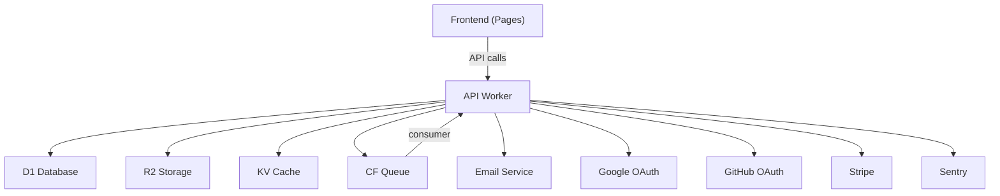

---

## SLA Reference

| Service | SLA | Source |
|---|---|---|
| Cloudflare Workers | 99.99% | Cloudflare Enterprise |
| Cloudflare Pages | 99.99% | Cloudflare |
| Cloudflare D1 | 99.9% | Cloudflare |
| Resend | 99.9% | Resend SLA |
| Stripe | 99.9% | Stripe Status |

---

## Version History

| Version | Date | Change |
|---|---|---|
| 1.0.0 | 2026-07-17 | Initial service registry |

---

## Related Documents

- [API.md](API.md) — API contract detail
- [CLOUDFLARE.md](CLOUDFLARE.md) — CF service configuration
- [ENVIRONMENT_VARIABLES.md](ENVIRONMENT_VARIABLES.md) — Service credentials
- [FEATURE_REGISTRY.md](FEATURE_REGISTRY.md) — Features per service


---

## STATE_MANAGEMENT
<a id="state-management"></a>

# STATE_MANAGEMENT.md — State Management

> **Back to:** [INDEX.md](INDEX.md) | **Related:** [FRONTEND.md](FRONTEND.md) | [API.md](API.md)

---

## Metadata

| Field | Value |
|---|---|
| **Version** | 1.0.0 |
| **Owner** | @jelvan-ricolcol |
| **Last Updated** | 2026-07-17 |
| **Status** | Active |
| **Scope** | Client-side and server state management patterns |

---

## Overview

State is categorized into server state (data from APIs) and client state (UI, preferences, auth). Different tools are used for each to avoid mixing concerns.

---

## State Categories

| Category | Tool | Storage | Examples |
|---|---|---|---|
| Server data | React Query (TanStack) | Memory + Cache | Users, posts, orders |
| Auth state | Zustand + React Query | Memory | Current user, roles |
| UI state | useState / Zustand | Memory | Modals, drawers, tabs |
| Form state | React Hook Form | Memory | Form fields, validation |
| URL/route state | React Router | URL | Filters, pagination |
| User preferences | Zustand + localStorage | localStorage | Theme, language |

---

## Server State (React Query)

```typescript
// queries/users.ts
import { useQuery, useMutation, useQueryClient } from '@tanstack/react-query';
import { apiClient } from '../lib/api-client';

// Query
export function useUsers() {
  return useQuery({
    queryKey: ['users'],
    queryFn: () => apiClient.get<User[]>('/v1/users'),
    staleTime: 60_000,    // Data fresh for 1 minute
    gcTime: 300_000,      // Kept in cache for 5 minutes
  });
}

export function useUser(id: string) {
  return useQuery({
    queryKey: ['users', id],
    queryFn: () => apiClient.get<User>(`/v1/users/${id}`),
    enabled: !!id,
  });
}

// Mutation with cache invalidation
export function useUpdateUser() {
  const queryClient = useQueryClient();
  return useMutation({
    mutationFn: ({ id, data }: { id: string; data: Partial<User> }) =>
      apiClient.patch<User>(`/v1/users/${id}`, data),
    onSuccess: (updated) => {
      queryClient.setQueryData(['users', updated.id], updated);
      queryClient.invalidateQueries({ queryKey: ['users'] });
    },
  });
}
```

### Query Key Convention
```typescript
// Hierarchical keys enable targeted invalidation
['users']                    // All users list
['users', userId]            // Single user
['users', userId, 'posts']   // User's posts
['auth', 'me']               // Current user
```

---

## Client State (Zustand)

```typescript
// stores/auth.store.ts
import { create } from 'zustand';
import { persist } from 'zustand/middleware';

interface AuthState {
  accessToken: string | null;
  isAuthenticated: boolean;
  setAccessToken: (token: string) => void;
  clearAuth: () => void;
}

export const useAuthStore = create<AuthState>()(
  // Don't persist accessToken (memory only for security)
  (set) => ({
    accessToken: null,
    isAuthenticated: false,
    setAccessToken: (token) => set({ accessToken: token, isAuthenticated: true }),
    clearAuth: () => set({ accessToken: null, isAuthenticated: false }),
  })
);

// UI preferences store (persisted to localStorage)
interface UIState {
  sidebarOpen: boolean;
  theme: 'light' | 'dark';
  toggleSidebar: () => void;
  setTheme: (theme: 'light' | 'dark') => void;
}

export const useUIStore = create<UIState>()(
  persist(
    (set) => ({
      sidebarOpen: true,
      theme: 'light',
      toggleSidebar: () => set((s) => ({ sidebarOpen: !s.sidebarOpen })),
      setTheme: (theme) => set({ theme }),
    }),
    { name: 'ui-preferences' }
  )
);
```

---

## Form State (React Hook Form)

```typescript
import { useForm } from 'react-hook-form';
import { zodResolver } from '@hookform/resolvers/zod';
import { z } from 'zod';

const LoginSchema = z.object({
  email: z.string().email('Invalid email address'),
  password: z.string().min(8, 'Password must be at least 8 characters'),
});

type LoginFormData = z.infer<typeof LoginSchema>;

function LoginForm() {
  const {
    register,
    handleSubmit,
    formState: { errors, isSubmitting },
  } = useForm<LoginFormData>({
    resolver: zodResolver(LoginSchema),
  });

  const onSubmit = handleSubmit(async (data) => {
    // ... submit logic
  });

  return (
    <form onSubmit={onSubmit}>
      <input {...register('email')} />
      {errors.email && <span>{errors.email.message}</span>}
      {/* ... */}
    </form>
  );
}
```

---

## URL State (React Router)

```typescript
// Use URL for state that should be shareable/bookmarkable
function UserList() {
  const [searchParams, setSearchParams] = useSearchParams();
  const page = Number(searchParams.get('page') ?? '1');
  const search = searchParams.get('q') ?? '';

  return (
    <div>
      <input
        value={search}
        onChange={(e) => setSearchParams({ q: e.target.value, page: '1' })}
      />
      {/* ... */}
    </div>
  );
}
```

---

## Anti-Patterns to Avoid

- ❌ Storing server data in Zustand (use React Query)
- ❌ Storing access tokens in localStorage (use memory only)
- ❌ Global state for UI state that is component-local (use useState)
- ❌ Mixing server and client state in the same store
- ❌ Manual loading/error state management when React Query handles it

---

## Version History

| Version | Date | Change |
|---|---|---|
| 1.0.0 | 2026-07-17 | Initial state management documentation |

---

## Related Documents

- [FRONTEND.md](FRONTEND.md) — Frontend architecture
- [API.md](API.md) — API contracts consumed by queries
- [AUTHENTICATION.md](AUTHENTICATION.md) — Auth state management
- [docs/frontend/state-management.md](docs/frontend/state-management.md) — State deep dive


---

## STORAGE
<a id="storage"></a>

# STORAGE.md — Storage Architecture

> **Back to:** [INDEX.md](INDEX.md) | **Related:** [DATABASE.md](DATABASE.md) | [CLOUDFLARE.md](CLOUDFLARE.md) | [BACKEND.md](BACKEND.md)

---

## Metadata

| Field | Value |
|---|---|
| **Version** | 1.0.0 |
| **Owner** | @jelvan-ricolcol |
| **Last Updated** | 2026-07-17 |
| **Status** | Active |
| **Scope** | All storage solutions: object, key-value, relational, and CDN |

---

## Overview

Storage is split by data type and access pattern across four Cloudflare services: D1 (SQL), R2 (objects), KV (key-value), and Durable Objects (stateful).

---

## Storage Decision Matrix

| Data Type | Storage | Reason |
|---|---|---|
| Structured relational data | D1 (SQLite) | ACID, SQL queries |
| Files, images, documents | R2 (S3-compatible) | Unlimited size, cheap |
| Sessions, cache, feature flags | KV | Fast global read |
| Realtime state, presence | Durable Objects | Strong consistency |
| Async jobs, events | Queues | Reliable delivery |

---

## Cloudflare R2 (Object Storage)

### Use Cases
- User-uploaded files (documents, images)
- Processed/generated assets (thumbnails, exports)
- Static asset backup
- Database backups

### Key Conventions
```typescript
// Key naming: {category}/{userId}/{filename}
const key = `uploads/${userId}/${Date.now()}-${filename}`;

// Upload with metadata
await env.BUCKET.put(key, body, {
  httpMetadata: {
    contentType: file.type,
    cacheControl: 'public, max-age=31536000',
  },
  customMetadata: {
    uploadedBy: userId,
    originalName: file.name,
  },
});

// Serve (via Worker — not direct R2 public URL in production)
const obj = await env.BUCKET.get(key);
return new Response(obj?.body, {
  headers: {
    'Content-Type': obj?.httpMetadata?.contentType ?? 'application/octet-stream',
    'Cache-Control': 'public, max-age=31536000',
  },
});
```

### File Upload Flow
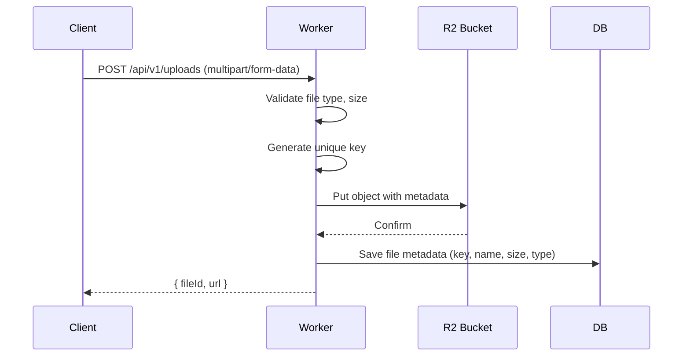

---

## KV Store

### Use Cases
- API response caching
- Session data (short-lived)
- Feature flags
- Rate limit counters (approximate — KV is eventually consistent)
- User preferences

### Key Naming Conventions
```
user:{userId}                   → Cached user object (TTL: 5min)
session:{token}                 → Session data (TTL: 7d)
ratelimit:{ip}:{minute}         → Rate limit count (TTL: 60s)
feature:{flagName}              → Feature flag (TTL: 5min)
config:{key}                    → System config (TTL: 1h)
```

---

## D1 for Structured Storage

See: [DATABASE.md](DATABASE.md)

---

## File Type Restrictions

| Type | Allowed | Max Size |
|---|---|---|
| Images (jpg, png, webp, gif) | ✅ | 10MB |
| Documents (pdf, docx) | ✅ | 25MB |
| Audio (mp3, wav) | ✅ | 50MB |
| Video (mp4) | ✅ | 200MB |
| Executables (.exe, .sh) | ❌ | — |
| Archives (.zip) | ❌ (scan first) | 50MB |

---

## Security

- Validate file type via magic bytes, not just extension
- Restrict R2 bucket to Worker-only access (no public bucket URL)
- Serve files via Worker to enforce authentication
- Scan uploaded files for malware (integrate with antivirus API if required)
- Signed URLs for temporary access (time-limited)

---

## Version History

| Version | Date | Change |
|---|---|---|
| 1.0.0 | 2026-07-17 | Initial storage documentation |

---

## Related Documents

- [DATABASE.md](DATABASE.md) — SQL storage
- [CLOUDFLARE.md](CLOUDFLARE.md) — R2 and KV configuration
- [BACKEND.md](BACKEND.md) — Upload route implementation
- [SECURITY.md](SECURITY.md) — File upload security
- [docs/cloudflare/r2.md](docs/cloudflare/r2.md) — R2 deep dive
- [docs/cloudflare/kv.md](docs/cloudflare/kv.md) — KV deep dive


---

## STYLE_GUIDE
<a id="style-guide"></a>

# STYLE_GUIDE.md — Documentation Style Guide

> **Back to:** [INDEX.md](INDEX.md) | **Related:** [CONTRIBUTING.md](CONTRIBUTING.md) | [CODING_STANDARDS.md](CODING_STANDARDS.md)

---

## Metadata

| Field | Value |
|---|---|
| **Version** | 1.0.0 |
| **Owner** | @jelvan-ricolcol |
| **Last Updated** | 2026-07-17 |
| **Status** | Active |
| **Scope** | Documentation authoring standards for all repository documents |

---

## Overview

This guide ensures documentation is consistent, AI-readable, and human-friendly across all files.

---

## Document Structure

Every document must include:

```markdown
# DOCUMENT_NAME.md — Human-Readable Title

> **Back to:** [INDEX.md](INDEX.md) | **Related:** [DOC1.md](DOC1.md)

---

## Metadata
| Field | Value |
|---|---|
| **Version** | x.y.z |
| **Owner** | @username |
| **Last Updated** | YYYY-MM-DD |
| **Status** | Active / Draft / Deprecated |
| **Scope** | One-line description |

---

## Overview
Brief description of what this document covers.

[... content sections ...]

## Version History
| Version | Date | Change |

## Related Documents
- [DOC.md](DOC.md) — Description
```

---

## Headings

- `#` — Document title (one per file)
- `##` — Major sections
- `###` — Subsections
- `####` — Deep subsections (use sparingly)
- Never skip heading levels

---

## Tables

Use tables for:
- Metadata
- Comparison matrices
- Configuration options
- Status tracking
- Reference lookups

```markdown
| Column 1 | Column 2 | Column 3 |
|---|---|---|
| Value | Value | Value |
```

---

## Code Blocks

Always label code blocks with the language:

````markdown
```typescript
const x: string = 'hello';
```

```bash
npm run build
```

```sql
SELECT * FROM users WHERE id = ?;
```

```json
{ "key": "value" }
```
````

---

## Diagrams

Use Mermaid for all diagrams:

````markdown
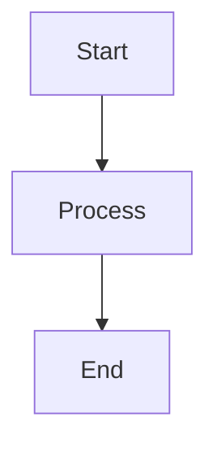

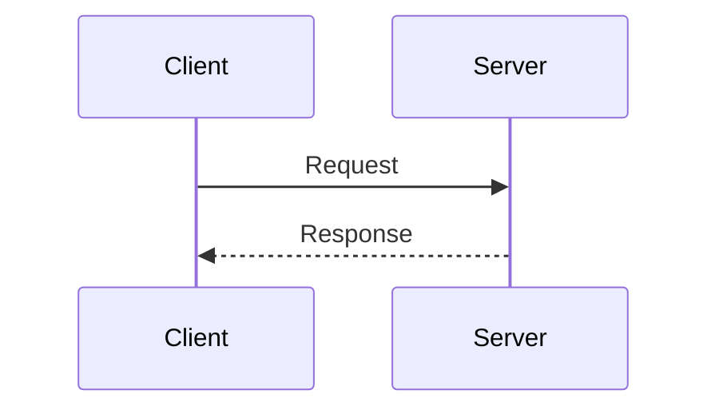
````

---

## File Naming

| Type | Convention | Example |
|---|---|---|
| Root documents | `UPPER_SNAKE_CASE.md` | `ARCHITECTURE.md` |
| Subdirectory documents | `kebab-case.md` | `api-standards.md` |

---

## Status Values

| Status | Meaning |
|---|---|
| Active | Current, accurate, maintained |
| Draft | Work in progress, not finalized |
| Deprecated | Superseded; kept for reference |
| Archived | No longer relevant |

---

## Language

- Write in clear, direct English
- Use present tense: "The Worker handles" not "The Worker will handle"
- Use active voice: "Validate the input" not "The input should be validated"
- Avoid filler phrases: "It should be noted that" → just state the fact
- Acronyms: spell out on first use: "Role-Based Access Control (RBAC)"

---

## Cross-References

Every document must:
1. Link back to [INDEX.md](INDEX.md) in the header
2. List related documents in a "Related Documents" section
3. Use relative links for internal documents: `[BACKEND.md](BACKEND.md)`
4. Use absolute URLs for external references

---

## Version History Tracking

All documents track changes in a version history table:

```markdown
## Version History
| Version | Date | Change |
|---|---|---|
| 1.1.0 | 2026-08-01 | Added section X |
| 1.0.0 | 2026-07-17 | Initial document |
```

---

## Version History

| Version | Date | Change |
|---|---|---|
| 1.0.0 | 2026-07-17 | Initial style guide |

---

## Related Documents

- [INDEX.md](INDEX.md) — Documentation map
- [CONTRIBUTING.md](CONTRIBUTING.md) — How to contribute
- [CODING_STANDARDS.md](CODING_STANDARDS.md) — Code conventions
- [GLOSSARY.md](GLOSSARY.md) — Terms and definitions

## Documentation template for contributors

- **Decision:** What implementation choice was made?
- **Source:** Which official document backs the choice?
- **Reason:** Why is it appropriate for this project?
- **Risk:** What breaks if the assumption changes?
- **Validation:** Which test, command, or review proves it works?

## Verified sources

- Docker Docs — https://docs.docker.com/
- Kubernetes Docs — https://kubernetes.io/docs/
- OpenTelemetry Docs — https://opentelemetry.io/docs/
- Prometheus Docs — https://prometheus.io/docs/
- The Twelve-Factor App — https://12factor.net/


---

## SYSTEM_DESIGN
<a id="system-design"></a>

# SYSTEM_DESIGN.md — System Design

> **Back to:** [INDEX.md](INDEX.md) | **Related:** [ARCHITECTURE.md](ARCHITECTURE.md) | [BACKEND.md](BACKEND.md) | [DATABASE.md](DATABASE.md)

---

## Metadata

| Field | Value |
|---|---|
| **Version** | 1.0.0 |
| **Owner** | @jelvan-ricolcol |
| **Last Updated** | 2026-07-17 |
| **Status** | Active |
| **Scope** | Full-stack system design patterns and decisions |

---

## Overview

This document captures the fundamental system design decisions for a production-grade full-stack application deployed on Cloudflare's edge network. It documents the rationale behind key choices so that future developers and AI assistants can understand constraints and make consistent decisions.

---

## Architecture Style

**Chosen:** Edge-first Serverless with optional Origin Fallback

**Rationale:**
- Cloudflare Workers execute at 300+ edge locations, minimizing request latency globally.
- No server provisioning, automatic scaling, zero cold-start overhead.
- Integrated storage (D1, R2, KV) eliminates cross-region database hops for most queries.
- Reduces operational burden: no VMs, no load balancers, no Kubernetes for typical workloads.

**Trade-offs:**
- Worker CPU limits (10ms free / 30s paid) constrain heavy computation.
- Node.js built-ins unavailable — must use Web APIs.
- D1 (SQLite) lacks some PostgreSQL features; migration to Hyperdrive + PostgreSQL is documented.

---

## System Diagram

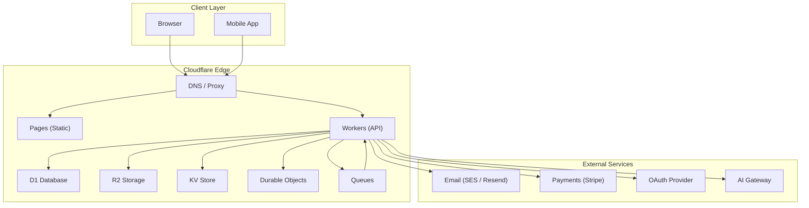

---

## Request Lifecycle

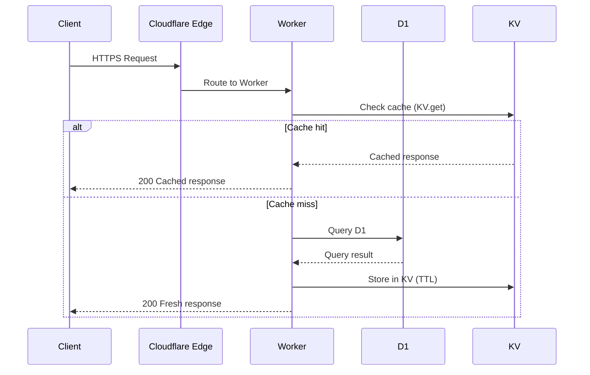

---

## Data Flow Design

### Write Path
```
Client → Worker → Validate Input (Zod) → Authenticate (JWT)
       → Authorize (RBAC) → Write D1 → Invalidate KV Cache
       → Enqueue background job (optional) → Return 201
```

### Read Path
```
Client → Worker → Authenticate (JWT) → Authorize (RBAC)
       → Check KV cache → (miss) Query D1 → Cache in KV
       → Return 200 with data
```

### Async Path
```
Worker → Enqueue to CF Queues → Return 202 Accepted
Background Worker → Dequeue → Process → Update D1 → Notify via DO
```

---

## Database Design Principles

- **Primary DB:** Cloudflare D1 (SQLite) for structured relational data.
- **Schema-first:** All tables defined in migration files under `migrations/`.
- **Soft deletes:** Prefer `deleted_at TIMESTAMP` over hard deletes for audit trails.
- **Timestamps:** Every table has `created_at` and `updated_at`.
- **IDs:** CUID2 or UUIDv7 for distributed uniqueness without auto-increment.
- **Indexes:** Defined on all foreign keys and common query predicates.

See: [DATABASE.md](DATABASE.md)

---

## API Design Principles

- **RESTful** with resource-oriented URLs.
- **Versioned** via URI path (`/api/v1/`).
- **Authenticated** with JWT ****** on all protected routes.
- **Paginated** with cursor-based pagination for list endpoints.
- **Idempotent** POST and PUT operations documented with `Idempotency-Key` header support.
- **Error responses** follow a consistent schema.

See: [API.md](API.md)

---

## Authentication Design

- **Primary flow:** OAuth 2.0 Authorization Code with PKCE.
- **Token format:** JWT (HS256 or RS256).
- **Access token TTL:** 15 minutes.
- **Refresh token TTL:** 7 days, rotated on use.
- **Storage:** Access token in memory; Refresh token in HttpOnly cookie.
- **Session revocation:** Revocation list in KV store.

See: [AUTHENTICATION.md](AUTHENTICATION.md)

---

## Authorization Design

- **Model:** Role-Based Access Control (RBAC) with resource-level policies.
- **Roles:** `admin`, `editor`, `viewer`, `service` (system-to-system).
- **Enforcement:** Middleware in Worker before route handler.
- **Policy storage:** D1 `permissions` table or KV for fast lookup.

See: [AUTHORIZATION.md](AUTHORIZATION.md)

---

## Caching Strategy

| Layer | Technology | TTL | Use Case |
|---|---|---|---|
| CDN | Cloudflare Cache | Configurable | Static assets, public pages |
| Application | KV Store | 60s – 24h | API responses, sessions |
| Database | D1 prepared queries | N/A | Query plan caching |
| Client | HTTP Cache-Control | Per endpoint | Browser-level cache |

---

## Storage Design

| Data Type | Storage | Notes |
|---|---|---|
| Structured/relational | D1 (SQLite) | Users, content, transactions |
| Unstructured/blobs | R2 | Images, documents, exports |
| Ephemeral key-value | KV | Sessions, cache, feature flags |
| Realtime state | Durable Objects | Presence, chat, collaboration |
| Message queues | Cloudflare Queues | Email, webhooks, notifications |

See: [STORAGE.md](STORAGE.md)

---

## Scalability Design

- **Horizontal scale:** Workers scale automatically at the edge.
- **Database scale:** D1 scales reads; for high write throughput, shard by tenant or migrate to Hyperdrive + PostgreSQL.
- **Storage scale:** R2 is object-level, unlimited scale.
- **Rate limiting:** CF Rate Limiting rules + per-IP / per-user limits in Workers.

---

## Resilience & Reliability

- **Retries:** Exponential backoff for all external API calls.
- **Timeouts:** 5s for external HTTP; 30s for Worker max.
- **Circuit breaker:** Not built-in to Workers; implement via KV flag.
- **Health checks:** `/health` endpoint returning Worker + D1 status.
- **Graceful degradation:** Return cached data on DB failure where acceptable.

---

## Security Design

- TLS enforced by Cloudflare (no self-signed certs needed).
- All secrets in Cloudflare Secrets or GitHub Secrets — never in code.
- Input validated at every Worker entry point.
- OWASP Top 10 mitigations applied.
- Content-Security-Policy and CORS headers on all responses.

See: [SECURITY.md](SECURITY.md)

---

## Performance Targets

| Metric | Target |
|---|---|
| API p50 latency | < 50ms |
| API p99 latency | < 200ms |
| Time to First Byte | < 200ms |
| Core Web Vitals (LCP) | < 2.5s |
| Worker CPU per request | < 10ms (free tier) |

See: [PERFORMANCE.md](PERFORMANCE.md)

---

## Known Trade-offs & Decisions

| Decision | Rationale | Risk | Mitigation |
|---|---|---|---|
| Cloudflare Workers over Lambda | Lower latency, simpler ops | CF vendor lock-in | Abstract runtime-specific code |
| D1 (SQLite) over PostgreSQL | Zero config, cheap, integrated | Limited SQL features | Migrate to Hyperdrive if needed |
| JWT over server sessions | Stateless, scalable | Token revocation complexity | Short TTL + KV revocation list |
| Cursor pagination over offset | Consistent results, better perf | Harder to jump to page N | Accept limitation, document it |

---

## Version History

| Version | Date | Change |
|---|---|---|
| 1.0.0 | 2026-07-17 | Initial system design documentation |

---

## Related Documents

- [ARCHITECTURE.md](ARCHITECTURE.md) — High-level architecture
- [BACKEND.md](BACKEND.md) — Backend implementation
- [DATABASE.md](DATABASE.md) — Database schema and patterns
- [API.md](API.md) — API contracts
- [CLOUDFLARE.md](CLOUDFLARE.md) — Cloudflare configuration
- [SECURITY.md](SECURITY.md) — Security design
- [PERFORMANCE.md](PERFORMANCE.md) — Performance targets


---

## TESTING
<a id="testing"></a>

# TESTING.md — Testing Strategy & Standards

> **Back to:** [INDEX.md](INDEX.md) | **Related:** [CI_CD.md](CI_CD.md) | [BACKEND.md](BACKEND.md) | [FRONTEND.md](FRONTEND.md)

---

## Metadata

| Field | Value |
|---|---|
| **Version** | 1.0.0 |
| **Owner** | @jelvan-ricolcol |
| **Last Updated** | 2026-07-17 |
| **Status** | Active |
| **Scope** | Testing strategy, tools, and standards across all layers |

---

## Overview

Testing is mandatory for all production code. The strategy follows the testing pyramid: many unit tests, fewer integration tests, minimal but critical E2E tests.

---

## Testing Pyramid

```
        /\
       /E2E\          Playwright: critical user flows
      /------\
     /Integr. \       Vitest + Miniflare: route handlers, middleware
    /----------\
   /   Unit     \     Vitest: services, utilities, components
  /--------------\
```

---

## Tools

| Tool | Purpose |
|---|---|
| Vitest | Unit and integration tests (Workers + Frontend) |
| Miniflare | Cloudflare Workers emulator for integration tests |
| React Testing Library | React component testing |
| MSW (Mock Service Worker) | API mocking for frontend tests |
| Playwright | End-to-end browser testing |
| @cloudflare/vitest-pool-workers | Run tests inside real Workers runtime |

---

## Coverage Targets

| Layer | Target Coverage |
|---|---|
| Backend services | 80%+ |
| Backend routes | 70%+ |
| Frontend components | 70%+ |
| Utilities/helpers | 90%+ |
| E2E (critical flows) | 100% of critical paths |

---

## Backend Unit Tests

```typescript
// services/__tests__/user.service.test.ts
import { describe, it, expect, vi } from 'vitest';
import { UserService } from '../user.service';

describe('UserService', () => {
  it('returns cached user from KV', async () => {
    const mockKV = {
      get: vi.fn().mockResolvedValue(JSON.stringify({ id: '1', email: 'a@b.com' })),
    } as unknown as KVNamespace;

    const service = new UserService(mockRepo, mockKV);
    const user = await service.getUserById('1');

    expect(user.email).toBe('a@b.com');
    expect(mockKV.get).toHaveBeenCalledWith('user:1');
  });

  it('throws NotFoundError for unknown user', async () => {
    const mockRepo = { findById: vi.fn().mockResolvedValue(null) };
    const mockKV = { get: vi.fn().mockResolvedValue(null) } as unknown as KVNamespace;

    const service = new UserService(mockRepo as any, mockKV);
    await expect(service.getUserById('unknown')).rejects.toThrow('User not found');
  });
});
```

---

## Backend Integration Tests (Miniflare)

```typescript
// routes/__tests__/users.test.ts
import { SELF } from 'cloudflare:test';
import { describe, it, expect, beforeAll } from 'vitest';

describe('GET /api/v1/users/:id', () => {
  it('returns 401 without auth token', async () => {
    const response = await SELF.fetch('http://localhost/api/v1/users/123');
    expect(response.status).toBe(401);
  });

  it('returns user when authenticated', async () => {
    const response = await SELF.fetch('http://localhost/api/v1/users/test-user-id', {
      headers: { Authorization: `****** },
    });
    expect(response.status).toBe(200);
    const { data } = await response.json();
    expect(data.id).toBe('test-user-id');
  });
});
```

---

## Frontend Component Tests

```typescript
// components/__tests__/Button.test.tsx
import { render, screen, fireEvent } from '@testing-library/react';
import { describe, it, expect, vi } from 'vitest';
import { Button } from '../Button';

describe('Button', () => {
  it('renders children', () => {
    render(<Button>Click me</Button>);
    expect(screen.getByText('Click me')).toBeInTheDocument();
  });

  it('calls onClick when clicked', () => {
    const onClick = vi.fn();
    render(<Button onClick={onClick}>Click me</Button>);
    fireEvent.click(screen.getByText('Click me'));
    expect(onClick).toHaveBeenCalledTimes(1);
  });

  it('is disabled when loading', () => {
    render(<Button loading>Click me</Button>);
    expect(screen.getByRole('button')).toBeDisabled();
  });
});
```

---

## E2E Tests (Playwright)

```typescript
// e2e/auth.spec.ts
import { test, expect } from '@playwright/test';

test('user can login and view dashboard', async ({ page }) => {
  await page.goto('/login');
  await page.fill('[name="email"]', 'user@example.com');
  await page.fill('[name="password"]', 'SecurePass123!');
  await page.click('[type="submit"]');

  await expect(page).toHaveURL('/dashboard');
  await expect(page.locator('h1')).toContainText('Dashboard');
});

test('redirects unauthenticated users to login', async ({ page }) => {
  await page.goto('/dashboard');
  await expect(page).toHaveURL('/login');
});
```

---

## Test Configuration

```typescript
// vitest.config.ts
import { defineWorkersConfig } from '@cloudflare/vitest-pool-workers/config';

export default defineWorkersConfig({
  test: {
    poolOptions: {
      workers: {
        wrangler: { configPath: './wrangler.toml' },
      },
    },
    coverage: {
      provider: 'v8',
      reporter: ['text', 'html', 'lcov'],
      thresholds: {
        lines: 80,
        functions: 80,
        branches: 75,
      },
    },
  },
});
```

---

## Running Tests

```bash
# All tests
npm run test

# Watch mode
npm run test:watch

# Coverage report
npm run test:coverage

# E2E tests (requires running server)
npm run test:e2e

# E2E tests with UI
npx playwright test --ui
```

---

## Test Data & Fixtures

- Use factory functions to create test data
- Never use production data in tests
- Seed test database with known state before integration tests
- Reset test state between tests via `beforeEach` hooks

---

## Version History

| Version | Date | Change |
|---|---|---|
| 1.0.0 | 2026-07-17 | Initial testing documentation |

---

## Related Documents

- [CI_CD.md](CI_CD.md) — Tests in pipeline
- [BACKEND.md](BACKEND.md) — Backend test patterns
- [FRONTEND.md](FRONTEND.md) — Frontend test patterns
- [ERROR_HANDLING.md](ERROR_HANDLING.md) — Testing error cases
- [docs/testing/README.md](docs/testing/README.md) — Testing deep dive


---

## TROUBLESHOOTING
<a id="troubleshooting"></a>

# TROUBLESHOOTING.md — Troubleshooting Guide

> **Back to:** [INDEX.md](INDEX.md) | **Related:** [MONITORING.md](MONITORING.md) | [DEPLOYMENT.md](DEPLOYMENT.md) | [KNOWN_LIMITATIONS.md](KNOWN_LIMITATIONS.md)

---

## Metadata

| Field | Value |
|---|---|
| **Version** | 1.0.0 |
| **Owner** | @jelvan-ricolcol |
| **Last Updated** | 2026-07-17 |
| **Status** | Active |
| **Scope** | Common issues, root causes, and resolutions |

---

## Diagnostic Tools

```bash
# Live Worker logs
wrangler tail --env production

# Check deployment status
wrangler deployments list

# Check D1 database
wrangler d1 execute DB --command "SELECT 1" --env production

# Check Worker status
curl https://api.{domain}/health
```

---

## Common Issues

---

### Worker Returns 500 on All Requests

**Symptoms:** All API calls return 500 Internal Server Error immediately after deployment.

**Causes:**
1. Missing required environment variable or secret
2. Syntax error in Worker code
3. Failed D1 migration that left schema in bad state

**Resolution:**
```bash
# Check live logs for error details
wrangler tail --env production

# Verify secrets are set
wrangler secret list --env production

# Rollback to previous deployment
wrangler rollback --env production
```

---

### JWT Token Always Returns 401 "Invalid Token"

**Symptoms:** Valid JWT returns 401, token appears correctly formatted.

**Causes:**
1. `JWT_SECRET` mismatch between token issuer and validator
2. Token signed with wrong algorithm (RS256 vs HS256)
3. `JWT_ISSUER` or `JWT_AUDIENCE` mismatch

**Resolution:**
```bash
# Verify JWT_SECRET is set correctly
wrangler secret list

# Decode token (without verification) to inspect claims
# Use jwt.io in browser or:
echo "YOUR_TOKEN_HERE" | cut -d. -f2 | base64 -d 2>/dev/null | python3 -m json.tool
```

---

### D1 Migration Fails

**Symptoms:** `wrangler d1 migrations apply` returns error.

**Causes:**
1. Migration SQL syntax error (SQLite not PostgreSQL)
2. Table already exists (migration not idempotent)
3. Wrong database ID in wrangler.toml

**Resolution:**
```bash
# Check migration SQL for SQLite compatibility
# Use IF NOT EXISTS in all CREATE TABLE statements

# Check migration status
wrangler d1 migrations list --env production

# Apply specific migration
wrangler d1 execute DB --file migrations/0002_fix.sql --env production
```

---

### KV Data Not Updating (Stale Cache)

**Symptoms:** Updated data in D1 not reflected via API.

**Causes:**
1. KV cache TTL not expired
2. Cache invalidation not triggered on write

**Resolution:**
```bash
# Manually delete KV key
wrangler kv key delete --binding=KV "user:abc123" --env production

# Delete all keys with prefix
wrangler kv key list --binding=KV --prefix="user:" | jq '.[].name' | xargs -I{} wrangler kv key delete --binding=KV "{}"
```

---

### CORS Error in Browser

**Symptoms:** Browser console shows CORS error; `OPTIONS` request fails with 403.

**Causes:**
1. Worker not handling `OPTIONS` preflight requests
2. `Access-Control-Allow-Origin` missing or incorrect

**Resolution:**
```typescript
// Ensure CORS middleware handles OPTIONS
app.options('*', (c) => {
  return new Response(null, {
    status: 204,
    headers: {
      'Access-Control-Allow-Origin': c.env.CORS_ORIGINS,
      'Access-Control-Allow-Methods': 'GET, POST, PUT, PATCH, DELETE, OPTIONS',
      'Access-Control-Allow-Headers': 'Content-Type, Authorization',
      'Access-Control-Max-Age': '86400',
    },
  });
});
```

---

### Cloudflare Pages Deploy Fails

**Symptoms:** CI pipeline fails at Pages deploy step.

**Causes:**
1. `CLOUDFLARE_API_TOKEN` does not have Pages permission
2. Build output directory incorrect
3. Pages project does not exist

**Resolution:**
```bash
# Verify token has Cloudflare Pages:Edit permission
# In Cloudflare Dashboard: Profile → API Tokens

# Check build output exists
ls -la dist/

# Create Pages project if missing
wrangler pages project create my-frontend
```

---

### R2 Upload Returns 403

**Symptoms:** File upload to R2 returns 403 Forbidden.

**Causes:**
1. R2 binding not configured in wrangler.toml
2. `BUCKET` binding name mismatch

**Resolution:**
```toml
# Verify wrangler.toml has correct R2 binding
[[r2_buckets]]
binding = "BUCKET"
bucket_name = "my-bucket-prod"
```

---

### High Worker CPU Usage

**Symptoms:** Worker CPU time p99 exceeds 10ms; requests slowing.

**Causes:**
1. Synchronous heavy computation in request path
2. Too many sequential D1 queries (N+1)
3. Large JSON serialization

**Resolution:**
- Move heavy computation to background via `ctx.waitUntil()`
- Batch D1 queries with `env.DB.batch()`
- Cache results in KV
- Profile with `wrangler tail --format=json | jq '.cpuTime'`

---

## Escalation Path

1. Check this document for known issues
2. Check `wrangler tail` for live logs
3. Check Cloudflare Analytics dashboard
4. Check Sentry for error details
5. Open GitHub Issue with: error logs, Worker version, environment, steps to reproduce

---

## Version History

| Version | Date | Change |
|---|---|---|
| 1.0.0 | 2026-07-17 | Initial troubleshooting guide |

---

## Related Documents

- [KNOWN_LIMITATIONS.md](KNOWN_LIMITATIONS.md) — Platform limitations
- [MONITORING.md](MONITORING.md) — Alerting setup
- [DEPLOYMENT.md](DEPLOYMENT.md) — Deployment procedures
- [CLOUDFLARE.md](CLOUDFLARE.md) — Cloudflare configuration
- [ERROR_HANDLING.md](ERROR_HANDLING.md) — Error codes reference


---

## UI_RESOURCES
<a id="ui-resources"></a>

# UI_RESOURCES.md — UI Design Resources and Delivery Guide

> **Back to:** [INDEX.md](INDEX.md) | **Related:** [DESIGN_SYSTEM.md](DESIGN_SYSTEM.md) | [COMPONENT_LIBRARY.md](COMPONENT_LIBRARY.md) | [FRONTEND.md](FRONTEND.md) | [DEPLOYMENT.md](DEPLOYMENT.md)

---

## Metadata

| Field | Value |
|---|---|
| **Version** | 1.0.0 |
| **Owner** | @jelvan-ricolcol |
| **Last Updated** | 2026-07-17 |
| **Status** | Active |
| **Scope** | UI assets, design inputs, AI probing, email HTML, serverless, and automation delivery |

---

## Overview

This document centralizes the free, production-appropriate resources and decision policies used to design and ship web apps, websites, dashboards, HTML emails, serverless flows, and automation-enabled products across desktop, tablet, mobile, and responsive surfaces.

Use this page before designing a new product or feature. It defines what to gather, which assets are allowed, what to build, and how UI decisions connect to backend, deployment, and GitHub workflow requirements.

---

## Supported Delivery Surfaces

| Surface | Primary Goal | Required Outputs |
|---|---|---|
| Marketing website | Convert visitors | Responsive layouts, CTA sections, analytics events, SEO metadata |
| Product web app | Complete user tasks | App shell, authenticated flows, empty/loading/error states |
| Admin dashboard | Operate system safely | Dense data views, permissions-aware actions, audit-friendly UX |
| Mobile web / PWA | Fast task completion | Touch targets, reduced payload, offline-aware behavior |
| Transactional email | Confirm or prompt action | HTML email template, plain-text fallback, tracked links |
| Serverless workflow UI | Trigger or observe automation | Job status UI, retry state, webhook or queue observability |
| Automation console | Configure recurring tasks | Schedules, rules, logs, failure notifications |

---

## Approved Free UI Resource Catalog

All external assets must allow commercial use and redistribution appropriate to the product. Record the exact license and source URL in the consuming feature documentation.

### SVG Icons

| Resource | Best Use | Notes |
|---|---|---|
| [Lucide](https://lucide.dev/) | Product UI, dashboards, apps | Clean open-source icon set with React support |
| [Heroicons](https://heroicons.com/) | SaaS apps, admin interfaces | Works well with Tailwind-driven systems |
| [Tabler Icons](https://tabler.io/icons) | Dense products, settings, data tools | Broad icon coverage |
| [Phosphor Icons](https://phosphoricons.com/) | Marketing + product hybrid styles | Multiple visual weights |
| [Simple Icons](https://simpleicons.org/) | Brand/logo references | Use only for approved brand usage |

### Fonts

| Resource | Best Use | Notes |
|---|---|---|
| [Inter](https://fonts.google.com/specimen/Inter) | Default UI font | Excellent readability across devices |
| [Manrope](https://fonts.google.com/specimen/Manrope) | Modern marketing pages | Strong headings |
| [Public Sans](https://fonts.google.com/specimen/Public+Sans) | Accessibility-focused products | Neutral, highly readable |
| [Plus Jakarta Sans](https://fonts.google.com/specimen/Plus+Jakarta+Sans) | Product + landing page blend | Friendly without losing clarity |
| [IBM Plex Sans](https://fonts.google.com/specimen/IBM+Plex+Sans) | Technical apps | Balanced with data-heavy interfaces |
| [JetBrains Mono](https://www.jetbrains.com/lp/mono/) | Code, logs, terminal surfaces | Use only where monospacing improves clarity |

### Illustrations and Visual Systems

| Resource | Best Use | Notes |
|---|---|---|
| [unDraw](https://undraw.co/illustrations) | Empty states, onboarding, marketing | Free customizable SVG illustrations |
| [Storyset](https://storyset.com/) | Landing pages, feature explainers | Multiple styles and edit options |
| [Humaaans](https://www.humaaans.com/) | Editorial/product storytelling | Good for modular hero scenes |
| [Open Doodles](https://www.opendoodles.com/) | Friendly onboarding and support pages | Informal visual tone |

### UI Kits and Inspiration

| Resource | Best Use | Notes |
|---|---|---|
| [Figma Community](https://www.figma.com/community) | Free wireframes and UI starters | Verify license per file |
| [Flowbite](https://flowbite.com/) | Tailwind-aligned component inspiration | Good for dashboards and forms |
| [DaisyUI](https://daisyui.com/) | Rapid prototyping | Use as reference, not as a substitute for design policy |
| [Can I Email](https://www.caniemail.com/) | Email HTML support checks | Required before shipping new email patterns |

---

## Cross-Device Design Matrix

| Surface | Target Width | Primary Layout Pattern | Key Rules |
|---|---|---|---|
| Small mobile | 320–374px | Single-column stack | 16px minimum body text, 44px touch targets |
| Standard mobile | 375–767px | Single-column stack with sticky primary action | Prioritize task completion above decoration |
| Tablet | 768–1023px | Split layout or 8-column grid | Preserve tap comfort and reduce side-panel density |
| Desktop | 1024–1439px | 12-column grid | Use progressive disclosure for secondary actions |
| Large desktop | 1440px+ | Centered content with max width | Avoid uncontrolled line length and stretched cards |
| HTML email | 320–600px effective | Table-based single column | Inline CSS, conservative spacing, image fallbacks |

---

## UI Structure Policy

Every feature design must define the following structure before implementation:

1. **Page shell** — header, navigation, content frame, footer or utility tray.
2. **Primary workflow** — the main user action and the success condition.
3. **Support states** — loading, empty, error, success, locked, and offline variants.
4. **Component inventory** — primitives, composite blocks, and any new design tokens.
5. **Content hierarchy** — title, summary, body, metadata, action zones, help text.
6. **Accessibility controls** — keyboard flow, focus order, contrast, labels, announcements.
7. **Analytics hooks** — CTA clicks, submissions, failures, retention events.
8. **Deployment dependency** — API, queue, cron, webhook, email, or third-party integration.

### Component Alignment Rules

| Area | Policy |
|---|---|
| Tokens | Use [DESIGN_SYSTEM.md](DESIGN_SYSTEM.md) tokens first; add new ones only when repeated need is proven |
| Components | Reuse shared primitives before creating feature-specific UI |
| Copy | UI text must state action, outcome, or constraint directly |
| Accessibility | WCAG 2.1 AA minimum |
| State design | Every async action has idle, loading, success, and failure states |
| Responsiveness | Layout must be reviewed at mobile, tablet, and desktop widths |
| Security | Never expose secrets, internal IDs, or privileged controls without authorization checks |

---

## AI Discovery Questionnaire

Use these probing questions before generating UI, backend, or deployment plans.

| Category | Questions to Answer |
|---|---|
| Product type | Is this a marketing site, SaaS app, admin portal, mobile-first tool, email flow, automation console, or mixed platform? |
| Users | Who are the primary users, what is their role, and what task must become easier or faster? |
| Core workflow | What is the single most important action? What does success look like? |
| Content | What text, media, forms, tables, charts, or documents must appear? |
| Brand | Which colors, tone, icon style, and typography are required or preferred? |
| Devices | Which device is primary, and which views must be optimized second? |
| Accessibility | What assistive needs, localization, reduced motion, or readability constraints apply? |
| Data | Which entities, API calls, uploads, filters, or real-time updates are required? |
| Integrations | Does the product send email, call third-party APIs, use payments, maps, AI, or auth providers? |
| Serverless | Which actions should trigger Workers, Queues, Durable Objects, cron jobs, or webhooks? |
| Automation | What can be scheduled, retried, approved, escalated, or summarized automatically? |
| Deployment | Is the target Cloudflare Pages, Workers, static hosting, email platform, or mixed infrastructure? |

### Output Mapping

| If answers indicate... | Create... |
|---|---|
| Acquisition or brand storytelling | Landing page system, lead capture forms, SEO pages |
| Repeated authenticated workflows | Product app shell, protected routes, dashboard patterns |
| Frequent operational actions | Admin console, permission-aware table and detail views |
| Triggered notifications | Transactional HTML email templates and event pipeline |
| Event-driven backend tasks | Queue-backed serverless workflow and status UI |
| Scheduled rules or no-code actions | Automation builder, logs, retry, and audit surfaces |

---

## HTML Email Design Guidelines

HTML email support is required whenever the product sends onboarding, verification, alerting, billing, or lifecycle messaging.

### Email Template Policy

| Requirement | Standard |
|---|---|
| Layout | Table-based, 600px max content width |
| Styling | Inline CSS only for critical rendering |
| Typography | Use safe fallbacks: `Arial, Helvetica, sans-serif` |
| Content | One primary CTA per email |
| Accessibility | Meaningful preheader, alt text, readable contrast |
| Compatibility | Validate against [Can I Email](https://www.caniemail.com/) before shipping |
| Deliverability | Include plain-text fallback, unsubscribe or preference link when required |

### Recommended Free Email Tooling

| Tool | Purpose | Notes |
|---|---|---|
| [MJML](https://mjml.io/) | Responsive email authoring | Strong default compatibility |
| [Maizzle](https://maizzle.com/) | HTML email framework | Useful for larger email systems |
| [Can I Email](https://www.caniemail.com/) | Feature compatibility testing | Required reference |
| [Email Markup Consortium](https://emailmarkup.org/) | Email HTML standards guidance | Good for interoperability checks |

---

## Serverless and Automation Alignment

UI planning must include the backend execution model so the designed surface matches how the system is deployed.

| Capability | Recommended Platform Pattern | UI Requirement |
|---|---|---|
| Public website + forms | Cloudflare Pages + Worker API | Fast forms, bot protection, success/error states |
| Product API | Cloudflare Workers | Auth-aware API feedback and optimistic UI only where safe |
| Async job processing | Cloudflare Queues + Worker consumers | Job status, retries, audit trail |
| Realtime collaboration | Durable Objects | Presence, conflict handling, reconnection states |
| Scheduled automation | Cron triggers / scheduled Workers | Schedule editor, last-run status, failure alerting |
| Email sending | Worker + email provider | Template preview, send status, bounce/error visibility |
| GitHub automation | GitHub Actions | Deployment status, preview links, rollback notes |

---

## End-to-End Delivery Checklist

1. Define the product surface and primary user workflow.
2. Choose asset sources for icons, fonts, illustrations, and layout inspiration.
3. Confirm responsive behavior for mobile, tablet, desktop, and email if applicable.
4. Map screens to components, design tokens, and accessibility requirements.
5. Map UI actions to API endpoints, queues, realtime state, or scheduled jobs.
6. Define required emails, webhooks, automations, and serverless triggers.
7. Document deployment target, GitHub workflow, rollback path, and observability hooks.
8. Update related docs: frontend, backend, deployment, GitHub, and feature registry when scope expands.

---

## Verified Sources

- Google Fonts — https://fonts.google.com/
- Lucide — https://lucide.dev/
- Heroicons — https://heroicons.com/
- Tabler Icons — https://tabler.io/icons
- Phosphor Icons — https://phosphoricons.com/
- Simple Icons — https://simpleicons.org/
- Figma Community — https://www.figma.com/community
- Can I Email — https://www.caniemail.com/
- MJML — https://mjml.io/
- Maizzle — https://maizzle.com/
- Cloudflare Workers Docs — https://developers.cloudflare.com/workers/
- GitHub Actions Docs — https://docs.github.com/actions

---

## Version History

| Version | Date | Change |
|---|---|---|
| 1.0.0 | 2026-07-17 | Initial UI design resources and delivery guide |

---

## Related Documents

- [DESIGN_SYSTEM.md](DESIGN_SYSTEM.md) — Tokens, typography, and visual language
- [COMPONENT_LIBRARY.md](COMPONENT_LIBRARY.md) — Shared components and interaction standards
- [FRONTEND.md](FRONTEND.md) — Frontend architecture and delivery patterns
- [BACKEND.md](BACKEND.md) — Backend and API integration patterns
- [DEPLOYMENT.md](DEPLOYMENT.md) — Deployment runbooks and environments
- [GITHUB.md](GITHUB.md) — GitHub workflows and governance


---

## assets/README
<a id="assets-readme"></a>

# Assets

## Verification status

This document has been rechecked against official vendor, standards-body, or mature security references. Treat linked sources as authoritative when platform limits, syntax, pricing, or feature availability changes.

## What this covers

- The production purpose of **Assets** in a full-stack system.
- The implementation decisions that must be documented before build or rollout.
- The security, reliability, testing, and operations checks expected for maintainable delivery.

## Source-aligned guidance

- Start with the official specification or vendor guide listed below; do not rely on blog posts for normative behavior.
- Record versions, runtime targets, regions, limits, and compatibility assumptions when they affect implementation.
- Use least privilege for credentials, API tokens, service roles, CI jobs, and deployed workloads.
- Validate inputs at trust boundaries and encode or parameterize outputs according to the target protocol or storage engine.
- Prefer automated checks: unit tests, integration tests, linting, type checks, schema validation, dependency scanning, and deployment smoke tests.
- Document rollback, incident response, logging fields, metrics, traces, alerts, and ownership before production release.

## Implementation checklist

1. Define the user journey, data involved, failure modes, and business criticality.
2. Select the official source below that governs API shape, runtime behavior, or security requirements.
3. Capture configuration in code where safe; store secrets only in approved secret stores.
4. Add examples that can be copied, tested, and updated without hidden dependencies.
5. Review accessibility, privacy, security, performance, and operability before merging.
6. Schedule periodic source rechecks for pages tied to fast-moving vendors or cloud services.

## Documentation template for contributors

- **Decision:** What implementation choice was made?
- **Source:** Which official document backs the choice?
- **Reason:** Why is it appropriate for this project?
- **Risk:** What breaks if the assumption changes?
- **Validation:** Which test, command, or review proves it works?

## Verified sources

- Docker Docs — https://docs.docker.com/
- Kubernetes Docs — https://kubernetes.io/docs/
- OpenTelemetry Docs — https://opentelemetry.io/docs/
- Prometheus Docs — https://prometheus.io/docs/
- The Twelve-Factor App — https://12factor.net/


---

## docs/README
<a id="docs-readme"></a>

# Documentation

Complete full-stack developer knowledge base. Each topic page includes a verification status, implementation checklist, contributor template, and links to authoritative sources.

## Sections

- architecture
- frontend
- backend
- api
- database
- authentication
- authorization
- cloudflare
- github
- aws
- docker
- kubernetes
- monitoring
- observability
- logging
- caching
- storage
- queues
- realtime
- security
- testing
- deployment
- performance
- accessibility
- seo
- ui-ux
- integrations
- prompts
- standards
- troubleshooting
- references

## Maintenance rules

1. Prefer official standards, vendor documentation, and mature security references.
2. Do not present copied vendor text as original guidance; summarize and link the source.
3. Recheck fast-moving cloud, security, and API pages before production use.
4. Add runnable examples only when they can be tested in this repository or clearly marked as external setup.


---

## docs/accessibility/README
<a id="docs-accessibility-readme"></a>

# Accessibility

> **Back to:** [INDEX.md](../../INDEX.md) | **Related:** [DESIGN_SYSTEM.md](../../DESIGN_SYSTEM.md) | [COMPONENT_LIBRARY.md](../../COMPONENT_LIBRARY.md)

## Overview

All UI must meet WCAG 2.1 Level AA. Accessibility is not optional.

## Requirements

- All interactive elements must be keyboard-navigable
- Color contrast ratio: 4.5:1 for normal text, 3:1 for large text
- All images must have descriptive alt text (or `alt=""` if decorative)
- All form fields must have associated labels
- Focus must be visible at all times
- Screen reader tested with NVDA (Windows) and VoiceOver (macOS/iOS)
- No content flashes more than 3 times per second (seizure prevention)

## ARIA Patterns

```tsx
// Button with icon only — must have label
<button aria-label="Close modal">×</button>

// Loading state
<button aria-busy={loading} disabled={loading}>
  {loading ? 'Saving...' : 'Save'}
</button>

// Dialog
<div role="dialog" aria-modal aria-labelledby="dialog-title">
  <h2 id="dialog-title">Confirm Delete</h2>
</div>
```

## Testing Tools

- axe DevTools (browser extension)
- Playwright `a11y` plugin for automated checks
- Manual keyboard navigation testing
- NVDA + Chrome for Windows
- VoiceOver + Safari for macOS/iOS

## Verified Sources

- WCAG 2.1 — https://www.w3.org/TR/WCAG21/
- ARIA Authoring Practices — https://www.w3.org/WAI/ARIA/apg/
- axe Rules — https://dequeuniversity.com/rules/axe/


---

## docs/api/api-standards
<a id="docs-api-api-standards"></a>

# API Standards

> **Back to:** [INDEX.md](../../INDEX.md) | **Root doc:** [API.md](../../API.md)

## Overview

API design standards. See [API.md](../../API.md) for the full API contract documentation.

## URL Design

```
# Collections
GET    /api/v1/users        → List users
POST   /api/v1/users        → Create user

# Single resources
GET    /api/v1/users/:id    → Get user
PATCH  /api/v1/users/:id    → Update user
DELETE /api/v1/users/:id    → Delete user

# Sub-resources
GET    /api/v1/users/:id/posts → Get user's posts
```

## Request Standards

```http
POST /api/v1/users HTTP/1.1
Content-Type: application/json
Authorization: ******
Accept: application/json
Idempotency-Key: uuid-v4  (for POST operations that should be idempotent)

{ "email": "user@example.com", "name": "John" }
```

## Response Standards

Success:
```json
{ "data": { ... } }
```

Error:
```json
{ "error": { "code": "...", "message": "...", "status": 400, "requestId": "..." } }
```

## Verified Sources

- REST API Tutorial — https://restfulapi.net/
- HTTP Semantics (RFC 9110) — https://www.rfc-editor.org/rfc/rfc9110
- Google API Design Guide — https://cloud.google.com/apis/design


---

## docs/api/authentication
<a id="docs-api-authentication"></a>

# API Authentication

> **Back to:** [INDEX.md](../../INDEX.md) | **Root doc:** [AUTHENTICATION.md](../../AUTHENTICATION.md) | **Related:** [API.md](../../API.md)

## Overview

How to authenticate API requests. See [AUTHENTICATION.md](../../AUTHENTICATION.md) for the full auth implementation.

## ******

All protected endpoints require a JWT access token:

```http
GET /api/v1/users/me HTTP/1.1
Authorization: ******
```

## Obtaining a Token

```http
POST /api/v1/auth/login HTTP/1.1
Content-Type: application/json

{ "email": "user@example.com", "password": "..." }
```

Response:
```json
{
  "data": {
    "accessToken": "eyJhbGci...",
    "expiresIn": 900,
    "tokenType": "Bearer"
  }
}
```

## Refreshing a Token

```http
POST /api/v1/auth/refresh HTTP/1.1
Cookie: refresh_token=...
```

## Token Expiry

| Token | TTL |
|---|---|
| Access token | 15 minutes |
| Refresh token | 7 days |

## Verified Sources

- RFC 6750 (****** — https://www.rfc-editor.org/rfc/rfc6750
- RFC 7519 (JWT) — https://www.rfc-editor.org/rfc/rfc7519


---

## docs/api/documentation
<a id="docs-api-documentation"></a>

# API Documentation Standards

> **Back to:** [INDEX.md](../../INDEX.md) | **Root doc:** [API.md](../../API.md)

## Overview

Standards for writing and maintaining API documentation.

## Documentation Requirements

Every API endpoint must document:
- HTTP method and URL
- Authentication requirements
- Request body schema (with Zod schema or TypeScript type)
- Response schema
- Error codes that can be returned
- Example request and response

## OpenAPI Specification

The API should be documented in OpenAPI 3.1 format:

```yaml
# docs/api/openapi.yaml (planned)
openapi: '3.1.0'
info:
  title: My API
  version: '1.0.0'
paths:
  /api/v1/users/{id}:
    get:
      summary: Get user by ID
      parameters:
        - name: id
          in: path
          required: true
          schema: { type: string }
      responses:
        '200':
          description: User found
        '404':
          description: User not found
```

## Versioning Documentation

See [docs/api/versioning.md](versioning.md).

## Verified Sources

- OpenAPI 3.1 Spec — https://spec.openapis.org/oas/v3.1.0
- Swagger UI — https://swagger.io/tools/swagger-ui/


---

## docs/api/versioning
<a id="docs-api-versioning"></a>

# API Versioning

> **Back to:** [INDEX.md](../../INDEX.md) | **Root doc:** [API.md](../../API.md)

## Overview

API versioning strategy. See [API.md](../../API.md) for the full versioning policy.

## Strategy: URI Path Versioning

```
/api/v1/users    ← Current version
/api/v2/users    ← New version (breaking change)
```

## Version Policy

- **Minor/patch changes** (new fields, new optional params): no version bump
- **Breaking changes** (removed fields, changed types, removed endpoints): new version
- **Deprecation period:** 6 months minimum with `Deprecation` response header

## Deprecation Headers

```http
HTTP/1.1 200 OK
Deprecation: true
Sunset: Sat, 01 Jan 2027 00:00:00 GMT
Link: <https://api.{domain}/v2/users>; rel="successor-version"
```

## Migration Guide

When a new version is released:
1. Update [API.md](../../API.md) with new endpoints
2. Update [CHANGELOG.md](../../CHANGELOG.md) with breaking changes
3. Notify API consumers via response headers
4. Keep old version running for deprecation period
5. Remove old version after sunset date

## Verified Sources

- API Versioning Best Practices — https://www.mnot.net/blog/2012/12/04/api-evolution
- HTTP Deprecation Header (RFC 8594) — https://www.rfc-editor.org/rfc/rfc8594


---

## docs/architecture/diagrams
<a id="docs-architecture-diagrams"></a>

# Diagrams

> **Back to:** [INDEX.md](../../INDEX.md) | **Root doc:** [ARCHITECTURE.md](../../ARCHITECTURE.md) | **Related:** [SYSTEM_DESIGN.md](../../SYSTEM_DESIGN.md)

## Overview

See [ARCHITECTURE.md](../../ARCHITECTURE.md) for the primary architecture documentation.

## Verified Sources

- Cloudflare Workers Docs — https://developers.cloudflare.com/workers/
- The Twelve-Factor App — https://12factor.net/
- Martin Fowler Architecture Patterns — https://martinfowler.com/architecture/


---

## docs/architecture/microservices
<a id="docs-architecture-microservices"></a>

# Microservices

> **Back to:** [INDEX.md](../../INDEX.md) | **Root doc:** [ARCHITECTURE.md](../../ARCHITECTURE.md) | **Related:** [SYSTEM_DESIGN.md](../../SYSTEM_DESIGN.md)

## Overview

See [ARCHITECTURE.md](../../ARCHITECTURE.md) for the primary architecture documentation.

## Verified Sources

- Cloudflare Workers Docs — https://developers.cloudflare.com/workers/
- The Twelve-Factor App — https://12factor.net/
- Martin Fowler Architecture Patterns — https://martinfowler.com/architecture/


---

## docs/architecture/monolith-vs-microservices
<a id="docs-architecture-monolith-vs-microservices"></a>

# Monolith Vs Microservices

> **Back to:** [INDEX.md](../../INDEX.md) | **Root doc:** [ARCHITECTURE.md](../../ARCHITECTURE.md) | **Related:** [SYSTEM_DESIGN.md](../../SYSTEM_DESIGN.md)

## Overview

See [ARCHITECTURE.md](../../ARCHITECTURE.md) for the primary architecture documentation.

## Verified Sources

- Cloudflare Workers Docs — https://developers.cloudflare.com/workers/
- The Twelve-Factor App — https://12factor.net/
- Martin Fowler Architecture Patterns — https://martinfowler.com/architecture/


---

## docs/architecture/scalable-architecture
<a id="docs-architecture-scalable-architecture"></a>

# Scalable Architecture

> **Back to:** [INDEX.md](../../INDEX.md) | **Root doc:** [ARCHITECTURE.md](../../ARCHITECTURE.md) | **Related:** [SYSTEM_DESIGN.md](../../SYSTEM_DESIGN.md)

## Overview

See [ARCHITECTURE.md](../../ARCHITECTURE.md) for the primary architecture documentation.

## Verified Sources

- Cloudflare Workers Docs — https://developers.cloudflare.com/workers/
- The Twelve-Factor App — https://12factor.net/
- Martin Fowler Architecture Patterns — https://martinfowler.com/architecture/


---

## docs/architecture/system-design
<a id="docs-architecture-system-design"></a>

# System Design

## Verification status

This document has been rechecked against official vendor, standards-body, or mature security references. Treat linked sources as authoritative when platform limits, syntax, pricing, or feature availability changes.

## What this covers

- The production purpose of **System Design** in a full-stack system.
- The implementation decisions that must be documented before build or rollout.
- The security, reliability, testing, and operations checks expected for maintainable delivery.

## Source-aligned guidance

- Start with the official specification or vendor guide listed below; do not rely on blog posts for normative behavior.
- Record versions, runtime targets, regions, limits, and compatibility assumptions when they affect implementation.
- Use least privilege for credentials, API tokens, service roles, CI jobs, and deployed workloads.
- Validate inputs at trust boundaries and encode or parameterize outputs according to the target protocol or storage engine.
- Prefer automated checks: unit tests, integration tests, linting, type checks, schema validation, dependency scanning, and deployment smoke tests.
- Document rollback, incident response, logging fields, metrics, traces, alerts, and ownership before production release.

## Implementation checklist

1. Define the user journey, data involved, failure modes, and business criticality.
2. Select the official source below that governs API shape, runtime behavior, or security requirements.
3. Capture configuration in code where safe; store secrets only in approved secret stores.
4. Add examples that can be copied, tested, and updated without hidden dependencies.
5. Review accessibility, privacy, security, performance, and operability before merging.
6. Schedule periodic source rechecks for pages tied to fast-moving vendors or cloud services.

## Documentation template for contributors

- **Decision:** What implementation choice was made?
- **Source:** Which official document backs the choice?
- **Reason:** Why is it appropriate for this project?
- **Risk:** What breaks if the assumption changes?
- **Validation:** Which test, command, or review proves it works?

## Verified sources

- Docker Docs — https://docs.docker.com/
- Kubernetes Docs — https://kubernetes.io/docs/
- OpenTelemetry Docs — https://opentelemetry.io/docs/
- Prometheus Docs — https://prometheus.io/docs/
- The Twelve-Factor App — https://12factor.net/


---

## docs/authentication/jwt
<a id="docs-authentication-jwt"></a>

# JWT (JSON Web Tokens)

> **Back to:** [INDEX.md](../../INDEX.md) | **Root doc:** [AUTHENTICATION.md](../../AUTHENTICATION.md)

## Overview

JWTs are used as access tokens for API authentication. See [AUTHENTICATION.md](../../AUTHENTICATION.md) for the full authentication flow.

## Token Structure

```
HEADER.PAYLOAD.SIGNATURE

Header: { "alg": "HS256", "typ": "JWT" }
Payload: {
  "sub": "cuid2abc123",
  "email": "user@example.com",
  "role": "admin",
  "iss": "https://api.{domain}",
  "aud": "https://{domain}",
  "iat": 1719600000,
  "exp": 1719600900,
  "jti": "unique-id"
}
```

## Token TTL

| Token | TTL |
|---|---|
| Access token | 15 minutes |
| Refresh token | 7 days |

## Signing (HS256)

```typescript
import { SignJWT } from 'jose';

const accessToken = await new SignJWT({
  sub: userId,
  email: user.email,
  role: user.role,
})
  .setProtectedHeader({ alg: 'HS256' })
  .setIssuedAt()
  .setIssuer(env.JWT_ISSUER)
  .setAudience(env.JWT_AUDIENCE)
  .setExpirationTime('15m')
  .setJti(crypto.randomUUID())
  .sign(new TextEncoder().encode(env.JWT_SECRET));
```

## Verification

```typescript
import { jwtVerify } from 'jose';

const { payload } = await jwtVerify(
  token,
  new TextEncoder().encode(env.JWT_SECRET),
  { issuer: env.JWT_ISSUER, audience: env.JWT_AUDIENCE }
);
```

## Security

- Store access token in **memory only** (never localStorage)
- Use HS256 with ≥256-bit secret, or RS256 for distributed verification
- `jti` claim prevents token replay after revocation
- Short TTL (15min) limits blast radius of token theft

## Verified Sources

- RFC 7519 (JWT) — https://www.rfc-editor.org/rfc/rfc7519
- jose library — https://github.com/panva/jose
- OWASP JWT Cheatsheet — https://cheatsheetseries.owasp.org/cheatsheets/JSON_Web_Token_for_Java_Cheat_Sheet.html


---

## docs/authentication/mfa
<a id="docs-authentication-mfa"></a>

# Multi-Factor Authentication (MFA)

> **Back to:** [INDEX.md](../../INDEX.md) | **Root doc:** [AUTHENTICATION.md](../../AUTHENTICATION.md)

## Overview

MFA adds a second factor beyond password. Currently **planned** for v1.2.0.

## Planned Implementation

| Method | Status | Notes |
|---|---|---|
| TOTP (Authenticator app) | 📋 Planned | Google Authenticator, Authy |
| Backup codes | 📋 Planned | 10 single-use codes |
| SMS OTP | 🚫 Not recommended | NIST 800-63B discourages SMS |

## TOTP Flow (Planned)

```
1. User enables MFA in settings
2. Backend generates TOTP secret → returns QR code URI
3. User scans with authenticator app
4. User confirms with first TOTP code
5. Backend marks MFA as verified
6. All subsequent logins require TOTP code after password
```

## TOTP Implementation (Reference)

```typescript
import { generateTOTPSecret, verifyTOTP } from 'otplib'; // (planned)

// Generate secret for enrollment
const secret = generateTOTPSecret();
const otpauthUrl = `otpauth://totp/${encodeURIComponent(email)}?secret=${secret}&issuer=MyApp`;

// Verify code on login
const isValid = verifyTOTP(userProvidedCode, storedSecret);
```

## Verified Sources

- RFC 6238 (TOTP) — https://www.rfc-editor.org/rfc/rfc6238
- NIST SP 800-63B — https://pages.nist.gov/800-63-3/sp800-63b.html
- OWASP MFA Cheatsheet — https://cheatsheetseries.owasp.org/cheatsheets/Multifactor_Authentication_Cheat_Sheet.html


---

## docs/authentication/oauth
<a id="docs-authentication-oauth"></a>

# OAuth

## Verification status

This document has been rechecked against official vendor, standards-body, or mature security references. Treat linked sources as authoritative when platform limits, syntax, pricing, or feature availability changes.

## What this covers

- The production purpose of **OAuth** in a full-stack system.
- The implementation decisions that must be documented before build or rollout.
- The security, reliability, testing, and operations checks expected for maintainable delivery.

## Source-aligned guidance

- Start with the official specification or vendor guide listed below; do not rely on blog posts for normative behavior.
- Record versions, runtime targets, regions, limits, and compatibility assumptions when they affect implementation.
- Use least privilege for credentials, API tokens, service roles, CI jobs, and deployed workloads.
- Validate inputs at trust boundaries and encode or parameterize outputs according to the target protocol or storage engine.
- Prefer automated checks: unit tests, integration tests, linting, type checks, schema validation, dependency scanning, and deployment smoke tests.
- Document rollback, incident response, logging fields, metrics, traces, alerts, and ownership before production release.

## Implementation checklist

1. Define the user journey, data involved, failure modes, and business criticality.
2. Select the official source below that governs API shape, runtime behavior, or security requirements.
3. Capture configuration in code where safe; store secrets only in approved secret stores.
4. Add examples that can be copied, tested, and updated without hidden dependencies.
5. Review accessibility, privacy, security, performance, and operability before merging.
6. Schedule periodic source rechecks for pages tied to fast-moving vendors or cloud services.

## Documentation template for contributors

- **Decision:** What implementation choice was made?
- **Source:** Which official document backs the choice?
- **Reason:** Why is it appropriate for this project?
- **Risk:** What breaks if the assumption changes?
- **Validation:** Which test, command, or review proves it works?

## Verified sources

- OAuth 2.0 RFC 6749 — https://www.rfc-editor.org/rfc/rfc6749
- JWT RFC 7519 — https://www.rfc-editor.org/rfc/rfc7519
- OWASP Authentication Cheat Sheet — https://cheatsheetseries.owasp.org/cheatsheets/Authentication_Cheat_Sheet.html
- NIST Digital Identity Guidelines — https://pages.nist.gov/800-63-3/


---

## docs/authentication/sessions
<a id="docs-authentication-sessions"></a>

# Session Management

> **Back to:** [INDEX.md](../../INDEX.md) | **Root doc:** [AUTHENTICATION.md](../../AUTHENTICATION.md) | **Related:** [DATABASE.md](../../DATABASE.md)

## Overview

Session management using refresh tokens stored in D1. See [AUTHENTICATION.md](../../AUTHENTICATION.md) for the full flow.

## Session Storage

Sessions stored in D1 `sessions` table:
```sql
CREATE TABLE sessions (
  id            TEXT PRIMARY KEY,
  user_id       TEXT NOT NULL REFERENCES users(id),
  refresh_token TEXT NOT NULL UNIQUE,
  user_agent    TEXT,
  ip_address    TEXT,
  expires_at    TEXT NOT NULL,
  created_at    TEXT NOT NULL,
  revoked_at    TEXT
);
```

## Session Lifecycle

| Event | Action |
|---|---|
| Login | Create session record; set HttpOnly cookie |
| Token refresh | Rotate refresh token; invalidate old; update session |
| Logout | Set `revoked_at`; clear cookie |
| Password change | Revoke ALL user sessions |
| Security event | Revoke suspicious session |

## Token Rotation (Security)

Refresh tokens are **rotated on every use**:
```typescript
// On refresh:
// 1. Validate incoming refresh token
// 2. Mark old token revoked
// 3. Generate new refresh token
// 4. Update session record
// 5. Return new access token + set new cookie
```

This prevents token reuse even if a token is intercepted.

## Session Cleanup

Expired sessions should be purged periodically:
```sql
DELETE FROM sessions WHERE expires_at < datetime('now') OR revoked_at IS NOT NULL;
```

Run via a scheduled Cloudflare Workers Cron Trigger or Queue job.

## Verified Sources

- OWASP Session Management — https://cheatsheetseries.owasp.org/cheatsheets/Session_Management_Cheat_Sheet.html
- RFC 6749 (OAuth 2.0) — https://www.rfc-editor.org/rfc/rfc6749


---

## docs/authorization/access-control
<a id="docs-authorization-access-control"></a>

# Access Control

> **Back to:** [INDEX.md](../../INDEX.md) | **Root doc:** [AUTHORIZATION.md](../../AUTHORIZATION.md)

## Overview

Access control policies defining what each role can access. See [AUTHORIZATION.md](../../AUTHORIZATION.md) for the full RBAC model.

## Access Control Principles

1. **Deny by default** — No access unless explicitly granted
2. **Least privilege** — Users get minimum permissions needed
3. **Fail securely** — Errors result in access denied, not access granted
4. **Complete mediation** — Every request is checked, no bypass paths

## Route-Level Access

```typescript
// Define access required for each route
const routes = {
  'GET /api/v1/users':       { resource: 'users', action: 'list' },
  'POST /api/v1/users':      { resource: 'users', action: 'create' },
  'GET /api/v1/users/:id':   { resource: 'users', action: 'read' },
  'PATCH /api/v1/users/:id': { resource: 'users', action: 'update' },
  'DELETE /api/v1/users/:id':{ resource: 'users', action: 'delete' },
};
```

## Verified Sources

- OWASP Access Control — https://cheatsheetseries.owasp.org/cheatsheets/Access_Control_Cheat_Sheet.html
- NIST RBAC Standard — https://csrc.nist.gov/projects/role-based-access-control


---

## docs/authorization/permissions
<a id="docs-authorization-permissions"></a>

# Permissions

> **Back to:** [INDEX.md](../../INDEX.md) | **Root doc:** [AUTHORIZATION.md](../../AUTHORIZATION.md)

## Overview

Detailed permission definitions per role. See [AUTHORIZATION.md](../../AUTHORIZATION.md) for the permission matrix.

## Role Definitions

### admin
- Full read/write access to all resources
- Can manage users (create, update role, delete)
- Can view audit logs
- Can modify system settings

### editor
- Read/write access to content resources
- Cannot manage users (except own profile)
- Cannot view audit logs
- Cannot modify system settings

### viewer
- Read-only access to permitted content
- Can update own profile
- No administrative capabilities

### service
- Machine-to-machine role
- Full read access to all resources
- Write access to data-plane operations
- No destructive operations (delete users)

## Adding Custom Permissions

For dynamic permissions beyond the static RBAC map:

```sql
CREATE TABLE IF NOT EXISTS user_permissions (
  user_id    TEXT NOT NULL REFERENCES users(id),
  resource   TEXT NOT NULL,
  action     TEXT NOT NULL,
  granted_at TEXT NOT NULL,
  granted_by TEXT NOT NULL,
  PRIMARY KEY (user_id, resource, action)
);
```

## Verified Sources

- OWASP Authorization Testing — https://owasp.org/www-project-web-security-testing-guide/
- NIST RBAC — https://csrc.nist.gov/projects/role-based-access-control


---

## docs/authorization/rbac
<a id="docs-authorization-rbac"></a>

# RBAC

## Verification status

This document has been rechecked against official vendor, standards-body, or mature security references. Treat linked sources as authoritative when platform limits, syntax, pricing, or feature availability changes.

## What this covers

- The production purpose of **RBAC** in a full-stack system.
- The implementation decisions that must be documented before build or rollout.
- The security, reliability, testing, and operations checks expected for maintainable delivery.

## Source-aligned guidance

- Start with the official specification or vendor guide listed below; do not rely on blog posts for normative behavior.
- Record versions, runtime targets, regions, limits, and compatibility assumptions when they affect implementation.
- Use least privilege for credentials, API tokens, service roles, CI jobs, and deployed workloads.
- Validate inputs at trust boundaries and encode or parameterize outputs according to the target protocol or storage engine.
- Prefer automated checks: unit tests, integration tests, linting, type checks, schema validation, dependency scanning, and deployment smoke tests.
- Document rollback, incident response, logging fields, metrics, traces, alerts, and ownership before production release.

## Implementation checklist

1. Define the user journey, data involved, failure modes, and business criticality.
2. Select the official source below that governs API shape, runtime behavior, or security requirements.
3. Capture configuration in code where safe; store secrets only in approved secret stores.
4. Add examples that can be copied, tested, and updated without hidden dependencies.
5. Review accessibility, privacy, security, performance, and operability before merging.
6. Schedule periodic source rechecks for pages tied to fast-moving vendors or cloud services.

## Documentation template for contributors

- **Decision:** What implementation choice was made?
- **Source:** Which official document backs the choice?
- **Reason:** Why is it appropriate for this project?
- **Risk:** What breaks if the assumption changes?
- **Validation:** Which test, command, or review proves it works?

## Verified sources

- OAuth 2.0 RFC 6749 — https://www.rfc-editor.org/rfc/rfc6749
- JWT RFC 7519 — https://www.rfc-editor.org/rfc/rfc7519
- OWASP Authentication Cheat Sheet — https://cheatsheetseries.owasp.org/cheatsheets/Authentication_Cheat_Sheet.html
- NIST Digital Identity Guidelines — https://pages.nist.gov/800-63-3/


---

## docs/aws/cloud-services
<a id="docs-aws-cloud-services"></a>

# AWS Cloud Services

> **Back to:** [INDEX.md](../../INDEX.md) | **Related:** [CLOUDFLARE.md](../../CLOUDFLARE.md) | [DEPLOYMENT.md](../../DEPLOYMENT.md)

## Overview

AWS services used as optional components alongside Cloudflare.

## Services Reference

| Service | CF Equivalent | Use When |
|---|---|---|
| Lambda | Workers | Node.js-specific code, longer CPU |
| S3 | R2 | Existing AWS ecosystem, S3 SDK |
| SES | Resend | High-volume email, existing AWS account |
| CloudFront | Cloudflare CDN | AWS-native deployments |
| RDS/Aurora | Hyperdrive + PostgreSQL | Advanced SQL features |

## Email via SES

```typescript
// Using SES for transactional email
const response = await fetch(`https://email.${region}.amazonaws.com/v2/email/outbound-emails`, {
  method: 'POST',
  headers: {
    'X-Amz-Date': amzDate,
    Authorization: awsSignature,
    'Content-Type': 'application/json',
  },
  body: JSON.stringify({
    FromEmailAddress: env.EMAIL_FROM,
    Destination: { ToAddresses: [to] },
    Content: { Simple: { Subject: { Data: subject }, Body: { Html: { Data: html } } } },
  }),
});
```

## Verified Sources

- AWS Documentation — https://docs.aws.amazon.com/
- AWS SES Docs — https://docs.aws.amazon.com/ses/


---

## docs/aws/lambda
<a id="docs-aws-lambda"></a>

# AWS LAMBDA

> **Back to:** [INDEX.md](../../INDEX.md) | **Related:** [docs/aws/cloud-services.md](cloud-services.md)

## Overview

See [cloud-services.md](cloud-services.md) for the full AWS services overview and when to use AWS vs Cloudflare.

## Verified Sources

- AWS LAMBDA Documentation — https://docs.aws.amazon.com/lambda/


---

## docs/aws/s3
<a id="docs-aws-s3"></a>

# AWS S3

> **Back to:** [INDEX.md](../../INDEX.md) | **Related:** [docs/aws/cloud-services.md](cloud-services.md)

## Overview

See [cloud-services.md](cloud-services.md) for the full AWS services overview and when to use AWS vs Cloudflare.

## Verified Sources

- AWS S3 Documentation — https://docs.aws.amazon.com/s3/


---

## docs/aws/ses
<a id="docs-aws-ses"></a>

# AWS SES

> **Back to:** [INDEX.md](../../INDEX.md) | **Related:** [docs/aws/cloud-services.md](cloud-services.md)

## Overview

See [cloud-services.md](cloud-services.md) for the full AWS services overview and when to use AWS vs Cloudflare.

## Verified Sources

- AWS SES Documentation — https://docs.aws.amazon.com/ses/


---

## docs/backend/api-design
<a id="docs-backend-api-design"></a>

# API Design

> **Back to:** [INDEX.md](../../INDEX.md) | **Root doc:** [API.md](../../API.md) | **Related:** [BACKEND.md](../../BACKEND.md)

## Overview

API design principles for the backend. See [API.md](../../API.md) for the full API documentation.

## Route Handler Structure

```typescript
// routes/users.ts
import { Hono } from 'hono';
import { zValidator } from '@hono/zod-validator';

const users = new Hono<{ Bindings: Env }>();

users.get('/', authorize('users', 'list'), async (c) => {
  const { limit, cursor } = PaginationSchema.parse(c.req.query());
  const service = new UserService(new UserRepository(c.env.DB), c.env.KV);
  const result = await service.listUsers({ limit, cursor });
  return c.json({ data: result.users, pagination: result.pagination });
});

users.post(
  '/',
  authorize('users', 'create'),
  zValidator('json', CreateUserSchema),
  async (c) => {
    const data = c.req.valid('json');
    const service = new UserService(new UserRepository(c.env.DB), c.env.KV);
    const user = await service.createUser(data);
    return c.json({ data: user }, 201);
  }
);

export { users as usersRouter };
```

## Verified Sources

- Hono Framework — https://hono.dev/
- REST API Design — https://restfulapi.net/


---

## docs/backend/backend-patterns
<a id="docs-backend-backend-patterns"></a>

# Backend Patterns

> **Back to:** [INDEX.md](../../INDEX.md) | **Root doc:** [BACKEND.md](../../BACKEND.md)

## Overview

Common backend design patterns used in Cloudflare Workers. See [BACKEND.md](../../BACKEND.md) for the full architecture.

## Repository Pattern

```typescript
// Base repository with common operations
export abstract class BaseRepository<T> {
  constructor(protected readonly db: D1Database) {}

  abstract tableName: string;

  async findById(id: string): Promise<T | null> {
    return this.db
      .prepare(`SELECT * FROM ${this.tableName} WHERE id = ? AND deleted_at IS NULL`)
      .bind(id)
      .first<T>();
  }

  async softDelete(id: string): Promise<void> {
    await this.db
      .prepare(`UPDATE ${this.tableName} SET deleted_at = ? WHERE id = ?`)
      .bind(new Date().toISOString(), id)
      .run();
  }
}
```

## Service Layer Pattern

Services contain business logic and orchestrate repositories:

```typescript
export class UserService {
  constructor(
    private readonly repo: UserRepository,
    private readonly kv: KVNamespace,
    private readonly queue: Queue
  ) {}

  async createUser(data: CreateUserInput): Promise<User> {
    // 1. Validate business rules
    const existing = await this.repo.findByEmail(data.email);
    if (existing) throw new ConflictError('Email already in use');

    // 2. Create in DB
    const user = await this.repo.create(data);

    // 3. Enqueue welcome email
    await this.queue.send({ type: 'welcome-email', userId: user.id });

    return user;
  }
}
```

## Middleware Chain Pattern

```typescript
const middlewares = [
  corsMiddleware(),
  rateLimitMiddleware(),
  requestLoggerMiddleware(),
  // Route-specific:
  authMiddleware(),
  authorizeMiddleware('users', 'create'),
  validateBody(CreateUserSchema),
];
```

## Verified Sources

- Cloudflare Workers Docs — https://developers.cloudflare.com/workers/
- Hono Framework — https://hono.dev/


---

## docs/backend/graphql
<a id="docs-backend-graphql"></a>

# GraphQL

> **Back to:** [INDEX.md](../../INDEX.md) | **Root doc:** [BACKEND.md](../../BACKEND.md)

## Overview

GraphQL is an optional API layer. The primary API is REST (see [API.md](../../API.md)).
GraphQL may be considered for complex query requirements in future versions.

## When to Use GraphQL

- Complex nested data requirements with many joins
- Clients needing very different subsets of data
- Real-time subscriptions (via WebSocket)

## Workers + GraphQL

GraphQL can run in Cloudflare Workers using lightweight libraries:

```typescript
import { createSchema, createYoga } from 'graphql-yoga';

const schema = createSchema({
  typeDefs: `
    type User {
      id: ID!
      email: String!
      name: String!
    }
    type Query {
      user(id: ID!): User
    }
  `,
  resolvers: {
    Query: {
      user: async (_, { id }, { env }) => {
        return env.DB.prepare('SELECT * FROM users WHERE id = ?').bind(id).first();
      },
    },
  },
});

const yoga = createYoga({ schema });
export default { fetch: yoga.fetch };
```

## Security Considerations

- Depth limiting to prevent deeply nested queries
- Complexity analysis to prevent expensive queries
- Authentication required on all resolvers
- Input validation on all arguments

## Verified Sources

- GraphQL Spec — https://spec.graphql.org/
- GraphQL Yoga — https://the-guild.dev/graphql/yoga-server
- OWASP GraphQL — https://cheatsheetseries.owasp.org/cheatsheets/GraphQL_Cheat_Sheet.html


---

## docs/backend/rest-api
<a id="docs-backend-rest-api"></a>

# REST API Patterns

> **Back to:** [INDEX.md](../../INDEX.md) | **Root doc:** [API.md](../../API.md) | **Related:** [BACKEND.md](../../BACKEND.md)

## Overview

REST API design patterns. See [API.md](../../API.md) for the full API contract.

## Resource Naming

```
/api/v1/users              → Collection
/api/v1/users/:id          → Single resource
/api/v1/users/:id/posts    → Sub-collection
```

## HTTP Methods

| Method | Action | Idempotent |
|---|---|---|
| GET | Read | Yes |
| POST | Create | No (use Idempotency-Key) |
| PUT | Replace | Yes |
| PATCH | Partial update | No |
| DELETE | Remove | Yes |

## Response Codes

See [API.md](../../API.md) for the full status code reference.

## Pagination Pattern

```
GET /api/v1/users?limit=20&cursor=next_cursor
```

Response:
```json
{
  "data": [...],
  "pagination": { "cursor": "...", "hasMore": true, "limit": 20 }
}
```

## Verified Sources

- REST API Design — https://restfulapi.net/
- HTTP/1.1 RFC 7231 — https://www.rfc-editor.org/rfc/rfc7231
- API Design Patterns (Google) — https://cloud.google.com/apis/design


---

## docs/backend/serverless
<a id="docs-backend-serverless"></a>

# Serverless Patterns

> **Back to:** [INDEX.md](../../INDEX.md) | **Root doc:** [BACKEND.md](../../BACKEND.md) | **Related:** [CLOUDFLARE.md](../../CLOUDFLARE.md)

## Overview

Serverless principles applied to Cloudflare Workers.

## Key Differences from Traditional Server

| Traditional Server | Cloudflare Workers |
|---|---|
| Node.js process | V8 isolate |
| Long-lived | Request-scoped |
| `process.env` | `env` bindings |
| TCP connections | Worker bindings |
| `fs` module | R2/KV bindings |
| Horizontal scaling | Automatic edge scaling |

## Stateless Request Handling

Workers are stateless per request. State lives in:
- D1 (structured data)
- R2 (files)
- KV (cache/sessions)
- Durable Objects (realtime state)

## Background Work

```typescript
// ctx.waitUntil — run after response is sent
ctx.waitUntil(
  auditLog(env.DB, { userId, action: 'users:create' })
);
```

## Cold Start

Workers use V8 isolates — cold start is near-zero (~0ms). New isolates are created on new requests but V8 isolates are reused aggressively.

## Verified Sources

- Cloudflare Workers Docs — https://developers.cloudflare.com/workers/
- The Twelve-Factor App — https://12factor.net/


---

## docs/backend/workers-backend
<a id="docs-backend-workers-backend"></a>

# Cloudflare Workers Backend

> **Back to:** [INDEX.md](../../INDEX.md) | **Root doc:** [BACKEND.md](../../BACKEND.md) | **Related:** [CLOUDFLARE.md](../../CLOUDFLARE.md)

## Overview

Cloudflare Workers-specific backend patterns. See [BACKEND.md](../../BACKEND.md) for the full backend architecture.

## Environment Bindings Type

```typescript
// types/env.ts
export interface Env {
  // Cloudflare bindings
  DB: D1Database;
  BUCKET: R2Bucket;
  KV: KVNamespace;
  DO: DurableObjectNamespace;
  QUEUE: Queue;

  // Secrets (set via wrangler secret put)
  JWT_SECRET: string;
  JWT_ISSUER: string;
  JWT_AUDIENCE: string;
  EMAIL_API_KEY: string;

  // Vars (set via wrangler.toml [vars])
  ENVIRONMENT: 'local' | 'staging' | 'production';
  CORS_ORIGINS: string;
}
```

## Worker Limitations to Remember

- No `process.env` → use `env.VAR_NAME`
- No `fs` → use R2 (`env.BUCKET`)
- No `require()` → use ESM `import`
- No `__dirname` → not needed in Workers
- CPU limit: 10ms (free) / 30s (paid)
- Web Crypto: `crypto.subtle` (not Node.js `crypto`)

## Execution Context

```typescript
export default {
  async fetch(request: Request, env: Env, ctx: ExecutionContext): Promise<Response> {
    // ctx.waitUntil — schedule async work after response
    ctx.waitUntil(logRequest(request, env));

    // ctx.passThroughOnException — fall through to origin on error
    // ctx.passThroughOnException(); (use cautiously)

    return app.fetch(request, env, ctx);
  },
};
```

## Verified Sources

- Cloudflare Workers Runtime — https://developers.cloudflare.com/workers/runtime-apis/
- Cloudflare Workers Limits — https://developers.cloudflare.com/workers/platform/limits/


---

## docs/caching/README
<a id="docs-caching-readme"></a>

# Caching

> **Back to:** [INDEX.md](../../INDEX.md) | **Related:** [STORAGE.md](../../STORAGE.md) | [PERFORMANCE.md](../../PERFORMANCE.md)

## Overview

Multi-layer caching strategy.

## Cache Layers

| Layer | Technology | TTL | Use |
|---|---|---|---|
| CDN | Cloudflare Cache | Configurable | Public static assets |
| Application | KV Store | 60s – 24h | API responses, sessions |
| Client | HTTP Cache-Control | Per endpoint | Browser cache |

## KV Cache Pattern

```typescript
async function getWithCache<T>(
  kv: KVNamespace,
  key: string,
  fetcher: () => Promise<T>,
  ttl = 300
): Promise<T> {
  const cached = await kv.get(key);
  if (cached) return JSON.parse(cached);
  const data = await fetcher();
  await kv.put(key, JSON.stringify(data), { expirationTtl: ttl });
  return data;
}
```

## Cache Invalidation

```typescript
// Invalidate on update
await env.KV.delete(`user:${userId}`);
await env.KV.delete('stats:users');
```

## HTTP Cache Headers

```typescript
// Long-lived assets
headers.set('Cache-Control', 'public, max-age=31536000, immutable');

// API responses (private)
headers.set('Cache-Control', 'private, no-cache');

// Short-lived public
headers.set('Cache-Control', 'public, s-maxage=60, stale-while-revalidate=30');
```

## Verified Sources

- Cloudflare KV — https://developers.cloudflare.com/kv/
- HTTP Caching (MDN) — https://developer.mozilla.org/en-US/docs/Web/HTTP/Caching


---

## docs/cloudflare/d1
<a id="docs-cloudflare-d1"></a>

# Cloudflare D1

> **Back to:** [INDEX.md](../../INDEX.md) | **Root doc:** [CLOUDFLARE.md](../../CLOUDFLARE.md) | **Related:** [DATABASE.md](../../DATABASE.md)

## Overview

D1 is Cloudflare's serverless SQLite database. It is accessed as a Worker binding with no connection management required.

## Key Facts

| Property | Value |
|---|---|
| Engine | SQLite |
| Max size | 2GB |
| Consistency | Strong (writes); Eventually consistent (reads) |
| Connection | Worker binding (`env.DB`) |
| Cost | Free tier: 5M reads/day, 100K writes/day |

## Setup

```toml
# wrangler.toml
[[d1_databases]]
binding = "DB"
database_name = "my-database"
database_id = "xxxx-xxxx-xxxx-xxxx"
```

## Basic Operations

```typescript
// SELECT one row
const user = await env.DB
  .prepare('SELECT * FROM users WHERE id = ?')
  .bind(userId)
  .first<User>();

// SELECT multiple rows
const { results } = await env.DB
  .prepare('SELECT * FROM users WHERE role = ? LIMIT ?')
  .bind('admin', 20)
  .all<User>();

// INSERT
await env.DB
  .prepare('INSERT INTO users (id, email, name) VALUES (?, ?, ?)')
  .bind(id, email, name)
  .run();

// Batch (parallel execution in one round-trip)
const [users, count] = await env.DB.batch([
  env.DB.prepare('SELECT * FROM users LIMIT 10'),
  env.DB.prepare('SELECT COUNT(*) as total FROM users'),
]);
```

## Migrations

```bash
# Create migration
echo "ALTER TABLE users ADD COLUMN phone TEXT;" > migrations/0003_add_phone.sql

# Apply to production
wrangler d1 migrations apply DB --env production

# Check migration status
wrangler d1 migrations list --env production
```

## Limitations

- Single writer (serialized writes)
- SQLite syntax (not PostgreSQL)
- No stored procedures
- No `RETURNING` in some versions
- 2GB max database size

See: [KNOWN_LIMITATIONS.md](../../KNOWN_LIMITATIONS.md)

## Verified Sources

- Cloudflare D1 Docs — https://developers.cloudflare.com/d1/
- SQLite Documentation — https://www.sqlite.org/docs.html


---

## docs/cloudflare/deployment
<a id="docs-cloudflare-deployment"></a>

# Cloudflare Deployment

> **Back to:** [INDEX.md](../../INDEX.md) | **Root doc:** [DEPLOYMENT.md](../../DEPLOYMENT.md) | **Related:** [CI_CD.md](../../CI_CD.md)

## Overview

Deployment to Cloudflare Workers and Pages via Wrangler CLI and GitHub Actions. The current repository workflow deploys the `devpilot-api` Worker and the `devpilot-dashboard` Pages project from `.github/workflows/deploy.yml`.

## Wrangler Commands

```bash
# Deploy Worker
wrangler deploy --env production

# Deploy Pages
wrangler pages deploy dist --project-name devpilot-dashboard

# Apply D1 migrations
wrangler d1 migrations apply DB --env production

# Rollback Worker
wrangler rollback [deployment-id] --env production

# List deployments
wrangler deployments list --env production

# Live logs
wrangler tail --env production
```

## GitHub Actions (Automated)

```yaml
- run: npm run build
- run: node scripts/sync-worker-secrets.mjs
- uses: cloudflare/wrangler-action@v3
  with:
    apiToken: ${{ secrets.CLOUDFLARE_API_TOKEN }}
    accountId: ${{ secrets.CLOUDFLARE_ACCOUNT_ID }}
    command: deploy --env production
- uses: cloudflare/pages-action@v1
  with:
    apiToken: ${{ secrets.CLOUDFLARE_API_TOKEN }}
    accountId: ${{ secrets.CLOUDFLARE_ACCOUNT_ID }}
    projectName: devpilot-dashboard
    directory: dist
    gitHubToken: ${{ secrets.GITHUB_TOKEN }}
```

## Manual follow-up still required

- Create the Cloudflare Pages project `devpilot-dashboard` before the first automated deploy (Cloudflare Dashboard → Workers & Pages → Create application → Pages → Direct Upload)
- Manually maintain the Worker runtime secret `GITHUB_TOKEN` if server-side GitHub proxying is needed
- Add any additional runtime secrets and bindings that are not derived from the two GitHub deployment secrets
- Configure custom domains or routes in Cloudflare if production traffic should not use default `*.pages.dev` or worker subdomains

## Environment Configuration

See [ENVIRONMENT_VARIABLES.md](../../ENVIRONMENT_VARIABLES.md) for all environment-specific configuration.

## Verified Sources

- Wrangler Docs — https://developers.cloudflare.com/workers/wrangler/
- Cloudflare Pages Deploy — https://developers.cloudflare.com/pages/how-to/use-direct-upload-with-continuous-integration/
- Wrangler GitHub Action — https://github.com/cloudflare/wrangler-action


---

## docs/cloudflare/durable-objects
<a id="docs-cloudflare-durable-objects"></a>

# Cloudflare Durable Objects

> **Back to:** [INDEX.md](../../INDEX.md) | **Root doc:** [CLOUDFLARE.md](../../CLOUDFLARE.md)

## Overview

Durable Objects provide strongly-consistent, stateful compute. Each DO instance is a single actor globally.

## Use Cases

- WebSocket chat rooms
- User presence/online status
- Collaborative document editing
- Rate limiting with strong consistency
- Game state management

## Key Facts

| Property | Value |
|---|---|
| Consistency | Strong (single-writer) |
| Location | Single region (by default) |
| Storage | DO Storage API (durable) |
| Binding | `env.DO` |

## Basic Pattern

```typescript
export class ChatRoom implements DurableObject {
  private connections: Set<WebSocket> = new Set();

  constructor(
    private readonly state: DurableObjectState,
    private readonly env: Env
  ) {}

  async fetch(request: Request): Promise<Response> {
    if (request.headers.get('Upgrade') === 'websocket') {
      const { 0: client, 1: server } = new WebSocketPair();
      server.accept();
      this.connections.add(server);

      server.addEventListener('message', (event) => {
        // Broadcast to all connections
        for (const conn of this.connections) {
          conn.send(event.data);
        }
      });

      server.addEventListener('close', () => {
        this.connections.delete(server);
      });

      return new Response(null, { status: 101, webSocket: client });
    }
    return new Response('Not WebSocket', { status: 400 });
  }
}
```

## Access from Worker

```typescript
// Get DO instance by name
const id = env.DO.idFromName('chat-room-general');
const stub = env.DO.get(id);
const response = await stub.fetch(request);
```

## Limitations

- Single-region by default (latency for global users)
- Billed per request + storage
- Not suitable for high-frequency short-lived operations

## Verified Sources

- Cloudflare Durable Objects Docs — https://developers.cloudflare.com/durable-objects/


---

## docs/cloudflare/kv
<a id="docs-cloudflare-kv"></a>

# Cloudflare KV

> **Back to:** [INDEX.md](../../INDEX.md) | **Root doc:** [CLOUDFLARE.md](../../CLOUDFLARE.md) | **Related:** [STORAGE.md](../../STORAGE.md)

## Overview

KV is a globally-distributed, eventually-consistent key-value store.

## Key Facts

| Property | Value |
|---|---|
| Consistency | Eventually consistent (≤60s globally) |
| Max value size | 25MB |
| Max key size | 512 bytes |
| Read latency | < 1ms at edge |
| Binding | `env.KV` |

## Setup

```toml
[[kv_namespaces]]
binding = "KV"
id = "xxxx-xxxx-xxxx-xxxx"
```

## Operations

```typescript
// Write with TTL
await env.KV.put(key, JSON.stringify(value), { expirationTtl: 3600 });

// Read
const raw = await env.KV.get(key);
const value = raw ? JSON.parse(raw) : null;

// Delete
await env.KV.delete(key);

// List keys
const list = await env.KV.list({ prefix: 'user:', limit: 100 });
```

## Limitations

- **Not for counters** — eventual consistency means lost updates
- **Not for transactions** — no atomic multi-key operations
- **Not for large values** — max 25MB per value
- Use D1 for transactional state

See: [KNOWN_LIMITATIONS.md](../../KNOWN_LIMITATIONS.md)

## Verified Sources

- Cloudflare KV Docs — https://developers.cloudflare.com/kv/


---

## docs/cloudflare/queues
<a id="docs-cloudflare-queues"></a>

# Cloudflare Queues

> **Back to:** [INDEX.md](../../INDEX.md) | **Root doc:** [CLOUDFLARE.md](../../CLOUDFLARE.md) | **Related:** [docs/queues/README.md](../queues/README.md)

## Overview

Cloudflare Queues provide reliable, at-least-once message delivery for async background processing.

## Setup

```toml
[[queues.producers]]
queue = "background-jobs"
binding = "QUEUE"

[[queues.consumers]]
queue = "background-jobs"
max_batch_size = 10
max_batch_timeout = 30
max_retries = 3
dead_letter_queue = "background-jobs-dlq"
```

## Producer (send message)

```typescript
await env.QUEUE.send({
  type: 'send-welcome-email',
  userId,
  email,
});
// Returns 202 Accepted to client
```

## Consumer (process messages)

```typescript
export default {
  async queue(batch: MessageBatch<JobMessage>, env: Env): Promise<void> {
    for (const msg of batch.messages) {
      try {
        await handleJob(msg.body, env);
        msg.ack();
      } catch (error) {
        msg.retry({ delaySeconds: 30 });
      }
    }
  },
};
```

## Verified Sources

- Cloudflare Queues Docs — https://developers.cloudflare.com/queues/


---

## docs/cloudflare/r2
<a id="docs-cloudflare-r2"></a>

# Cloudflare R2

> **Back to:** [INDEX.md](../../INDEX.md) | **Root doc:** [CLOUDFLARE.md](../../CLOUDFLARE.md) | **Related:** [STORAGE.md](../../STORAGE.md)

## Overview

R2 is Cloudflare's S3-compatible object storage with zero egress fees.

## Key Facts

| Property | Value |
|---|---|
| Compatibility | S3-compatible |
| Egress cost | $0 |
| Max object size | 5TB |
| Binding | `env.BUCKET` |

## Setup

```toml
[[r2_buckets]]
binding = "BUCKET"
bucket_name = "my-bucket"
```

## Operations

```typescript
// Upload
await env.BUCKET.put(key, body, {
  httpMetadata: { contentType: 'image/jpeg' },
  customMetadata: { uploadedBy: userId },
});

// Download
const obj = await env.BUCKET.get(key);
if (!obj) throw new NotFoundError('Object not found');
return new Response(obj.body, {
  headers: { 'Content-Type': obj.httpMetadata?.contentType ?? 'application/octet-stream' },
});

// Delete
await env.BUCKET.delete(key);

// List
const list = await env.BUCKET.list({ prefix: `uploads/${userId}/` });
```

## File Upload Flow

See [STORAGE.md](../../STORAGE.md) for the full upload flow diagram.

## Verified Sources

- Cloudflare R2 Docs — https://developers.cloudflare.com/r2/
- R2 Workers API — https://developers.cloudflare.com/r2/api/workers/workers-api-reference/


---

## docs/cloudflare/workers
<a id="docs-cloudflare-workers"></a>

# Cloudflare Workers
## 1. Overview
- What it is
  Cloudflare Workers is a serverless platform that runs JavaScript/TypeScript at Cloudflare’s edge network. Workers allow you to run application logic in response to HTTP requests with minimal cold-start and high global performance.
- Why it is used
  Used for building APIs, edge caching, authentication gateways, image transformation, and realtime/lightweight backend services close to users to reduce latency.
- When to use it
  Use Workers when you need low-latency responses globally, want to offload simple to moderate compute to the edge, or when you need to implement dynamic behavior at the CDN layer.
- Production use cases
  - Global REST or GraphQL APIs with low-latency reads
  - Image optimization and manipulation at edge
  - Realtime messaging glue using Durable Objects
  - Background processing with Queues
  - File upload endpoints backed by R2
  - Edge caching and A/B testing

## 2. Architecture
- System design
  Workers run stateless code on edge nodes. For stateful or long-lived state, integrate with D1 (SQL), R2 (object storage), KV (key-value store), Durable Objects (single-instance per object), and Queues for background jobs.
- Data flow
  1. Client sends HTTP request to Cloudflare-managed domain.
  2. Request hits nearest edge node and executes Worker.
  3. Worker may read/write KV, D1, R2, or forward to origin services.
  4. Worker responds immediately or enqueues background job.
- Components
  - Worker scripts (TypeScript/JavaScript)
  - Wrangler (CLI) for development and deployment
  - D1: SQLite-compatible SQL database for Cloudflare
  - R2: S3-compatible object storage
  - KV: global key-value cache for small values
  - Durable Objects: single-instance, strongly-consistent objects (sessions, locks)
  - Queues: reliable task enqueuing and consumption
  - Pages: static site hosting integrated with Workers for SSR
- Security considerations
  - Use environment bindings for secrets (DO NOT hardcode keys)
  - Validate and sanitize all inputs in Workers
  - Rate limit abusive requests
  - Use signed URLs for R2 uploads where appropriate
  - Use separate KV namespaces for staging/production

## 3. Requirements
- Required accounts
  - Cloudflare account with Workers, R2, D1 access (some features may require specific plan)
  - Optional: Cloudflare Pages account for static hosting
- Dependencies
  - Node.js (>= 18 recommended for local development)
  - Wrangler CLI (v2+)
  - Git
- Environment setup
  - CF API token with appropriate permissions (Workers Scripts, D1, R2, KV, Pages)
  - Local environment variables for secrets (use .dev.vars or direnv)

## 4. Installation / Setup
Commands:
- Install packages
  - npm init -y
  - npm install --save-dev wrangler typescript esbuild
- Configure environment
  - wrangler login
  - export CF_API_TOKEN="<token>" (or store in your system secret manager)
- Create resources
  - wrangler init --yes --site (for Pages/Workers)
  - wrangler d1 create my-d1-db
  - wrangler r2 create my-r2-bucket
  - wrangler kv:namespace create "MY_KV"
  - wrangler durable-object create ChatObject (if supported via wrangler)

## 5. Implementation
Example:
- Project structure
  - wrangler.toml
  - src/
    - index.ts
    - handlers/
      - upload.ts
      - api.ts
      - chat_do.ts
    - worker.d.ts
  - migrations/
    - 001-create-tables.sql
  - package.json

- Configuration files
wrangler.toml

```toml
name = "my-workers-app"
main = "./dist/index.js"
dev = { port = 8787 }
compatibility_date = "2026-01-01"

[vars]
  NODE_ENV = "development"

[triggers]
  crons = [ "0 0 * * *" ]

[build]
  command = "npm run build"

[workers_dev]
  # use the workers.dev subdomain during development
  enabled = true

[[r2_buckets]]
  binding = "MY_R2"
  bucket_name = "my-r2-bucket"

[[d1_databases]]
  binding = "MY_D1"
  database_name = "my_d1_db"

[[kv_namespaces]]
  binding = "MY_KV"
  id = "<kv-namespace-id>"

[durable_objects]
  bindings = [ { name = "CHAT_DO", class_name = "ChatDO" } ]

[env.production]
  compatibility_date = "2026-01-01"
  vars = { NODE_ENV = "production" }
```

- Backend code
TypeScript Worker example (src/index.ts)

```typescript
import { Router } from 'itty-router'
import { handleUpload } from './handlers/upload'
import { handleApi } from './handlers/api'

const router = Router()

router.post('/upload', handleUpload)
router.get('/api/users', handleApi)

addEventListener('fetch', (event) => {
  event.respondWith(router.handle(event.request))
})
```

Upload handler (src/handlers/upload.ts)

```typescript
export async function handleUpload(request: Request, env: any) {
  // Expect multipart/form-data or presigned URL
  // Simple example: accept raw body and store to R2
  const key = `uploads/${Date.now()}.bin`
  const body = await request.arrayBuffer()
  await env.MY_R2.put(key, body)
  const publicUrl = `https://<account_id>.r2.cloudflarestorage.com/${env.MY_R2_BUCKET}/${key}`
  return new Response(JSON.stringify({ key, url: publicUrl }), { status: 201 })
}
```

- Frontend code
A minimal fetch to the Worker endpoint from React:

```ts
async function uploadFile(file: File) {
  const resp = await fetch('/upload', { method: 'POST', body: file })
  return resp.json()
}
```

- Database schema
migrations/001-create-tables.sql

```sql
CREATE TABLE users (
  id TEXT PRIMARY KEY,
  email TEXT UNIQUE NOT NULL,
  name TEXT,
  created_at TIMESTAMP DEFAULT CURRENT_TIMESTAMP
);

CREATE TABLE messages (
  id TEXT PRIMARY KEY,
  user_id TEXT REFERENCES users(id),
  body TEXT,
  created_at TIMESTAMP DEFAULT CURRENT_TIMESTAMP
);
```

- API endpoints
- POST /upload -> store object in R2
- GET /api/users -> return users from D1
- POST /api/messages -> store message in D1 and notify Durable Object

## 6. Complete Code Examples
Example:
```javascript
// production example
// TypeScript implementation

// src/index.ts
import { Router } from 'itty-router'
import { json } from 'itty-router-extras'

const router = Router()

router.get('/health', () => new Response('ok'))

router.post('/messages', async (request, env) => {
  const payload = await request.json()
  const id = crypto.randomUUID()
  // Insert into D1
  await env.MY_D1.prepare(`INSERT INTO messages (id, user_id, body) VALUES (?, ?, ?)`)
    .bind(id, payload.user_id, payload.body)
    .run()
  // Notify Durable Object
  const objId = env.CHAT_DO.idFromName('global-chat')
  const obj = env.CHAT_DO.get(objId)
  await obj.fetch('https://dummy.local/send', { method: 'POST', body: JSON.stringify({ id, body: payload.body })})
  return json({ id }, 201)
})

addEventListener('fetch', (e) => e.respondWith(router.handle(e.request)))
```

-- Database example
```sql
-- migrations/001-create-tables.sql
CREATE TABLE messages (
  id TEXT PRIMARY KEY,
  user_id TEXT,
  body TEXT,
  created_at TIMESTAMP DEFAULT CURRENT_TIMESTAMP
);
```

7. Deployment

* Local development
  - wrangler dev --local
  - Use wrangler preview or workers.dev
* Staging
  - Configure wrangler environment: [env.staging]
  - wrangler publish --env staging
* Production
  - Set env vars in Cloudflare dashboard or via wrangler secret put
  - wrangler publish --env production
* CI/CD workflow
  - Example GitHub Actions job: build, run tests, wrangler publish using CF API token stored in repo secrets.

Example .github/workflows/deploy.yml snippet

```yaml
name: Deploy Workers
on:
  push:
    branches: [ main ]

jobs:
  deploy:
    runs-on: ubuntu-latest
    steps:
      - uses: actions/checkout@v4
      - uses: actions/setup-node@v4
        with:
          node-version: 18
      - run: npm ci
      - run: npm run build
      - name: Publish to Cloudflare
        env:
          CF_API_TOKEN: ${{ secrets.CF_API_TOKEN }}
        run: npx wrangler publish --env production
```

8. Security

* Authentication
  - Use JWTs signed with a secret stored in Cloudflare Workers secrets (wrangler secret put JWT_SECRET)
  - For OAuth, perform flow server-side in Worker and store tokens in secure cookie or Durable Object
* Authorization
  - Use role claims in JWT and enforce in Worker middleware
* Secrets management
  - Use wrangler secrets and environment variables; do not commit secrets
* Common vulnerabilities
  - SSRF via uncontrolled fetch URLs: validate origin
  - Large body DoS: enforce content-length limits
  - Injection attacks in D1: use parameterized queries

9. Performance Optimization

* Scaling
  - Workers scale automatically; design idempotent operations and minimize external round-trips
* Caching
  - Use Cloudflare cache API and KV for public content
  - Use Cache-Control headers for client and edge caching
* Monitoring
  - Use Cloudflare Analytics and Logs (if available)
  - Integrate with external observability (Datadog, Sentry) via batches to avoid per-request overhead

10. Troubleshooting

Common errors:

* Error message: "D1 prepare failed"
  * Cause: SQL syntax error or missing migration
  * Solution: Verify migrations ran, check SQL syntax, run d1/sql migrations logs

* Error message: "R2 put failed"
  * Cause: Missing binding or insufficient permissions
  * Solution: Ensure R2 bucket binding in wrangler.toml and CF token has R2 write permissions

* Error message: "Unhandled exception in Durable Object"
  * Cause: Unhandled runtime error in DO class
  * Solution: Add try/catch, log errors to durable logs, add unit tests for DO logic

11. Official References

- https://developers.cloudflare.com/workers/
- https://developers.cloudflare.com/workers/cli-wrangler/
- https://developers.cloudflare.com/d1/
- https://developers.cloudflare.com/r2/
- https://developers.cloudflare.com/workers/runtime-apis/kv/
- https://developers.cloudflare.com/workers/runtime-apis/durable-objects/
- https://developers.cloudflare.com/workers/queues/
- https://developers.cloudflare.com/pages/


---

## docs/database/migrations
<a id="docs-database-migrations"></a>

# Database Migrations

> **Back to:** [INDEX.md](../../INDEX.md) | **Root doc:** [DATABASE.md](../../DATABASE.md)

## Overview

D1 database migration strategy. See [DATABASE.md](../../DATABASE.md) for the full schema documentation.

## Migration Files

```
migrations/
├── 0001_initial.sql          ← Initial schema
├── 0002_add_sessions.sql     ← Add sessions table
├── 0003_add_audit_logs.sql   ← Add audit logging
└── 0004_add_user_prefs.sql   ← Add preferences
```

## Naming Convention

`{four-digit-number}_{description}.sql`

## Migration Rules

1. **Never modify existing migrations** — Create new ones
2. **Idempotent:** Use `CREATE TABLE IF NOT EXISTS`, `CREATE INDEX IF NOT EXISTS`
3. **Include rollback SQL** as a comment at the bottom
4. **Test on staging** before production
5. **Backward compatible:** Deploy code before removing columns

## Migration Template

```sql
-- Migration: 0005_add_avatar.sql
-- Description: Add avatar_url to users table
-- Date: 2026-07-17

ALTER TABLE users ADD COLUMN avatar_url TEXT;

-- Rollback:
-- ALTER TABLE users DROP COLUMN avatar_url;
```

## Running Migrations

```bash
# Local dev
wrangler d1 migrations apply DB

# Staging
wrangler d1 migrations apply DB --env staging

# Production (automated in CI)
wrangler d1 migrations apply DB --env production

# Check status
wrangler d1 migrations list --env production
```

## Verified Sources

- Cloudflare D1 Migrations — https://developers.cloudflare.com/d1/reference/migrations/
- SQLite ALTER TABLE — https://www.sqlite.org/lang_altertable.html


---

## docs/database/nosql
<a id="docs-database-nosql"></a>

# NoSQL Patterns

> **Back to:** [INDEX.md](../../INDEX.md) | **Root doc:** [DATABASE.md](../../DATABASE.md)

## Overview

NoSQL alternatives when D1 (SQLite) is not the right fit.

## When to Use NoSQL

| Use Case | Alternative |
|---|---|
| Key-value lookup | Cloudflare KV |
| Document storage | D1 JSON columns |
| Time-series | D1 with date indexes |
| Full-text search | D1 FTS5 or external (Typesense) |
| Graph data | Not recommended on CF; use PostgreSQL with pg_graph |

## Cloudflare KV as NoSQL

KV stores arbitrary values (JSON, binary):

```typescript
// Store document
await env.KV.put(`doc:${docId}`, JSON.stringify(document), { expirationTtl: 86400 });

// Retrieve
const doc = JSON.parse(await env.KV.get(`doc:${docId}`) ?? 'null');
```

**Limitation:** No query capabilities. Must know the key. Not suitable for range or filter queries.

## D1 JSON Support

```sql
-- Store JSON in TEXT column
INSERT INTO items (id, metadata) VALUES (?, ?);

-- Query JSON fields
SELECT * FROM items WHERE json_extract(metadata, '$.category') = 'article';
```

## Verified Sources

- Cloudflare KV Docs — https://developers.cloudflare.com/kv/
- SQLite JSON Functions — https://www.sqlite.org/json1.html


---

## docs/database/optimization
<a id="docs-database-optimization"></a>

# Query Optimization

> **Back to:** [INDEX.md](../../INDEX.md) | **Root doc:** [DATABASE.md](../../DATABASE.md)

## Overview

D1 (SQLite) query optimization techniques.

## Indexing

```sql
-- Index on frequently-queried columns
CREATE INDEX idx_users_email ON users(email);
CREATE INDEX idx_users_role  ON users(role);

-- Composite index (most selective column first)
CREATE INDEX idx_posts_user_created ON posts(user_id, created_at DESC);

-- Check if index is used
EXPLAIN QUERY PLAN SELECT * FROM users WHERE email = 'a@b.com';
-- Should show: SEARCH users USING INDEX idx_users_email
```

## Query Patterns

```typescript
// ✅ Select only needed columns
const user = await env.DB
  .prepare('SELECT id, email, name, role FROM users WHERE id = ?')
  .bind(id)
  .first();

// ✅ Use LIMIT always
const { results } = await env.DB
  .prepare('SELECT * FROM users WHERE role = ? ORDER BY created_at DESC LIMIT ?')
  .bind(role, limit)
  .all();

// ✅ Batch independent queries
const [users, count] = await env.DB.batch([
  env.DB.prepare('SELECT * FROM users LIMIT 20'),
  env.DB.prepare('SELECT COUNT(*) as total FROM users'),
]);
```

## Avoid

- `SELECT *` — Fetches unused data
- Missing `LIMIT` — Can return unbounded rows
- String-interpolated queries — SQL injection risk AND no query plan reuse
- N+1 queries — Use JOINs or batch

## KV Caching for Hot Queries

```typescript
// Cache frequently-read rows
const cacheKey = `user:${id}`;
const cached = await env.KV.get(cacheKey);
if (cached) return JSON.parse(cached);

const user = await queryUser(id);
await env.KV.put(cacheKey, JSON.stringify(user), { expirationTtl: 300 });
```

## Verified Sources

- SQLite Query Planning — https://www.sqlite.org/queryplanner.html
- SQLite EXPLAIN — https://www.sqlite.org/eqp.html


---

## docs/database/sql
<a id="docs-database-sql"></a>

# SQL Patterns

> **Back to:** [INDEX.md](../../INDEX.md) | **Root doc:** [DATABASE.md](../../DATABASE.md)

## Overview

SQL patterns for Cloudflare D1 (SQLite). See [DATABASE.md](../../DATABASE.md) for schema and migration documentation.

## Safe Query Pattern

```typescript
// ✅ Always parameterize — never interpolate
const user = await env.DB
  .prepare('SELECT id, email, name FROM users WHERE id = ?')
  .bind(userId)
  .first<User>();

// ❌ Never do this
const user = await env.DB
  .prepare(`SELECT * FROM users WHERE id = '${userId}'`) // SQL injection!
  .first();
```

## Common Patterns

```sql
-- Soft delete
UPDATE users SET deleted_at = ? WHERE id = ?;

-- Active records only
SELECT * FROM users WHERE deleted_at IS NULL;

-- Pagination (cursor-based)
SELECT * FROM users
WHERE created_at < ?  -- cursor
ORDER BY created_at DESC
LIMIT ?;

-- Upsert
INSERT INTO users (id, email, name) VALUES (?, ?, ?)
ON CONFLICT(email) DO UPDATE SET name = excluded.name, updated_at = excluded.updated_at;
```

## Data Types

| Use Case | SQLite Type |
|---|---|
| ID | TEXT (CUID2) |
| Timestamp | TEXT (ISO 8601) |
| Boolean | INTEGER (0/1) |
| Currency | INTEGER (cents) |
| JSON | TEXT + json_extract() |
| Enum | TEXT + CHECK constraint |

## Verified Sources

- SQLite Documentation — https://www.sqlite.org/docs.html
- Cloudflare D1 Docs — https://developers.cloudflare.com/d1/
- OWASP SQL Injection Prevention — https://cheatsheetseries.owasp.org/cheatsheets/SQL_Injection_Prevention_Cheat_Sheet.html


---

## docs/deployment/README
<a id="docs-deployment-readme"></a>

# Deployment

> **Back to:** [INDEX.md](../../INDEX.md) | **Root doc:** [DEPLOYMENT.md](../../DEPLOYMENT.md) | **Related:** [CI_CD.md](../../CI_CD.md)

## Overview

Deployment documentation. See [DEPLOYMENT.md](../../DEPLOYMENT.md) for full procedures and runbooks.

## Environments

| Environment | Branch | URL |
|---|---|---|
| Local | Any | localhost |
| Preview | PR branches | *.pages.dev |
| Staging | develop | staging.{domain} |
| Production | main | {domain} |

## Deploy Commands

```bash
# Deploy Worker to production
wrangler deploy --env production

# Deploy Pages
wrangler pages deploy dist --project-name my-frontend --branch main

# Run migrations
wrangler d1 migrations apply DB --env production

# Rollback Worker
wrangler rollback --env production
```

## Verified Sources

- Wrangler CLI Docs — https://developers.cloudflare.com/workers/wrangler/
- Cloudflare Pages Docs — https://developers.cloudflare.com/pages/
- GitHub Actions Cloudflare — https://github.com/cloudflare/wrangler-action


---

## docs/docker/README
<a id="docs-docker-readme"></a>

# Docker

> **Back to:** [INDEX.md](../../INDEX.md) | **Related:** [DEPLOYMENT.md](../../DEPLOYMENT.md)

## Overview

Docker is used for local development environments and optional containerized deployments (not Cloudflare Workers — those are edge-native).

## Use Cases

| Use Case | Docker? |
|---|---|
| Cloudflare Workers (production) | ❌ Not needed |
| Local PostgreSQL (dev) | ✅ |
| Local development services | ✅ |
| CI testing environment | ✅ |
| Optional origin server | ✅ |

## Local Development Services

```yaml
# docker-compose.yml
version: '3.9'
services:
  postgres:
    image: postgres:16
    environment:
      POSTGRES_DB: myapp
      POSTGRES_USER: myapp
      POSTGRES_PASSWORD: local_password
    ports:
      - "5432:5432"

  redis:
    image: redis:7-alpine
    ports:
      - "6379:6379"
```

```bash
# Start local services
docker compose up -d

# Stop local services
docker compose down
```

## Verified Sources

- Docker Docs — https://docs.docker.com/
- Docker Compose Docs — https://docs.docker.com/compose/


---

## docs/frontend/flutter-web
<a id="docs-frontend-flutter-web"></a>

# Flutter Web

> **Back to:** [INDEX.md](../../INDEX.md) | **Root doc:** [FRONTEND.md](../../FRONTEND.md)

## Overview

Flutter Web is a secondary frontend option for cross-platform applications (web, mobile, desktop from a single codebase).

## When to Use Flutter Web

| Scenario | React | Flutter Web |
|---|---|---|
| Web-first application | ✅ Preferred | ✅ Optional |
| Mobile + Web from one codebase | ❌ | ✅ Preferred |
| Complex animations | ✅ | ✅ |
| SEO-critical pages | ✅ | ⚠️ Limited |

## Flutter Web + Cloudflare Workers

Flutter Web is hosted on Cloudflare Pages:
```bash
# Build Flutter web app
flutter build web --release

# Deploy to Cloudflare Pages
wrangler pages deploy build/web --project-name my-flutter-app
```

## API Integration

```dart
// lib/services/api_client.dart
import 'package:http/http.dart' as http;

class ApiClient {
  final String baseUrl;
  final String? accessToken;

  Future<Map<String, dynamic>> get(String path) async {
    final response = await http.get(
      Uri.parse('$baseUrl$path'),
      headers: {
        'Content-Type': 'application/json',
        if (accessToken != null) 'Authorization': 'Bearer $accessToken',
      },
    );
    if (response.statusCode >= 400) throw ApiException.fromResponse(response);
    return jsonDecode(response.body);
  }
}
```

## Verified Sources

- Flutter Web Docs — https://docs.flutter.dev/platform-integration/web
- Flutter HTTP Package — https://pub.dev/packages/http


---

## docs/frontend/frontend-security
<a id="docs-frontend-frontend-security"></a>

# Frontend Security

> **Back to:** [INDEX.md](../../INDEX.md) | **Root doc:** [FRONTEND.md](../../FRONTEND.md) | **Related:** [SECURITY.md](../../SECURITY.md)

## Overview

Frontend security practices. See [SECURITY.md](../../SECURITY.md) for the full security policy.

## XSS Prevention

React escapes all values in JSX by default. Never use `dangerouslySetInnerHTML` with untrusted content:

```tsx
// ✅ Safe — React escapes this
<p>{userInput}</p>

// ❌ Dangerous — Never do this with untrusted data
<div dangerouslySetInnerHTML={{ __html: userInput }} />

// ✅ If HTML rendering is required, sanitize first
import DOMPurify from 'dompurify';
<div dangerouslySetInnerHTML={{ __html: DOMPurify.sanitize(userInput) }} />
```

## Token Storage

```typescript
// ✅ Access token in memory only
let accessToken: string | null = null;

// ✅ Refresh token in HttpOnly cookie (set by server)
// Cannot be accessed by JavaScript

// ❌ Never store tokens in localStorage
localStorage.setItem('token', accessToken); // VULNERABLE
```

## CSRF Protection

- Refresh tokens in SameSite=Strict cookies prevent CSRF
- Custom header check: `X-Requested-With: XMLHttpRequest`
- Origin validation on server

## Content Security Policy

Set by Cloudflare Workers response headers — not configurable from frontend. See [CLOUDFLARE.md](../../CLOUDFLARE.md).

## Dependency Security

```bash
# Audit dependencies
npm audit

# Check for known vulnerabilities
npx better-npm-audit audit
```

## Verified Sources

- OWASP XSS — https://cheatsheetseries.owasp.org/cheatsheets/Cross_Site_Scripting_Prevention_Cheat_Sheet.html
- OWASP CSRF — https://cheatsheetseries.owasp.org/cheatsheets/Cross-Site_Request_Forgery_Prevention_Cheat_Sheet.html


---

## docs/frontend/html-css
<a id="docs-frontend-html-css"></a>

# HTML & CSS Standards

> **Back to:** [INDEX.md](../../INDEX.md) | **Root doc:** [FRONTEND.md](../../FRONTEND.md) | **Related:** [DESIGN_SYSTEM.md](../../DESIGN_SYSTEM.md)

## HTML Standards

- Use semantic HTML elements (`<nav>`, `<main>`, `<article>`, `<section>`, etc.)
- All images require `alt` attribute
- All form inputs require `<label>` with `for` attribute
- Use `<button>` for interactive elements, not `<div onClick>`
- Use `lang` attribute on `<html>` element

## CSS Standards

This project uses **Tailwind CSS** for styling.

```tsx
// ✅ Tailwind utility classes
<button className="bg-primary-500 hover:bg-primary-600 text-white px-4 py-2 rounded-md">
  Save
</button>

// Use cn() utility for conditional classes
import { cn } from '@/lib/utils';
<div className={cn('base-class', { 'conditional-class': isActive })}>
```

## CSS Modules (for complex components)

```tsx
// Button.module.css
.button { /* ... */ }
.button--primary { /* ... */ }

// Button.tsx
import styles from './Button.module.css';
<button className={cn(styles.button, styles['button--primary'])}>
```

## Responsive Design

Mobile-first approach with Tailwind breakpoints:
```
sm: 640px   → Tablet portrait
md: 768px   → Tablet landscape
lg: 1024px  → Desktop
xl: 1280px  → Large desktop
2xl: 1536px → Extra large
```

## Verified Sources

- MDN HTML — https://developer.mozilla.org/en-US/docs/Web/HTML
- MDN CSS — https://developer.mozilla.org/en-US/docs/Web/CSS
- Tailwind CSS — https://tailwindcss.com/docs/
- WHATWG HTML Living Standard — https://html.spec.whatwg.org/


---

## docs/frontend/javascript
<a id="docs-frontend-javascript"></a>

# JavaScript Standards

> **Back to:** [INDEX.md](../../INDEX.md) | **Root doc:** [FRONTEND.md](../../FRONTEND.md) | **Related:** [CODING_STANDARDS.md](../../CODING_STANDARDS.md)

## Overview

JavaScript/TypeScript standards. Prefer TypeScript for all new code. See [docs/frontend/typescript.md](typescript.md).

## ES Features Used

- ES2022+ features enabled via Vite + esbuild
- `async/await` for all asynchronous code
- Optional chaining (`?.`) and nullish coalescing (`??`)
- Destructuring, spread operator
- Array methods (`map`, `filter`, `reduce`, `flatMap`)
- `crypto.randomUUID()` for IDs

## Avoid

- `var` — Use `const`/`let`
- `==` — Use `===`
- `arguments` — Use rest parameters `...args`
- `Promise` chains — Use `async/await`
- `eval()` — Never (security risk)
- `document.write()` — Never

## Module System

ES Modules only (`import`/`export`). No CommonJS (`require`/`module.exports`).

```typescript
// ✅ ESM
import { UserService } from './user.service';
export { UserService };

// ❌ CJS
const { UserService } = require('./user.service');
```

## Verified Sources

- ECMAScript Spec — https://tc39.es/ecma262/
- MDN JavaScript — https://developer.mozilla.org/en-US/docs/Web/JavaScript


---

## docs/frontend/react
<a id="docs-frontend-react"></a>

# React Patterns

> **Back to:** [INDEX.md](../../INDEX.md) | **Root doc:** [FRONTEND.md](../../FRONTEND.md)

## Overview

React patterns used in this project.

## Component Patterns

```tsx
// Functional component with forwardRef
export const Input = forwardRef<HTMLInputElement, InputProps>(
  ({ label, error, ...props }, ref) => (
    <div>
      <label htmlFor={props.id}>{label}</label>
      <input ref={ref} aria-invalid={!!error} {...props} />
      {error && <span role="alert">{error}</span>}
    </div>
  )
);
Input.displayName = 'Input';
```

## Hook Patterns

```typescript
// Custom data-fetching hook
function useUser(id: string) {
  return useQuery({
    queryKey: ['users', id],
    queryFn: () => apiClient.get<User>(`/v1/users/${id}`),
    enabled: !!id,
  });
}

// Custom mutation hook
function useUpdateUser() {
  const queryClient = useQueryClient();
  return useMutation({
    mutationFn: (data: UpdateUserInput) => apiClient.patch('/v1/users/me', data),
    onSuccess: (user) => {
      queryClient.setQueryData(['users', user.id], user);
    },
  });
}
```

## Error Boundary

```tsx
// Wrap each route in an error boundary
<ErrorBoundary fallback={<ErrorPage />}>
  <Suspense fallback={<PageSkeleton />}>
    <Dashboard />
  </Suspense>
</ErrorBoundary>
```

## Verified Sources

- React Docs — https://react.dev/
- TanStack Query — https://tanstack.com/query/latest


---

## docs/frontend/state-management
<a id="docs-frontend-state-management"></a>

# Frontend State Management

> **Back to:** [INDEX.md](../../INDEX.md) | **Root doc:** [STATE_MANAGEMENT.md](../../STATE_MANAGEMENT.md) | **Related:** [FRONTEND.md](../../FRONTEND.md)

## Overview

Frontend state management patterns. See [STATE_MANAGEMENT.md](../../STATE_MANAGEMENT.md) for the full documentation.

## Quick Reference

| State Type | Tool |
|---|---|
| Server data | React Query (TanStack) |
| Auth | Zustand |
| UI (modals, etc.) | useState or Zustand |
| Forms | React Hook Form + Zod |
| URL | React Router params |
| Preferences | Zustand + localStorage |

## React Query Key Conventions

```typescript
// Hierarchical keys enable targeted invalidation
queryClient.invalidateQueries({ queryKey: ['users'] })           // All users
queryClient.invalidateQueries({ queryKey: ['users', userId] })   // One user
queryClient.setQueryData(['users', user.id], updatedUser)        // Optimistic update
```

## Verified Sources

- TanStack Query Docs — https://tanstack.com/query/latest
- Zustand Docs — https://docs.pmnd.rs/zustand/getting-started/introduction
- React Hook Form — https://react-hook-form.com/


---

## docs/frontend/typescript
<a id="docs-frontend-typescript"></a>

# TypeScript Standards

> **Back to:** [INDEX.md](../../INDEX.md) | **Root doc:** [FRONTEND.md](../../FRONTEND.md) | **Related:** [CODING_STANDARDS.md](../../CODING_STANDARDS.md)

## Overview

TypeScript conventions for this project. See [CODING_STANDARDS.md](../../CODING_STANDARDS.md) for general coding standards.

## tsconfig.json

```json
{
  "compilerOptions": {
    "strict": true,
    "noUncheckedIndexedAccess": true,
    "exactOptionalPropertyTypes": true,
    "noImplicitReturns": true,
    "target": "ES2022",
    "module": "ESNext",
    "moduleResolution": "Bundler",
    "jsx": "react-jsx",
    "paths": { "@/*": ["./src/*"] }
  }
}
```

## Type Patterns

```typescript
// Prefer interface for object shapes
interface User {
  id: string;
  email: string;
  role: UserRole;
  createdAt: string;
}

// Use type for unions and computed types
type UserRole = 'admin' | 'editor' | 'viewer';
type PartialUser = Partial<Pick<User, 'name' | 'email'>>;

// Avoid `any` — use `unknown` + type narrowing
function processData(data: unknown): string {
  if (typeof data !== 'string') throw new TypeError('Expected string');
  return data.toUpperCase();
}

// Use `satisfies` for config validation
const config = {
  apiUrl: 'https://api.example.com',
  timeout: 5000,
} satisfies AppConfig;
```

## React + TypeScript

```tsx
// Typed props
interface ButtonProps extends React.ButtonHTMLAttributes<HTMLButtonElement> {
  variant?: 'primary' | 'secondary';
  loading?: boolean;
}

// Generic components
function List<T extends { id: string }>({ items, renderItem }: {
  items: T[];
  renderItem: (item: T) => React.ReactNode;
}) {
  return <ul>{items.map(item => <li key={item.id}>{renderItem(item)}</li>)}</ul>;
}
```

## Verified Sources

- TypeScript Docs — https://www.typescriptlang.org/docs/
- React TypeScript Guide — https://react-typescript-cheatsheet.netlify.app/


---

## docs/github/ci-cd
<a id="docs-github-ci-cd"></a>

# CI/CD (GitHub Actions)

> **Back to:** [INDEX.md](../../INDEX.md) | **Root doc:** [CI_CD.md](../../CI_CD.md) | **Related:** [DEPLOYMENT.md](../../DEPLOYMENT.md)

## Overview

GitHub Actions CI/CD pipeline. See [CI_CD.md](../../CI_CD.md) for full workflow YAML and configuration.

## Workflows

| Workflow | File | Trigger |
|---|---|---|
| CI | `.github/workflows/ci.yml` | Push, PR |
| Deploy Preview | `.github/workflows/deploy-preview.yml` | PR opened/updated |
| Deploy Staging | `.github/workflows/deploy-staging.yml` | Push to develop |
| Deploy Production | `.github/workflows/deploy-production.yml` | Push to main |
| CodeQL | `.github/workflows/codeql.yml` | Push + weekly |

## Secrets Required

| Secret | Purpose |
|---|---|
| `CLOUDFLARE_API_TOKEN` | Deploy Workers and Pages |
| `CLOUDFLARE_ACCOUNT_ID` | CF account identifier |

## Required Status Checks

All PRs to `main` must pass:
1. `Lint & Type Check`
2. `Unit & Integration Tests`
3. `Build`

## Actions Pinning

All third-party Actions are pinned to a specific commit SHA to prevent supply chain attacks:

```yaml
# ✅ Pinned
- uses: actions/checkout@11bd71901bbe5b1630ceea73d27597364c9af683  # v4.2.2

# ❌ Not pinned
- uses: actions/checkout@v4
```

## Verified Sources

- GitHub Actions Docs — https://docs.github.com/actions
- GitHub Actions Security — https://docs.github.com/actions/security-for-github-actions
- Wrangler Action — https://github.com/cloudflare/wrangler-action


---

## docs/github/github-actions
<a id="docs-github-github-actions"></a>

# Github Actions

## Verification status

This document has been rechecked against official vendor, standards-body, or mature security references. Treat linked sources as authoritative when platform limits, syntax, pricing, or feature availability changes.

## What this covers

- The production purpose of **Github Actions** in a full-stack system.
- The implementation decisions that must be documented before build or rollout.
- The security, reliability, testing, and operations checks expected for maintainable delivery.

## Source-aligned guidance

- Start with the official specification or vendor guide listed below; do not rely on blog posts for normative behavior.
- Record versions, runtime targets, regions, limits, and compatibility assumptions when they affect implementation.
- Use least privilege for credentials, API tokens, service roles, CI jobs, and deployed workloads.
- Validate inputs at trust boundaries and encode or parameterize outputs according to the target protocol or storage engine.
- Prefer automated checks: unit tests, integration tests, linting, type checks, schema validation, dependency scanning, and deployment smoke tests.
- Document rollback, incident response, logging fields, metrics, traces, alerts, and ownership before production release.

## Implementation checklist

1. Define the user journey, data involved, failure modes, and business criticality.
2. Select the official source below that governs API shape, runtime behavior, or security requirements.
3. Capture configuration in code where safe; store secrets only in approved secret stores.
4. Add examples that can be copied, tested, and updated without hidden dependencies.
5. Review accessibility, privacy, security, performance, and operability before merging.
6. Schedule periodic source rechecks for pages tied to fast-moving vendors or cloud services.

## Documentation template for contributors

- **Decision:** What implementation choice was made?
- **Source:** Which official document backs the choice?
- **Reason:** Why is it appropriate for this project?
- **Risk:** What breaks if the assumption changes?
- **Validation:** Which test, command, or review proves it works?

## Verified sources

- GitHub Docs — https://docs.github.com/
- GitHub Actions Docs — https://docs.github.com/actions
- GitHub Actions security — https://docs.github.com/actions/security-for-github-actions


---

## docs/github/repository-standard
<a id="docs-github-repository-standard"></a>

# Repository Standard

> **Back to:** [INDEX.md](../../INDEX.md) | **Root doc:** [GITHUB.md](../../GITHUB.md) | **Related:** [CONTRIBUTING.md](../../CONTRIBUTING.md)

## Overview

Repository configuration and governance standards. See [GITHUB.md](../../GITHUB.md) for full governance documentation.

## Required Files

| File | Purpose |
|---|---|
| `README.md` | Repository overview |
| `INDEX.md` | Documentation map |
| `LICENSE` | License declaration |
| `CODE_OF_CONDUCT.md` | Community standards |
| `CONTRIBUTING.md` | Contribution guidelines |
| `SECURITY.md` | Security policy |
| `.github/CODEOWNERS` | Review ownership |
| `.github/dependabot.yml` | Dependency updates |
| `.gitignore` | Excluded files |

## Branch Protection (main)

- Require PR before merging
- Require 1 approving review
- Require CODEOWNER review
- Require status checks (lint, test, build)
- Require branch up-to-date
- No force pushes
- No direct deletions

## Repository Settings

- **Visibility:** Public (documentation) / Private (app code)
- **Default branch:** `main`
- **Issues:** Enabled
- **Discussions:** Enabled (for Q&A and announcements)
- **Projects:** Enabled
- **Wiki:** Disabled (use docs/ instead)
- **Squash merge:** Enabled
- **Merge commits:** Disabled
- **Rebase merge:** Enabled

## Verified Sources

- GitHub Repository Docs — https://docs.github.com/repositories
- GitHub Branch Protection — https://docs.github.com/repositories/configuring-branches-and-merges


---

## docs/github/security
<a id="docs-github-security"></a>

# GitHub Security Settings

> **Back to:** [INDEX.md](../../INDEX.md) | **Root doc:** [GITHUB.md](../../GITHUB.md) | **Related:** [SECURITY.md](../../SECURITY.md)

## Overview

GitHub security configuration for this repository. See [SECURITY.md](../../SECURITY.md) for the full security policy.

## Enabled Security Features

| Feature | Status | Purpose |
|---|---|---|
| Secret scanning | ✅ Enabled | Detect secrets committed to code |
| Push protection | ✅ Enabled | Block commits with secrets |
| Dependency review | ✅ Enabled | Review dep changes in PRs |
| Dependabot alerts | ✅ Enabled | Notify on vulnerable deps |
| Dependabot security updates | ✅ Enabled | Auto-PR for security patches |
| CodeQL (JavaScript) | ✅ Enabled | SAST scanning |
| GHAS (if available) | Optional | Advanced security features |

## Secret Scanning

GitHub automatically scans all commits for known secret patterns (API keys, tokens, etc.).

Push protection prevents secrets from being pushed:
- Blocks push immediately
- Developer must remove secret before pushing
- Contact owner if legitimate false positive

## Dependabot Configuration

```yaml
# .github/dependabot.yml
version: 2
updates:
  - package-ecosystem: "npm"
    directory: "/"
    schedule:
      interval: "weekly"
    groups:
      dev-dependencies:
        patterns: ["*"]
        dependency-type: "development"
  - package-ecosystem: "github-actions"
    directory: "/"
    schedule:
      interval: "monthly"
```

## Security Reporting

Report vulnerabilities via GitHub Security Advisories — not public issues.

URL: `https://github.com/jelvan-ricolcol/fullstack-developer-documentation-/security/advisories/new`

## Verified Sources

- GitHub Security Docs — https://docs.github.com/code-security
- Secret Scanning — https://docs.github.com/code-security/secret-scanning
- Dependabot — https://docs.github.com/code-security/dependabot


---

## docs/integrations/README
<a id="docs-integrations-readme"></a>

# Third-Party Integrations

> **Back to:** [INDEX.md](../../INDEX.md) | **Related:** [SERVICE_REGISTRY.md](../../SERVICE_REGISTRY.md) | [ENVIRONMENT_VARIABLES.md](../../ENVIRONMENT_VARIABLES.md)

## Overview

This document covers third-party service integrations. For service contracts and SLAs, see [SERVICE_REGISTRY.md](../../SERVICE_REGISTRY.md).

## Active Integrations

| Service | Purpose | Auth |
|---|---|---|
| Google OAuth | Social login | Client ID + Secret |
| GitHub OAuth | Developer login | Client ID + Secret |
| Resend / SES | Transactional email | API Key |
| Stripe | Payments | Secret Key + Webhook Secret |
| Sentry | Error tracking | DSN |
| Cloudflare Turnstile | Bot protection | Site Key + Secret |

## Adding a New Integration

1. Evaluate necessity — avoid unnecessary dependencies
2. Review service SLA and privacy policy
3. Store credentials in Cloudflare Secrets (never code)
4. Document in [SERVICE_REGISTRY.md](../../SERVICE_REGISTRY.md)
5. Add environment variables to [ENVIRONMENT_VARIABLES.md](../../ENVIRONMENT_VARIABLES.md)
6. Implement error handling for service unavailability
7. Update [CHANGELOG.md](../../CHANGELOG.md)

## Integration Pattern

```typescript
// Wrap external calls with error handling
async function sendEmail(to: string, subject: string, html: string): Promise<void> {
  const response = await fetch('https://api.resend.com/emails', {
    method: 'POST',
    headers: {
      Authorization: `****** env.EMAIL_API_KEY}`,
      'Content-Type': 'application/json',
    },
    body: JSON.stringify({ from: env.EMAIL_FROM, to, subject, html }),
  });
  if (!response.ok) {
    throw new Error(`Email send failed: ${response.status}`);
  }
}
```

## Verified Sources

- Resend Docs — https://resend.com/docs
- Stripe Docs — https://stripe.com/docs
- Sentry Cloudflare — https://docs.sentry.io/platforms/javascript/guides/cloudflare/


---

## docs/kubernetes/README
<a id="docs-kubernetes-readme"></a>

# Kubernetes

> **Back to:** [INDEX.md](../../INDEX.md) | **Related:** [DEPLOYMENT.md](../../DEPLOYMENT.md) | [DOCKER](README.md)

## Overview

Kubernetes is **not** used for the primary Cloudflare-based deployment. This document covers Kubernetes as an optional deployment target for origin services or self-hosted components.

## When to Use Kubernetes

| Scenario | Use K8s? |
|---|---|
| Primary API (Cloudflare Workers) | ❌ Not applicable |
| Origin fallback server | ✅ Optional |
| Internal tooling | ✅ Optional |
| Complex microservices | ✅ When needed |

## Basic Deployment Example

```yaml
# deployment.yaml (for origin services only)
apiVersion: apps/v1
kind: Deployment
metadata:
  name: my-origin-service
spec:
  replicas: 2
  selector:
    matchLabels:
      app: my-origin-service
  template:
    spec:
      containers:
        - name: api
          image: my-api:latest
          env:
            - name: DATABASE_URL
              valueFrom:
                secretKeyRef:
                  name: db-secret
                  key: url
```

## Verified Sources

- Kubernetes Docs — https://kubernetes.io/docs/
- Kubernetes Security — https://kubernetes.io/docs/concepts/security/


---

## docs/logging/README
<a id="docs-logging-readme"></a>

# Logging

> **Back to:** [INDEX.md](../../INDEX.md) | **Root doc:** [OBSERVABILITY.md](../../OBSERVABILITY.md) | **Related:** [MONITORING.md](../../MONITORING.md)

## Overview

Logging standards for Cloudflare Workers. All log output is structured JSON.

## Log Format

```typescript
interface LogEntry {
  timestamp: string;   // ISO 8601
  level: 'debug' | 'info' | 'warn' | 'error';
  message: string;
  requestId?: string;
  userId?: string;
  method?: string;
  path?: string;
  status?: number;
  durationMs?: number;
  error?: { code: string; message: string; stack?: string };
}
```

## Usage

```typescript
import { log } from '../lib/logger';

log({ level: 'info', message: 'User created', userId, requestId });
log({ level: 'error', message: 'DB query failed', error: { code: 'DB_ERROR', message: err.message } });
```

## Log Levels by Environment

| Level | Local | Staging | Production |
|---|---|---|---|
| debug | ✅ | ❌ | ❌ |
| info | ✅ | ✅ | ✅ |
| warn | ✅ | ✅ | ✅ |
| error | ✅ | ✅ | ✅ |

## Shipping Logs

- Local: `console.log` output
- Staging/Production: Cloudflare Logpush → R2 or external SIEM

## Verified Sources

- Cloudflare Workers Logging — https://developers.cloudflare.com/workers/observability/logs/
- Cloudflare Logpush — https://developers.cloudflare.com/logs/


---

## docs/monitoring/README
<a id="docs-monitoring-readme"></a>

# Monitoring

> **Back to:** [INDEX.md](../../INDEX.md) | **Root doc:** [MONITORING.md](../../MONITORING.md) | **Related:** [OBSERVABILITY.md](../../OBSERVABILITY.md)

## Overview

Monitoring documentation. See [MONITORING.md](../../MONITORING.md) for the full setup and alerting configuration.

## Tools

| Tool | Purpose |
|---|---|
| Cloudflare Analytics | Worker metrics, error rates, CPU |
| `wrangler tail` | Live log streaming |
| Sentry | Error tracking and alerting |
| Uptime monitoring | Endpoint availability |

## Key Metrics

- API error rate (target < 0.1%)
- API p99 latency (target < 300ms)
- Worker CPU p99 (target < 10ms)
- Health check availability (target 99.9%)

## Quick Commands

```bash
# Live Worker logs
wrangler tail --env production

# Filter errors only
wrangler tail --env production --status error

# Health check
curl https://api.{domain}/health
```

## Alerting

Alerts defined in [MONITORING.md](../../MONITORING.md):
- API down: Critical (Email + SMS)
- Error rate > 1%: High (Email)
- Latency p99 > 500ms: Medium (Email)

## Verified Sources

- Cloudflare Analytics — https://developers.cloudflare.com/analytics/
- Sentry Cloudflare SDK — https://docs.sentry.io/platforms/javascript/guides/cloudflare/


---

## docs/observability/README
<a id="docs-observability-readme"></a>

# Observability

> **Back to:** [INDEX.md](../../INDEX.md) | **Root doc:** [OBSERVABILITY.md](../../OBSERVABILITY.md) | **Related:** [MONITORING.md](../../MONITORING.md)

## Overview

Observability documentation. See [OBSERVABILITY.md](../../OBSERVABILITY.md) for the full observability stack: logs, metrics, and traces.

## Three Pillars

| Pillar | Tool | Location |
|---|---|---|
| Logs | Structured JSON → wrangler tail / Logpush | Workers console |
| Metrics | Cloudflare Analytics | Dashboard |
| Traces | Sentry Traces | Sentry Dashboard |

## Structured Log Format

```json
{
  "timestamp": "2026-07-17T13:54:52.000Z",
  "level": "info",
  "message": "Request completed",
  "requestId": "req_abc123",
  "userId": "cuid2abc",
  "method": "GET",
  "path": "/api/v1/users",
  "status": 200,
  "durationMs": 42
}
```

## Log Levels

| Level | When |
|---|---|
| debug | Detailed diagnostic (disabled in production) |
| info | Normal operations |
| warn | Unexpected but handled |
| error | Failures requiring attention |

## Verified Sources

- OpenTelemetry Docs — https://opentelemetry.io/docs/
- Cloudflare Logpush — https://developers.cloudflare.com/logs/get-started/


---

## docs/performance/README
<a id="docs-performance-readme"></a>

# Performance

> **Back to:** [INDEX.md](../../INDEX.md) | **Root doc:** [PERFORMANCE.md](../../PERFORMANCE.md) | **Related:** [MONITORING.md](../../MONITORING.md)

## Overview

Performance documentation for the full-stack application. See [PERFORMANCE.md](../../PERFORMANCE.md) for budgets and targets.

## Core Web Vitals Targets

| Metric | Good | Alert |
|---|---|---|
| LCP | ≤ 2.5s | > 4s |
| INP | ≤ 200ms | > 500ms |
| CLS | ≤ 0.1 | > 0.25 |

## API Latency Targets

| Percentile | Target | Alert |
|---|---|---|
| p50 | < 50ms | > 100ms |
| p95 | < 150ms | > 300ms |
| p99 | < 300ms | > 500ms |

## Key Optimizations

### Cloudflare Workers
- Use `ctx.waitUntil()` for non-blocking background tasks
- Cache hot data in KV with appropriate TTL
- Use `env.DB.batch()` for parallel D1 queries
- Keep Worker CPU under 10ms on free tier

### Frontend
- Route-level code splitting with React.lazy
- Image optimization (WebP, lazy loading)
- Preload critical routes and fonts
- Bundle size budget: < 200KB gzipped initial JS

## Profiling Tools

```bash
# Worker CPU time
wrangler tail --env production --format json | jq '.cpuTime'

# Lighthouse audit
npx lhci autorun

# Bundle analysis
npm run build:analyze
```

## Verified Sources

- Web Vitals — https://web.dev/vitals/
- Cloudflare Workers Limits — https://developers.cloudflare.com/workers/platform/limits/
- Lighthouse CI — https://github.com/GoogleChrome/lighthouse-ci


---

## docs/prompts/README
<a id="docs-prompts-readme"></a>

# AI Prompt Library

> **Back to:** [INDEX.md](../../INDEX.md) | **Related:** [AI_CONTEXT.md](../../AI_CONTEXT.md) | [AI_POLICY.md](../../AI_POLICY.md)

## Overview

This directory contains reusable prompts for AI-assisted development tasks. Prompts are designed to produce production-ready, documentation-compliant output.

## System Prompt (For AI Assistants)

Use this as a system prompt when working on this repository:

```
You are working on the jelvan-ricolcol/fullstack-developer-documentation- repository.

Before making any changes:
1. Read AI_CONTEXT.md for project state and architecture
2. Check AI_REFERENCE.md for quick lookup
3. Read KNOWN_LIMITATIONS.md to avoid hitting platform limits
4. Follow CODING_STANDARDS.md for code conventions
5. Update all affected documentation after any change
6. Never commit secrets
7. Always validate input with Zod
8. Use parameterized D1 queries
9. Check INDEX.md to find where to document your changes
```

## Task Prompts

### Create a new API endpoint
```
Create a new REST endpoint at GET /api/v1/{resource}. 
- Follow the patterns in BACKEND.md
- Add auth middleware (authMiddleware)
- Add authorization check (authorize function)
- Validate query params with Zod
- Add to API.md endpoint registry
- Add to FEATURE_REGISTRY.md
```

### Add a database table
```
Add a new D1 table for {entity}.
- Follow DATABASE.md schema conventions (snake_case, CUID2 ids, ISO timestamps)
- Create migration file in migrations/
- Add to DATA_DICTIONARY.md
- Add repository class following BACKEND.md patterns
```

### Create a React component
```
Create a new React component {ComponentName}.
- Follow COMPONENT_LIBRARY.md standards
- Use DESIGN_SYSTEM.md tokens
- Add ARIA attributes for accessibility
- Write unit test with React Testing Library
- Export from components/index.ts
```

## Verified Sources

- Anthropic Prompt Library — https://docs.anthropic.com/
- OpenAI Prompt Engineering — https://platform.openai.com/docs/guides/prompt-engineering


---

## docs/queues/README
<a id="docs-queues-readme"></a>

# Queues

> **Back to:** [INDEX.md](../../INDEX.md) | **Related:** [CLOUDFLARE.md](../../CLOUDFLARE.md) | [BACKEND.md](../../BACKEND.md)

## Overview

Cloudflare Queues provide reliable, at-least-once message delivery for background jobs.

## Use Cases

- Sending transactional emails
- Webhook delivery
- Image/file processing after upload
- Scheduled notifications
- Analytics event batching

## Queue Producer Pattern

```typescript
// Enqueue a job from API handler
await env.QUEUE.send({
  type: 'send-welcome-email',
  userId,
  email: user.email,
});

// Return 202 Accepted immediately
return new Response(null, { status: 202 });
```

## Queue Consumer Pattern

```typescript
export default {
  async queue(batch: MessageBatch<QueueMessage>, env: Env): Promise<void> {
    for (const message of batch.messages) {
      try {
        await processMessage(message.body, env);
        message.ack();
      } catch (error) {
        console.error('Queue processing failed:', error);
        // Retry with exponential backoff
        message.retry({ delaySeconds: Math.min(2 ** message.attempts * 10, 3600) });
      }
    }
  },
};
```

## Idempotency

Queue delivers messages **at-least-once**. Consumers must be idempotent:

```typescript
// Check if already processed before acting
const alreadyProcessed = await env.KV.get(`processed:${message.id}`);
if (alreadyProcessed) {
  message.ack();
  return;
}
// ... process
await env.KV.put(`processed:${message.id}`, '1', { expirationTtl: 86400 });
```

## Limitations

- Max message size: 128KB (store large payloads in R2)
- At-least-once delivery (duplicates possible)
- No native dead-letter queue (implement manually with D1)

## Verified Sources

- Cloudflare Queues Docs — https://developers.cloudflare.com/queues/


---

## docs/realtime/cloudflare-durable-object-realtime
<a id="docs-realtime-cloudflare-durable-object-realtime"></a>

# Cloudflare Durable Object Realtime

> **Back to:** [INDEX.md](../../INDEX.md) | **Related:** [docs/cloudflare/durable-objects.md](../cloudflare/durable-objects.md) | [docs/realtime/websocket.md](websocket.md)

## Overview

Real-time features using Cloudflare Durable Objects for stateful WebSocket management.

## Architecture

```
Client ──WebSocket──► Worker ──► Durable Object (ChatRoom)
                                    │
                               [All WS connections]
                               [DO Storage for history]
```

## Chat Room Pattern

```typescript
export class ChatRoom implements DurableObject {
  private sessions: Map<string, WebSocket> = new Map();

  constructor(
    private state: DurableObjectState,
    private env: Env
  ) {}

  async fetch(request: Request): Promise<Response> {
    const { 0: client, 1: server } = new WebSocketPair();
    const sessionId = crypto.randomUUID();

    server.accept();
    this.sessions.set(sessionId, server);

    server.addEventListener('message', (event) => {
      this.broadcast(sessionId, event.data as string);
    });

    server.addEventListener('close', () => {
      this.sessions.delete(sessionId);
    });

    return new Response(null, { status: 101, webSocket: client });
  }

  private broadcast(senderSessionId: string, data: string): void {
    for (const [id, ws] of this.sessions) {
      if (id !== senderSessionId) {
        ws.send(data);
      }
    }
  }
}
```

## Verified Sources

- Cloudflare Durable Objects — https://developers.cloudflare.com/durable-objects/
- Cloudflare Realtime Example — https://developers.cloudflare.com/durable-objects/examples/websocket-hibernation-server/


---

## docs/realtime/messaging-platform
<a id="docs-realtime-messaging-platform"></a>

# Messaging Platform

> **Back to:** [INDEX.md](../../INDEX.md) | **Related:** [docs/realtime/websocket.md](websocket.md) | [docs/cloudflare/queues.md](../cloudflare/queues.md)

## Overview

Messaging platform architecture combining WebSockets for realtime delivery and Queues for reliable async delivery.

## Delivery Modes

| Mode | Technology | Use Case |
|---|---|---|
| Realtime | WebSocket + Durable Objects | Chat, live presence |
| Near-realtime | Server-Sent Events (SSE) | Notifications, feeds |
| Async | Cloudflare Queues | Email, webhooks |

## Notification Delivery Flow

```
User Action → Worker → Enqueue notification
                     → Durable Object: notify connected WS clients

Queue Consumer → Process notification
              → Email/Push if user offline
```

## Server-Sent Events

```typescript
// Worker SSE endpoint
app.get('/api/v1/notifications/stream', async (c) => {
  const { readable, writable } = new TransformStream();
  const writer = writable.getWriter();
  const encoder = new TextEncoder();

  // Send heartbeat every 30s
  const interval = setInterval(() => {
    writer.write(encoder.encode('event: heartbeat\ndata: {}\n\n'));
  }, 30000);

  c.req.raw.signal.addEventListener('abort', () => {
    clearInterval(interval);
    writer.close();
  });

  return new Response(readable, {
    headers: {
      'Content-Type': 'text/event-stream',
      'Cache-Control': 'no-cache',
      'Connection': 'keep-alive',
    },
  });
});
```

## Verified Sources

- MDN Server-Sent Events — https://developer.mozilla.org/en-US/docs/Web/API/Server-sent_events
- Cloudflare Queues — https://developers.cloudflare.com/queues/


---

## docs/realtime/websocket
<a id="docs-realtime-websocket"></a>

# WebSocket

> **Back to:** [INDEX.md](../../INDEX.md) | **Related:** [docs/realtime/cloudflare-durable-object-realtime.md](cloudflare-durable-object-realtime.md)

## Overview

WebSocket patterns for real-time communication. In Cloudflare Workers, WebSocket connections require Durable Objects for stateful management.

## WebSocket via Durable Objects

```typescript
// In a Durable Object class
async fetch(request: Request): Promise<Response> {
  const upgradeHeader = request.headers.get('Upgrade');
  if (upgradeHeader !== 'websocket') {
    return new Response('Expected WebSocket', { status: 426 });
  }

  const { 0: client, 1: server } = new WebSocketPair();
  server.accept();

  server.addEventListener('message', (event) => {
    // Broadcast or process message
    const data = JSON.parse(event.data as string);
    this.broadcast(data);
  });

  server.addEventListener('close', () => {
    this.connections.delete(server);
  });

  this.connections.add(server);

  return new Response(null, {
    status: 101,
    webSocket: client,
  });
}
```

## Client-Side Connection

```typescript
const ws = new WebSocket('wss://api.{domain}/ws/room-123');

ws.addEventListener('open', () => {
  ws.send(JSON.stringify({ type: 'join', userId }));
});

ws.addEventListener('message', (event) => {
  const message = JSON.parse(event.data);
  handleMessage(message);
});

ws.addEventListener('close', (event) => {
  // Reconnect with exponential backoff
  setTimeout(() => reconnect(), Math.min(reconnectAttempts * 1000, 30000));
});
```

## Verified Sources

- Cloudflare WebSockets — https://developers.cloudflare.com/workers/examples/websockets/
- MDN WebSocket API — https://developer.mozilla.org/en-US/docs/Web/API/WebSocket
- RFC 6455 (WebSocket) — https://www.rfc-editor.org/rfc/rfc6455


---

## docs/references/README
<a id="docs-references-readme"></a>

# External References

> **Back to:** [INDEX.md](../../INDEX.md)

## Overview

Authoritative external references used throughout this documentation.

## Standards & Specifications

| Standard | URL |
|---|---|
| WHATWG HTML | https://html.spec.whatwg.org/ |
| WHATWG Fetch | https://fetch.spec.whatwg.org/ |
| ECMAScript | https://tc39.es/ecma262/ |
| Web Crypto API | https://www.w3.org/TR/WebCryptoAPI/ |
| RFC 7519 (JWT) | https://www.rfc-editor.org/rfc/rfc7519 |
| RFC 6749 (OAuth 2.0) | https://www.rfc-editor.org/rfc/rfc6749 |
| RFC 7636 (PKCE) | https://www.rfc-editor.org/rfc/rfc7636 |
| WCAG 2.1 | https://www.w3.org/TR/WCAG21/ |
| OpenAPI 3.1 | https://spec.openapis.org/oas/v3.1.0 |

## Security References

| Standard | URL |
|---|---|
| OWASP Top 10 | https://owasp.org/www-project-top-ten/ |
| OWASP Cheat Sheets | https://cheatsheetseries.owasp.org/ |
| NIST SP 800-63B | https://pages.nist.gov/800-63-3/sp800-63b.html |
| CISA KEV | https://www.cisa.gov/known-exploited-vulnerabilities-catalog |

## Platform Documentation

| Platform | URL |
|---|---|
| Cloudflare Workers | https://developers.cloudflare.com/workers/ |
| Cloudflare Pages | https://developers.cloudflare.com/pages/ |
| Cloudflare D1 | https://developers.cloudflare.com/d1/ |
| Cloudflare R2 | https://developers.cloudflare.com/r2/ |
| Cloudflare KV | https://developers.cloudflare.com/kv/ |
| GitHub Docs | https://docs.github.com/ |
| GitHub Actions | https://docs.github.com/actions |

## Frameworks & Libraries

| Library | URL |
|---|---|
| React | https://react.dev/ |
| TypeScript | https://www.typescriptlang.org/docs/ |
| Hono | https://hono.dev/ |
| Zod | https://zod.dev/ |
| TanStack Query | https://tanstack.com/query/latest |
| Zustand | https://zustand-demo.pmnd.rs/ |
| Vitest | https://vitest.dev/ |
| Playwright | https://playwright.dev/ |


---

## docs/security/encryption
<a id="docs-security-encryption"></a>

# Encryption

> **Back to:** [INDEX.md](../../INDEX.md) | **Root doc:** [SECURITY.md](../../SECURITY.md)

## Overview

Encryption standards for data at rest and in transit.

## Data in Transit

- TLS 1.2+ enforced by Cloudflare on all connections
- TLS 1.3 preferred
- HSTS header set: `Strict-Transport-Security: max-age=31536000; includeSubDomains; preload`
- No self-signed certificates needed (Cloudflare manages TLS)

## Data at Rest

- D1 data: encrypted at rest by Cloudflare (AES-256)
- R2 objects: encrypted at rest by Cloudflare (AES-256)
- KV values: encrypted at rest by Cloudflare
- Sensitive fields (e.g., SSN, credit card): encrypt in application layer before storage

## Password Hashing

```typescript
import { hash, verify } from '@node-rs/argon2';

// Hash password
const hashedPassword = await hash(plainPassword, {
  memoryCost: 19456,    // 19 MiB
  timeCost: 2,
  outputLen: 32,
  parallelism: 1,
});

// Verify password
const isValid = await verify(hashedPassword, plainPassword);
```

**Algorithm:** Argon2id (per OWASP recommendation)

## JWT Signing

- Algorithm: HS256 (HMAC-SHA256) with ≥256-bit secret
- Or RS256 (RSA-SHA256) for distributed verification
- Key rotation documented in [AUTHENTICATION.md](../../AUTHENTICATION.md)

## Web Crypto (Workers)

```typescript
// Generate random token
const token = crypto.randomUUID();

// Hash with SHA-256
const encoder = new TextEncoder();
const data = encoder.encode(input);
const hashBuffer = await crypto.subtle.digest('SHA-256', data);
const hashHex = Array.from(new Uint8Array(hashBuffer))
  .map(b => b.toString(16).padStart(2, '0'))
  .join('');
```

## Verified Sources

- OWASP Password Storage — https://cheatsheetseries.owasp.org/cheatsheets/Password_Storage_Cheat_Sheet.html
- NIST SP 800-63B — https://pages.nist.gov/800-63-3/sp800-63b.html
- Web Crypto API — https://www.w3.org/TR/WebCryptoAPI/


---

## docs/security/owasp
<a id="docs-security-owasp"></a>

# OWASP

## Verification status

This document has been rechecked against official vendor, standards-body, or mature security references. Treat linked sources as authoritative when platform limits, syntax, pricing, or feature availability changes.

## What this covers

- The production purpose of **OWASP** in a full-stack system.
- The implementation decisions that must be documented before build or rollout.
- The security, reliability, testing, and operations checks expected for maintainable delivery.

## Source-aligned guidance

- Start with the official specification or vendor guide listed below; do not rely on blog posts for normative behavior.
- Record versions, runtime targets, regions, limits, and compatibility assumptions when they affect implementation.
- Use least privilege for credentials, API tokens, service roles, CI jobs, and deployed workloads.
- Validate inputs at trust boundaries and encode or parameterize outputs according to the target protocol or storage engine.
- Prefer automated checks: unit tests, integration tests, linting, type checks, schema validation, dependency scanning, and deployment smoke tests.
- Document rollback, incident response, logging fields, metrics, traces, alerts, and ownership before production release.

## Implementation checklist

1. Define the user journey, data involved, failure modes, and business criticality.
2. Select the official source below that governs API shape, runtime behavior, or security requirements.
3. Capture configuration in code where safe; store secrets only in approved secret stores.
4. Add examples that can be copied, tested, and updated without hidden dependencies.
5. Review accessibility, privacy, security, performance, and operability before merging.
6. Schedule periodic source rechecks for pages tied to fast-moving vendors or cloud services.

## Documentation template for contributors

- **Decision:** What implementation choice was made?
- **Source:** Which official document backs the choice?
- **Reason:** Why is it appropriate for this project?
- **Risk:** What breaks if the assumption changes?
- **Validation:** Which test, command, or review proves it works?

## Verified sources

- OWASP Cheat Sheet Series — https://cheatsheetseries.owasp.org/
- OWASP Top 10 — https://owasp.org/www-project-top-ten/
- CISA Known Exploited Vulnerabilities — https://www.cisa.gov/known-exploited-vulnerabilities-catalog


---

## docs/security/secrets
<a id="docs-security-secrets"></a>

# Secrets Management

> **Back to:** [INDEX.md](../../INDEX.md) | **Root doc:** [SECURITY.md](../../SECURITY.md) | **Related:** [ENVIRONMENT_VARIABLES.md](../../ENVIRONMENT_VARIABLES.md)

## Overview

Secrets management policy. No secret may ever be committed to the repository.

## Where Secrets Live

| Secret Type | Storage | Access |
|---|---|---|
| Worker runtime secrets | Cloudflare Secrets | `env.SECRET_NAME` |
| CI/CD secrets | GitHub Secrets | `${{ secrets.NAME }}` |
| Local dev secrets | `.env.local` (gitignored) | `process.env` (Wrangler dev) |

## Setting Cloudflare Secrets

```bash
# Set a secret
wrangler secret put JWT_SECRET

# List secrets (names only — values never shown)
wrangler secret list

# Delete a secret
wrangler secret delete OLD_SECRET

# Set for specific environment
wrangler secret put OAUTH_SECRET --env production
```

## Secret Rotation

When rotating a secret:
1. Generate new secret value
2. Deploy new secret: `wrangler secret put KEY`
3. Verify services function with new secret
4. Invalidate all existing tokens/sessions signed with old secret
5. Document rotation in incident log

## What Never to Do

- ❌ Never put secrets in `wrangler.toml` (committed to git)
- ❌ Never put secrets in `.env` files that are committed
- ❌ Never log secret values
- ❌ Never hardcode secrets in source code
- ❌ Never pass secrets as URL parameters

## Verified Sources

- OWASP Secrets Management — https://cheatsheetseries.owasp.org/cheatsheets/Secrets_Management_Cheat_Sheet.html
- Cloudflare Secrets — https://developers.cloudflare.com/workers/configuration/secrets/
- GitHub Encrypted Secrets — https://docs.github.com/actions/security-guides/encrypted-secrets


---

## docs/security/vulnerability-management
<a id="docs-security-vulnerability-management"></a>

# Vulnerability Management

> **Back to:** [INDEX.md](../../INDEX.md) | **Root doc:** [SECURITY.md](../../SECURITY.md)

## Overview

Process for identifying, triaging, and remediating security vulnerabilities.

## Vulnerability Detection

| Method | Tool | Frequency |
|---|---|---|
| Dependency scanning | Dependabot + `npm audit` | Continuous / CI |
| SAST | CodeQL | On push + weekly |
| Secret scanning | GitHub Secret Scanning | On every push |
| Manual review | PR review checklist | Every PR |
| Penetration testing | Third-party | Annually (recommended) |

## Severity Levels

| Level | CVSS Score | Response SLA |
|---|---|---|
| Critical | 9.0–10.0 | 24 hours |
| High | 7.0–8.9 | 72 hours |
| Medium | 4.0–6.9 | 7 days |
| Low | 0.1–3.9 | 30 days |

## Response Process

1. **Identify** — Detection via tool or report
2. **Triage** — Assess severity, exploitability, impact
3. **Communicate** — Notify affected parties if user data at risk
4. **Remediate** — Fix in isolated branch, test
5. **Deploy** — Emergency release if Critical/High
6. **Post-mortem** — Document in [TROUBLESHOOTING.md](../../TROUBLESHOOTING.md)

## Reporting

See [SECURITY.md](../../SECURITY.md) for vulnerability reporting instructions.

## Verified Sources

- CVSS v3.1 — https://www.first.org/cvss/
- CISA KEV — https://www.cisa.gov/known-exploited-vulnerabilities-catalog
- OWASP Vulnerability Management — https://owasp.org/


---

## docs/seo/README
<a id="docs-seo-readme"></a>

# SEO

> **Back to:** [INDEX.md](../../INDEX.md) | **Related:** [FRONTEND.md](../../FRONTEND.md) | [PERFORMANCE.md](../../PERFORMANCE.md)

## Overview

SEO considerations for the Cloudflare Pages + React SPA deployment.

## SPA SEO Challenge

React SPAs are client-rendered. Search engines may not index client-rendered content reliably.

**Options:**
1. **Prerendering** — Generate static HTML at build time (Vite SSG)
2. **SSR via Workers** — Render React on the edge with Worker + Pages Functions
3. **Static pages for landing** — Serve pre-rendered HTML for marketing pages

## Meta Tags

```tsx
// Use react-helmet-async or @tanstack/react-router meta
<head>
  <title>{pageTitle} | My App</title>
  <meta name="description" content={description} />
  <meta property="og:title" content={pageTitle} />
  <meta property="og:description" content={description} />
  <meta property="og:image" content={ogImage} />
  <link rel="canonical" href={canonicalUrl} />
</head>
```

## Performance & SEO

Core Web Vitals directly affect Google ranking. Target:
- LCP ≤ 2.5s
- INP ≤ 200ms
- CLS ≤ 0.1

See [PERFORMANCE.md](../../PERFORMANCE.md).

## robots.txt

```
User-agent: *
Allow: /
Disallow: /api/
Disallow: /admin/
Sitemap: https://{domain}/sitemap.xml
```

## Verified Sources

- Google Search Central — https://developers.google.com/search
- Web Vitals — https://web.dev/vitals/
- Schema.org — https://schema.org/


---

## docs/standards/README
<a id="docs-standards-readme"></a>

# Standards

> **Back to:** [INDEX.md](../../INDEX.md) | **Related:** [CODING_STANDARDS.md](../../CODING_STANDARDS.md) | [STYLE_GUIDE.md](../../STYLE_GUIDE.md)

## Overview

This document provides pointers to coding and documentation standards. See the root-level documents for full standards.

## Standards Documents

| Standard | Document |
|---|---|
| Code conventions | [CODING_STANDARDS.md](../../CODING_STANDARDS.md) |
| Documentation style | [STYLE_GUIDE.md](../../STYLE_GUIDE.md) |
| API standards | [API.md](../../API.md) |
| Security standards | [SECURITY.md](../../SECURITY.md) |
| Git conventions | [GITHUB.md](../../GITHUB.md) |
| Testing standards | [TESTING.md](../../TESTING.md) |

## Key Standards Summary

- TypeScript strict mode enabled everywhere
- Zod validation at all API trust boundaries
- Conventional Commits for all git commits
- Parameterized queries for all D1 operations
- OWASP Top 10 applied by default
- WCAG 2.1 AA for all UI
- Semantic versioning for releases

## Verified Sources

- ECMAScript Specification — https://tc39.es/ecma262/
- TypeScript Docs — https://www.typescriptlang.org/docs/
- Conventional Commits — https://www.conventionalcommits.org/
- Semantic Versioning — https://semver.org/


---

## docs/storage/README
<a id="docs-storage-readme"></a>

# Storage

> **Back to:** [INDEX.md](../../INDEX.md) | **Root doc:** [STORAGE.md](../../STORAGE.md) | **Related:** [DATABASE.md](../../DATABASE.md)

## Overview

Storage patterns and configuration. See [STORAGE.md](../../STORAGE.md) for the full storage architecture.

## Storage Decision Matrix

| Data Type | Storage | Binding |
|---|---|---|
| Structured relational | D1 (SQLite) | `env.DB` |
| Files, images, exports | R2 | `env.BUCKET` |
| Cache, sessions, flags | KV | `env.KV` |
| Realtime state | Durable Objects | `env.DO` |
| Background jobs | Queues | `env.QUEUE` |

## R2 Key Naming

```
uploads/{userId}/{timestamp}-{filename}
exports/{userId}/{date}-{type}.csv
avatars/{userId}/avatar.{ext}
```

## KV Key Naming

```
user:{userId}           → TTL: 5min
session:{token}         → TTL: 7d
ratelimit:{ip}:{min}    → TTL: 60s
feature:{flagName}      → TTL: 5min
```

## Verified Sources

- Cloudflare R2 Docs — https://developers.cloudflare.com/r2/
- Cloudflare KV Docs — https://developers.cloudflare.com/kv/


---

## docs/testing/README
<a id="docs-testing-readme"></a>

# Testing

> **Back to:** [INDEX.md](../../INDEX.md) | **Root doc:** [TESTING.md](../../TESTING.md) | **Related:** [CI_CD.md](../../CI_CD.md)

## Overview

This directory contains detailed testing documentation. For the testing strategy overview, see [TESTING.md](../../TESTING.md).

## Tools

| Tool | Version | Purpose |
|---|---|---|
| Vitest | 1.x | Unit and integration tests |
| @cloudflare/vitest-pool-workers | latest | Run tests in real Workers runtime |
| React Testing Library | 14.x | Component testing |
| MSW | 2.x | API mocking in frontend tests |
| Playwright | 1.x | End-to-end browser testing |
| Miniflare | 3.x | Local Workers emulator |

## Test Types

### Unit Tests
- Location: `**/__tests__/*.test.ts(x)` co-located with source
- Run: `npm run test`
- Covers: Services, utilities, validators, components

### Integration Tests
- Location: `test/integration/**/*.test.ts`
- Run: `npm run test:integration`
- Covers: Route handlers with real Worker bindings (Miniflare)

### E2E Tests
- Location: `e2e/**/*.spec.ts`
- Run: `npm run test:e2e`
- Covers: Critical user flows (login, create, read, delete)

## Running Tests

```bash
npm run test              # All unit tests
npm run test:watch        # Watch mode
npm run test:coverage     # Coverage report
npm run test:e2e          # E2E with Playwright
```

## Coverage Thresholds

| Metric | Threshold |
|---|---|
| Lines | 80% |
| Functions | 80% |
| Branches | 75% |

## Verified Sources

- Vitest Docs — https://vitest.dev/
- Playwright Docs — https://playwright.dev/
- React Testing Library — https://testing-library.com/
- Cloudflare Vitest Pool — https://developers.cloudflare.com/workers/testing/vitest-integration/


---

## docs/troubleshooting/README
<a id="docs-troubleshooting-readme"></a>

# Troubleshooting

> **Back to:** [INDEX.md](../../INDEX.md) | **Root doc:** [TROUBLESHOOTING.md](../../TROUBLESHOOTING.md) | **Related:** [KNOWN_LIMITATIONS.md](../../KNOWN_LIMITATIONS.md)

## Overview

Troubleshooting guide. See [TROUBLESHOOTING.md](../../TROUBLESHOOTING.md) for common issues and resolutions.

## Quick Diagnostics

```bash
# Live Worker logs
wrangler tail --env production

# Check deployment
wrangler deployments list

# Health check
curl https://api.{domain}/health

# Check D1
wrangler d1 execute DB --command "SELECT 1" --env production
```

## Common Issues

| Symptom | First Check |
|---|---|
| 500 on all requests | `wrangler tail` for missing secrets |
| 401 on valid JWT | JWT_SECRET mismatch |
| CORS error | OPTIONS handler missing |
| Stale data | KV cache not invalidated |
| Deploy fails | Token permissions in CF Dashboard |

See [TROUBLESHOOTING.md](../../TROUBLESHOOTING.md) for detailed resolution steps.


---

## docs/ui-ux/README
<a id="docs-ui-ux-readme"></a>

# UI/UX Guidelines

> **Back to:** [INDEX.md](../../INDEX.md) | **Related:** [UI_RESOURCES.md](../../UI_RESOURCES.md) | [DESIGN_SYSTEM.md](../../DESIGN_SYSTEM.md) | [COMPONENT_LIBRARY.md](../../COMPONENT_LIBRARY.md)

## Overview

UI/UX principles for building consistent, user-friendly interfaces.

## Resource Hub

For curated SVG, font, illustration, cross-device, email HTML, serverless, and automation design guidance, use [UI_RESOURCES.md](../../UI_RESOURCES.md) as the canonical starting point.

## Design Principles

1. **Clarity** — Users should always know where they are and what to do next
2. **Feedback** — Every action must have visible feedback (loading, success, error)
3. **Consistency** — Same patterns for same behaviors throughout the app
4. **Accessibility** — Designed for all users including those using assistive tech
5. **Responsiveness** — Works on mobile (375px) through desktop (1440px)

## Loading States

Every async operation must show a loading state:
- Button loading: spinner + disabled
- Page loading: skeleton screens (not spinners for layout elements)
- Data fetching: use React Query's `isLoading` state

## Error States

- Show error message inline, near the cause
- Always provide a recovery action (retry, go back)
- Never leave users at a dead end

## Empty States

- Empty lists must have a descriptive empty state
- Include a call-to-action when possible

## Responsive Breakpoints

| Name | Width |
|---|---|
| Mobile | 320–767px |
| Tablet | 768–1023px |
| Desktop | 1024px+ |

## Verified Sources

- Material Design Guidelines — https://m3.material.io/
- Apple HIG — https://developer.apple.com/design/human-interface-guidelines/
- Nielsen Norman Group — https://www.nngroup.com/


---

## examples/README
<a id="examples-readme"></a>

# Examples

## Verification status

This document has been rechecked against official vendor, standards-body, or mature security references. Treat linked sources as authoritative when platform limits, syntax, pricing, or feature availability changes.

## What this covers

- The production purpose of **Examples** in a full-stack system.
- The implementation decisions that must be documented before build or rollout.
- The security, reliability, testing, and operations checks expected for maintainable delivery.

## Source-aligned guidance

- Start with the official specification or vendor guide listed below; do not rely on blog posts for normative behavior.
- Record versions, runtime targets, regions, limits, and compatibility assumptions when they affect implementation.
- Use least privilege for credentials, API tokens, service roles, CI jobs, and deployed workloads.
- Validate inputs at trust boundaries and encode or parameterize outputs according to the target protocol or storage engine.
- Prefer automated checks: unit tests, integration tests, linting, type checks, schema validation, dependency scanning, and deployment smoke tests.
- Document rollback, incident response, logging fields, metrics, traces, alerts, and ownership before production release.

## Implementation checklist

1. Define the user journey, data involved, failure modes, and business criticality.
2. Select the official source below that governs API shape, runtime behavior, or security requirements.
3. Capture configuration in code where safe; store secrets only in approved secret stores.
4. Add examples that can be copied, tested, and updated without hidden dependencies.
5. Review accessibility, privacy, security, performance, and operability before merging.
6. Schedule periodic source rechecks for pages tied to fast-moving vendors or cloud services.

## Documentation template for contributors

- **Decision:** What implementation choice was made?
- **Source:** Which official document backs the choice?
- **Reason:** Why is it appropriate for this project?
- **Risk:** What breaks if the assumption changes?
- **Validation:** Which test, command, or review proves it works?

## Verified sources

- Docker Docs — https://docs.docker.com/
- Kubernetes Docs — https://kubernetes.io/docs/
- OpenTelemetry Docs — https://opentelemetry.io/docs/
- Prometheus Docs — https://prometheus.io/docs/
- The Twelve-Factor App — https://12factor.net/


---

## examples/api/README
<a id="examples-api-readme"></a>

# API

## Verification status

This document has been rechecked against official vendor, standards-body, or mature security references. Treat linked sources as authoritative when platform limits, syntax, pricing, or feature availability changes.

## What this covers

- The production purpose of **API** in a full-stack system.
- The implementation decisions that must be documented before build or rollout.
- The security, reliability, testing, and operations checks expected for maintainable delivery.

## Source-aligned guidance

- Start with the official specification or vendor guide listed below; do not rely on blog posts for normative behavior.
- Record versions, runtime targets, regions, limits, and compatibility assumptions when they affect implementation.
- Use least privilege for credentials, API tokens, service roles, CI jobs, and deployed workloads.
- Validate inputs at trust boundaries and encode or parameterize outputs according to the target protocol or storage engine.
- Prefer automated checks: unit tests, integration tests, linting, type checks, schema validation, dependency scanning, and deployment smoke tests.
- Document rollback, incident response, logging fields, metrics, traces, alerts, and ownership before production release.

## Implementation checklist

1. Define the user journey, data involved, failure modes, and business criticality.
2. Select the official source below that governs API shape, runtime behavior, or security requirements.
3. Capture configuration in code where safe; store secrets only in approved secret stores.
4. Add examples that can be copied, tested, and updated without hidden dependencies.
5. Review accessibility, privacy, security, performance, and operability before merging.
6. Schedule periodic source rechecks for pages tied to fast-moving vendors or cloud services.

## Documentation template for contributors

- **Decision:** What implementation choice was made?
- **Source:** Which official document backs the choice?
- **Reason:** Why is it appropriate for this project?
- **Risk:** What breaks if the assumption changes?
- **Validation:** Which test, command, or review proves it works?

## Verified sources

- OpenAPI Specification — https://spec.openapis.org/oas/latest.html
- HTTP Semantics RFC 9110 — https://www.rfc-editor.org/rfc/rfc9110
- GraphQL Specification — https://spec.graphql.org/


---

## examples/authentication/README
<a id="examples-authentication-readme"></a>

# Authentication

## Verification status

This document has been rechecked against official vendor, standards-body, or mature security references. Treat linked sources as authoritative when platform limits, syntax, pricing, or feature availability changes.

## What this covers

- The production purpose of **Authentication** in a full-stack system.
- The implementation decisions that must be documented before build or rollout.
- The security, reliability, testing, and operations checks expected for maintainable delivery.

## Source-aligned guidance

- Start with the official specification or vendor guide listed below; do not rely on blog posts for normative behavior.
- Record versions, runtime targets, regions, limits, and compatibility assumptions when they affect implementation.
- Use least privilege for credentials, API tokens, service roles, CI jobs, and deployed workloads.
- Validate inputs at trust boundaries and encode or parameterize outputs according to the target protocol or storage engine.
- Prefer automated checks: unit tests, integration tests, linting, type checks, schema validation, dependency scanning, and deployment smoke tests.
- Document rollback, incident response, logging fields, metrics, traces, alerts, and ownership before production release.

## Implementation checklist

1. Define the user journey, data involved, failure modes, and business criticality.
2. Select the official source below that governs API shape, runtime behavior, or security requirements.
3. Capture configuration in code where safe; store secrets only in approved secret stores.
4. Add examples that can be copied, tested, and updated without hidden dependencies.
5. Review accessibility, privacy, security, performance, and operability before merging.
6. Schedule periodic source rechecks for pages tied to fast-moving vendors or cloud services.

## Documentation template for contributors

- **Decision:** What implementation choice was made?
- **Source:** Which official document backs the choice?
- **Reason:** Why is it appropriate for this project?
- **Risk:** What breaks if the assumption changes?
- **Validation:** Which test, command, or review proves it works?

## Verified sources

- OAuth 2.0 RFC 6749 — https://www.rfc-editor.org/rfc/rfc6749
- JWT RFC 7519 — https://www.rfc-editor.org/rfc/rfc7519
- OWASP Authentication Cheat Sheet — https://cheatsheetseries.owasp.org/cheatsheets/Authentication_Cheat_Sheet.html
- NIST Digital Identity Guidelines — https://pages.nist.gov/800-63-3/


---

## examples/aws-ses/README
<a id="examples-aws-ses-readme"></a>

# Aws Ses

## Verification status

This document has been rechecked against official vendor, standards-body, or mature security references. Treat linked sources as authoritative when platform limits, syntax, pricing, or feature availability changes.

## What this covers

- The production purpose of **Aws Ses** in a full-stack system.
- The implementation decisions that must be documented before build or rollout.
- The security, reliability, testing, and operations checks expected for maintainable delivery.

## Source-aligned guidance

- Start with the official specification or vendor guide listed below; do not rely on blog posts for normative behavior.
- Record versions, runtime targets, regions, limits, and compatibility assumptions when they affect implementation.
- Use least privilege for credentials, API tokens, service roles, CI jobs, and deployed workloads.
- Validate inputs at trust boundaries and encode or parameterize outputs according to the target protocol or storage engine.
- Prefer automated checks: unit tests, integration tests, linting, type checks, schema validation, dependency scanning, and deployment smoke tests.
- Document rollback, incident response, logging fields, metrics, traces, alerts, and ownership before production release.

## Implementation checklist

1. Define the user journey, data involved, failure modes, and business criticality.
2. Select the official source below that governs API shape, runtime behavior, or security requirements.
3. Capture configuration in code where safe; store secrets only in approved secret stores.
4. Add examples that can be copied, tested, and updated without hidden dependencies.
5. Review accessibility, privacy, security, performance, and operability before merging.
6. Schedule periodic source rechecks for pages tied to fast-moving vendors or cloud services.

## Documentation template for contributors

- **Decision:** What implementation choice was made?
- **Source:** Which official document backs the choice?
- **Reason:** Why is it appropriate for this project?
- **Risk:** What breaks if the assumption changes?
- **Validation:** Which test, command, or review proves it works?

## Verified sources

- AWS Documentation — https://docs.aws.amazon.com/
- Amazon S3 User Guide — https://docs.aws.amazon.com/AmazonS3/latest/userguide/
- AWS Lambda Developer Guide — https://docs.aws.amazon.com/lambda/latest/dg/
- Amazon SES Developer Guide — https://docs.aws.amazon.com/ses/latest/dg/


---

## examples/cloudflare/README
<a id="examples-cloudflare-readme"></a>

# Cloudflare

## Verification status

This document has been rechecked against official vendor, standards-body, or mature security references. Treat linked sources as authoritative when platform limits, syntax, pricing, or feature availability changes.

## What this covers

- The production purpose of **Cloudflare** in a full-stack system.
- The implementation decisions that must be documented before build or rollout.
- The security, reliability, testing, and operations checks expected for maintainable delivery.

## Source-aligned guidance

- Start with the official specification or vendor guide listed below; do not rely on blog posts for normative behavior.
- Record versions, runtime targets, regions, limits, and compatibility assumptions when they affect implementation.
- Use least privilege for credentials, API tokens, service roles, CI jobs, and deployed workloads.
- Validate inputs at trust boundaries and encode or parameterize outputs according to the target protocol or storage engine.
- Prefer automated checks: unit tests, integration tests, linting, type checks, schema validation, dependency scanning, and deployment smoke tests.
- Document rollback, incident response, logging fields, metrics, traces, alerts, and ownership before production release.

## Implementation checklist

1. Define the user journey, data involved, failure modes, and business criticality.
2. Select the official source below that governs API shape, runtime behavior, or security requirements.
3. Capture configuration in code where safe; store secrets only in approved secret stores.
4. Add examples that can be copied, tested, and updated without hidden dependencies.
5. Review accessibility, privacy, security, performance, and operability before merging.
6. Schedule periodic source rechecks for pages tied to fast-moving vendors or cloud services.

## Documentation template for contributors

- **Decision:** What implementation choice was made?
- **Source:** Which official document backs the choice?
- **Reason:** Why is it appropriate for this project?
- **Risk:** What breaks if the assumption changes?
- **Validation:** Which test, command, or review proves it works?

## Verified sources

- Cloudflare Workers Docs — https://developers.cloudflare.com/workers/
- Cloudflare D1 Docs — https://developers.cloudflare.com/d1/
- Cloudflare R2 Docs — https://developers.cloudflare.com/r2/
- Cloudflare KV Docs — https://developers.cloudflare.com/kv/
- Cloudflare Durable Objects Docs — https://developers.cloudflare.com/durable-objects/
- Cloudflare Queues Docs — https://developers.cloudflare.com/queues/


---

## examples/messaging/README
<a id="examples-messaging-readme"></a>

# Messaging

## Verification status

This document has been rechecked against official vendor, standards-body, or mature security references. Treat linked sources as authoritative when platform limits, syntax, pricing, or feature availability changes.

## What this covers

- The production purpose of **Messaging** in a full-stack system.
- The implementation decisions that must be documented before build or rollout.
- The security, reliability, testing, and operations checks expected for maintainable delivery.

## Source-aligned guidance

- Start with the official specification or vendor guide listed below; do not rely on blog posts for normative behavior.
- Record versions, runtime targets, regions, limits, and compatibility assumptions when they affect implementation.
- Use least privilege for credentials, API tokens, service roles, CI jobs, and deployed workloads.
- Validate inputs at trust boundaries and encode or parameterize outputs according to the target protocol or storage engine.
- Prefer automated checks: unit tests, integration tests, linting, type checks, schema validation, dependency scanning, and deployment smoke tests.
- Document rollback, incident response, logging fields, metrics, traces, alerts, and ownership before production release.

## Implementation checklist

1. Define the user journey, data involved, failure modes, and business criticality.
2. Select the official source below that governs API shape, runtime behavior, or security requirements.
3. Capture configuration in code where safe; store secrets only in approved secret stores.
4. Add examples that can be copied, tested, and updated without hidden dependencies.
5. Review accessibility, privacy, security, performance, and operability before merging.
6. Schedule periodic source rechecks for pages tied to fast-moving vendors or cloud services.

## Documentation template for contributors

- **Decision:** What implementation choice was made?
- **Source:** Which official document backs the choice?
- **Reason:** Why is it appropriate for this project?
- **Risk:** What breaks if the assumption changes?
- **Validation:** Which test, command, or review proves it works?

## Verified sources

- MDN WebSocket API — https://developer.mozilla.org/en-US/docs/Web/API/WebSockets_API
- RFC 6455 WebSocket Protocol — https://www.rfc-editor.org/rfc/rfc6455
- Cloudflare Durable Objects Docs — https://developers.cloudflare.com/durable-objects/


---

## examples/oauth/README
<a id="examples-oauth-readme"></a>

# Oauth

## Verification status

This document has been rechecked against official vendor, standards-body, or mature security references. Treat linked sources as authoritative when platform limits, syntax, pricing, or feature availability changes.

## What this covers

- The production purpose of **Oauth** in a full-stack system.
- The implementation decisions that must be documented before build or rollout.
- The security, reliability, testing, and operations checks expected for maintainable delivery.

## Source-aligned guidance

- Start with the official specification or vendor guide listed below; do not rely on blog posts for normative behavior.
- Record versions, runtime targets, regions, limits, and compatibility assumptions when they affect implementation.
- Use least privilege for credentials, API tokens, service roles, CI jobs, and deployed workloads.
- Validate inputs at trust boundaries and encode or parameterize outputs according to the target protocol or storage engine.
- Prefer automated checks: unit tests, integration tests, linting, type checks, schema validation, dependency scanning, and deployment smoke tests.
- Document rollback, incident response, logging fields, metrics, traces, alerts, and ownership before production release.

## Implementation checklist

1. Define the user journey, data involved, failure modes, and business criticality.
2. Select the official source below that governs API shape, runtime behavior, or security requirements.
3. Capture configuration in code where safe; store secrets only in approved secret stores.
4. Add examples that can be copied, tested, and updated without hidden dependencies.
5. Review accessibility, privacy, security, performance, and operability before merging.
6. Schedule periodic source rechecks for pages tied to fast-moving vendors or cloud services.

## Documentation template for contributors

- **Decision:** What implementation choice was made?
- **Source:** Which official document backs the choice?
- **Reason:** Why is it appropriate for this project?
- **Risk:** What breaks if the assumption changes?
- **Validation:** Which test, command, or review proves it works?

## Verified sources

- OAuth 2.0 RFC 6749 — https://www.rfc-editor.org/rfc/rfc6749
- JWT RFC 7519 — https://www.rfc-editor.org/rfc/rfc7519
- OWASP Authentication Cheat Sheet — https://cheatsheetseries.owasp.org/cheatsheets/Authentication_Cheat_Sheet.html
- NIST Digital Identity Guidelines — https://pages.nist.gov/800-63-3/


---

## examples/openai/README
<a id="examples-openai-readme"></a>

# OpenAI

## Verification status

This document has been rechecked against official vendor, standards-body, or mature security references. Treat linked sources as authoritative when platform limits, syntax, pricing, or feature availability changes.

## What this covers

- The production purpose of **OpenAI** in a full-stack system.
- The implementation decisions that must be documented before build or rollout.
- The security, reliability, testing, and operations checks expected for maintainable delivery.

## Source-aligned guidance

- Start with the official specification or vendor guide listed below; do not rely on blog posts for normative behavior.
- Record versions, runtime targets, regions, limits, and compatibility assumptions when they affect implementation.
- Use least privilege for credentials, API tokens, service roles, CI jobs, and deployed workloads.
- Validate inputs at trust boundaries and encode or parameterize outputs according to the target protocol or storage engine.
- Prefer automated checks: unit tests, integration tests, linting, type checks, schema validation, dependency scanning, and deployment smoke tests.
- Document rollback, incident response, logging fields, metrics, traces, alerts, and ownership before production release.

## Implementation checklist

1. Define the user journey, data involved, failure modes, and business criticality.
2. Select the official source below that governs API shape, runtime behavior, or security requirements.
3. Capture configuration in code where safe; store secrets only in approved secret stores.
4. Add examples that can be copied, tested, and updated without hidden dependencies.
5. Review accessibility, privacy, security, performance, and operability before merging.
6. Schedule periodic source rechecks for pages tied to fast-moving vendors or cloud services.

## Documentation template for contributors

- **Decision:** What implementation choice was made?
- **Source:** Which official document backs the choice?
- **Reason:** Why is it appropriate for this project?
- **Risk:** What breaks if the assumption changes?
- **Validation:** Which test, command, or review proves it works?

## Verified sources

- OpenAI API Docs — https://platform.openai.com/docs
- OpenAI Safety Best Practices — https://platform.openai.com/docs/guides/safety-best-practices


---

## examples/payments/README
<a id="examples-payments-readme"></a>

# Payments

## Verification status

This document has been rechecked against official vendor, standards-body, or mature security references. Treat linked sources as authoritative when platform limits, syntax, pricing, or feature availability changes.

## What this covers

- The production purpose of **Payments** in a full-stack system.
- The implementation decisions that must be documented before build or rollout.
- The security, reliability, testing, and operations checks expected for maintainable delivery.

## Source-aligned guidance

- Start with the official specification or vendor guide listed below; do not rely on blog posts for normative behavior.
- Record versions, runtime targets, regions, limits, and compatibility assumptions when they affect implementation.
- Use least privilege for credentials, API tokens, service roles, CI jobs, and deployed workloads.
- Validate inputs at trust boundaries and encode or parameterize outputs according to the target protocol or storage engine.
- Prefer automated checks: unit tests, integration tests, linting, type checks, schema validation, dependency scanning, and deployment smoke tests.
- Document rollback, incident response, logging fields, metrics, traces, alerts, and ownership before production release.

## Implementation checklist

1. Define the user journey, data involved, failure modes, and business criticality.
2. Select the official source below that governs API shape, runtime behavior, or security requirements.
3. Capture configuration in code where safe; store secrets only in approved secret stores.
4. Add examples that can be copied, tested, and updated without hidden dependencies.
5. Review accessibility, privacy, security, performance, and operability before merging.
6. Schedule periodic source rechecks for pages tied to fast-moving vendors or cloud services.

## Documentation template for contributors

- **Decision:** What implementation choice was made?
- **Source:** Which official document backs the choice?
- **Reason:** Why is it appropriate for this project?
- **Risk:** What breaks if the assumption changes?
- **Validation:** Which test, command, or review proves it works?

## Verified sources

- Stripe Docs — https://docs.stripe.com/
- Stripe API Reference — https://docs.stripe.com/api


---

## examples/realtime-chat/README
<a id="examples-realtime-chat-readme"></a>

# Realtime Chat

## Verification status

This document has been rechecked against official vendor, standards-body, or mature security references. Treat linked sources as authoritative when platform limits, syntax, pricing, or feature availability changes.

## What this covers

- The production purpose of **Realtime Chat** in a full-stack system.
- The implementation decisions that must be documented before build or rollout.
- The security, reliability, testing, and operations checks expected for maintainable delivery.

## Source-aligned guidance

- Start with the official specification or vendor guide listed below; do not rely on blog posts for normative behavior.
- Record versions, runtime targets, regions, limits, and compatibility assumptions when they affect implementation.
- Use least privilege for credentials, API tokens, service roles, CI jobs, and deployed workloads.
- Validate inputs at trust boundaries and encode or parameterize outputs according to the target protocol or storage engine.
- Prefer automated checks: unit tests, integration tests, linting, type checks, schema validation, dependency scanning, and deployment smoke tests.
- Document rollback, incident response, logging fields, metrics, traces, alerts, and ownership before production release.

## Implementation checklist

1. Define the user journey, data involved, failure modes, and business criticality.
2. Select the official source below that governs API shape, runtime behavior, or security requirements.
3. Capture configuration in code where safe; store secrets only in approved secret stores.
4. Add examples that can be copied, tested, and updated without hidden dependencies.
5. Review accessibility, privacy, security, performance, and operability before merging.
6. Schedule periodic source rechecks for pages tied to fast-moving vendors or cloud services.

## Documentation template for contributors

- **Decision:** What implementation choice was made?
- **Source:** Which official document backs the choice?
- **Reason:** Why is it appropriate for this project?
- **Risk:** What breaks if the assumption changes?
- **Validation:** Which test, command, or review proves it works?

## Verified sources

- MDN WebSocket API — https://developer.mozilla.org/en-US/docs/Web/API/WebSockets_API
- RFC 6455 WebSocket Protocol — https://www.rfc-editor.org/rfc/rfc6455
- Cloudflare Durable Objects Docs — https://developers.cloudflare.com/durable-objects/


---

## examples/stripe/README
<a id="examples-stripe-readme"></a>

# Stripe

## Verification status

This document has been rechecked against official vendor, standards-body, or mature security references. Treat linked sources as authoritative when platform limits, syntax, pricing, or feature availability changes.

## What this covers

- The production purpose of **Stripe** in a full-stack system.
- The implementation decisions that must be documented before build or rollout.
- The security, reliability, testing, and operations checks expected for maintainable delivery.

## Source-aligned guidance

- Start with the official specification or vendor guide listed below; do not rely on blog posts for normative behavior.
- Record versions, runtime targets, regions, limits, and compatibility assumptions when they affect implementation.
- Use least privilege for credentials, API tokens, service roles, CI jobs, and deployed workloads.
- Validate inputs at trust boundaries and encode or parameterize outputs according to the target protocol or storage engine.
- Prefer automated checks: unit tests, integration tests, linting, type checks, schema validation, dependency scanning, and deployment smoke tests.
- Document rollback, incident response, logging fields, metrics, traces, alerts, and ownership before production release.

## Implementation checklist

1. Define the user journey, data involved, failure modes, and business criticality.
2. Select the official source below that governs API shape, runtime behavior, or security requirements.
3. Capture configuration in code where safe; store secrets only in approved secret stores.
4. Add examples that can be copied, tested, and updated without hidden dependencies.
5. Review accessibility, privacy, security, performance, and operability before merging.
6. Schedule periodic source rechecks for pages tied to fast-moving vendors or cloud services.

## Documentation template for contributors

- **Decision:** What implementation choice was made?
- **Source:** Which official document backs the choice?
- **Reason:** Why is it appropriate for this project?
- **Risk:** What breaks if the assumption changes?
- **Validation:** Which test, command, or review proves it works?

## Verified sources

- Stripe Docs — https://docs.stripe.com/
- Stripe API Reference — https://docs.stripe.com/api


---

## examples/websocket/README
<a id="examples-websocket-readme"></a>

# Websocket

## Verification status

This document has been rechecked against official vendor, standards-body, or mature security references. Treat linked sources as authoritative when platform limits, syntax, pricing, or feature availability changes.

## What this covers

- The production purpose of **Websocket** in a full-stack system.
- The implementation decisions that must be documented before build or rollout.
- The security, reliability, testing, and operations checks expected for maintainable delivery.

## Source-aligned guidance

- Start with the official specification or vendor guide listed below; do not rely on blog posts for normative behavior.
- Record versions, runtime targets, regions, limits, and compatibility assumptions when they affect implementation.
- Use least privilege for credentials, API tokens, service roles, CI jobs, and deployed workloads.
- Validate inputs at trust boundaries and encode or parameterize outputs according to the target protocol or storage engine.
- Prefer automated checks: unit tests, integration tests, linting, type checks, schema validation, dependency scanning, and deployment smoke tests.
- Document rollback, incident response, logging fields, metrics, traces, alerts, and ownership before production release.

## Implementation checklist

1. Define the user journey, data involved, failure modes, and business criticality.
2. Select the official source below that governs API shape, runtime behavior, or security requirements.
3. Capture configuration in code where safe; store secrets only in approved secret stores.
4. Add examples that can be copied, tested, and updated without hidden dependencies.
5. Review accessibility, privacy, security, performance, and operability before merging.
6. Schedule periodic source rechecks for pages tied to fast-moving vendors or cloud services.

## Documentation template for contributors

- **Decision:** What implementation choice was made?
- **Source:** Which official document backs the choice?
- **Reason:** Why is it appropriate for this project?
- **Risk:** What breaks if the assumption changes?
- **Validation:** Which test, command, or review proves it works?

## Verified sources

- MDN WebSocket API — https://developer.mozilla.org/en-US/docs/Web/API/WebSockets_API
- RFC 6455 WebSocket Protocol — https://www.rfc-editor.org/rfc/rfc6455
- Cloudflare Durable Objects Docs — https://developers.cloudflare.com/durable-objects/


---

## snippets/README
<a id="snippets-readme"></a>

# Snippets

## Verification status

This document has been rechecked against official vendor, standards-body, or mature security references. Treat linked sources as authoritative when platform limits, syntax, pricing, or feature availability changes.

## What this covers

- The production purpose of **Snippets** in a full-stack system.
- The implementation decisions that must be documented before build or rollout.
- The security, reliability, testing, and operations checks expected for maintainable delivery.

## Source-aligned guidance

- Start with the official specification or vendor guide listed below; do not rely on blog posts for normative behavior.
- Record versions, runtime targets, regions, limits, and compatibility assumptions when they affect implementation.
- Use least privilege for credentials, API tokens, service roles, CI jobs, and deployed workloads.
- Validate inputs at trust boundaries and encode or parameterize outputs according to the target protocol or storage engine.
- Prefer automated checks: unit tests, integration tests, linting, type checks, schema validation, dependency scanning, and deployment smoke tests.
- Document rollback, incident response, logging fields, metrics, traces, alerts, and ownership before production release.

## Implementation checklist

1. Define the user journey, data involved, failure modes, and business criticality.
2. Select the official source below that governs API shape, runtime behavior, or security requirements.
3. Capture configuration in code where safe; store secrets only in approved secret stores.
4. Add examples that can be copied, tested, and updated without hidden dependencies.
5. Review accessibility, privacy, security, performance, and operability before merging.
6. Schedule periodic source rechecks for pages tied to fast-moving vendors or cloud services.

## Documentation template for contributors

- **Decision:** What implementation choice was made?
- **Source:** Which official document backs the choice?
- **Reason:** Why is it appropriate for this project?
- **Risk:** What breaks if the assumption changes?
- **Validation:** Which test, command, or review proves it works?

## Verified sources

- Docker Docs — https://docs.docker.com/
- Kubernetes Docs — https://kubernetes.io/docs/
- OpenTelemetry Docs — https://opentelemetry.io/docs/
- Prometheus Docs — https://prometheus.io/docs/
- The Twelve-Factor App — https://12factor.net/


---

## snippets/flutter/README
<a id="snippets-flutter-readme"></a>

# Flutter

## Verification status

This document has been rechecked against official vendor, standards-body, or mature security references. Treat linked sources as authoritative when platform limits, syntax, pricing, or feature availability changes.

## What this covers

- The production purpose of **Flutter** in a full-stack system.
- The implementation decisions that must be documented before build or rollout.
- The security, reliability, testing, and operations checks expected for maintainable delivery.

## Source-aligned guidance

- Start with the official specification or vendor guide listed below; do not rely on blog posts for normative behavior.
- Record versions, runtime targets, regions, limits, and compatibility assumptions when they affect implementation.
- Use least privilege for credentials, API tokens, service roles, CI jobs, and deployed workloads.
- Validate inputs at trust boundaries and encode or parameterize outputs according to the target protocol or storage engine.
- Prefer automated checks: unit tests, integration tests, linting, type checks, schema validation, dependency scanning, and deployment smoke tests.
- Document rollback, incident response, logging fields, metrics, traces, alerts, and ownership before production release.

## Implementation checklist

1. Define the user journey, data involved, failure modes, and business criticality.
2. Select the official source below that governs API shape, runtime behavior, or security requirements.
3. Capture configuration in code where safe; store secrets only in approved secret stores.
4. Add examples that can be copied, tested, and updated without hidden dependencies.
5. Review accessibility, privacy, security, performance, and operability before merging.
6. Schedule periodic source rechecks for pages tied to fast-moving vendors or cloud services.

## Documentation template for contributors

- **Decision:** What implementation choice was made?
- **Source:** Which official document backs the choice?
- **Reason:** Why is it appropriate for this project?
- **Risk:** What breaks if the assumption changes?
- **Validation:** Which test, command, or review proves it works?

## Verified sources

- MDN Web Docs — https://developer.mozilla.org/en-US/docs/Web
- WHATWG HTML Living Standard — https://html.spec.whatwg.org/
- W3C WCAG — https://www.w3.org/WAI/standards-guidelines/wcag/


---

## snippets/javascript/README
<a id="snippets-javascript-readme"></a>

# Javascript

## Verification status

This document has been rechecked against official vendor, standards-body, or mature security references. Treat linked sources as authoritative when platform limits, syntax, pricing, or feature availability changes.

## What this covers

- The production purpose of **Javascript** in a full-stack system.
- The implementation decisions that must be documented before build or rollout.
- The security, reliability, testing, and operations checks expected for maintainable delivery.

## Source-aligned guidance

- Start with the official specification or vendor guide listed below; do not rely on blog posts for normative behavior.
- Record versions, runtime targets, regions, limits, and compatibility assumptions when they affect implementation.
- Use least privilege for credentials, API tokens, service roles, CI jobs, and deployed workloads.
- Validate inputs at trust boundaries and encode or parameterize outputs according to the target protocol or storage engine.
- Prefer automated checks: unit tests, integration tests, linting, type checks, schema validation, dependency scanning, and deployment smoke tests.
- Document rollback, incident response, logging fields, metrics, traces, alerts, and ownership before production release.

## Implementation checklist

1. Define the user journey, data involved, failure modes, and business criticality.
2. Select the official source below that governs API shape, runtime behavior, or security requirements.
3. Capture configuration in code where safe; store secrets only in approved secret stores.
4. Add examples that can be copied, tested, and updated without hidden dependencies.
5. Review accessibility, privacy, security, performance, and operability before merging.
6. Schedule periodic source rechecks for pages tied to fast-moving vendors or cloud services.

## Documentation template for contributors

- **Decision:** What implementation choice was made?
- **Source:** Which official document backs the choice?
- **Reason:** Why is it appropriate for this project?
- **Risk:** What breaks if the assumption changes?
- **Validation:** Which test, command, or review proves it works?

## Verified sources

- MDN Web Docs — https://developer.mozilla.org/en-US/docs/Web
- WHATWG HTML Living Standard — https://html.spec.whatwg.org/
- W3C WCAG — https://www.w3.org/WAI/standards-guidelines/wcag/


---

## snippets/react/README
<a id="snippets-react-readme"></a>

# React

## Verification status

This document has been rechecked against official vendor, standards-body, or mature security references. Treat linked sources as authoritative when platform limits, syntax, pricing, or feature availability changes.

## What this covers

- The production purpose of **React** in a full-stack system.
- The implementation decisions that must be documented before build or rollout.
- The security, reliability, testing, and operations checks expected for maintainable delivery.

## Source-aligned guidance

- Start with the official specification or vendor guide listed below; do not rely on blog posts for normative behavior.
- Record versions, runtime targets, regions, limits, and compatibility assumptions when they affect implementation.
- Use least privilege for credentials, API tokens, service roles, CI jobs, and deployed workloads.
- Validate inputs at trust boundaries and encode or parameterize outputs according to the target protocol or storage engine.
- Prefer automated checks: unit tests, integration tests, linting, type checks, schema validation, dependency scanning, and deployment smoke tests.
- Document rollback, incident response, logging fields, metrics, traces, alerts, and ownership before production release.

## Implementation checklist

1. Define the user journey, data involved, failure modes, and business criticality.
2. Select the official source below that governs API shape, runtime behavior, or security requirements.
3. Capture configuration in code where safe; store secrets only in approved secret stores.
4. Add examples that can be copied, tested, and updated without hidden dependencies.
5. Review accessibility, privacy, security, performance, and operability before merging.
6. Schedule periodic source rechecks for pages tied to fast-moving vendors or cloud services.

## Documentation template for contributors

- **Decision:** What implementation choice was made?
- **Source:** Which official document backs the choice?
- **Reason:** Why is it appropriate for this project?
- **Risk:** What breaks if the assumption changes?
- **Validation:** Which test, command, or review proves it works?

## Verified sources

- MDN Web Docs — https://developer.mozilla.org/en-US/docs/Web
- WHATWG HTML Living Standard — https://html.spec.whatwg.org/
- W3C WCAG — https://www.w3.org/WAI/standards-guidelines/wcag/


---

## snippets/sql/README
<a id="snippets-sql-readme"></a>

# SQL

## Verification status

This document has been rechecked against official vendor, standards-body, or mature security references. Treat linked sources as authoritative when platform limits, syntax, pricing, or feature availability changes.

## What this covers

- The production purpose of **SQL** in a full-stack system.
- The implementation decisions that must be documented before build or rollout.
- The security, reliability, testing, and operations checks expected for maintainable delivery.

## Source-aligned guidance

- Start with the official specification or vendor guide listed below; do not rely on blog posts for normative behavior.
- Record versions, runtime targets, regions, limits, and compatibility assumptions when they affect implementation.
- Use least privilege for credentials, API tokens, service roles, CI jobs, and deployed workloads.
- Validate inputs at trust boundaries and encode or parameterize outputs according to the target protocol or storage engine.
- Prefer automated checks: unit tests, integration tests, linting, type checks, schema validation, dependency scanning, and deployment smoke tests.
- Document rollback, incident response, logging fields, metrics, traces, alerts, and ownership before production release.

## Implementation checklist

1. Define the user journey, data involved, failure modes, and business criticality.
2. Select the official source below that governs API shape, runtime behavior, or security requirements.
3. Capture configuration in code where safe; store secrets only in approved secret stores.
4. Add examples that can be copied, tested, and updated without hidden dependencies.
5. Review accessibility, privacy, security, performance, and operability before merging.
6. Schedule periodic source rechecks for pages tied to fast-moving vendors or cloud services.

## Documentation template for contributors

- **Decision:** What implementation choice was made?
- **Source:** Which official document backs the choice?
- **Reason:** Why is it appropriate for this project?
- **Risk:** What breaks if the assumption changes?
- **Validation:** Which test, command, or review proves it works?

## Verified sources

- PostgreSQL Documentation — https://www.postgresql.org/docs/
- MongoDB Documentation — https://www.mongodb.com/docs/
- SQLite Documentation — https://www.sqlite.org/docs.html


---

## snippets/typescript/README
<a id="snippets-typescript-readme"></a>

# Typescript

## Verification status

This document has been rechecked against official vendor, standards-body, or mature security references. Treat linked sources as authoritative when platform limits, syntax, pricing, or feature availability changes.

## What this covers

- The production purpose of **Typescript** in a full-stack system.
- The implementation decisions that must be documented before build or rollout.
- The security, reliability, testing, and operations checks expected for maintainable delivery.

## Source-aligned guidance

- Start with the official specification or vendor guide listed below; do not rely on blog posts for normative behavior.
- Record versions, runtime targets, regions, limits, and compatibility assumptions when they affect implementation.
- Use least privilege for credentials, API tokens, service roles, CI jobs, and deployed workloads.
- Validate inputs at trust boundaries and encode or parameterize outputs according to the target protocol or storage engine.
- Prefer automated checks: unit tests, integration tests, linting, type checks, schema validation, dependency scanning, and deployment smoke tests.
- Document rollback, incident response, logging fields, metrics, traces, alerts, and ownership before production release.

## Implementation checklist

1. Define the user journey, data involved, failure modes, and business criticality.
2. Select the official source below that governs API shape, runtime behavior, or security requirements.
3. Capture configuration in code where safe; store secrets only in approved secret stores.
4. Add examples that can be copied, tested, and updated without hidden dependencies.
5. Review accessibility, privacy, security, performance, and operability before merging.
6. Schedule periodic source rechecks for pages tied to fast-moving vendors or cloud services.

## Documentation template for contributors

- **Decision:** What implementation choice was made?
- **Source:** Which official document backs the choice?
- **Reason:** Why is it appropriate for this project?
- **Risk:** What breaks if the assumption changes?
- **Validation:** Which test, command, or review proves it works?

## Verified sources

- MDN Web Docs — https://developer.mozilla.org/en-US/docs/Web
- WHATWG HTML Living Standard — https://html.spec.whatwg.org/
- W3C WCAG — https://www.w3.org/WAI/standards-guidelines/wcag/


---

## snippets/workers/README
<a id="snippets-workers-readme"></a>

# Workers

## Verification status

This document has been rechecked against official vendor, standards-body, or mature security references. Treat linked sources as authoritative when platform limits, syntax, pricing, or feature availability changes.

## What this covers

- The production purpose of **Workers** in a full-stack system.
- The implementation decisions that must be documented before build or rollout.
- The security, reliability, testing, and operations checks expected for maintainable delivery.

## Source-aligned guidance

- Start with the official specification or vendor guide listed below; do not rely on blog posts for normative behavior.
- Record versions, runtime targets, regions, limits, and compatibility assumptions when they affect implementation.
- Use least privilege for credentials, API tokens, service roles, CI jobs, and deployed workloads.
- Validate inputs at trust boundaries and encode or parameterize outputs according to the target protocol or storage engine.
- Prefer automated checks: unit tests, integration tests, linting, type checks, schema validation, dependency scanning, and deployment smoke tests.
- Document rollback, incident response, logging fields, metrics, traces, alerts, and ownership before production release.

## Implementation checklist

1. Define the user journey, data involved, failure modes, and business criticality.
2. Select the official source below that governs API shape, runtime behavior, or security requirements.
3. Capture configuration in code where safe; store secrets only in approved secret stores.
4. Add examples that can be copied, tested, and updated without hidden dependencies.
5. Review accessibility, privacy, security, performance, and operability before merging.
6. Schedule periodic source rechecks for pages tied to fast-moving vendors or cloud services.

## Documentation template for contributors

- **Decision:** What implementation choice was made?
- **Source:** Which official document backs the choice?
- **Reason:** Why is it appropriate for this project?
- **Risk:** What breaks if the assumption changes?
- **Validation:** Which test, command, or review proves it works?

## Verified sources

- Cloudflare Workers Docs — https://developers.cloudflare.com/workers/
- Cloudflare D1 Docs — https://developers.cloudflare.com/d1/
- Cloudflare R2 Docs — https://developers.cloudflare.com/r2/
- Cloudflare KV Docs — https://developers.cloudflare.com/kv/
- Cloudflare Durable Objects Docs — https://developers.cloudflare.com/durable-objects/
- Cloudflare Queues Docs — https://developers.cloudflare.com/queues/


---

## templates/README
<a id="templates-readme"></a>

# Templates

## Verification status

This document has been rechecked against official vendor, standards-body, or mature security references. Treat linked sources as authoritative when platform limits, syntax, pricing, or feature availability changes.

## What this covers

- The production purpose of **Templates** in a full-stack system.
- The implementation decisions that must be documented before build or rollout.
- The security, reliability, testing, and operations checks expected for maintainable delivery.

## Source-aligned guidance

- Start with the official specification or vendor guide listed below; do not rely on blog posts for normative behavior.
- Record versions, runtime targets, regions, limits, and compatibility assumptions when they affect implementation.
- Use least privilege for credentials, API tokens, service roles, CI jobs, and deployed workloads.
- Validate inputs at trust boundaries and encode or parameterize outputs according to the target protocol or storage engine.
- Prefer automated checks: unit tests, integration tests, linting, type checks, schema validation, dependency scanning, and deployment smoke tests.
- Document rollback, incident response, logging fields, metrics, traces, alerts, and ownership before production release.

## Implementation checklist

1. Define the user journey, data involved, failure modes, and business criticality.
2. Select the official source below that governs API shape, runtime behavior, or security requirements.
3. Capture configuration in code where safe; store secrets only in approved secret stores.
4. Add examples that can be copied, tested, and updated without hidden dependencies.
5. Review accessibility, privacy, security, performance, and operability before merging.
6. Schedule periodic source rechecks for pages tied to fast-moving vendors or cloud services.

## Documentation template for contributors

- **Decision:** What implementation choice was made?
- **Source:** Which official document backs the choice?
- **Reason:** Why is it appropriate for this project?
- **Risk:** What breaks if the assumption changes?
- **Validation:** Which test, command, or review proves it works?

## Verified sources

- Docker Docs — https://docs.docker.com/
- Kubernetes Docs — https://kubernetes.io/docs/
- OpenTelemetry Docs — https://opentelemetry.io/docs/
- Prometheus Docs — https://prometheus.io/docs/
- The Twelve-Factor App — https://12factor.net/

